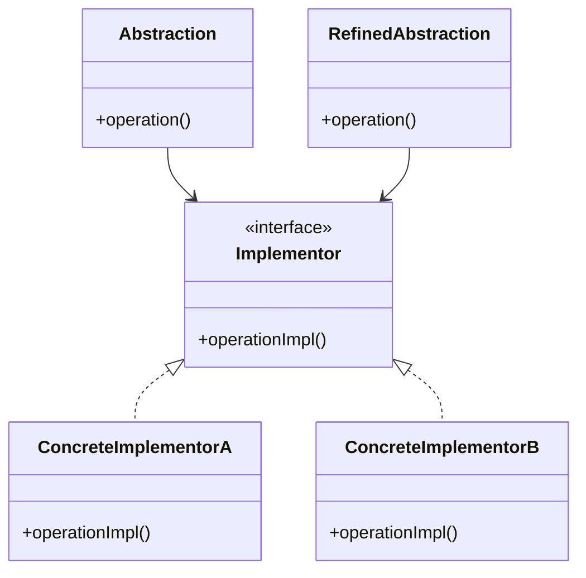

## 5.2 Bridge Pattern

### Introduction

In the realm of software design, the Bridge Pattern stands out as a powerful structural pattern that aims to decouple an abstraction from its implementation. This separation allows both the abstraction and the implementation to evolve independently, providing a flexible architecture that can adapt to changing requirements without necessitating a complete overhaul of the system. In this section, we will delve into the Bridge Pattern, explore its traditional use in object-oriented programming, and demonstrate how it can be effectively implemented in F# using functional programming principles.

### Understanding the Bridge Pattern

#### Definition and Intent

The Bridge Pattern is a structural design pattern that separates the abstraction from its implementation, allowing the two to vary independently. The primary intent is to avoid a permanent binding between an abstraction and its implementation, enabling flexibility and scalability in software design.

#### Problem Statement

In traditional software design, an abstraction is often tightly coupled with its implementation. This coupling can lead to rigidity, making it challenging to adapt or extend the system as requirements evolve. The Bridge Pattern addresses this issue by providing a mechanism to decouple the abstraction from its implementation, allowing both to change independently without affecting each other.

#### Traditional Use in Object-Oriented Programming

In object-oriented programming (OOP), the Bridge Pattern is typically used to separate class hierarchies. The abstraction is represented by an interface or an abstract class, while the implementation is encapsulated in a separate class hierarchy. This separation allows developers to extend both the abstraction and the implementation independently, promoting flexibility and reuse.

### Implementing the Bridge Pattern in F#

In F#, we can leverage functional programming principles to implement the Bridge Pattern in a way that emphasizes composition and modularity. Instead of relying on class hierarchies, we can use functions as implementations that are passed into abstractions. This approach aligns with the functional programming paradigm, where functions are first-class citizens and can be used to abstract behavior.

#### Abstracting Implementations with Functions

In F#, we can define abstractions as functions that take other functions as parameters. These parameterized functions can represent different implementations, allowing us to inject behavior dynamically.

```fsharp
// Define an abstraction as a function that takes an implementation function
let executeOperation operation x y =
    operation x y

// Define different implementations as functions
let add x y = x + y
let multiply x y = x * y

// Use the abstraction with different implementations
let result1 = executeOperation add 5 3
let result2 = executeOperation multiply 5 3

printfn "Addition Result: %d" result1
printfn "Multiplication Result: %d" result2
```

In this example, `executeOperation` serves as the abstraction, while `add` and `multiply` are different implementations. By passing different functions to `executeOperation`, we can dynamically change the behavior of the operation.

#### Creating Flexible Systems with Higher-Order Functions

Higher-order functions, which take other functions as arguments or return functions, are a powerful tool in functional programming. They enable us to create flexible systems where behavior can be injected or modified without changing the core logic.

```fsharp
// Define a higher-order function that takes an operation and a list of numbers
let applyOperation operation numbers =
    numbers |> List.map operation

// Define different operations
let increment x = x + 1
let double x = x * 2

// Use the higher-order function with different operations
let incrementedNumbers = applyOperation increment [1; 2; 3; 4]
let doubledNumbers = applyOperation double [1; 2; 3; 4]

printfn "Incremented Numbers: %A" incrementedNumbers
printfn "Doubled Numbers: %A" doubledNumbers
```

In this example, `applyOperation` is a higher-order function that applies a given operation to a list of numbers. By passing different operations, we can easily modify the behavior of the function without altering its structure.

### Aligning the Bridge Pattern with Functional Programming Principles

The Bridge Pattern aligns well with functional programming principles, particularly composition and modularity. By using functions to abstract implementations, we can create systems that are both flexible and maintainable.

#### Composition and Modularity

Functional programming emphasizes the composition of small, reusable functions to build complex systems. The Bridge Pattern supports this approach by allowing us to separate concerns and inject behavior through function parameters.

```fsharp
// Define a function to compose two operations
let composeOperations op1 op2 x =
    x |> op1 |> op2

// Define operations
let square x = x * x
let negate x = -x

// Compose operations
let squareAndNegate = composeOperations square negate

// Apply composed operation
let result = squareAndNegate 3
printfn "Square and Negate Result: %d" result
```

In this example, `composeOperations` allows us to combine two operations into a single function. This modular approach enables us to build complex behavior from simple, reusable components.

### Practical Examples

#### Interchangeable Algorithms

One practical application of the Bridge Pattern is in scenarios where we need to implement interchangeable algorithms or strategies. By decoupling the algorithm from its context, we can easily swap different strategies without modifying the core logic.

```fsharp
// Define a function to execute a strategy
let executeStrategy strategy data =
    strategy data

// Define different strategies
let sortAscending data = List.sort data
let sortDescending data = List.sortDescending data

// Use the strategy with different implementations
let sortedAscending = executeStrategy sortAscending [5; 3; 8; 1]
let sortedDescending = executeStrategy sortDescending [5; 3; 8; 1]

printfn "Sorted Ascending: %A" sortedAscending
printfn "Sorted Descending: %A" sortedDescending
```

In this example, `executeStrategy` is a function that takes a strategy and applies it to a list of data. By passing different sorting strategies, we can easily change the sorting behavior.

#### Flexible Logging System

Another example is a flexible logging system where the logging mechanism can be changed without altering the core logic.

```fsharp
// Define a function to log messages using a logging strategy
let logMessage logger message =
    logger message

// Define different logging strategies
let consoleLogger message = printfn "Console: %s" message
let fileLogger message = System.IO.File.AppendAllText("log.txt", message + "\n")

// Use the logging function with different strategies
logMessage consoleLogger "This is a console log."
logMessage fileLogger "This is a file log."
```

In this example, `logMessage` is a function that logs messages using a specified logging strategy. By passing different logging functions, we can easily switch between console and file logging.

### Considerations and Potential Pitfalls

While the Bridge Pattern offers significant flexibility, there are considerations and potential pitfalls to keep in mind:

- **Managing Dependencies**: Ensure that dependencies are managed effectively to avoid tight coupling between abstractions and implementations.
- **Consistency Across Implementations**: Maintain consistency across different implementations to ensure predictable behavior.
- **Complexity**: Avoid unnecessary complexity by using the Bridge Pattern only when it provides clear benefits.

### Encouragement to Apply the Bridge Pattern

The Bridge Pattern is a valuable tool for creating scalable and maintainable codebases where abstractions and implementations can evolve separately. By leveraging functional programming principles, we can build systems that are both flexible and robust. As you continue to explore design patterns in F#, consider how the Bridge Pattern can enhance your software architecture and contribute to more adaptable and resilient systems.

### Try It Yourself

To deepen your understanding of the Bridge Pattern, try modifying the code examples provided. Experiment with different functions and strategies to see how they affect the behavior of the system. Consider creating your own examples where the Bridge Pattern can be applied to solve real-world problems.

### Visualizing the Bridge Pattern

To further illustrate the Bridge Pattern, let's visualize the relationship between abstraction and implementation using a class diagram.



**Diagram Description**: This class diagram represents the traditional Bridge Pattern in object-oriented programming. The `Abstraction` class depends on the `Implementor` interface, which is implemented by `ConcreteImplementorA` and `ConcreteImplementorB`. The `RefinedAbstraction` class extends `Abstraction` and can use any `Implementor` to perform its operations.

### Conclusion

The Bridge Pattern is a versatile design pattern that offers a clean separation between abstraction and implementation. By embracing functional programming principles, we can implement this pattern in F# in a way that promotes flexibility, modularity, and maintainability. As you continue your journey in software design, consider how the Bridge Pattern can be leveraged to create systems that are both adaptable and resilient.

## Quiz Time!



### What is the primary intent of the Bridge Pattern?

- [x] To decouple an abstraction from its implementation so that the two can vary independently.
- [ ] To provide a simplified interface to a complex system.
- [ ] To ensure a class has only one instance.
- [ ] To encapsulate a group of individual factories.

> **Explanation:** The Bridge Pattern aims to decouple an abstraction from its implementation, allowing both to evolve independently.

### How does the Bridge Pattern solve the problem of tight coupling?

- [x] By separating the abstraction from its implementation.
- [ ] By using inheritance to extend classes.
- [ ] By creating a single interface for multiple classes.
- [ ] By encapsulating object creation logic.

> **Explanation:** The Bridge Pattern separates the abstraction from its implementation, reducing tight coupling and increasing flexibility.

### In F#, how can we implement the Bridge Pattern using functional programming principles?

- [x] By using functions as implementations passed into abstractions.
- [ ] By creating class hierarchies with interfaces.
- [ ] By using inheritance and polymorphism.
- [ ] By encapsulating data and behavior in objects.

> **Explanation:** In F#, the Bridge Pattern can be implemented by using functions as implementations that are passed into abstractions, aligning with functional programming principles.

### What is a higher-order function in functional programming?

- [x] A function that takes other functions as arguments or returns functions.
- [ ] A function that is defined within another function.
- [ ] A function that operates on lists or collections.
- [ ] A function that is used to create objects.

> **Explanation:** A higher-order function is one that takes other functions as arguments or returns functions, enabling flexible and dynamic behavior.

### Which of the following is a practical application of the Bridge Pattern?

- [x] Implementing interchangeable algorithms or strategies.
- [ ] Ensuring a class has only one instance.
- [ ] Providing a simplified interface to a complex system.
- [ ] Encapsulating a group of individual factories.

> **Explanation:** The Bridge Pattern is useful for implementing interchangeable algorithms or strategies by decoupling the algorithm from its context.

### What is a potential pitfall of using the Bridge Pattern?

- [x] Managing dependencies and ensuring consistency across implementations.
- [ ] Creating a single interface for multiple classes.
- [ ] Using inheritance to extend classes.
- [ ] Encapsulating object creation logic.

> **Explanation:** A potential pitfall of the Bridge Pattern is managing dependencies and ensuring consistency across different implementations.

### How does the Bridge Pattern align with functional programming principles?

- [x] By emphasizing composition and modularity.
- [ ] By using inheritance and polymorphism.
- [ ] By encapsulating data and behavior in objects.
- [ ] By creating class hierarchies with interfaces.

> **Explanation:** The Bridge Pattern aligns with functional programming principles by emphasizing composition and modularity, allowing for flexible and maintainable systems.

### What is the role of an abstraction in the Bridge Pattern?

- [x] To define the interface for the client to interact with.
- [ ] To implement the concrete behavior of the system.
- [ ] To encapsulate object creation logic.
- [ ] To provide a simplified interface to a complex system.

> **Explanation:** In the Bridge Pattern, the abstraction defines the interface for the client to interact with, while the implementation provides the concrete behavior.

### Why is the Bridge Pattern considered a structural pattern?

- [x] Because it focuses on how classes and objects are composed to form larger structures.
- [ ] Because it defines the skeleton of an algorithm.
- [ ] Because it provides a way to create objects without specifying their concrete classes.
- [ ] Because it ensures a class has only one instance.

> **Explanation:** The Bridge Pattern is a structural pattern because it focuses on how classes and objects are composed to form larger structures, separating abstraction from implementation.

### True or False: The Bridge Pattern can be used to create scalable and maintainable codebases.

- [x] True
- [ ] False

> **Explanation:** True. The Bridge Pattern allows for scalable and maintainable codebases by decoupling abstraction from implementation, enabling independent evolution.


