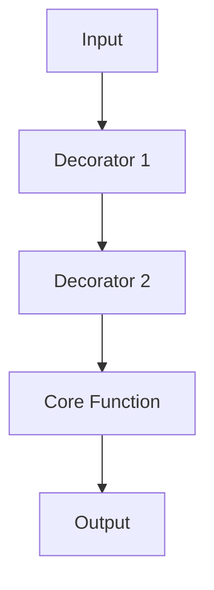

## 5.4 Decorator Pattern

### Introduction

The Decorator Pattern is a structural design pattern that allows behavior to be added to individual objects, either statically or dynamically, without affecting the behavior of other objects from the same class. This pattern is particularly useful for extending functionality in a flexible and reusable way without modifying existing code, making it a staple in both object-oriented and functional programming paradigms.

### Understanding the Problem

In software development, we often encounter situations where we need to extend the functionality of existing code. Traditional approaches might involve modifying the original code or using inheritance, both of which can lead to issues such as code rigidity and increased maintenance overhead. The Decorator Pattern offers a solution by allowing us to add responsibilities to objects dynamically, promoting code reuse and flexibility.

### Traditional Implementations in Object-Oriented Programming

In object-oriented programming (OOP), the Decorator Pattern is typically implemented using inheritance and aggregation. A decorator class wraps the original class and adds new behavior. This approach, while effective, can lead to a proliferation of classes and increased complexity.

```csharp
// Example in C#
public interface IComponent
{
    void Operation();
}

public class ConcreteComponent : IComponent
{
    public void Operation()
    {
        Console.WriteLine("ConcreteComponent Operation");
    }
}

public class Decorator : IComponent
{
    private readonly IComponent _component;

    public Decorator(IComponent component)
    {
        _component = component;
    }

    public void Operation()
    {
        Console.WriteLine("Decorator Operation");
        _component.Operation();
    }
}
```

### Implementing the Decorator Pattern in F#

In F#, we can leverage the power of function composition to implement the Decorator Pattern. This approach is more idiomatic in functional programming and avoids the pitfalls of class-based decorators.

#### Function Composition in F#

Function composition is a fundamental concept in functional programming, allowing us to combine simple functions to build more complex ones. In F#, we can use the `>>` operator to compose functions.

```fsharp
let add x y = x + y
let multiply x y = x * y

let addThenMultiply = add 2 >> multiply 3

let result = addThenMultiply 5 // (5 + 2) * 3 = 21
```

#### Decorating Functions with Additional Behavior

Let's explore how we can use function composition to decorate a function with additional behavior, such as logging, validation, or error handling.

##### Example: Logging Decorator

```fsharp
let logDecorator (func: 'a -> 'b) (input: 'a) =
    printfn "Input: %A" input
    let result = func input
    printfn "Output: %A" result
    result

let square x = x * x

let loggedSquare = logDecorator square

let result = loggedSquare 5 // Logs: Input: 5, Output: 25
```

##### Example: Validation Decorator

```fsharp
let validateDecorator (func: 'a -> 'b) (input: 'a) =
    if input < 0 then
        failwith "Input must be non-negative"
    else
        func input

let validatedSquare = validateDecorator square

let result = validatedSquare 5 // Works fine
// let result = validatedSquare -5 // Throws exception
```

#### Using Higher-Order Functions

Higher-order functions are functions that take other functions as arguments or return them as results. They are essential for implementing decorators in F#.

```fsharp
let decorate (decorator: ('a -> 'b) -> 'a -> 'b) (func: 'a -> 'b) =
    decorator func

let decoratedSquare = decorate logDecorator square

let result = decoratedSquare 5 // Logs: Input: 5, Output: 25
```

### Practical Use Cases in F#

The Decorator Pattern is versatile and can be applied in various scenarios in F#, such as extending data processing pipelines or adding cross-cutting concerns like caching.

#### Data Processing Pipelines

In data processing pipelines, we can use decorators to add steps like logging, validation, or transformation without modifying the core processing logic.

```fsharp
let processData data =
    data |> List.map (decorate logDecorator square)

let data = [1; 2; 3; 4; 5]
let processedData = processData data
```

#### Caching with Decorators

Caching is a common cross-cutting concern that can be elegantly handled using decorators.

```fsharp
let cacheDecorator (func: 'a -> 'b) =
    let cache = System.Collections.Generic.Dictionary<'a, 'b>()
    fun input ->
        if cache.ContainsKey(input) then
            cache.[input]
        else
            let result = func input
            cache.[input] <- result
            result

let cachedSquare = cacheDecorator square

let result1 = cachedSquare 5 // Computes and caches result
let result2 = cachedSquare 5 // Retrieves result from cache
```

### Advantages of Function Composition

Function composition offers several advantages over class-based decorators, including simplicity, reduced boilerplate, and improved readability. By focusing on functions rather than classes, we can create more modular and reusable code.

#### Order of Composition

When using function composition, the order in which decorators are applied matters. Ensure that decorators are composed in the correct order to achieve the desired behavior.

```fsharp
let decoratedFunction = logDecorator >> validateDecorator >> square
```

#### Managing Side Effects

While decorators can introduce side effects, such as logging or caching, it's important to manage these effects carefully to maintain code purity and testability.

### Encouraging Modular and Testable Code

By using the Decorator Pattern in F#, we can write code that is modular, reusable, and easily testable. This approach aligns with functional programming principles and promotes clean, maintainable codebases.

### Try It Yourself

Experiment with the provided code examples by modifying the decorators or creating your own. Try adding new behaviors, such as timing execution or handling exceptions, to see how decorators can enhance functionality.

### Visualizing the Decorator Pattern

To better understand the Decorator Pattern, let's visualize how functions are composed and decorated.



This diagram illustrates how input flows through a series of decorators before reaching the core function, with each decorator adding its own behavior.

### References and Further Reading

- [F# Language Reference](https://docs.microsoft.com/en-us/dotnet/fsharp/)
- [Functional Programming in F#](https://fsharpforfunandprofit.com/)
- [Design Patterns: Elements of Reusable Object-Oriented Software](https://en.wikipedia.org/wiki/Design_Patterns)

### Knowledge Check

- What is the primary purpose of the Decorator Pattern?
- How does function composition differ from class-based decorators?
- What are some practical use cases for decorators in F#?

### Embrace the Journey

Remember, this is just the beginning. As you progress, you'll discover more ways to leverage the Decorator Pattern in F# to create powerful, flexible, and maintainable applications. Keep experimenting, stay curious, and enjoy the journey!

## Quiz Time!



### What is the primary purpose of the Decorator Pattern?

- [x] To add behavior or responsibilities to individual objects without affecting others.
- [ ] To modify existing code directly.
- [ ] To create new classes for each additional behavior.
- [ ] To simplify code by reducing the number of functions.

> **Explanation:** The Decorator Pattern allows for adding behavior to objects dynamically without modifying existing code, promoting flexibility and reuse.

### How is the Decorator Pattern traditionally implemented in object-oriented programming?

- [x] Using inheritance and aggregation.
- [ ] Using only inheritance.
- [ ] Using only aggregation.
- [ ] Using function composition.

> **Explanation:** In OOP, the Decorator Pattern is typically implemented using inheritance and aggregation to wrap and extend the behavior of classes.

### What is a key advantage of using function composition for decorators in F#?

- [x] It reduces boilerplate code and improves readability.
- [ ] It requires more classes to be written.
- [ ] It makes the code more complex.
- [ ] It limits the flexibility of the code.

> **Explanation:** Function composition reduces boilerplate and improves readability by allowing simple functions to be combined into more complex ones without the need for additional classes.

### How can decorators be applied in F# to handle cross-cutting concerns?

- [x] By using higher-order functions and function composition.
- [ ] By modifying the core function directly.
- [ ] By creating new classes for each concern.
- [ ] By using inheritance.

> **Explanation:** In F#, decorators can be applied using higher-order functions and function composition to handle cross-cutting concerns like logging and caching.

### What is a potential consideration when composing decorators?

- [x] The order of composition.
- [ ] The number of decorators.
- [ ] The size of the function.
- [ ] The complexity of the core function.

> **Explanation:** The order of composition is crucial as it affects the behavior of the decorated function, ensuring that decorators are applied in the correct sequence.

### Which of the following is an example of a higher-order function?

- [x] A function that takes another function as an argument.
- [ ] A function that returns a simple value.
- [ ] A function that modifies a global variable.
- [ ] A function that only performs arithmetic operations.

> **Explanation:** A higher-order function is one that takes other functions as arguments or returns them as results, enabling powerful abstractions and compositions.

### What is a practical use case for decorators in data processing pipelines?

- [x] Adding logging, validation, or transformation steps.
- [ ] Modifying the core processing logic directly.
- [ ] Removing steps from the pipeline.
- [ ] Simplifying the data structure.

> **Explanation:** Decorators can be used to add logging, validation, or transformation steps to data processing pipelines without altering the core logic.

### How does caching work as a decorator?

- [x] By storing computed results and reusing them for the same inputs.
- [ ] By modifying the input data directly.
- [ ] By creating a new cache for each function call.
- [ ] By removing the need for computation.

> **Explanation:** Caching as a decorator involves storing computed results and reusing them for the same inputs, improving efficiency and performance.

### What is the role of function composition in the Decorator Pattern?

- [x] To combine simple functions into more complex ones.
- [ ] To create new classes for each behavior.
- [ ] To modify existing functions directly.
- [ ] To simplify the code by reducing the number of functions.

> **Explanation:** Function composition allows simple functions to be combined into more complex ones, enabling the dynamic addition of behavior in the Decorator Pattern.

### True or False: The Decorator Pattern in F# can only be used for logging purposes.

- [ ] True
- [x] False

> **Explanation:** The Decorator Pattern in F# is versatile and can be used for various purposes, including logging, validation, error handling, caching, and more.


