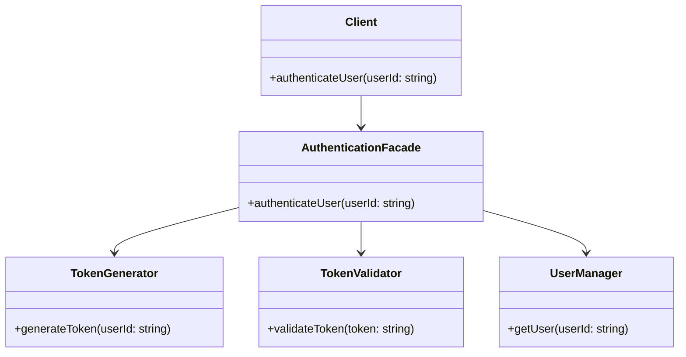

## 5.5 Facade Pattern

### Introduction

In the realm of software design, complexity is an inevitable challenge. As systems grow, they often become intricate, with numerous interconnected components and interfaces. The Facade Pattern emerges as a beacon of simplicity in such environments. By offering a unified interface to a set of interfaces within a subsystem, the Facade Pattern reduces complexity, making the subsystem easier to use for clients.

### Understanding the Facade Pattern

The Facade Pattern is a structural design pattern that provides a simplified interface to a complex system of classes, libraries, or frameworks. It serves as a front-facing interface masking more complex underlying or structural code. This pattern is particularly useful when dealing with complex or poorly designed APIs, as it abstracts the intricacies and presents a cleaner, more manageable interface to the client.

#### Purpose of the Facade Pattern

- **Simplification**: The primary goal of the Facade Pattern is to simplify interactions with complex systems. By providing a single entry point, it reduces the need for clients to manage multiple interfaces.
- **Decoupling**: It decouples the client from the subsystem, reducing dependencies and making the system more modular.
- **Improved Readability and Maintainability**: By hiding the complexities of the subsystem, the Facade Pattern enhances code readability and maintainability.

### Problem Solved by the Facade Pattern

In large systems, clients often need to interact with multiple components, each with its own interface. This can lead to:

- **Complexity**: Clients must understand and manage multiple interfaces, increasing the cognitive load.
- **Tight Coupling**: Direct interactions with subsystem components can lead to tight coupling, making the system harder to maintain and evolve.
- **Error-Prone Code**: With multiple interfaces, the likelihood of errors increases, especially if the subsystem's interfaces are poorly designed or inconsistent.

The Facade Pattern addresses these issues by providing a single, unified interface that abstracts the complexities of the subsystem, allowing clients to interact with it more easily and reliably.

### Implementing the Facade Pattern in F#

F#'s functional programming paradigm and its powerful module system make it an excellent choice for implementing the Facade Pattern. Let's explore how we can use F# modules to create a facade that simplifies interactions with a complex subsystem.

#### Step-by-Step Implementation

1. **Identify the Subsystem**: Determine the components and interfaces that make up the subsystem you want to simplify.

2. **Design the Facade Interface**: Define a simplified interface that abstracts the complexities of the subsystem. This interface should expose only the necessary functionality to the client.

3. **Implement the Facade Module**: Use F# modules to encapsulate the subsystem's components and provide the simplified interface.

4. **Hide the Complexity**: Ensure that the facade hides the underlying complexity, exposing only what is necessary for the client.

#### Example: Simplifying a Complex API

Consider a scenario where we have a complex library for handling user authentication, involving multiple components like token generation, validation, and user management. We can create a facade to simplify interactions with this library.

```fsharp
module AuthenticationFacade =

    // Simulated complex subsystem components
    module TokenGenerator =
        let generateToken userId = $"Token_{userId}_{System.Guid.NewGuid()}"

    module TokenValidator =
        let validateToken token = token.StartsWith("Token_")

    module UserManager =
        let getUser userId = $"User_{userId}"

    // Facade providing a simplified interface
    let authenticateUser userId =
        let token = TokenGenerator.generateToken userId
        if TokenValidator.validateToken token then
            Some (UserManager.getUser userId)
        else
            None

// Usage of the facade
let user = AuthenticationFacade.authenticateUser "12345"
match user with
| Some u -> printfn "Authenticated user: %s" u
| None -> printfn "Authentication failed"
```

In this example, the `AuthenticationFacade` module provides a single function `authenticateUser`, which abstracts the complexities of token generation, validation, and user management. The client interacts with this simplified interface without worrying about the underlying details.

### Benefits of the Facade Pattern

- **Improved Code Readability**: By providing a single entry point, the facade makes the code easier to read and understand.
- **Enhanced Maintainability**: Changes to the subsystem can be made without affecting the client, as long as the facade interface remains consistent.
- **Reduced Coupling**: The facade decouples the client from the subsystem, leading to a more modular and flexible system.

### Real-World Examples

Facades are commonly used in various scenarios, such as:

- **Database Access**: Wrapping complex database interactions to provide a simple API for data retrieval and manipulation.
- **Third-Party Libraries**: Simplifying the use of third-party libraries with complex or inconsistent APIs.
- **Legacy Systems**: Providing a modern interface to interact with legacy systems.

### F# Organization Features for Effective Facades

F#'s module system and functional programming features are well-suited for creating effective facades. Modules allow you to encapsulate functionality and expose only what is necessary, while functional programming principles promote immutability and statelessness, leading to more predictable and reliable facades.

### Potential Drawbacks

While the Facade Pattern offers numerous benefits, it is important to be aware of potential drawbacks:

- **Over-Simplification**: In some cases, the facade may oversimplify the subsystem, hiding important functionality that clients may need.
- **Hidden Complexity**: By abstracting the subsystem, the facade may hide important details, making debugging and troubleshooting more challenging.

### Encouragement to Use the Facade Pattern

The Facade Pattern is a powerful tool for managing complexity and creating clean interfaces in your systems. By embracing this pattern, you can enhance code readability, maintainability, and flexibility, leading to more robust and scalable applications.

### Try It Yourself

To deepen your understanding of the Facade Pattern, try modifying the example code:

- Add additional functionality to the `AuthenticationFacade` module, such as logging or error handling.
- Create a facade for another subsystem in your project, focusing on simplifying complex interactions.

### Visualizing the Facade Pattern

To better understand the Facade Pattern, let's visualize it using a class diagram.



In this diagram, the `Client` interacts with the `AuthenticationFacade`, which in turn interacts with the underlying components (`TokenGenerator`, `TokenValidator`, and `UserManager`). The facade provides a simplified interface, hiding the complexities of the subsystem from the client.

### Conclusion

The Facade Pattern is an invaluable tool for software engineers and architects looking to manage complexity and create clean, maintainable interfaces. By providing a unified interface to a set of interfaces within a subsystem, the Facade Pattern simplifies interactions, reduces coupling, and enhances code readability and maintainability. As you continue your journey in software development, consider using the Facade Pattern to streamline your systems and improve their overall design.

## Quiz Time!



### What is the primary purpose of the Facade Pattern?

- [x] To provide a simplified interface to a complex system
- [ ] To increase the complexity of a system
- [ ] To replace all interfaces in a subsystem
- [ ] To eliminate the need for interfaces

> **Explanation:** The Facade Pattern is designed to provide a simplified interface to a complex system, making it easier for clients to interact with the subsystem.

### How does the Facade Pattern improve code maintainability?

- [x] By reducing dependencies between the client and the subsystem
- [ ] By increasing the number of interfaces
- [ ] By making the subsystem more complex
- [ ] By eliminating the need for documentation

> **Explanation:** The Facade Pattern reduces dependencies between the client and the subsystem, leading to improved code maintainability and flexibility.

### Which F# feature is particularly useful for implementing the Facade Pattern?

- [x] Modules
- [ ] Classes
- [ ] Interfaces
- [ ] Inheritance

> **Explanation:** F# modules are particularly useful for implementing the Facade Pattern, as they allow you to encapsulate functionality and expose only what is necessary.

### What is a potential drawback of the Facade Pattern?

- [x] Over-simplification of the subsystem
- [ ] Increased complexity of the subsystem
- [ ] Elimination of all interfaces
- [ ] Reduced code readability

> **Explanation:** A potential drawback of the Facade Pattern is over-simplification, which may hide important functionality that clients need.

### In the provided example, what does the `authenticateUser` function do?

- [x] It generates a token, validates it, and retrieves the user
- [ ] It only generates a token
- [ ] It only validates a token
- [ ] It only retrieves the user

> **Explanation:** The `authenticateUser` function generates a token, validates it, and retrieves the user, providing a simplified interface to the underlying components.

### What is a common use case for the Facade Pattern?

- [x] Wrapping complex database interactions
- [ ] Increasing the complexity of a system
- [ ] Eliminating the need for interfaces
- [ ] Making a system more error-prone

> **Explanation:** A common use case for the Facade Pattern is wrapping complex database interactions to provide a simple API for data retrieval and manipulation.

### How can the Facade Pattern reduce coupling in a system?

- [x] By providing a single entry point for clients
- [ ] By increasing the number of interfaces
- [ ] By making the subsystem more complex
- [ ] By eliminating the need for documentation

> **Explanation:** The Facade Pattern reduces coupling by providing a single entry point for clients, decoupling them from the subsystem's components.

### What is the role of the `AuthenticationFacade` module in the example?

- [x] To provide a simplified interface for user authentication
- [ ] To increase the complexity of user authentication
- [ ] To eliminate the need for user authentication
- [ ] To make user authentication more error-prone

> **Explanation:** The `AuthenticationFacade` module provides a simplified interface for user authentication, abstracting the complexities of the underlying components.

### True or False: The Facade Pattern can hide important details, making debugging more challenging.

- [x] True
- [ ] False

> **Explanation:** True. By abstracting the subsystem, the Facade Pattern can hide important details, making debugging and troubleshooting more challenging.

### Which of the following is NOT a benefit of the Facade Pattern?

- [ ] Improved code readability
- [ ] Enhanced maintainability
- [ ] Reduced coupling
- [x] Increased complexity

> **Explanation:** The Facade Pattern is designed to reduce complexity, not increase it. Its benefits include improved code readability, enhanced maintainability, and reduced coupling.


