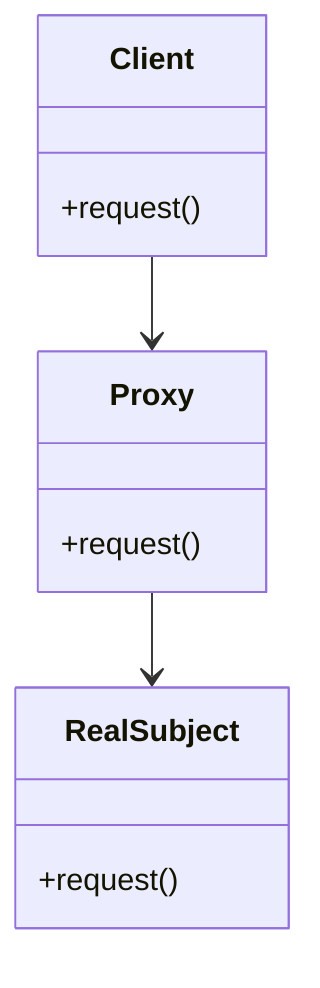

## 5.7 Proxy Pattern

In this section, we delve into the Proxy Pattern, a structural design pattern that plays a crucial role in controlling access to objects. We will explore its purpose, the problems it solves, and how it can be effectively implemented in F# using functional programming constructs. Let's embark on this journey to understand how proxies can enhance your software architecture.

### Understanding the Proxy Pattern

The Proxy Pattern is a design pattern that provides a surrogate or placeholder for another object to control access to it. It acts as an intermediary between a client and the real object, allowing for controlled access, additional functionality, or even deferred execution.

#### Purpose of the Proxy Pattern

The primary purpose of the Proxy Pattern is to introduce a level of indirection to manage access to an object. This can be useful for several reasons:

- **Controlled Access**: Restrict or manage access to sensitive objects.
- **Lazy Initialization**: Delay the creation and initialization of resource-intensive objects until they are needed.
- **Logging and Monitoring**: Add logging or monitoring functionality transparently.
- **Remote Interaction**: Represent remote objects locally, enabling communication over a network.

### Problems Solved by the Proxy Pattern

The Proxy Pattern addresses several common software design challenges:

- **Performance Optimization**: By deferring the creation of expensive objects, proxies can improve application performance.
- **Security**: Proxies can enforce access control policies, ensuring that only authorized clients can interact with certain objects.
- **Decoupling**: By abstracting the interaction with the real object, proxies can reduce coupling between components.
- **Cross-Cutting Concerns**: Proxies can manage concerns like logging and transaction management without cluttering the core business logic.

### Types of Proxies

There are several types of proxies, each serving a specific purpose:

1. **Virtual Proxy**: Manages access to resource-intensive objects, creating them on demand.
2. **Remote Proxy**: Represents an object located in a different address space, facilitating communication over a network.
3. **Protection Proxy**: Controls access to an object based on access rights.
4. **Smart Reference**: Provides additional functionality, such as reference counting or logging, when accessing an object.

### Implementing the Proxy Pattern in F#

In F#, we can leverage higher-order functions and object expressions to implement the Proxy Pattern. Let's explore how to do this with practical examples.

#### Using Higher-Order Functions

Higher-order functions are functions that take other functions as arguments or return them as results. They are a powerful tool in functional programming and can be used to create proxies by wrapping core operations with additional behavior.

```fsharp
// Define a function that represents the core operation
let fetchData id =
    printfn "Fetching data for ID: %d" id
    // Simulate data fetching
    sprintf "Data for ID: %d" id

// Define a proxy function that adds logging before and after the core operation
let loggingProxy operation id =
    printfn "Logging: About to fetch data for ID: %d" id
    let result = operation id
    printfn "Logging: Finished fetching data for ID: %d" id
    result

// Use the proxy function
let result = loggingProxy fetchData 42
printfn "Result: %s" result
```

In this example, `loggingProxy` is a higher-order function that wraps the `fetchData` function, adding logging before and after the core operation.

#### Object Expressions for Interfacing with OOP

When working with object-oriented code, we may need to implement interfaces or abstract classes. F# provides object expressions, which allow us to create lightweight objects without defining a full class.

```fsharp
// Define an interface for data fetching
type IDataFetcher =
    abstract member FetchData: int -> string

// Implement a proxy using an object expression
let dataFetcherProxy (realFetcher: IDataFetcher) =
    { new IDataFetcher with
        member _.FetchData id =
            printfn "Proxy: Checking access rights for ID: %d" id
            let result = realFetcher.FetchData id
            printfn "Proxy: Access granted for ID: %d" id
            result
    }

// Define a real data fetcher
let realFetcher =
    { new IDataFetcher with
        member _.FetchData id =
            printfn "RealFetcher: Fetching data for ID: %d" id
            sprintf "Data for ID: %d" id
    }

// Use the proxy
let proxy = dataFetcherProxy realFetcher
let data = proxy.FetchData 42
printfn "Data: %s" data
```

Here, `dataFetcherProxy` is an object expression that implements the `IDataFetcher` interface, adding access control logic around the real fetcher.

### Practical Applications of the Proxy Pattern

Proxies are versatile and can be applied in various scenarios:

- **Lazy Resource Loading**: Use virtual proxies to defer loading of large resources until they are needed.
- **Access Control**: Implement protection proxies to enforce security policies.
- **Monitoring**: Use smart references to add logging or performance monitoring.
- **Remote Communication**: Employ remote proxies to interact with distributed systems.

### Benefits of Functional Proxies

Functional programming constructs, such as higher-order functions and immutability, offer several advantages when implementing proxies:

- **Lightweight**: Functional proxies are often simpler and more concise than their object-oriented counterparts.
- **Composable**: Higher-order functions enable easy composition of multiple proxy behaviors.
- **Immutable**: Immutability ensures thread safety, reducing the risk of concurrency issues.

### Challenges in Implementing Proxies

While proxies offer many benefits, there are challenges to consider:

- **Interface Maintenance**: Ensure that the proxy maintains the same interface as the real object.
- **Thread Safety**: When dealing with shared resources, ensure that proxies are thread-safe.

### Encouragement to Apply the Proxy Pattern

The Proxy Pattern is a powerful tool for managing cross-cutting concerns and introducing additional behavior transparently. We encourage you to explore its potential in your applications, leveraging F#'s functional programming capabilities to create efficient and maintainable proxies.

### Visualizing the Proxy Pattern

To better understand the Proxy Pattern, let's visualize its structure using a class diagram.



In this diagram, the `Client` interacts with the `Proxy`, which in turn delegates requests to the `RealSubject`. The proxy can add additional behavior before or after forwarding the request.

### Try It Yourself

To deepen your understanding of the Proxy Pattern, try modifying the code examples provided:

- **Add Caching**: Extend the `loggingProxy` function to cache results for previously fetched IDs.
- **Implement a Protection Proxy**: Modify the `dataFetcherProxy` to restrict access based on a simple access control list (ACL).

### Knowledge Check

Before we conclude, let's review some key concepts:

- What is the primary purpose of the Proxy Pattern?
- How can higher-order functions be used to implement proxies in F#?
- What are some practical applications of proxies?

### Conclusion

The Proxy Pattern is a versatile and powerful design pattern that can enhance your software architecture by controlling access to objects and managing cross-cutting concerns. By leveraging F#'s functional programming constructs, you can create lightweight, composable, and efficient proxies. Remember, this is just the beginning. As you progress, you'll discover even more ways to apply the Proxy Pattern in your projects. Keep experimenting, stay curious, and enjoy the journey!

## Quiz Time!



### What is the primary purpose of the Proxy Pattern?

- [x] To provide a surrogate or placeholder for another object to control access to it.
- [ ] To create a new object from a prototype instance.
- [ ] To define a family of algorithms and make them interchangeable.
- [ ] To separate the construction of a complex object from its representation.

> **Explanation:** The Proxy Pattern provides a surrogate or placeholder for another object to control access to it.

### Which of the following is NOT a type of proxy?

- [ ] Virtual Proxy
- [ ] Remote Proxy
- [ ] Protection Proxy
- [x] Factory Proxy

> **Explanation:** Factory Proxy is not a recognized type of proxy. The recognized types include Virtual, Remote, Protection, and Smart Reference proxies.

### How can higher-order functions be used to implement proxies in F#?

- [x] By wrapping a function with another function to add behavior before and/or after the core operation.
- [ ] By creating a new class that inherits from an existing class.
- [ ] By defining a new interface and implementing it in a separate module.
- [ ] By using reflection to dynamically modify object behavior at runtime.

> **Explanation:** Higher-order functions can wrap existing functions to add additional behavior, making them suitable for implementing proxies.

### What is a key benefit of using functional programming constructs for proxies?

- [x] They are lightweight and composable.
- [ ] They require less memory than object-oriented proxies.
- [ ] They automatically handle network communication.
- [ ] They eliminate the need for interfaces.

> **Explanation:** Functional programming constructs, such as higher-order functions, make proxies lightweight and composable.

### What challenge might arise when implementing a proxy?

- [x] Maintaining the interface of the proxied object.
- [ ] Ensuring the proxy is always faster than the real object.
- [ ] Automatically generating proxy code.
- [ ] Eliminating all cross-cutting concerns.

> **Explanation:** Maintaining the interface of the proxied object is crucial to ensure seamless integration.

### What is a practical application of a virtual proxy?

- [x] Lazy resource loading
- [ ] Real-time data processing
- [ ] Dynamic code generation
- [ ] Automated testing

> **Explanation:** Virtual proxies are often used for lazy resource loading, deferring object creation until necessary.

### How can object expressions be used in F# proxies?

- [x] To implement interfaces or abstract classes without defining a full class.
- [ ] To dynamically generate new types at runtime.
- [ ] To create immutable data structures.
- [ ] To enforce type safety at compile time.

> **Explanation:** Object expressions allow implementing interfaces or abstract classes without defining a full class, useful in F# proxies.

### Which of the following is a benefit of using immutability in proxies?

- [x] Ensures thread safety
- [ ] Reduces memory usage
- [ ] Increases execution speed
- [ ] Simplifies network communication

> **Explanation:** Immutability ensures thread safety by preventing shared state modifications.

### What is a smart reference proxy used for?

- [x] Providing additional functionality, such as reference counting or logging.
- [ ] Managing remote object interaction.
- [ ] Enforcing access control policies.
- [ ] Deferring object creation until needed.

> **Explanation:** Smart reference proxies provide additional functionality like reference counting or logging.

### True or False: The Proxy Pattern can be used to manage cross-cutting concerns.

- [x] True
- [ ] False

> **Explanation:** The Proxy Pattern is often used to manage cross-cutting concerns like logging and access control.


