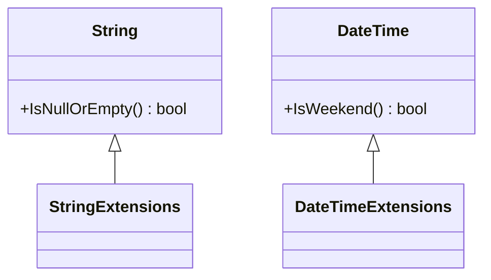

## 5.8 Extension Pattern

In the realm of software design, the ability to extend existing functionality without altering the original source code is a powerful tool. The Extension Pattern in F# allows developers to add new methods or properties to existing types, promoting code reuse and adhering to the open-closed principle. This section will delve into the intricacies of the Extension Pattern, comparing it with similar concepts in other languages, and providing practical guidance on its implementation and use in F#.

### Understanding the Extension Pattern

The Extension Pattern is a design strategy that enables developers to augment existing types with additional functionality. This is achieved without modifying the original source code, thus preserving the integrity of the existing codebase. This pattern is particularly useful when working with types from external libraries or when you want to add utility functions to existing types.

#### Key Concepts

- **Open-Closed Principle**: This principle states that software entities should be open for extension but closed for modification. The Extension Pattern embodies this principle by allowing new functionality to be added without altering existing code.
- **Code Reuse**: By extending existing types, developers can promote code reuse, reducing duplication and enhancing maintainability.

### Extension Pattern vs. Extension Methods in C#

In C#, extension methods provide a way to add new methods to existing types without modifying their source code. These methods are static and are defined in static classes. While F# does not have extension methods in the same way C# does, it offers a similar capability through type extensions.

#### Similarities and Differences

- **Similarities**: Both C# extension methods and F# type extensions allow for the addition of new functionality to existing types without modifying the original type.
- **Differences**: F# type extensions are more flexible, allowing for the addition of both methods and properties. They can be defined within the same module or through augmentation, providing more control over the scope and visibility of the extensions.

### Implementing Extension Members in F#

F# provides a robust mechanism for extending types through type extensions. This allows developers to add new members to existing types, enhancing their functionality in a modular and maintainable way.

#### Syntax for Adding Members

To add members to a type in F#, you can use type extensions. These can be defined in two primary ways: within the same module or through augmentation.

##### Adding Members in the Same Module

```fsharp
module StringExtensions

type System.String with
    member this.IsNullOrEmpty() =
        String.IsNullOrEmpty(this)
```

In this example, we extend the `System.String` type by adding an `IsNullOrEmpty` method. This method checks if the string is null or empty, leveraging the existing `String.IsNullOrEmpty` method.

##### Augmenting Types

Type augmentation allows you to extend types across different modules or assemblies. This is particularly useful when working with types from external libraries.

```fsharp
module MyExtensions

open System

type DateTime with
    member this.IsWeekend() =
        this.DayOfWeek = DayOfWeek.Saturday || this.DayOfWeek = DayOfWeek.Sunday
```

Here, we augment the `DateTime` type by adding an `IsWeekend` method. This method determines if a given date falls on a weekend.

### Scenarios for Extending Types

Extending types can be advantageous in various scenarios, such as:

- **Utility Functions**: Adding helper methods to simplify common tasks.
- **Adapting External Libraries**: Extending types from third-party libraries to better fit your application's needs.
- **Enhancing Readability**: By adding domain-specific methods, you can make your code more expressive and easier to understand.

### Benefits of the Extension Pattern

The Extension Pattern offers several benefits:

- **Promotes Code Reuse**: By extending existing types, you can reuse code across different parts of your application.
- **Adheres to the Open-Closed Principle**: The pattern allows for the extension of functionality without modifying existing code, maintaining stability and reliability.
- **Enhances Readability and Maintainability**: By adding domain-specific methods, you can make your code more expressive and easier to understand.

### Importance of Namespaces and Module Organization

When implementing the Extension Pattern, it's crucial to organize your code effectively to prevent naming conflicts and maintain clarity. Here are some best practices:

- **Use Clear and Descriptive Namespaces**: Organize your extensions into namespaces that clearly indicate their purpose and scope.
- **Avoid Overlapping Names**: Ensure that your extensions do not conflict with existing methods or properties.
- **Document Extensions Thoroughly**: Provide clear documentation for your extensions to help other developers understand their purpose and usage.

### Potential Pitfalls and Best Practices

While the Extension Pattern is a powerful tool, it's important to use it responsibly to avoid potential pitfalls:

- **Avoid Overusing Extensions**: Excessive use of extensions can lead to code that's hard to navigate and maintain. Use extensions judiciously and only when they add clear value.
- **Ensure Extensions are Intuitive**: Extensions should enhance the readability and usability of your code. Avoid adding methods that are confusing or counterintuitive.
- **Test Extensions Thoroughly**: Ensure that your extensions are well-tested and reliable. This is especially important when extending types from external libraries.

### Try It Yourself

To get hands-on experience with the Extension Pattern, try modifying the examples provided. For instance, extend the `DateTime` type to include a method that checks if a date is a public holiday. Experiment with different types and methods to see how extensions can enhance your codebase.

### Visualizing Type Extensions

To better understand how type extensions work, let's visualize the process using a class diagram.



In this diagram, we see how the `String` and `DateTime` types are extended with new methods. The `StringExtensions` and `DateTimeExtensions` represent the modules where these extensions are defined.

### Summary

The Extension Pattern in F# is a powerful tool for adding functionality to existing types without modifying their source code. By leveraging type extensions, developers can promote code reuse, adhere to the open-closed principle, and enhance the readability and maintainability of their code. Remember to use extensions responsibly, ensuring they add clear value and do not complicate your codebase.

### Embrace the Journey

As you continue to explore the Extension Pattern, remember that this is just the beginning. By mastering this pattern, you'll be able to build more robust and flexible applications. Keep experimenting, stay curious, and enjoy the journey!

## Quiz Time!



### What is the primary benefit of using the Extension Pattern in F#?

- [x] It allows adding functionality without modifying existing code.
- [ ] It simplifies the code by reducing the number of lines.
- [ ] It enhances performance by optimizing existing methods.
- [ ] It automatically documents code changes.

> **Explanation:** The Extension Pattern allows developers to add new methods or properties to existing types without altering their source code, adhering to the open-closed principle.

### How do F# type extensions differ from C# extension methods?

- [x] F# type extensions can add both methods and properties.
- [ ] F# type extensions are static methods.
- [ ] F# type extensions require modifying the original type.
- [ ] F# type extensions are defined in static classes.

> **Explanation:** Unlike C# extension methods, which are static and defined in static classes, F# type extensions can add both methods and properties to existing types.

### What is a potential pitfall of overusing extensions?

- [x] Code becomes hard to navigate and maintain.
- [ ] Code execution becomes slower.
- [ ] It leads to excessive memory usage.
- [ ] It creates too many new classes.

> **Explanation:** Overusing extensions can lead to code that's difficult to navigate and maintain, as it may become cluttered with numerous methods and properties.

### Which principle does the Extension Pattern adhere to?

- [x] Open-Closed Principle
- [ ] Single Responsibility Principle
- [ ] Dependency Inversion Principle
- [ ] Interface Segregation Principle

> **Explanation:** The Extension Pattern adheres to the Open-Closed Principle, allowing software entities to be open for extension but closed for modification.

### What should you consider when organizing extensions in F#?

- [x] Use clear and descriptive namespaces.
- [ ] Always define extensions in the global namespace.
- [ ] Avoid using namespaces to keep code simple.
- [ ] Define all extensions in a single module.

> **Explanation:** Using clear and descriptive namespaces helps prevent naming conflicts and maintains clarity in the codebase.

### How can you extend a type from an external library in F#?

- [x] By using type augmentation.
- [ ] By modifying the library's source code.
- [ ] By creating a new type that inherits from the library type.
- [ ] By using reflection to add methods at runtime.

> **Explanation:** Type augmentation allows you to extend types from external libraries without modifying their source code.

### Why is it important to test extensions thoroughly?

- [x] To ensure they are reliable and do not introduce bugs.
- [ ] To increase the execution speed of the extensions.
- [ ] To automatically generate documentation.
- [ ] To reduce the number of lines of code.

> **Explanation:** Thorough testing ensures that extensions are reliable and do not introduce bugs, especially when extending types from external libraries.

### What is a best practice when adding extensions?

- [x] Ensure extensions are intuitive and enhance readability.
- [ ] Add as many extensions as possible to cover all scenarios.
- [ ] Avoid documenting extensions to keep code concise.
- [ ] Use extensions to replace existing methods.

> **Explanation:** Extensions should be intuitive and enhance the readability and usability of the code, providing clear value.

### Can F# type extensions be used to add properties to existing types?

- [x] True
- [ ] False

> **Explanation:** F# type extensions can be used to add both methods and properties to existing types.

### What is a scenario where extending types is advantageous?

- [x] Adding utility functions to existing types.
- [ ] Reducing the number of classes in a project.
- [ ] Automatically generating user interfaces.
- [ ] Compiling code faster.

> **Explanation:** Extending types is advantageous for adding utility functions, enhancing the functionality of existing types without modifying their source code.


