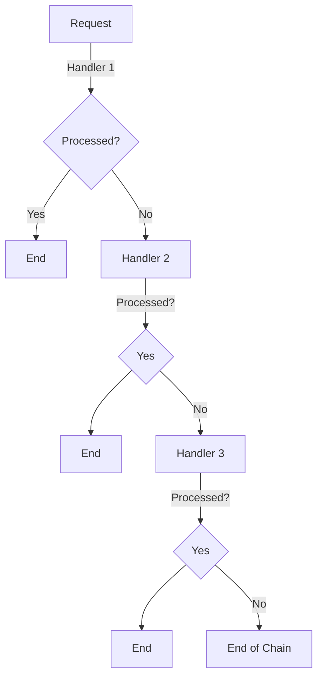

## 6.1 Chain of Responsibility Pattern

In the realm of software design, the Chain of Responsibility pattern stands out as a powerful tool for achieving loose coupling between the sender of a request and its potential receivers. This pattern allows a request to be passed along a chain of handlers, each having the opportunity to process it or pass it further down the line. This flexibility is particularly beneficial in scenarios where multiple objects might handle a request, but the sender should not be tightly coupled to any specific receiver.

### Understanding the Chain of Responsibility Pattern

The Chain of Responsibility pattern is a behavioral design pattern that decouples the sender of a request from its receivers by allowing multiple objects to handle the request. The request is passed along a chain of potential handlers until one of them processes it. This pattern is particularly useful in situations where the exact handler is not known in advance or might change dynamically.

#### Key Concepts

- **Loose Coupling**: The sender of a request is decoupled from the receiver, promoting flexibility and reusability.
- **Chain of Handlers**: A sequence of handlers that can process or pass on a request.
- **Dynamic Handling**: Handlers can be added or removed at runtime, allowing for dynamic request processing.

### Implementing Chain of Responsibility in F#

F#, with its functional programming paradigm, offers unique ways to implement the Chain of Responsibility pattern using functions and function composition. Let's explore how we can leverage F# features to create a chain of handlers.

#### Function Composition for Chains

In F#, functions are first-class citizens, meaning they can be passed around as arguments, returned from other functions, and composed together. This makes function composition a natural fit for implementing chains of responsibility.

```fsharp
// Define a type for requests
type Request = { Data: string; Processed: bool }

// Define a handler type
type Handler = Request -> Request option

// Function to compose handlers
let composeHandlers (handlers: Handler list) =
    let rec applyHandlers req = function
        | [] -> req
        | handler :: rest ->
            match handler req with
            | Some processedReq -> processedReq
            | None -> applyHandlers req rest
    applyHandlers

// Example handlers
let handler1 req =
    if req.Data.Contains("process1") then
        Some { req with Processed = true }
    else
        None

let handler2 req =
    if req.Data.Contains("process2") then
        Some { req with Processed = true }
    else
        None

// Create a chain of handlers
let handlers = [handler1; handler2]
let processRequest = composeHandlers handlers

// Test the chain
let request = { Data = "process1"; Processed = false }
let result = processRequest request
printfn "Request processed: %b" result.Processed
```

In this example, we define a `Handler` type as a function that takes a `Request` and returns an optional `Request`. The `composeHandlers` function takes a list of handlers and applies them in sequence until one processes the request.

#### Recursive Functions for Chains

Recursive functions can also be used to implement the chain mechanism, providing a clear and concise way to pass requests along the chain.

```fsharp
// Recursive function to process requests
let rec processChain (handlers: Handler list) (req: Request) =
    match handlers with
    | [] -> req
    | handler :: rest ->
        match handler req with
        | Some processedReq -> processedReq
        | None -> processChain rest req

// Use the recursive function
let resultRecursive = processChain handlers request
printfn "Request processed with recursion: %b" resultRecursive.Processed
```

This recursive approach achieves the same result as the function composition method, demonstrating the flexibility of F# in implementing design patterns.

### Scenarios for Chain of Responsibility

The Chain of Responsibility pattern is particularly beneficial in scenarios where multiple handlers might process a request. Let's explore some common use cases.

#### Processing UI Events

In graphical user interfaces, events such as mouse clicks or key presses can be handled by multiple components. The Chain of Responsibility pattern allows these events to be passed along a chain of handlers, each having the opportunity to process the event.

#### Middleware Pipelines

In web applications, middleware components can process requests and responses. The Chain of Responsibility pattern is often used to implement middleware pipelines, where each middleware component can handle or pass on the request.

### Advantages of Chain of Responsibility in F#

Using the Chain of Responsibility pattern in F# offers several advantages:

- **Flexibility**: Handlers can be added, removed, or reordered without affecting the sender.
- **Modularity**: Each handler is a separate function, promoting modular design.
- **Reusability**: Handlers can be reused across different chains or applications.

### Challenges and Considerations

While the Chain of Responsibility pattern offers many benefits, there are some challenges and considerations to keep in mind:

- **Performance**: Passing requests along a long chain of handlers can impact performance.
- **Debugging**: Tracing the flow of requests through a chain can be complex.
- **Termination**: Ensure that the chain terminates correctly, especially in recursive implementations.

### Best Practices for Chain of Responsibility in F#

To design and maintain effective chains of handlers in F# applications, consider the following best practices:

- **Keep Handlers Simple**: Each handler should perform a single, well-defined task.
- **Use Logging**: Add logging to track the flow of requests through the chain.
- **Test Thoroughly**: Ensure that each handler and the overall chain are thoroughly tested.

### Visualizing the Chain of Responsibility

To better understand the flow of requests through a chain of handlers, let's visualize the process using a Mermaid.js diagram.



This diagram illustrates how a request is passed along a chain of handlers, each having the opportunity to process it.

### Try It Yourself

To deepen your understanding of the Chain of Responsibility pattern in F#, try the following exercises:

1. **Modify the Handlers**: Add additional handlers to the chain and test how they interact with different requests.
2. **Implement Logging**: Add logging to each handler to track the flow of requests.
3. **Create a Middleware Pipeline**: Use the Chain of Responsibility pattern to implement a middleware pipeline for a simple web server.

### Conclusion

The Chain of Responsibility pattern is a powerful tool for achieving loose coupling and flexible request handling in F#. By leveraging function composition and recursive functions, we can create dynamic and modular chains of handlers. As you continue to explore F# and design patterns, remember to embrace the flexibility and power of functional programming.

## Quiz Time!



### What is the primary benefit of the Chain of Responsibility pattern?

- [x] Loose coupling between sender and receiver
- [ ] Improved performance
- [ ] Simplified code
- [ ] Reduced memory usage

> **Explanation:** The Chain of Responsibility pattern decouples the sender of a request from its receivers, allowing for flexible and dynamic request handling.

### How can functions in F# be used to implement the Chain of Responsibility pattern?

- [x] By composing functions to create a chain of handlers
- [ ] By using mutable state to track handlers
- [ ] By creating a class hierarchy
- [ ] By using global variables

> **Explanation:** In F#, functions can be composed together to form a chain of handlers, each capable of processing or passing on a request.

### Which of the following scenarios is suitable for the Chain of Responsibility pattern?

- [x] Processing UI events
- [x] Middleware pipelines
- [ ] Database transactions
- [ ] File I/O operations

> **Explanation:** The Chain of Responsibility pattern is well-suited for scenarios where multiple handlers might process a request, such as UI events and middleware pipelines.

### What is a potential challenge when implementing the Chain of Responsibility pattern?

- [x] Performance impact due to long chains
- [ ] Lack of flexibility
- [ ] Difficulty in adding new handlers
- [ ] Inability to handle requests

> **Explanation:** Long chains of handlers can impact performance, making it important to design chains efficiently.

### How can recursive functions be used in the Chain of Responsibility pattern?

- [x] To pass requests along a chain of handlers
- [ ] To store handler state
- [ ] To create a singleton handler
- [ ] To manage global state

> **Explanation:** Recursive functions can be used to implement the chain mechanism, passing requests along a sequence of handlers.

### What is a best practice for designing chains of handlers in F#?

- [x] Keep handlers simple and focused
- [ ] Use global variables for state management
- [ ] Avoid logging to reduce complexity
- [ ] Combine multiple responsibilities in a single handler

> **Explanation:** Keeping handlers simple and focused helps maintain modularity and clarity in the chain.

### How can logging be beneficial in the Chain of Responsibility pattern?

- [x] It helps track the flow of requests through the chain
- [ ] It reduces the number of handlers needed
- [ ] It simplifies handler implementation
- [ ] It eliminates the need for testing

> **Explanation:** Logging provides visibility into the flow of requests, aiding in debugging and monitoring.

### What is the role of the `composeHandlers` function in the provided code example?

- [x] It composes a list of handlers into a single function
- [ ] It initializes the request object
- [ ] It manages global state
- [ ] It terminates the chain

> **Explanation:** The `composeHandlers` function takes a list of handlers and composes them into a single function that processes requests.

### True or False: The Chain of Responsibility pattern is only applicable in object-oriented programming.

- [ ] True
- [x] False

> **Explanation:** The Chain of Responsibility pattern can be implemented in both object-oriented and functional programming paradigms.

### Which F# feature is particularly useful for implementing the Chain of Responsibility pattern?

- [x] Function composition
- [ ] Mutable state
- [ ] Class inheritance
- [ ] Global variables

> **Explanation:** Function composition allows for the creation of flexible and dynamic chains of handlers in F#.


