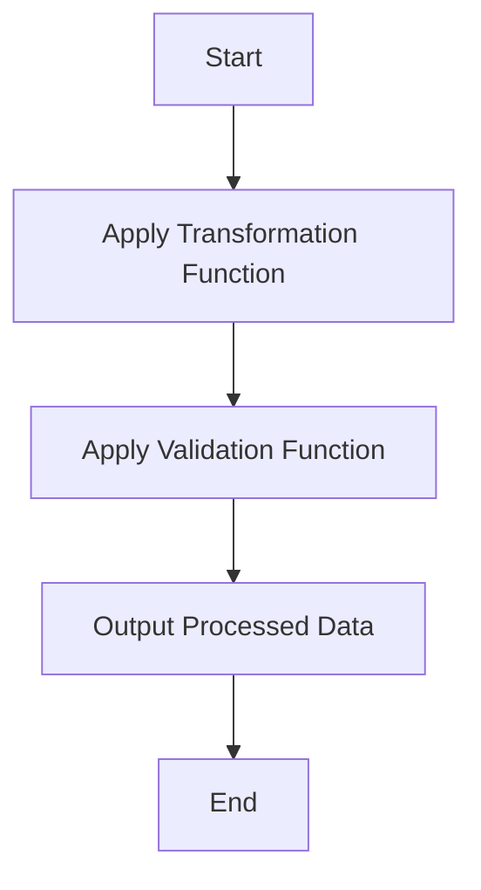

## 6.10 Template Method Pattern

In the realm of software design, the Template Method Pattern stands out as a powerful tool for defining the skeleton of an algorithm while allowing flexibility in its implementation. This pattern is particularly useful in scenarios where the overarching structure of an algorithm remains constant, but specific steps may vary. In F#, the Template Method Pattern can be elegantly implemented using higher-order functions, enabling developers to create flexible, reusable, and maintainable code.

### Understanding the Template Method Pattern

The Template Method Pattern is a behavioral design pattern that defines the skeleton of an algorithm in a base class, deferring some steps to subclasses. This allows subclasses to redefine certain steps of the algorithm without altering its overall structure. The pattern promotes code reuse and separation of concerns by encapsulating invariant parts of an algorithm while allowing variation in specific steps.

In F#, we can leverage the power of functional programming to implement the Template Method Pattern using higher-order functions. By defining functions that represent the algorithm's structure and accepting other functions as parameters, we can create flexible templates that can be customized for different use cases.

### Implementing the Template Method Pattern in F#

#### Using Higher-Order Functions as Templates

Higher-order functions are functions that can take other functions as arguments or return them as results. In F#, higher-order functions can serve as templates for algorithms, where the invariant parts of the algorithm are defined within the function, and the variable parts are passed as function parameters.

Consider the following example, where we define a simple data processing pipeline using higher-order functions:

```fsharp
// Define a higher-order function that serves as a template for data processing
let processData transform validate data =
    data
    |> List.map transform   // Apply the transformation function
    |> List.filter validate // Apply the validation function

// Define a transformation function
let toUpperCase (s: string) = s.ToUpper()

// Define a validation function
let isNotEmpty (s: string) = not (String.IsNullOrWhiteSpace s)

// Use the template method with specific functions
let processedData = processData toUpperCase isNotEmpty ["hello"; "world"; ""]

// Output: ["HELLO"; "WORLD"]
printfn "%A" processedData
```

In this example, `processData` is a higher-order function that defines the structure of a data processing pipeline. It accepts two functions, `transform` and `validate`, which represent the variable parts of the algorithm. By passing different functions to `processData`, we can customize the behavior of the pipeline without changing its overall structure.

#### Creating Reusable Algorithm Templates

One of the key benefits of the Template Method Pattern is the ability to create reusable algorithm templates. In F#, we can achieve this by using partial application or function parameters to define templates that can be easily reused across different contexts.

Let's explore an example where we create a reusable template for logging operations:

```fsharp
// Define a higher-order function for logging operations
let logOperation logFunc operationFunc input =
    logFunc ("Starting operation with input: " + input.ToString())
    let result = operationFunc input
    logFunc ("Operation completed with result: " + result.ToString())
    result

// Define a simple logging function
let consoleLog message = printfn "%s" message

// Define an operation function
let square x = x * x

// Use the template method with specific functions
let loggedSquare = logOperation consoleLog square

// Execute the logged operation
let result = loggedSquare 5

// Output:
// Starting operation with input: 5
// Operation completed with result: 25
printfn "Result: %d" result
```

In this example, `logOperation` is a higher-order function that serves as a template for logging operations. It accepts a logging function `logFunc` and an operation function `operationFunc`, allowing us to customize the logging behavior and the operation being performed. By using partial application, we can create a new function `loggedSquare` that logs the execution of the `square` operation.

### Use Cases for the Template Method Pattern

The Template Method Pattern is particularly useful in scenarios where we have a common algorithm structure with varying steps. Some common use cases include:

- **Data Processing Pipelines**: When processing data, we often have a series of steps that need to be applied to each data item. The Template Method Pattern allows us to define the pipeline structure while customizing the processing steps.

- **Logging and Monitoring**: In applications where logging or monitoring is required, the Template Method Pattern can be used to define the logging structure while allowing different logging implementations.

- **Validation and Transformation**: When validating or transforming data, the Template Method Pattern enables us to define the validation or transformation structure while allowing different validation or transformation rules.

### Benefits of Using the Template Method Pattern in F#

The Template Method Pattern offers several benefits when used in F#:

- **Code Reuse**: By defining reusable templates, we can avoid duplicating code and promote code reuse across different parts of the application.

- **Separation of Concerns**: The pattern promotes separation of concerns by encapsulating invariant parts of an algorithm and allowing variation in specific steps.

- **Flexibility**: The use of higher-order functions allows us to create flexible templates that can be easily customized for different use cases.

- **Maintainability**: By defining clear and reusable templates, we can improve the maintainability of the codebase, making it easier to understand and modify.

### Considerations and Best Practices

While the Template Method Pattern offers many benefits, it's important to consider the following when designing templates:

- **Balancing Flexibility with Complexity**: While flexibility is a key advantage of the Template Method Pattern, it's important to avoid overcomplicating the design. Keep templates simple and focused on the specific use case.

- **Designing Clear and Maintainable Templates**: Ensure that templates are well-documented and easy to understand. Use descriptive names for functions and parameters to improve readability.

- **Avoiding Overuse**: While the Template Method Pattern is a powerful tool, it's important to use it judiciously. Not every algorithm requires a template, and overuse can lead to unnecessary complexity.

### Try It Yourself

To deepen your understanding of the Template Method Pattern, try modifying the examples provided in this section. Experiment with different transformation and validation functions in the `processData` example, or create your own logging templates using different logging functions.

### Visualizing the Template Method Pattern

To better understand the Template Method Pattern, let's visualize the flow of the `processData` function using a flowchart:



This flowchart illustrates the structure of the `processData` function, where data is first transformed and then validated before being outputted.

### Knowledge Check

- **Question**: What is the primary purpose of the Template Method Pattern?
- **Answer**: The primary purpose of the Template Method Pattern is to define the skeleton of an algorithm while allowing subclasses to redefine certain steps without changing the algorithm's structure.

- **Question**: How can higher-order functions be used to implement the Template Method Pattern in F#?
- **Answer**: Higher-order functions can be used to implement the Template Method Pattern by defining the algorithm structure within the function and accepting other functions as parameters to represent the variable parts.

### Conclusion

The Template Method Pattern is a powerful tool for defining flexible and reusable algorithm structures in F#. By leveraging higher-order functions, we can create templates that promote code reuse, separation of concerns, and maintainability. As you continue to explore design patterns in F#, remember to keep your templates clear, focused, and adaptable to different use cases.

## Quiz Time!



### What is the primary purpose of the Template Method Pattern?

- [x] To define the skeleton of an algorithm while allowing subclasses to redefine certain steps without changing the algorithm's structure.
- [ ] To encapsulate data and behavior in a single class.
- [ ] To provide a way to access elements of a collection sequentially.
- [ ] To separate abstraction from implementation.

> **Explanation:** The Template Method Pattern is designed to define the overall structure of an algorithm while allowing specific steps to be customized by subclasses.

### How can higher-order functions be used to implement the Template Method Pattern in F#?

- [x] By defining the algorithm structure within the function and accepting other functions as parameters to represent the variable parts.
- [ ] By creating classes that inherit from a base class and override specific methods.
- [ ] By using interfaces to define the structure of the algorithm.
- [ ] By encapsulating behavior in objects and passing them around.

> **Explanation:** Higher-order functions in F# allow us to define the invariant parts of an algorithm and accept other functions as parameters to customize specific steps.

### Which of the following is a benefit of using the Template Method Pattern in F#?

- [x] Code reuse
- [x] Separation of concerns
- [ ] Increased complexity
- [ ] Reduced flexibility

> **Explanation:** The Template Method Pattern promotes code reuse and separation of concerns by encapsulating invariant parts of an algorithm and allowing variation in specific steps.

### What is a common use case for the Template Method Pattern?

- [x] Data processing pipelines
- [ ] Object serialization
- [ ] Network communication
- [ ] User interface design

> **Explanation:** Data processing pipelines often have a common structure with varying steps, making them a suitable use case for the Template Method Pattern.

### What should be considered when designing templates using the Template Method Pattern?

- [x] Balancing flexibility with complexity
- [x] Designing clear and maintainable templates
- [ ] Avoiding the use of higher-order functions
- [ ] Ensuring templates are as complex as possible

> **Explanation:** It's important to balance flexibility with complexity and design clear, maintainable templates when using the Template Method Pattern.

### What is the role of partial application in creating reusable algorithm templates?

- [x] It allows us to create new functions by fixing some arguments of a higher-order function.
- [ ] It enables us to define classes that inherit from a base class.
- [ ] It provides a way to encapsulate behavior in objects.
- [ ] It separates data from behavior.

> **Explanation:** Partial application allows us to create new functions by fixing some arguments of a higher-order function, making it useful for creating reusable algorithm templates.

### How does the Template Method Pattern promote maintainability?

- [x] By defining clear and reusable templates that are easy to understand and modify.
- [ ] By increasing the complexity of the codebase.
- [ ] By encapsulating all behavior in a single class.
- [ ] By avoiding the use of functions.

> **Explanation:** The Template Method Pattern promotes maintainability by defining clear and reusable templates that are easy to understand and modify.

### What is the benefit of using higher-order functions in the Template Method Pattern?

- [x] They allow for flexible templates that can be easily customized for different use cases.
- [ ] They increase the complexity of the algorithm.
- [ ] They require the use of object-oriented programming.
- [ ] They limit the ability to reuse code.

> **Explanation:** Higher-order functions allow for flexible templates that can be easily customized for different use cases, making them ideal for the Template Method Pattern.

### What is the main challenge when using the Template Method Pattern?

- [x] Balancing flexibility with complexity
- [ ] Ensuring all steps of the algorithm are defined in the base class
- [ ] Avoiding the use of functions
- [ ] Encapsulating all behavior in a single class

> **Explanation:** The main challenge when using the Template Method Pattern is balancing flexibility with complexity to ensure the design remains clear and maintainable.

### True or False: The Template Method Pattern is only applicable in object-oriented programming.

- [ ] True
- [x] False

> **Explanation:** The Template Method Pattern can be applied in functional programming languages like F# using higher-order functions, making it not exclusive to object-oriented programming.


