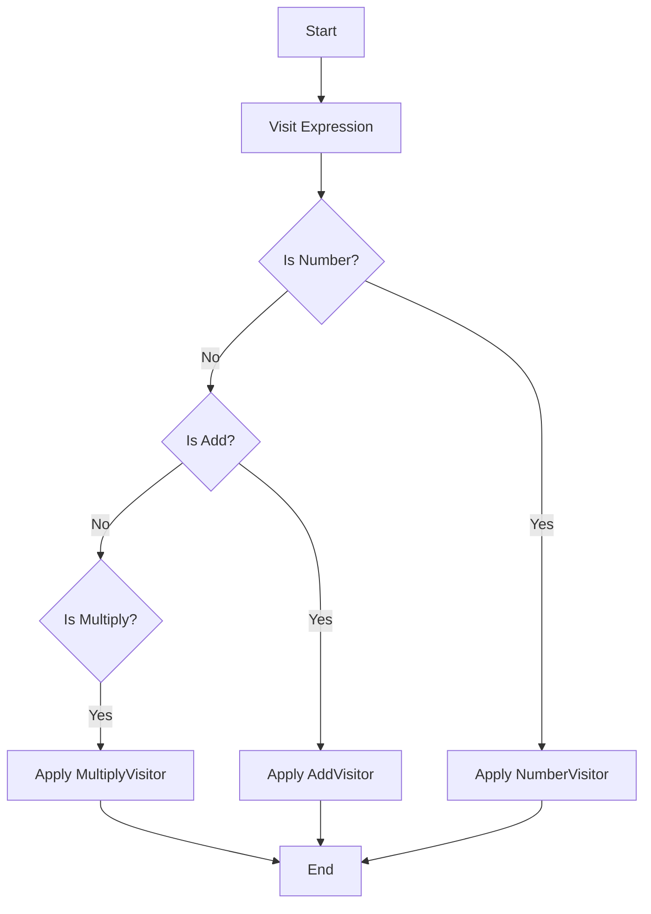

## 6.11 Visitor Pattern

In the realm of software design patterns, the Visitor Pattern stands out for its ability to separate algorithms from the object structures on which they operate. This separation is particularly beneficial in scenarios where operations on a set of objects need to be defined without altering the objects themselves. In this section, we will delve into the Visitor Pattern, its application in F#, and how it leverages the language's powerful pattern matching capabilities to achieve extensibility and type safety.

### Introduction to the Visitor Pattern

The Visitor Pattern is a behavioral design pattern that enables you to define new operations on objects without modifying their classes. This is achieved by encapsulating the operation within a visitor object. The primary advantage of this pattern is its ability to add new operations to existing object structures without altering the structures themselves, thus promoting the Open/Closed Principle.

#### Significance of the Visitor Pattern

The Visitor Pattern is particularly useful in scenarios where you have a complex object structure and need to perform various operations on these objects. For instance, in a compiler, you might have an abstract syntax tree (AST) representing the structure of a program. Different operations, such as type checking, optimization, or code generation, can be performed on this tree. The Visitor Pattern allows these operations to be defined separately from the tree structure, facilitating easier maintenance and extension.

### Implementing Visitor-Like Functionality in F#

F# is a functional-first language that provides powerful pattern matching capabilities, which can be used to implement visitor-like functionality. While traditional object-oriented languages rely on class hierarchies and interfaces to implement the Visitor Pattern, F# leverages discriminated unions and pattern matching to achieve similar results.

#### Pattern Matching in F#

Pattern matching in F# is a powerful feature that allows you to deconstruct data types and apply operations based on their structure. This feature can be used to implement visitor-like functionality by defining operations for different types within a discriminated union.

##### Example: Pattern Matching with Discriminated Unions

Let's consider a simple example of an arithmetic expression evaluator using discriminated unions and pattern matching:

```fsharp
type Expr =
    | Number of int
    | Add of Expr * Expr
    | Multiply of Expr * Expr

let rec evaluate expr =
    match expr with
    | Number n -> n
    | Add (left, right) -> evaluate left + evaluate right
    | Multiply (left, right) -> evaluate left * evaluate right

// Example usage
let expr = Add(Number 1, Multiply(Number 2, Number 3))
let result = evaluate expr
printfn "Result: %d" result
```

In this example, `Expr` is a discriminated union representing an arithmetic expression. The `evaluate` function uses pattern matching to apply operations based on the type of expression.

### Applying the Visitor Pattern to Discriminated Unions

The Visitor Pattern can be effectively applied to discriminated unions in F# by defining a visitor function that operates on each case of the union. This approach allows you to separate the operation logic from the data structure, enhancing maintainability and extensibility.

#### Example: Visitor Pattern with Discriminated Unions

Let's extend our previous example to include a visitor function that performs different operations on the expression tree:

```fsharp
type Expr =
    | Number of int
    | Add of Expr * Expr
    | Multiply of Expr * Expr

let rec visitExpr visitor expr =
    match expr with
    | Number n -> visitor.NumberVisitor n
    | Add (left, right) -> visitor.AddVisitor (visitExpr visitor left, visitExpr visitor right)
    | Multiply (left, right) -> visitor.MultiplyVisitor (visitExpr visitor left, visitExpr visitor right)

type ExprVisitor<'T> = {
    NumberVisitor: int -> 'T
    AddVisitor: 'T * 'T -> 'T
    MultiplyVisitor: 'T * 'T -> 'T
}

// Example usage
let evaluateVisitor = {
    NumberVisitor = id
    AddVisitor = fun (left, right) -> left + right
    MultiplyVisitor = fun (left, right) -> left * right
}

let expr = Add(Number 1, Multiply(Number 2, Number 3))
let result = visitExpr evaluateVisitor expr
printfn "Result: %d" result
```

In this example, `ExprVisitor` is a record type representing a visitor with functions for each case of the `Expr` union. The `visitExpr` function applies the appropriate visitor function based on the type of expression.

### Scenarios for Using the Visitor Pattern

The Visitor Pattern is particularly useful in scenarios where you need to perform multiple operations on a complex object structure. Some common use cases include:

- **Abstract Syntax Trees (ASTs)**: In compilers or interpreters, the Visitor Pattern can be used to perform operations like type checking, optimization, or code generation on an AST.
- **Document Processing**: When processing documents with a hierarchical structure, the Visitor Pattern can be used to apply operations like formatting, printing, or exporting to different formats.
- **Graphics Rendering**: In graphics applications, the Visitor Pattern can be used to apply rendering operations to a scene graph.

### Benefits of Using the Visitor Pattern in F#

The Visitor Pattern offers several benefits when applied in F#:

- **Extensibility**: New operations can be added without modifying existing object structures, adhering to the Open/Closed Principle.
- **Type Safety**: F#'s strong type system ensures that operations are applied to the correct types, reducing runtime errors.
- **Separation of Concerns**: By separating operations from data structures, the Visitor Pattern promotes cleaner and more maintainable code.

### Challenges and Considerations

While the Visitor Pattern offers many benefits, there are also challenges to consider:

- **Adding New Data Types**: Adding new cases to a discriminated union requires updating all visitor functions, which can be cumbersome in large systems.
- **Complexity**: The pattern can introduce complexity, especially when dealing with a large number of operations or data types.
- **Performance**: In some cases, the overhead of visitor functions can impact performance, especially in performance-critical applications.

### Best Practices for Implementing Visitors in F#

To effectively implement the Visitor Pattern in F#, consider the following best practices:

- **Define Clear Interfaces**: Use record types or interfaces to define clear and concise visitor functions.
- **Leverage Pattern Matching**: Utilize F#'s pattern matching capabilities to simplify visitor logic and enhance readability.
- **Modularize Operations**: Keep visitor functions modular and focused on a single operation to enhance maintainability.
- **Test Extensively**: Ensure that visitor functions are thoroughly tested to catch potential errors early.

### Try It Yourself

To get hands-on experience with the Visitor Pattern in F#, try modifying the code examples provided. For instance, add a new operation to the `ExprVisitor` type, such as subtraction or division, and update the `visitExpr` function accordingly. Experiment with different expression trees to see how the visitor functions apply operations.

### Visualizing the Visitor Pattern

To better understand the Visitor Pattern, let's visualize the process of visiting an expression tree using a flowchart:



This flowchart illustrates the process of visiting an expression tree and applying the appropriate visitor function based on the type of expression.

### References and Further Reading

For more information on the Visitor Pattern and its applications, consider exploring the following resources:

- [Design Patterns: Elements of Reusable Object-Oriented Software](https://en.wikipedia.org/wiki/Design_Patterns) by Erich Gamma et al.
- [F# for Fun and Profit](https://fsharpforfunandprofit.com/) - A comprehensive resource for learning F# and functional programming.
- [Functional Programming in F#](https://www.microsoft.com/en-us/research/publication/functional-programming-in-f/) by Michael R. Hansen and Hans Rischel.

### Knowledge Check

Before we conclude, let's summarize the key takeaways from this section:

- The Visitor Pattern separates algorithms from object structures, promoting extensibility and maintainability.
- FSharp's pattern matching capabilities can be used to implement visitor-like functionality with discriminated unions.
- The pattern is useful in scenarios like processing abstract syntax trees, document processing, and graphics rendering.
- While the pattern offers benefits like type safety and separation of concerns, it also presents challenges such as adding new data types and managing complexity.

### Embrace the Journey

Remember, mastering design patterns like the Visitor Pattern is a journey. As you continue to explore and experiment with these patterns, you'll gain a deeper understanding of their applications and benefits. Keep experimenting, stay curious, and enjoy the journey!

## Quiz Time!



### What is the primary advantage of the Visitor Pattern?

- [x] It allows new operations to be defined without modifying existing object structures.
- [ ] It simplifies the object structure by merging classes.
- [ ] It improves performance by reducing the number of classes.
- [ ] It enhances security by restricting access to object data.

> **Explanation:** The Visitor Pattern allows new operations to be defined without modifying existing object structures, promoting the Open/Closed Principle.

### How does F# implement visitor-like functionality?

- [x] By using pattern matching with discriminated unions.
- [ ] By using inheritance and interfaces.
- [ ] By using reflection and dynamic typing.
- [ ] By using global variables and state.

> **Explanation:** F# leverages pattern matching with discriminated unions to implement visitor-like functionality, allowing operations to be defined separately from data structures.

### What is a common use case for the Visitor Pattern?

- [x] Processing abstract syntax trees in compilers.
- [ ] Managing user authentication in web applications.
- [ ] Rendering 3D graphics in video games.
- [ ] Handling network requests in a server.

> **Explanation:** The Visitor Pattern is commonly used for processing abstract syntax trees in compilers, where multiple operations need to be performed on a complex object structure.

### What is a potential challenge of using the Visitor Pattern?

- [x] Adding new data types requires updating all visitor functions.
- [ ] It increases the number of classes in the system.
- [ ] It reduces the flexibility of the object structure.
- [ ] It complicates the implementation of inheritance.

> **Explanation:** Adding new data types requires updating all visitor functions, which can be cumbersome in large systems.

### What is a benefit of using the Visitor Pattern in F#?

- [x] Type safety and separation of concerns.
- [ ] Increased runtime performance.
- [ ] Simplified class hierarchies.
- [ ] Reduced memory usage.

> **Explanation:** The Visitor Pattern in F# offers benefits like type safety and separation of concerns, promoting cleaner and more maintainable code.

### How can you extend the functionality of a visitor in F#?

- [x] By adding new functions to the visitor record type.
- [ ] By modifying the existing object structure.
- [ ] By using global variables to store state.
- [ ] By creating new classes for each operation.

> **Explanation:** You can extend the functionality of a visitor in F# by adding new functions to the visitor record type, allowing new operations to be defined.

### What is a best practice for implementing visitors in F#?

- [x] Define clear interfaces and leverage pattern matching.
- [ ] Use global variables to store visitor state.
- [ ] Avoid using discriminated unions.
- [ ] Implement visitors as separate classes.

> **Explanation:** A best practice for implementing visitors in F# is to define clear interfaces and leverage pattern matching to simplify visitor logic and enhance readability.

### What is the role of pattern matching in the Visitor Pattern?

- [x] It deconstructs data types and applies operations based on their structure.
- [ ] It merges multiple classes into a single class.
- [ ] It dynamically changes the type of an object.
- [ ] It stores the state of an object globally.

> **Explanation:** Pattern matching deconstructs data types and applies operations based on their structure, enabling visitor-like functionality in F#.

### What should you do to test visitor functions effectively?

- [x] Ensure that visitor functions are thoroughly tested to catch potential errors early.
- [ ] Avoid testing visitor functions to save time.
- [ ] Use manual testing exclusively.
- [ ] Test only the most complex visitor functions.

> **Explanation:** To test visitor functions effectively, ensure that they are thoroughly tested to catch potential errors early, promoting reliability and correctness.

### True or False: The Visitor Pattern can introduce complexity, especially when dealing with a large number of operations or data types.

- [x] True
- [ ] False

> **Explanation:** True. The Visitor Pattern can introduce complexity, especially when dealing with a large number of operations or data types, which can make the system harder to manage.


