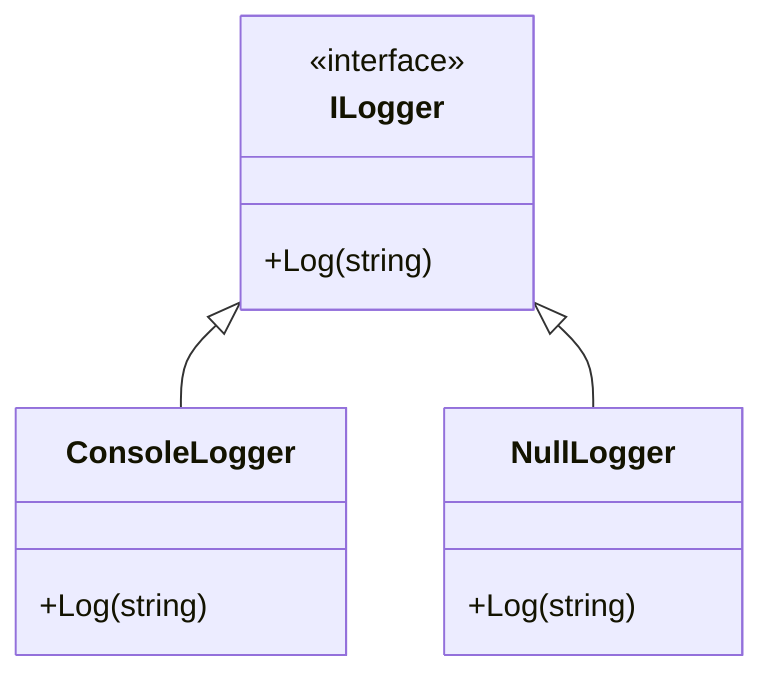

## 6.12 Null Object Pattern

In software development, dealing with the absence of an object is a common challenge. Traditionally, null references have been used to signify the absence of a value, but this approach often leads to null reference exceptions, a notorious source of runtime errors. The Null Object Pattern offers a solution by providing a surrogate object that implements default behavior, eliminating the need for null checks. In F#, the `Option` type provides a functional approach to handle the presence or absence of values, enhancing code safety and clarity.

### Understanding the Null Object Pattern

The Null Object Pattern is a design pattern that uses a special object to represent the absence of a value. Instead of returning `null`, a null object is returned, which implements the expected interface or behavior. This approach avoids null reference exceptions and simplifies code by eliminating the need for null checks.

#### Purpose of the Null Object Pattern

- **Avoid Null Reference Exceptions**: By using a null object, you can prevent null reference exceptions, which are common runtime errors.
- **Simplify Code**: Reduces the need for null checks, leading to cleaner and more readable code.
- **Provide Default Behavior**: A null object can implement default behavior, ensuring that the application continues to function even in the absence of a real object.

### The `Option` Type in F#

In F#, the `Option` type is a powerful tool for representing optional values. It is a discriminated union with two cases: `Some` and `None`. This type provides a functional approach to handle the presence or absence of values safely and effectively.

#### Using `Some` and `None`

The `Option` type can be used to represent a value that might be present (`Some`) or absent (`None`). Here's a simple example:

```fsharp
let getValue (input: int option) =
    match input with
    | Some value -> printfn "Value is %d" value
    | None -> printfn "No value provided"

let value1 = Some 42
let value2 = None

getValue value1 // Output: Value is 42
getValue value2 // Output: No value provided
```

In this example, `getValue` is a function that takes an `int option` as a parameter. It uses pattern matching to handle both cases: when a value is present (`Some`) and when it is absent (`None`).

### Pattern Matching with `Option` Types

Pattern matching is a powerful feature in F# that allows you to handle different cases in a concise and expressive way. When working with `Option` types, pattern matching can be used to safely process values without explicit null checks.

#### Safe Value Processing with Pattern Matching

Consider the following example:

```fsharp
let divide (numerator: int) (denominator: int option) =
    match denominator with
    | Some d when d <> 0 -> Some (numerator / d)
    | _ -> None

let result1 = divide 10 (Some 2) // Output: Some 5
let result2 = divide 10 (Some 0) // Output: None
let result3 = divide 10 None     // Output: None

printfn "%A" result1
printfn "%A" result2
printfn "%A" result3
```

In this example, the `divide` function takes an integer numerator and an optional integer denominator. It uses pattern matching to safely perform the division, returning `None` if the denominator is zero or absent.

### Benefits of Using `Option` Types

Using `Option` types in F# offers several advantages:

- **Increased Safety**: By eliminating null references, `Option` types reduce the risk of runtime errors.
- **Cleaner Code**: Pattern matching allows for concise and expressive handling of optional values.
- **Default Behavior**: `Option` types can be used to implement default behavior, ensuring that the application continues to function even when values are absent.

### Scenarios for the Null Object Pattern

The Null Object Pattern is beneficial in various scenarios, such as:

- **Default Behaviors**: When a default behavior is needed in the absence of a real object, a null object can provide this functionality.
- **Fallback Mechanisms**: In cases where a fallback mechanism is required, a null object can act as a fallback, ensuring that the application continues to function.

#### Example: Default Logger

Consider a logging system where a default logger is needed if no specific logger is provided:

```fsharp
type ILogger =
    abstract member Log: string -> unit

type ConsoleLogger() =
    interface ILogger with
        member _.Log message = printfn "Log: %s" message

type NullLogger() =
    interface ILogger with
        member _.Log _ = () // Do nothing

let logMessage (logger: ILogger option) message =
    match logger with
    | Some l -> l.Log message
    | None -> (NullLogger() :> ILogger).Log message

let consoleLogger = Some (ConsoleLogger() :> ILogger)
let noLogger = None

logMessage consoleLogger "This is a log message." // Output: Log: This is a log message.
logMessage noLogger "This message will not be logged." // No output
```

In this example, `ConsoleLogger` is a concrete implementation of `ILogger`, while `NullLogger` is a null object that does nothing. The `logMessage` function uses an `Option` type to determine whether to use the provided logger or the `NullLogger`.

### Considerations and Best Practices

While the Null Object Pattern and `Option` types offer many benefits, there are some considerations to keep in mind:

- **Overusing Optional Types**: Avoid overusing `Option` types, as they can lead to unnecessary complexity and verbosity.
- **Verbosity**: Pattern matching can become verbose, especially when dealing with complex data structures.

#### Best Practices for Using `Option` Types

- **Use When Appropriate**: Use `Option` types when the presence or absence of a value is a natural part of the domain.
- **Leverage Pattern Matching**: Use pattern matching to handle `Option` types concisely and expressively.
- **Avoid Overuse**: Avoid using `Option` types unnecessarily, as they can add complexity to the code.

### Try It Yourself

To deepen your understanding of the Null Object Pattern and `Option` types in F#, try modifying the examples provided. Experiment with different scenarios and see how the pattern can be applied to solve common programming challenges.

### Visualizing the Null Object Pattern

To better understand the Null Object Pattern, let's visualize how it works using a class diagram.



In this diagram, `ILogger` is an interface with a `Log` method. `ConsoleLogger` and `NullLogger` are concrete implementations of `ILogger`. `ConsoleLogger` performs logging, while `NullLogger` does nothing, representing the absence of a logger.

### Conclusion

The Null Object Pattern and `Option` types in F# provide a robust solution for handling the absence of values. By eliminating null references and leveraging pattern matching, you can write safer, cleaner, and more expressive code. Remember to use `Option` types judiciously and take advantage of pattern matching to handle optional values effectively.

## Quiz Time!



### What is the primary purpose of the Null Object Pattern?

- [x] To avoid null reference exceptions by providing a surrogate object.
- [ ] To enhance performance by reducing memory usage.
- [ ] To simplify complex algorithms.
- [ ] To improve user interface design.

> **Explanation:** The Null Object Pattern aims to avoid null reference exceptions by providing a surrogate object that implements default behavior.


### How does the `Option` type in F# handle the absence of a value?

- [x] By using the `None` case to represent absence.
- [ ] By using a special null keyword.
- [ ] By throwing an exception.
- [ ] By logging an error message.

> **Explanation:** The `Option` type uses the `None` case to represent the absence of a value, providing a safe way to handle optional values.


### Which F# feature allows for concise handling of `Option` types?

- [x] Pattern matching
- [ ] Reflection
- [ ] Dynamic typing
- [ ] Inheritance

> **Explanation:** Pattern matching in F# allows for concise and expressive handling of `Option` types, enabling safe value processing.


### What is a potential drawback of overusing `Option` types?

- [x] Increased verbosity and complexity
- [ ] Reduced code readability
- [ ] Increased risk of null reference exceptions
- [ ] Decreased performance

> **Explanation:** Overusing `Option` types can lead to increased verbosity and complexity, making the code harder to maintain.


### In which scenario is the Null Object Pattern particularly beneficial?

- [x] When a default behavior is needed in the absence of a real object.
- [ ] When optimizing database queries.
- [ ] When designing user interfaces.
- [ ] When implementing complex algorithms.

> **Explanation:** The Null Object Pattern is beneficial when a default behavior is needed in the absence of a real object, ensuring the application continues to function.


### What is the role of `Some` in the `Option` type?

- [x] To represent the presence of a value.
- [ ] To represent an error condition.
- [ ] To indicate a null reference.
- [ ] To log debug information.

> **Explanation:** `Some` in the `Option` type represents the presence of a value, distinguishing it from the absence represented by `None`.


### How can pattern matching be used with `Option` types?

- [x] To handle different cases without explicit null checks.
- [ ] To dynamically create new types.
- [ ] To optimize performance.
- [ ] To implement inheritance hierarchies.

> **Explanation:** Pattern matching can be used with `Option` types to handle different cases without explicit null checks, ensuring safe value processing.


### What is a best practice when using `Option` types in F#?

- [x] Use them when the presence or absence of a value is a natural part of the domain.
- [ ] Avoid using them to keep the code simple.
- [ ] Use them for all types to ensure consistency.
- [ ] Replace them with null references for performance.

> **Explanation:** A best practice is to use `Option` types when the presence or absence of a value is a natural part of the domain, leveraging their safety and expressiveness.


### Which of the following is a benefit of using the Null Object Pattern?

- [x] It simplifies code by reducing the need for null checks.
- [ ] It increases the complexity of the codebase.
- [ ] It requires more memory to store surrogate objects.
- [ ] It decreases application performance.

> **Explanation:** The Null Object Pattern simplifies code by reducing the need for null checks, leading to cleaner and more maintainable code.


### True or False: The `Option` type in F# can represent both the presence and absence of a value.

- [x] True
- [ ] False

> **Explanation:** True. The `Option` type in F# can represent both the presence of a value with `Some` and the absence of a value with `None`.


