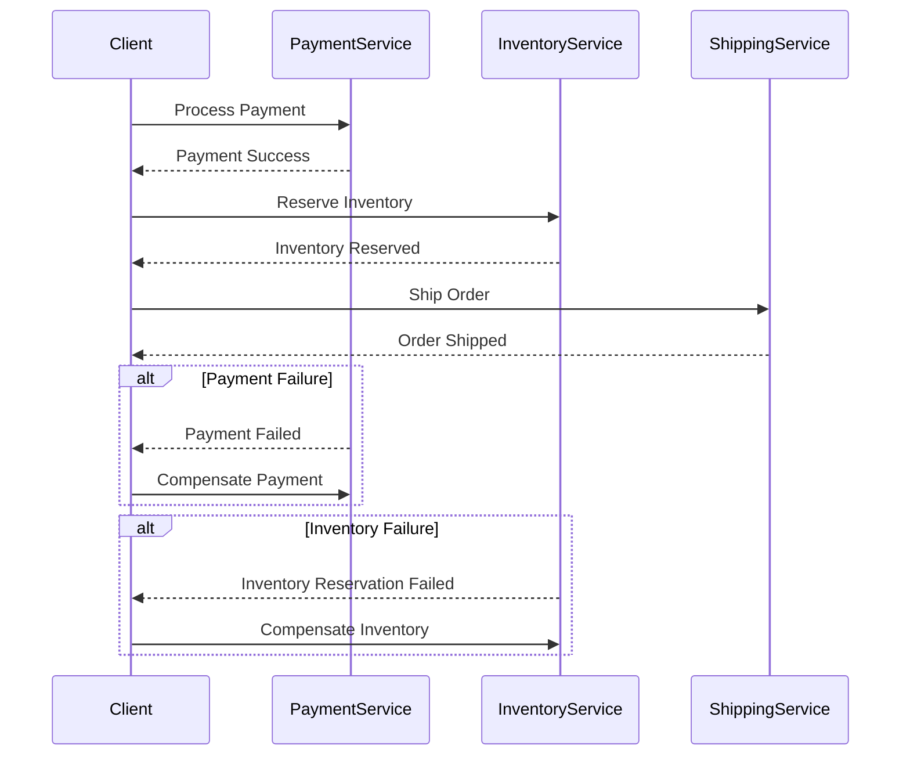

## 6.13 Saga Pattern

In the realm of distributed systems, managing transactions that span multiple services or systems is a complex challenge. The Saga Pattern emerges as a robust solution to orchestrate long-lived business processes and handle distributed transactions effectively. In this section, we will delve into the intricacies of the Saga Pattern, explore its implementation in F#, and discuss best practices for designing reliable and fault-tolerant systems.

### Understanding the Saga Pattern

The Saga Pattern is a design pattern used to manage complex transactions that involve multiple services or systems. Unlike traditional transactions that rely on a two-phase commit protocol, sagas break down a transaction into a series of smaller, isolated steps. Each step is a distinct operation that can be executed independently, and if a step fails, compensating actions are taken to undo the effects of the previous steps.

#### Key Concepts of the Saga Pattern

1. **Orchestration**: Sagas are orchestrated sequences of operations. An orchestrator coordinates the execution of each step and manages compensations in case of failures.

2. **Compensation**: Each step in a saga has an associated compensation action. If a step fails, the compensation action is executed to revert the system to a consistent state.

3. **Asynchronous Execution**: Sagas often involve asynchronous operations, allowing for non-blocking execution and improved system responsiveness.

4. **Idempotency**: Ensuring that operations can be safely retried without adverse effects is crucial for handling failures and retries.

### Implementing Sagas in F#

F#, with its functional programming paradigm, provides powerful constructs for implementing sagas. We can leverage workflows, asynchronous computations, and functional composition to define and manage sagas effectively.

#### Defining a Saga Workflow

In F#, a saga can be represented as a sequence of asynchronous operations. Let's consider an example of a simple saga for processing an order in a microservices architecture:

```fsharp
open System

type Order = { Id: int; Amount: decimal }
type Payment = { OrderId: int; Status: string }
type Inventory = { OrderId: int; Status: string }

let processPayment (order: Order) : Async<Payment> = async {
    // Simulate payment processing
    printfn "Processing payment for order %d" order.Id
    return { OrderId = order.Id; Status = "Paid" }
}

let reserveInventory (order: Order) : Async<Inventory> = async {
    // Simulate inventory reservation
    printfn "Reserving inventory for order %d" order.Id
    return { OrderId = order.Id; Status = "Reserved" }
}

let shipOrder (order: Order) : Async<unit> = async {
    // Simulate order shipment
    printfn "Shipping order %d" order.Id
}

let processOrderSaga (order: Order) : Async<unit> = async {
    try
        let! payment = processPayment order
        let! inventory = reserveInventory order
        do! shipOrder order
        printfn "Order %d processed successfully" order.Id
    with
    | ex ->
        printfn "Failed to process order %d: %s" order.Id ex.Message
        // Implement compensation logic here
}
```

In this example, the `processOrderSaga` function orchestrates the execution of three steps: processing payment, reserving inventory, and shipping the order. Each step is an asynchronous operation, allowing for non-blocking execution.

#### Compensation Actions

Compensation actions are crucial for maintaining system consistency in case of failures. Let's extend our example to include compensation logic:

```fsharp
let compensatePayment (payment: Payment) : Async<unit> = async {
    // Simulate payment compensation
    printfn "Compensating payment for order %d" payment.OrderId
}

let compensateInventory (inventory: Inventory) : Async<unit> = async {
    // Simulate inventory compensation
    printfn "Compensating inventory for order %d" inventory.OrderId
}

let processOrderSagaWithCompensation (order: Order) : Async<unit> = async {
    try
        let! payment = processPayment order
        let! inventory = reserveInventory order
        do! shipOrder order
        printfn "Order %d processed successfully" order.Id
    with
    | ex ->
        printfn "Failed to process order %d: %s" order.Id ex.Message
        // Execute compensation actions
        let! payment = processPayment order
        do! compensatePayment payment
        let! inventory = reserveInventory order
        do! compensateInventory inventory
}
```

In this enhanced example, compensation actions are defined for both payment and inventory steps. If any step fails, the corresponding compensation action is executed to revert the system to a consistent state.

### Scenarios for Using the Saga Pattern

The Saga Pattern is particularly useful in scenarios where transactions span multiple services or systems, such as:

- **Microservices Architectures**: In a microservices environment, each service is responsible for a specific business capability. Sagas coordinate transactions across these services, ensuring consistency and reliability.

- **Cloud-Based Applications**: Cloud applications often involve distributed components and services. Sagas provide a mechanism to manage transactions across these distributed elements.

- **Long-Lived Business Processes**: For processes that involve multiple steps and interactions, such as order fulfillment or account provisioning, sagas offer a structured approach to manage the workflow.

### Benefits of Using Sagas in F#

Implementing sagas in F# offers several advantages:

- **Reliability**: Sagas enhance system reliability by providing a mechanism to handle failures gracefully and maintain consistency.

- **Fault Tolerance**: By defining compensation actions, sagas ensure that the system can recover from partial failures and continue operating.

- **Scalability**: Sagas allow for asynchronous execution, enabling systems to scale efficiently and handle high loads.

### Challenges and Best Practices

While the Saga Pattern offers significant benefits, it also presents challenges that need to be addressed:

#### Ensuring Data Consistency

Maintaining data consistency across distributed systems is a critical challenge. To address this, consider the following best practices:

- **Idempotency**: Ensure that operations can be safely retried without adverse effects. This is crucial for handling failures and retries.

- **Monitoring and Logging**: Implement comprehensive monitoring and logging to track the progress of sagas and detect failures promptly.

- **Timeouts and Retries**: Define appropriate timeouts and retry strategies for each step to handle transient failures effectively.

#### Handling Partial Failures

Partial failures can occur when some steps in a saga succeed while others fail. To manage partial failures:

- **Compensation Actions**: Define compensation actions for each step to revert the system to a consistent state in case of failure.

- **Fallback Strategies**: Implement fallback strategies to handle failures gracefully and minimize disruption to the system.

### Best Practices for Designing Sagas

To design effective sagas, consider the following best practices:

- **Define Clear Boundaries**: Clearly define the boundaries of each saga and the steps involved. This helps in managing complexity and ensuring consistency.

- **Leverage F# Features**: Utilize F# features such as workflows, asynchronous computations, and functional composition to implement sagas efficiently.

- **Test Thoroughly**: Test sagas extensively to ensure that compensation actions work as expected and that the system can recover from failures.

- **Monitor and Optimize**: Continuously monitor the performance of sagas and optimize them for efficiency and reliability.

### Visualizing the Saga Pattern

To better understand the flow of a saga, let's visualize the process using a sequence diagram:



This diagram illustrates the sequence of operations in a saga, including the compensation actions in case of failures.

### Try It Yourself

To deepen your understanding of the Saga Pattern, try modifying the code examples provided. Experiment with different compensation actions and failure scenarios to see how the system behaves. Consider implementing additional steps or services to create a more complex saga.

### Conclusion

The Saga Pattern is a powerful tool for managing distributed transactions and long-lived business processes. By leveraging F#'s functional programming capabilities, we can implement sagas that are reliable, fault-tolerant, and scalable. Remember, this is just the beginning. As you progress, you'll build more complex and interactive systems. Keep experimenting, stay curious, and enjoy the journey!

## Quiz Time!



### What is the primary purpose of the Saga Pattern?

- [x] To manage complex transactions across distributed systems
- [ ] To improve UI responsiveness
- [ ] To enhance data storage efficiency
- [ ] To simplify code readability

> **Explanation:** The Saga Pattern is designed to handle complex transactions that span multiple systems or services, ensuring reliability and consistency.

### In the Saga Pattern, what is the role of compensation actions?

- [x] To undo or mitigate the effects of previous steps in case of failure
- [ ] To enhance performance
- [ ] To improve user interface design
- [ ] To simplify data structures

> **Explanation:** Compensation actions are used to revert the system to a consistent state if a step in the saga fails.

### Which F# feature is particularly useful for implementing sagas?

- [x] Asynchronous computations
- [ ] Mutable state
- [ ] Global variables
- [ ] Dynamic typing

> **Explanation:** Asynchronous computations in F# allow for non-blocking execution of saga steps, enhancing scalability and responsiveness.

### What is a key benefit of using the Saga Pattern in microservices architectures?

- [x] Ensures consistency across distributed services
- [ ] Reduces code complexity
- [ ] Increases data redundancy
- [ ] Simplifies database design

> **Explanation:** The Saga Pattern coordinates transactions across services in a microservices architecture, maintaining consistency and reliability.

### What is a common challenge when implementing the Saga Pattern?

- [x] Ensuring data consistency across distributed systems
- [ ] Improving code readability
- [ ] Enhancing UI design
- [ ] Reducing memory usage

> **Explanation:** Maintaining data consistency across distributed systems is a critical challenge when implementing the Saga Pattern.

### Which of the following is a best practice for designing sagas?

- [x] Define clear boundaries for each saga
- [ ] Use global variables for state management
- [ ] Avoid using compensation actions
- [ ] Implement synchronous operations only

> **Explanation:** Defining clear boundaries helps manage complexity and ensures consistency in saga design.

### How can partial failures be managed in a saga?

- [x] By defining compensation actions for each step
- [ ] By ignoring the failed steps
- [ ] By restarting the entire system
- [ ] By using global variables

> **Explanation:** Compensation actions are defined for each step to handle partial failures and revert the system to a consistent state.

### What is the significance of idempotency in the Saga Pattern?

- [x] It ensures operations can be safely retried
- [ ] It enhances UI design
- [ ] It reduces code complexity
- [ ] It simplifies database queries

> **Explanation:** Idempotency ensures that operations can be retried without adverse effects, which is crucial for handling failures and retries.

### What is the role of monitoring and logging in the Saga Pattern?

- [x] To track the progress of sagas and detect failures
- [ ] To improve UI responsiveness
- [ ] To enhance data storage efficiency
- [ ] To simplify code readability

> **Explanation:** Monitoring and logging are essential for tracking the progress of sagas and promptly detecting failures.

### True or False: The Saga Pattern is only applicable to microservices architectures.

- [ ] True
- [x] False

> **Explanation:** While the Saga Pattern is particularly useful in microservices architectures, it can be applied to any distributed system requiring complex transaction management.


