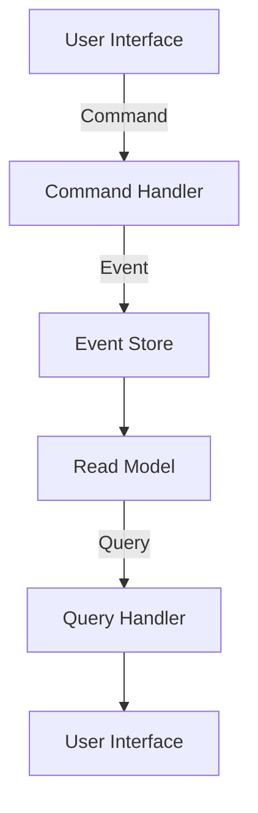

## 6.14 Command Query Responsibility Segregation (CQRS)

In the ever-evolving landscape of software architecture, the Command Query Responsibility Segregation (CQRS) pattern stands out as a powerful approach to managing complex systems. By separating the read (query) and write (command) operations of a data model, CQRS optimizes performance, scalability, and security, allowing for the independent evolution of read and write models. In this section, we will delve into the principles of CQRS, explore its implementation in F#, and discuss its advantages and challenges.

### Introduction to CQRS

Command Query Responsibility Segregation (CQRS) is a design pattern that separates the responsibilities of reading and writing data. This separation allows for more precise optimization of each operation, as the requirements for reading data often differ significantly from those for writing data. In traditional architectures, a single model is used for both reads and writes, which can lead to inefficiencies and complexities, especially in large-scale systems.

#### Significance in Modern Application Architecture

CQRS is particularly significant in modern application architecture due to its ability to handle complex domains and high-performance applications. By decoupling the read and write operations, CQRS enables systems to scale more effectively, handle more complex business logic, and provide better user experiences. It also facilitates the use of different data storage technologies for reads and writes, allowing developers to choose the best tool for each job.

### Principles of CQRS

At its core, CQRS is about separating commands (actions that change state) from queries (actions that read state). This separation is based on the principle that a system's write model and read model often have different requirements and can benefit from being designed independently.

#### Commands and Queries

- **Commands**: These are operations that change the state of the system. They are typically implemented as methods or functions that perform a specific action, such as creating, updating, or deleting data. Commands are usually processed asynchronously to ensure system responsiveness.

- **Queries**: These are operations that retrieve data from the system. They do not change the state of the system and are typically implemented as methods or functions that return data to the caller. Queries are often optimized for performance and can be processed synchronously or asynchronously.

### Implementing CQRS in F#

F# is a functional programming language that provides several features that make it well-suited for implementing CQRS. These include strong typing, pattern matching, and immutable data structures. Let's explore how we can use F# to define distinct models and handlers for commands and queries.

#### Designing Separate Types and Functions

In F#, we can define separate types for commands and queries, ensuring that each has its own distinct responsibilities. This separation allows us to optimize each operation independently and provides a clear boundary between the read and write models.

```fsharp
// Define a command type
type CreateOrderCommand = {
    OrderId: Guid
    CustomerId: Guid
    Items: List<OrderItem>
}

// Define a query type
type GetOrderQuery = {
    OrderId: Guid
}

// Define a function to handle the command
let handleCreateOrderCommand (command: CreateOrderCommand) =
    // Logic to create an order
    printfn "Order created with ID: %A" command.OrderId

// Define a function to handle the query
let handleGetOrderQuery (query: GetOrderQuery) =
    // Logic to retrieve an order
    printfn "Retrieving order with ID: %A" query.OrderId
```

In this example, we define a `CreateOrderCommand` type for creating orders and a `GetOrderQuery` type for retrieving orders. We then define separate functions to handle each operation, ensuring that the logic for commands and queries is kept distinct.

#### Using Immutable Data Structures

Immutable data structures are a key feature of F# and play an important role in implementing CQRS. By ensuring that data is immutable, we can avoid many of the concurrency issues that arise in traditional architectures. Immutable data structures also make it easier to reason about the state of the system and ensure that changes are applied consistently.

```fsharp
// Define an immutable order item type
type OrderItem = {
    ProductId: Guid
    Quantity: int
    Price: decimal
}

// Define an immutable order type
type Order = {
    OrderId: Guid
    CustomerId: Guid
    Items: List<OrderItem>
    Total: decimal
}
```

In this example, we define immutable types for `OrderItem` and `Order`. By using immutable data structures, we ensure that once an order is created, its state cannot be changed, reducing the risk of data inconsistencies.

### Event Sourcing and CQRS

Event sourcing is a complementary pattern to CQRS that involves storing changes to the system state as a sequence of events. Instead of storing the current state of an object, we store a log of all the changes that have been made to it. This approach provides a complete audit trail of all changes and allows us to reconstruct the state of the system at any point in time.

#### Implementing Event Sourcing in F#

F#'s functional programming features make it well-suited for implementing event sourcing. We can define events as immutable types and use pattern matching to handle them.

```fsharp
// Define an event type
type OrderEvent =
    | OrderCreated of Order
    | ItemAdded of OrderItem
    | ItemRemoved of OrderItem

// Define a function to apply events to an order
let applyEvent (order: Order) (event: OrderEvent) =
    match event with
    | OrderCreated newOrder -> newOrder
    | ItemAdded item -> { order with Items = item :: order.Items }
    | ItemRemoved item -> { order with Items = List.filter ((<>) item) order.Items }
```

In this example, we define an `OrderEvent` type with different events that can occur to an order. We then define a function `applyEvent` that applies an event to an order, updating its state accordingly.

### Scenarios Where CQRS is Beneficial

CQRS is particularly beneficial in scenarios where the read and write operations have different requirements or where the system needs to handle complex business logic. Some common scenarios where CQRS can be advantageous include:

- **Complex Domains**: In systems with complex business logic, separating the read and write models can simplify the design and make it easier to manage changes.

- **High-Performance Applications**: By optimizing the read and write operations independently, CQRS can improve the performance of high-traffic applications.

- **Scalability**: CQRS allows for the independent scaling of read and write models, making it easier to handle large volumes of data.

### Advantages of CQRS

The CQRS pattern offers several advantages, including:

- **Improved Scalability**: By separating the read and write models, CQRS allows for the independent scaling of each, making it easier to handle large volumes of data.

- **Flexibility**: CQRS allows for the use of different data storage technologies for reads and writes, providing greater flexibility in choosing the best tool for each job.

- **Maintainability**: By separating the responsibilities of reading and writing data, CQRS can simplify the design of complex systems and make it easier to manage changes.

### Potential Complexities

While CQRS offers many advantages, it also introduces some complexities that need to be managed:

- **Increased Codebase Size**: Separating the read and write models can lead to an increase in the size of the codebase, which can make it more challenging to manage.

- **Eventual Consistency**: In a CQRS system, the read and write models are often eventually consistent, meaning that there may be a delay between when a change is made and when it is reflected in the read model. This can introduce challenges in ensuring data consistency.

### Best Practices for Implementing CQRS in F#

When implementing CQRS in F#, it's important to follow best practices to ensure clear boundaries and effective collaboration between models:

- **Define Clear Boundaries**: Clearly define the boundaries between the read and write models, ensuring that each has its own distinct responsibilities.

- **Use Immutable Data Structures**: Leverage F#'s immutable data structures to ensure data consistency and avoid concurrency issues.

- **Leverage Pattern Matching**: Use pattern matching to handle commands and queries, making it easier to reason about the state of the system.

- **Implement Event Sourcing**: Consider using event sourcing to complement CQRS, providing a complete audit trail of all changes to the system.

- **Monitor Performance**: Regularly monitor the performance of the system to ensure that the read and write models are optimized for their respective operations.

### Try It Yourself

To get hands-on experience with CQRS in F#, try modifying the code examples provided in this section. Experiment with adding new commands and queries, and explore how changes to the read and write models affect the overall system. By experimenting with different scenarios, you'll gain a deeper understanding of how CQRS can be used to optimize performance, scalability, and maintainability in complex systems.

### Visualizing CQRS Architecture

To better understand the CQRS architecture, let's visualize the separation of command and query responsibilities using a diagram.



**Diagram Description**: This diagram illustrates the flow of commands and queries in a CQRS architecture. The user interface sends commands to the command handler, which processes them and stores events in the event store. The read model is updated based on these events. Queries are then processed by the query handler, which retrieves data from the read model and returns it to the user interface.

### Knowledge Check

Before we wrap up, let's reinforce what we've learned with a few questions:

- What are the main components of a CQRS architecture?
- How does CQRS improve scalability and flexibility in a system?
- What are some potential challenges when implementing CQRS?

### Conclusion

The Command Query Responsibility Segregation (CQRS) pattern is a powerful tool for managing complex systems, offering improved scalability, flexibility, and maintainability. By separating the read and write models, CQRS allows for the independent optimization of each operation, making it easier to handle complex business logic and high-performance applications. While CQRS introduces some complexities, such as increased codebase size and eventual consistency challenges, these can be managed with careful design and best practices. As you continue to explore CQRS in F#, remember to experiment with different scenarios and leverage the language's functional programming features to create robust, scalable systems.

## Quiz Time!



### What is the primary goal of CQRS?

- [x] To separate the read and write operations of a data model
- [ ] To combine the read and write operations into a single model
- [ ] To improve the security of a system
- [ ] To reduce the codebase size

> **Explanation:** The primary goal of CQRS is to separate the read and write operations of a data model to optimize performance, scalability, and security.

### In CQRS, what is the role of a command?

- [x] To change the state of the system
- [ ] To retrieve data from the system
- [ ] To handle queries
- [ ] To store events

> **Explanation:** In CQRS, a command is an operation that changes the state of the system.

### How does CQRS improve scalability?

- [x] By allowing independent scaling of read and write models
- [ ] By reducing the number of queries
- [ ] By combining read and write operations
- [ ] By using a single data storage technology

> **Explanation:** CQRS improves scalability by allowing the independent scaling of read and write models, making it easier to handle large volumes of data.

### What is a potential challenge of implementing CQRS?

- [x] Eventual consistency
- [ ] Improved performance
- [ ] Simplified design
- [ ] Reduced codebase size

> **Explanation:** A potential challenge of implementing CQRS is eventual consistency, where there may be a delay between when a change is made and when it is reflected in the read model.

### Which F# feature is particularly useful for implementing CQRS?

- [x] Immutable data structures
- [ ] Mutable state
- [ ] Dynamic typing
- [ ] Weak typing

> **Explanation:** Immutable data structures are particularly useful for implementing CQRS in F#, as they ensure data consistency and avoid concurrency issues.

### What is event sourcing?

- [x] Storing changes to the system state as a sequence of events
- [ ] Storing the current state of an object
- [ ] Combining read and write operations
- [ ] Handling queries

> **Explanation:** Event sourcing involves storing changes to the system state as a sequence of events, providing a complete audit trail of all changes.

### How can event sourcing complement CQRS?

- [x] By providing a complete audit trail of all changes
- [ ] By simplifying the design of the system
- [ ] By reducing the codebase size
- [ ] By combining read and write operations

> **Explanation:** Event sourcing can complement CQRS by providing a complete audit trail of all changes to the system, allowing for the reconstruction of the state at any point in time.

### What is a best practice for implementing CQRS in F#?

- [x] Define clear boundaries between read and write models
- [ ] Use mutable data structures
- [ ] Combine read and write operations
- [ ] Avoid using pattern matching

> **Explanation:** A best practice for implementing CQRS in F# is to define clear boundaries between the read and write models, ensuring that each has its own distinct responsibilities.

### What is the benefit of using pattern matching in CQRS?

- [x] It makes it easier to reason about the state of the system
- [ ] It reduces the codebase size
- [ ] It combines read and write operations
- [ ] It simplifies the design of the system

> **Explanation:** Using pattern matching in CQRS makes it easier to reason about the state of the system, as it allows for clear and concise handling of commands and queries.

### True or False: CQRS allows for the use of different data storage technologies for reads and writes.

- [x] True
- [ ] False

> **Explanation:** True. CQRS allows for the use of different data storage technologies for reads and writes, providing greater flexibility in choosing the best tool for each job.


