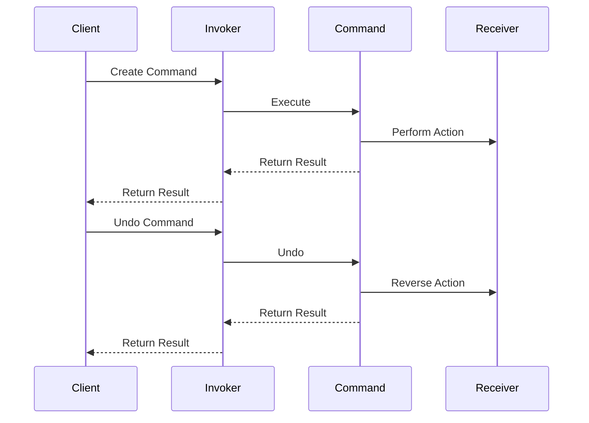

## 6.2 Command Pattern

In the realm of software design patterns, the Command Pattern stands out as a versatile and powerful tool for encapsulating requests or actions as objects. This pattern allows for the parameterization of clients with queues, requests, and operations, and supports undoable operations. In this section, we will delve into the Command Pattern, exploring its implementation in F# and its applications in real-world scenarios.

### Understanding the Command Pattern

The Command Pattern is a behavioral design pattern that turns a request into a stand-alone object containing all information about the request. This transformation allows for the parameterization of clients with different requests, queuing of requests, and logging of the requests. Moreover, it facilitates the implementation of undoable operations.

#### Purpose of the Command Pattern

The primary purpose of the Command Pattern is to decouple the object that invokes the operation from the one that knows how to perform it. This decoupling allows for greater flexibility in the design of software systems, enabling features such as:

- **Undo/Redo Functionality**: By storing commands, systems can easily reverse operations.
- **Logging and Auditing**: Commands can be logged for auditing purposes.
- **Task Scheduling**: Commands can be queued and executed at a later time.
- **Macro Recording**: Commands can be recorded and played back.

### Commands as First-Class Functions in F#

In F#, functions are first-class citizens, meaning they can be passed as arguments, returned from other functions, and assigned to variables. This feature makes F# particularly well-suited for implementing the Command Pattern, as commands can be represented as functions or immutable data structures.

#### Representing Commands with Functions

One of the simplest ways to implement the Command Pattern in F# is to use functions to represent commands. Here's a basic example:

```fsharp
// Define a type alias for a command
type Command = unit -> unit

// A simple command to print a message
let printHello: Command = fun () -> printfn "Hello, World!"

// Execute the command
printHello()
```

In this example, a `Command` is defined as a function that takes no arguments and returns no value (`unit -> unit`). The `printHello` command is a function that prints "Hello, World!" to the console. This command can be executed by simply invoking the function.

#### Using Immutable Data Structures

In addition to functions, commands can also be represented using immutable data structures. This approach is useful when commands need to carry additional information or parameters. Here's an example:

```fsharp
// Define a record type for a command with parameters
type PrintCommand = { Message: string }

// Function to execute the command
let executePrintCommand (command: PrintCommand) =
    printfn "%s" command.Message

// Create a command instance
let helloCommand = { Message = "Hello, F#" }

// Execute the command
executePrintCommand helloCommand
```

In this example, the `PrintCommand` record type encapsulates a message to be printed. The `executePrintCommand` function takes a `PrintCommand` instance and prints its message. This approach allows commands to be easily serialized, logged, or stored for later execution.

### Immutable Command Data Structures

Immutable data structures are a cornerstone of functional programming, and they play a crucial role in implementing the Command Pattern in F#. By using immutable structures, we can ensure that commands are thread-safe and can be easily shared across different parts of a system.

#### Command Creation and Execution

Let's explore a more complex example where commands are used to perform arithmetic operations:

```fsharp
// Define a record type for arithmetic commands
type ArithmeticCommand =
    | Add of int * int
    | Subtract of int * int
    | Multiply of int * int
    | Divide of int * int

// Function to execute an arithmetic command
let executeArithmeticCommand command =
    match command with
    | Add(x, y) -> printfn "Result: %d" (x + y)
    | Subtract(x, y) -> printfn "Result: %d" (x - y)
    | Multiply(x, y) -> printfn "Result: %d" (x * y)
    | Divide(x, y) when y <> 0 -> printfn "Result: %d" (x / y)
    | Divide(_, 0) -> printfn "Error: Division by zero"

// Create and execute commands
let addCommand = Add(5, 3)
let divideCommand = Divide(10, 0)

executeArithmeticCommand addCommand
executeArithmeticCommand divideCommand
```

In this example, the `ArithmeticCommand` type is a discriminated union representing different arithmetic operations. The `executeArithmeticCommand` function uses pattern matching to execute the appropriate operation based on the command type. This approach demonstrates the power of F#'s type system and pattern matching capabilities in implementing the Command Pattern.

### Facilitating Undo/Redo and Logging

One of the key benefits of the Command Pattern is its ability to facilitate features like undo/redo and logging. By storing a history of executed commands, systems can easily reverse operations or replay them for auditing purposes.

#### Implementing Undo/Redo

To implement undo/redo functionality, we need to store both the command and its inverse. Here's an example:

```fsharp
// Define a record type for commands with undo functionality
type UndoableCommand =
    { Execute: unit -> unit
      Undo: unit -> unit }

// Function to create an undoable add command
let createAddCommand x y =
    { Execute = fun () -> printfn "Add: %d + %d = %d" x y (x + y)
      Undo = fun () -> printfn "Undo Add: %d - %d = %d" (x + y) y x }

// Create and execute an undoable command
let addCommand = createAddCommand 5 3
addCommand.Execute()
addCommand.Undo()
```

In this example, the `UndoableCommand` record type encapsulates both an `Execute` function and an `Undo` function. The `createAddCommand` function creates an undoable add command by defining both the addition and its inverse operation. This approach allows for easy implementation of undo/redo functionality.

#### Logging Commands

Logging commands is straightforward when using the Command Pattern. By storing executed commands, systems can maintain a detailed audit trail of operations. Here's a simple example:

```fsharp
// Define a list to store executed commands
let mutable commandLog = []

// Function to execute and log a command
let executeAndLog command =
    command.Execute()
    commandLog <- command :: commandLog

// Create and execute a command
let logCommand = createAddCommand 10 5
executeAndLog logCommand

// Print the command log
commandLog |> List.iter (fun cmd -> cmd.Undo())
```

In this example, the `commandLog` list stores executed commands. The `executeAndLog` function executes a command and adds it to the log. This approach provides a simple mechanism for logging and auditing operations.

### Real-World Applications

The Command Pattern is widely used in various real-world applications, including:

- **Task Scheduling**: Commands can be queued and executed at specific times or intervals.
- **User Input Handling**: Commands can represent user actions, allowing for flexible input handling.
- **Macro Recording**: Commands can be recorded and replayed, enabling macro functionality in applications.
- **Remote Method Invocation**: Commands can be serialized and sent over a network for remote execution.

### Benefits of the Command Pattern in F#

The Command Pattern offers several benefits when implemented in F#, including:

- **Simplicity**: Commands can be represented as simple functions or immutable data structures.
- **Ease of Composition**: Commands can be easily composed and combined to form complex operations.
- **Thread Safety**: Immutable commands are inherently thread-safe, making them suitable for concurrent systems.
- **Flexibility**: The pattern supports a wide range of features, including undo/redo, logging, and scheduling.

### Potential Issues and Best Practices

While the Command Pattern offers many advantages, there are potential issues to consider:

- **Command Serialization**: When commands need to be serialized (e.g., for logging or remote execution), care must be taken to ensure that all necessary information is included.
- **State Maintenance**: Commands that rely on external state can be challenging to implement in a purely functional manner.

#### Best Practices for Implementing the Command Pattern

To effectively implement the Command Pattern in F#, consider the following best practices:

- **Use Immutable Data Structures**: Leverage F#'s immutable data structures to ensure thread safety and simplify command management.
- **Leverage Pattern Matching**: Use F#'s powerful pattern matching capabilities to handle different command types and operations.
- **Encapsulate State**: When commands require state, encapsulate it within the command itself to maintain functional purity.
- **Design for Extensibility**: Design commands to be easily extended and composed, allowing for flexible and scalable systems.

### Try It Yourself

To deepen your understanding of the Command Pattern in F#, try modifying the examples provided. For instance, you could:

- Implement additional arithmetic operations, such as modulus or exponentiation.
- Create a command that performs a series of operations, demonstrating command composition.
- Implement a simple task scheduler that queues and executes commands at specified intervals.

### Visualizing the Command Pattern

To better understand the Command Pattern, let's visualize the flow of command execution and undo operations using a sequence diagram:



In this diagram, the `Client` creates a `Command` and sends it to the `Invoker`, which executes the command by invoking the `Receiver`. The `Client` can also request the `Invoker` to undo the command, reversing the action performed by the `Receiver`.

### Conclusion

The Command Pattern is a powerful tool for encapsulating requests and actions in F#. By leveraging first-class functions and immutable data structures, F# developers can implement this pattern effectively, enabling features such as undo/redo, logging, and task scheduling. With its simplicity, flexibility, and thread safety, the Command Pattern is an essential addition to any F# developer's toolkit.

## Quiz Time!



### What is the primary purpose of the Command Pattern?

- [x] To decouple the object that invokes the operation from the one that knows how to perform it.
- [ ] To increase the complexity of the system.
- [ ] To make code less readable.
- [ ] To reduce the number of classes in a system.

> **Explanation:** The Command Pattern's primary purpose is to decouple the object that invokes the operation from the one that knows how to perform it, allowing for greater flexibility.

### How can commands be represented in F#?

- [x] As first-class functions.
- [x] As immutable data structures.
- [ ] As mutable variables.
- [ ] As global state.

> **Explanation:** In F#, commands can be represented as first-class functions or immutable data structures, leveraging F#'s functional programming capabilities.

### What is a benefit of using immutable data structures for commands?

- [x] Thread safety.
- [ ] Increased memory usage.
- [ ] Slower execution time.
- [ ] More complex code.

> **Explanation:** Immutable data structures are inherently thread-safe, making them suitable for concurrent systems.

### Which feature does the Command Pattern facilitate?

- [x] Undo/Redo functionality.
- [ ] Increased system complexity.
- [ ] Reduced code readability.
- [ ] Global state management.

> **Explanation:** The Command Pattern facilitates undo/redo functionality by encapsulating operations and their inverses.

### What is a potential issue when implementing the Command Pattern?

- [x] Command serialization.
- [ ] Increased system speed.
- [ ] Simplified code structure.
- [ ] Reduced system flexibility.

> **Explanation:** Command serialization can be a potential issue, especially when commands need to be logged or sent over a network.

### What is a best practice for implementing the Command Pattern in F#?

- [x] Use immutable data structures.
- [ ] Use global variables.
- [ ] Avoid pattern matching.
- [ ] Use mutable state.

> **Explanation:** Using immutable data structures is a best practice in F# to ensure thread safety and simplify command management.

### How can F#'s pattern matching be utilized in the Command Pattern?

- [x] To handle different command types and operations.
- [ ] To increase code complexity.
- [ ] To avoid using functions.
- [ ] To manage global state.

> **Explanation:** F#'s pattern matching can be used to handle different command types and operations, leveraging its powerful type system.

### What is a real-world application of the Command Pattern?

- [x] Task scheduling.
- [ ] Increasing code complexity.
- [ ] Reducing system flexibility.
- [ ] Managing global state.

> **Explanation:** The Command Pattern is used in real-world applications such as task scheduling, where commands can be queued and executed at specific times.

### Can the Command Pattern be used for logging purposes?

- [x] True
- [ ] False

> **Explanation:** True. The Command Pattern can be used for logging purposes by storing executed commands, allowing for detailed audit trails.

### What is an advantage of using the Command Pattern in F#?

- [x] Simplicity and ease of composition.
- [ ] Increased system complexity.
- [ ] Reduced code readability.
- [ ] Global state management.

> **Explanation:** The Command Pattern offers simplicity and ease of composition in F#, making it a valuable tool for developers.


