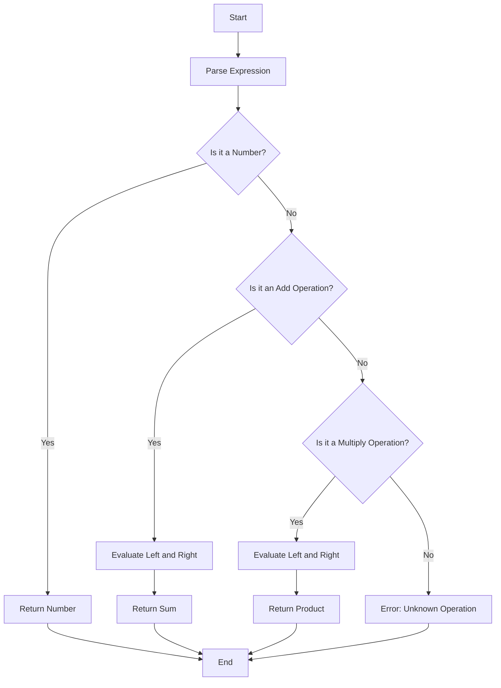

## 6.3 Interpreter Pattern

In the realm of software design patterns, the Interpreter Pattern holds a unique position, particularly when dealing with languages and grammars. This pattern is instrumental in defining a representation for a language's grammar and providing an interpreter to evaluate sentences in that language. In this section, we will delve into the intricacies of the Interpreter Pattern, focusing on its implementation in F#.

### Understanding the Interpreter Pattern

The Interpreter Pattern is a behavioral design pattern that specifies how to evaluate sentences in a language. It involves defining a grammar for the language and implementing an interpreter that processes this grammar. This pattern is particularly useful for languages with simple grammars and is often employed in the development of domain-specific languages (DSLs), configuration file parsers, and expression evaluators.

#### Key Components of the Interpreter Pattern

1. **Abstract Syntax Tree (AST):** A hierarchical representation of the language's grammar, where each node represents a construct occurring in the language.
2. **Interpreter:** A component that traverses the AST and evaluates the expressions based on the defined grammar.
3. **Context:** An environment that holds the state or variables needed during interpretation.

### Leveraging F# for the Interpreter Pattern

F# is a functional-first language that offers powerful features like pattern matching and discriminated unions, making it an excellent choice for implementing the Interpreter Pattern. Let's explore how these features can be utilized effectively.

#### Pattern Matching in F#

Pattern matching in F# is a powerful mechanism that simplifies the process of checking a value against a pattern. It is particularly useful in the context of interpreters, where different constructs of the language need to be evaluated differently. Here's a simple example of pattern matching in F#:

```fsharp
let evaluateExpression expr =
    match expr with
    | "Hello" -> "World"
    | "F#" -> "Functional Programming"
    | _ -> "Unknown Expression"

// Test the function
let result = evaluateExpression "F#"
printfn "%s" result  // Output: Functional Programming
```

In this example, the `evaluateExpression` function uses pattern matching to return different results based on the input expression.

#### Representing Grammar with Discriminated Unions

Discriminated unions in F# allow us to define a type that can be one of several named cases, each potentially with different values and types. This feature is ideal for representing the grammar of a language in the form of an AST.

Consider a simple arithmetic language with operations like addition and multiplication. We can represent its grammar using discriminated unions as follows:

```fsharp
type Expression =
    | Number of int
    | Add of Expression * Expression
    | Multiply of Expression * Expression

// Example of an expression: (3 + 4) * 2
let exampleExpression = Multiply(Add(Number 3, Number 4), Number 2)
```

In this code, the `Expression` type is defined with three cases: `Number`, `Add`, and `Multiply`. This allows us to construct complex expressions by combining these cases.

### Implementing the Interpreter

With the grammar defined, the next step is to implement the interpreter that can evaluate expressions represented by the AST. This involves writing a recursive function that traverses the AST and computes the result.

#### Recursive Evaluation of Expressions

Let's implement a function to evaluate arithmetic expressions defined by our `Expression` type:

```fsharp
let rec evaluate (expr: Expression) : int =
    match expr with
    | Number n -> n
    | Add (left, right) -> evaluate left + evaluate right
    | Multiply (left, right) -> evaluate left * evaluate right

// Evaluate the example expression
let result = evaluate exampleExpression
printfn "Result: %d" result  // Output: Result: 14
```

In this code, the `evaluate` function uses pattern matching to handle each case of the `Expression` type. It recursively evaluates sub-expressions and combines their results according to the operation.

### Use Cases for the Interpreter Pattern

The Interpreter Pattern is versatile and can be applied in various scenarios:

1. **Domain-Specific Languages (DSLs):** Custom languages tailored to specific problem domains can be implemented using the Interpreter Pattern. This allows for more expressive and concise problem-solving.
2. **Configuration Parsing:** Many applications require parsing configuration files. The Interpreter Pattern can be used to define and interpret the grammar of these files.
3. **Expression Evaluation:** Mathematical and logical expressions can be evaluated using this pattern, making it useful in calculators and rule engines.

### Advantages of Using F# for Interpreters

F# offers several advantages when implementing interpreters:

- **Concise Syntax:** F#'s syntax is clean and expressive, reducing boilerplate code.
- **Pattern Matching:** Simplifies the process of handling different cases in the grammar.
- **Immutability:** Encourages safer and more predictable code, especially in recursive functions.
- **Functional Paradigm:** Aligns well with the recursive nature of interpreters and AST traversal.

### Challenges and Considerations

While the Interpreter Pattern is powerful, it comes with its own set of challenges:

1. **Error Handling:** Managing errors gracefully during interpretation is crucial. This can be achieved using F#'s `Result` type or exceptions.
2. **Extending the Language:** Adding new constructs to the language requires modifying the AST and interpreter, which can be cumbersome.
3. **Performance:** Interpreters can be slower than compiled code. Optimizations like memoization can help improve performance.

### Best Practices for Designing Interpreters in F#

To ensure maintainability and scalability, consider the following best practices:

- **Modular Design:** Keep the grammar definition, interpreter logic, and context management separate.
- **Comprehensive Testing:** Write tests for each construct in the language to ensure correctness.
- **Documentation:** Clearly document the grammar and interpreter logic for future reference and maintenance.

### Try It Yourself

To deepen your understanding, try modifying the code examples to add new operations like subtraction or division. Experiment with different expressions and observe how the interpreter handles them.

### Visualizing the Interpreter Pattern

To better understand the flow of the Interpreter Pattern, let's visualize the process of interpreting an arithmetic expression using a flowchart.



This flowchart illustrates the decision-making process within the interpreter as it evaluates different types of expressions.

### References and Further Reading

- [MDN Web Docs on Design Patterns](https://developer.mozilla.org/en-US/docs/Web/JavaScript/Guide/Design_Patterns)
- [F# Language Reference](https://docs.microsoft.com/en-us/dotnet/fsharp/language-reference/)
- [Domain-Specific Languages in F#](https://fsharpforfunandprofit.com/posts/designing-with-types-domain-specific-languages/)

### Knowledge Check

- What are the key components of the Interpreter Pattern?
- How does F#'s pattern matching facilitate the implementation of interpreters?
- What are some common use cases for the Interpreter Pattern?
- What challenges might you encounter when implementing an interpreter in F#?

### Embrace the Journey

Remember, mastering the Interpreter Pattern is just one step in your journey as a software engineer. As you continue to explore design patterns and functional programming, you'll gain deeper insights and develop more sophisticated solutions. Keep experimenting, stay curious, and enjoy the journey!

## Quiz Time!



### What is the primary purpose of the Interpreter Pattern?

- [x] To define a representation for a language's grammar and provide an interpreter to evaluate sentences in that language.
- [ ] To optimize the performance of a program by compiling it to machine code.
- [ ] To manage the lifecycle of objects in a software application.
- [ ] To facilitate communication between different software components.

> **Explanation:** The Interpreter Pattern is primarily used to define a grammar for a language and provide an interpreter to evaluate sentences in that language.

### Which F# feature is particularly useful for implementing interpreters?

- [x] Pattern Matching
- [ ] Object-Oriented Programming
- [ ] Reflection
- [ ] Dynamic Typing

> **Explanation:** Pattern matching in F# simplifies the process of handling different cases in the grammar, making it particularly useful for implementing interpreters.

### What is an Abstract Syntax Tree (AST)?

- [x] A hierarchical representation of the language's grammar.
- [ ] A database schema used for storing language constructs.
- [ ] A graphical user interface for designing languages.
- [ ] A network protocol for transmitting language data.

> **Explanation:** An Abstract Syntax Tree (AST) is a hierarchical representation of the language's grammar, where each node represents a construct occurring in the language.

### What is a common use case for the Interpreter Pattern?

- [x] Domain-Specific Languages (DSLs)
- [ ] Real-time data processing
- [ ] Network communication protocols
- [ ] User interface design

> **Explanation:** The Interpreter Pattern is commonly used for implementing domain-specific languages (DSLs), allowing for more expressive and concise problem-solving.

### How can errors be managed during interpretation in F#?

- [x] Using F#'s `Result` type or exceptions
- [ ] Ignoring errors to simplify the code
- [ ] Using global variables to track errors
- [ ] Relying on external libraries for error handling

> **Explanation:** Errors during interpretation can be managed using F#'s `Result` type or exceptions, allowing for graceful handling of errors.

### What is a challenge when extending a language using the Interpreter Pattern?

- [x] Modifying the AST and interpreter can be cumbersome.
- [ ] The language becomes too fast to execute.
- [ ] The interpreter becomes too small to maintain.
- [ ] The grammar becomes too simple to understand.

> **Explanation:** Extending a language using the Interpreter Pattern often requires modifying the AST and interpreter, which can be cumbersome.

### What is a benefit of using F# for interpreters?

- [x] Concise syntax and ease of expression
- [ ] Built-in support for machine learning algorithms
- [ ] Automatic code generation
- [ ] Native support for web development

> **Explanation:** F# offers concise syntax and ease of expression, making it a great choice for implementing interpreters.

### What is a best practice for designing interpreters in F#?

- [x] Keep the grammar definition, interpreter logic, and context management separate.
- [ ] Use global variables for managing state.
- [ ] Avoid writing tests for the interpreter.
- [ ] Combine all logic into a single function for simplicity.

> **Explanation:** Keeping the grammar definition, interpreter logic, and context management separate is a best practice for designing interpreters in F#.

### What is a visual tool that can help understand the flow of an interpreter?

- [x] Flowchart
- [ ] Spreadsheet
- [ ] Text editor
- [ ] Web browser

> **Explanation:** A flowchart is a visual tool that can help understand the flow of an interpreter by illustrating the decision-making process.

### True or False: The Interpreter Pattern is only useful for complex languages.

- [ ] True
- [x] False

> **Explanation:** The Interpreter Pattern is not limited to complex languages; it is particularly useful for languages with simple grammars and is often employed in the development of domain-specific languages (DSLs), configuration file parsers, and expression evaluators.


