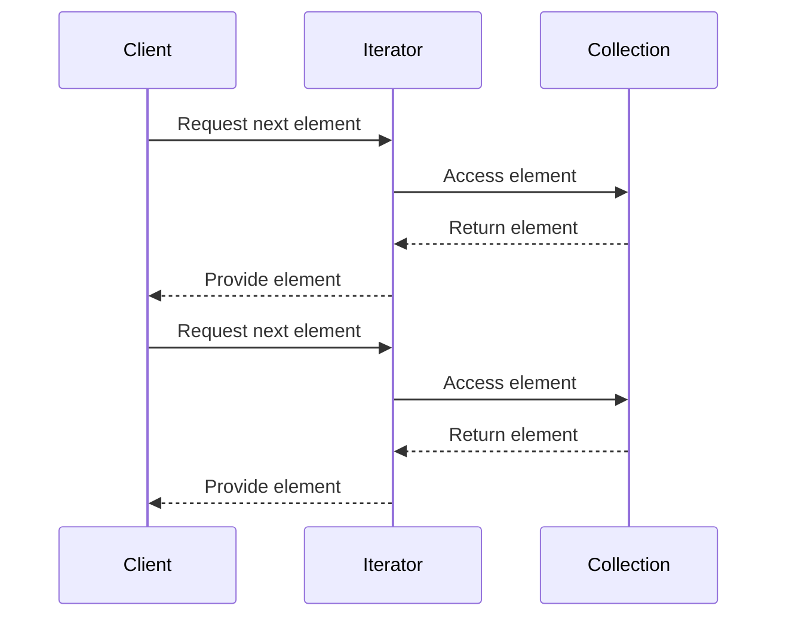

## 6.4 Iterator Pattern

In the realm of software design, the Iterator Pattern stands out as a quintessential tool for accessing elements of a collection sequentially without exposing the underlying representation. This pattern is particularly significant in traversing complex data structures, offering a standardized way to iterate over collections. In this section, we will delve into the Iterator Pattern's role within F#, exploring its inherent support for iteration through sequences, lists, and other collections. We'll also examine how to create custom iterators using sequence expressions or computation expressions, highlighting the benefits of lazy sequences for efficient iteration.

### Understanding the Iterator Pattern

The Iterator Pattern is a behavioral design pattern that provides a way to access the elements of an aggregate object sequentially without exposing its underlying representation. This pattern is particularly useful when dealing with complex data structures, as it abstracts the traversal process, allowing developers to focus on the logic of iteration rather than the intricacies of the data structure.

#### Key Concepts

- **Sequential Access**: The pattern allows elements to be accessed one at a time, in a defined order.
- **Encapsulation**: The underlying representation of the collection is hidden, promoting encapsulation.
- **Decoupling**: The pattern decouples the traversal logic from the collection itself, enabling flexibility and reuse.

### F# and Iteration

F# is a functional-first language that inherently supports iteration through its rich collection types, such as sequences (`seq`), lists, arrays, and more. These collections provide built-in support for iteration, making it easy to traverse elements efficiently.

#### Sequences in F#

Sequences in F# are a powerful abstraction for iteration. They are lazy, meaning elements are computed on-demand, which can lead to significant performance improvements, especially when dealing with large datasets or infinite sequences.

```fsharp
let numbers = seq { 1 .. 10 }
for n in numbers do
    printfn "%d" n
```

In this example, we define a sequence of numbers from 1 to 10 and iterate over it using a `for` loop. The sequence is evaluated lazily, ensuring that only the necessary elements are computed.

#### Lists and Arrays

While lists and arrays are not lazy like sequences, they provide efficient iteration mechanisms and are suitable for scenarios where the entire collection needs to be evaluated.

```fsharp
let list = [1; 2; 3; 4; 5]
list |> List.iter (printfn "%d")

let array = [|1; 2; 3; 4; 5|]
array |> Array.iter (printfn "%d")
```

### Creating Custom Iterators

F# allows developers to create custom iterators using sequence expressions or computation expressions. This capability is particularly useful when dealing with complex data traversal requirements.

#### Sequence Expressions

Sequence expressions in F# provide a concise way to define custom sequences. They are similar to list comprehensions in other functional languages.

```fsharp
let customSequence = seq {
    for i in 1 .. 10 do
        if i % 2 = 0 then
            yield i * i
}

customSequence |> Seq.iter (printfn "%d")
```

In this example, we define a custom sequence that yields the square of even numbers between 1 and 10. The `yield` keyword is used to produce elements of the sequence.

#### Computation Expressions

Computation expressions in F# are a more advanced feature that allows for the creation of complex iterators. They provide a way to define custom control flows and are particularly useful for asynchronous programming and workflows.

```fsharp
type MySeqBuilder() =
    member _.Yield(x) = seq { yield x }
    member _.Combine(seq1, seq2) = Seq.append seq1 seq2
    member _.Delay(f) = f()

let mySeq = MySeqBuilder()

let customIterator = mySeq {
    yield 1
    yield! seq { 2 .. 5 }
    yield 6
}

customIterator |> Seq.iter (printfn "%d")
```

In this example, we define a custom computation expression builder `MySeqBuilder` to create a sequence that combines multiple elements and sequences.

### Benefits of Lazy Sequences

Lazy sequences in F# offer several advantages, particularly in terms of performance and memory efficiency. By deferring computation until elements are needed, lazy sequences reduce unnecessary processing and memory usage.

#### Efficient Iteration

Lazy sequences are ideal for scenarios where only a subset of the collection is needed, as they avoid evaluating the entire collection upfront.

```fsharp
let largeSequence = seq { 1 .. 1000000 }
let firstTen = largeSequence |> Seq.take 10 |> Seq.toList
```

In this example, the `Seq.take` function ensures that only the first ten elements are evaluated, making the operation efficient even for large sequences.

#### Infinite Sequences

F#'s lazy sequences also support infinite sequences, which can be useful for generating data on-the-fly or simulating streams.

```fsharp
let rec fibs a b = seq {
    yield a
    yield! fibs b (a + b)
}

let fibonacci = fibs 0 1
fibonacci |> Seq.take 10 |> Seq.iter (printfn "%d")
```

This example demonstrates an infinite sequence of Fibonacci numbers, where only the first ten numbers are evaluated and printed.

### Use Cases for the Iterator Pattern

The Iterator Pattern is particularly useful in scenarios such as:

- **Streaming Data Processing**: When processing data streams, lazy sequences allow for efficient handling of potentially infinite data.
- **Complex Data Structures**: Traversing complex or nested data structures without exposing their internal representation.
- **Composability**: Combining multiple sequences or iterators to form complex data processing pipelines.

### Advantages in F#

F#'s support for the Iterator Pattern offers several advantages:

- **Composability**: F#'s functional nature allows for easy composition of iterators, enabling complex data processing workflows.
- **Memory Efficiency**: Lazy evaluation ensures that only necessary elements are computed, reducing memory usage.
- **Readability**: Sequence expressions and computation expressions provide a clear and concise way to define iterators.

### Considerations and Best Practices

When implementing iterators in F#, consider the following best practices:

- **Handle Infinite Sequences Carefully**: Ensure that operations on infinite sequences are bounded to avoid infinite loops or excessive resource consumption.
- **Manage Side Effects**: Be cautious of side effects during iteration, as they can lead to unexpected behavior or performance issues.
- **Optimize for Performance**: Use lazy sequences and efficient data structures to optimize performance, particularly for large datasets or complex operations.
- **Focus on Readability**: Write clear and concise code, using sequence expressions and computation expressions to enhance readability and maintainability.

### Try It Yourself

To gain a deeper understanding of the Iterator Pattern in F#, try modifying the code examples provided. Experiment with creating custom sequences for different data structures or use cases. Consider implementing an iterator for a complex data structure, such as a tree or graph, and explore how lazy evaluation can improve performance.

### Visualizing the Iterator Pattern

To better understand the flow of the Iterator Pattern, consider the following diagram illustrating the interaction between a client and an iterator:



This sequence diagram demonstrates how a client interacts with an iterator to access elements of a collection sequentially.

### Further Reading

For more information on the Iterator Pattern and its applications in F#, consider exploring the following resources:

- [F# Sequences and Lazy Evaluation](https://docs.microsoft.com/en-us/dotnet/fsharp/language-reference/sequences)
- [Computation Expressions in F#](https://docs.microsoft.com/en-us/dotnet/fsharp/language-reference/computation-expressions)
- [Functional Programming in F#](https://fsharp.org/learn/)

## Quiz Time!



### What is the primary purpose of the Iterator Pattern?

- [x] To provide a way to access elements of a collection sequentially without exposing the underlying representation.
- [ ] To modify elements of a collection directly.
- [ ] To sort elements of a collection.
- [ ] To store elements of a collection in a database.

> **Explanation:** The Iterator Pattern is designed to allow sequential access to elements without exposing the underlying data structure.

### How does F# support iteration inherently?

- [x] Through sequences (`seq`), lists, and arrays.
- [ ] Through direct manipulation of pointers.
- [ ] By using external libraries only.
- [ ] Through database queries.

> **Explanation:** F# provides built-in support for iteration through its collection types like sequences, lists, and arrays.

### What is a key benefit of using lazy sequences in F#?

- [x] They allow for efficient iteration by computing elements on-demand.
- [ ] They automatically sort the elements.
- [ ] They convert sequences into lists.
- [ ] They expose the underlying data structure.

> **Explanation:** Lazy sequences compute elements only when needed, which can improve performance and reduce memory usage.

### Which of the following is a scenario where the Iterator Pattern is particularly useful?

- [x] Streaming data processing.
- [ ] Direct database access.
- [ ] Static website development.
- [ ] Image processing.

> **Explanation:** The Iterator Pattern is useful in streaming data processing due to its ability to handle potentially infinite data efficiently.

### What is a potential consideration when working with infinite sequences?

- [x] Ensuring operations are bounded to avoid infinite loops.
- [ ] Automatically converting them to finite lists.
- [ ] Using them only for sorting operations.
- [ ] Storing them in databases.

> **Explanation:** Infinite sequences should be handled carefully to avoid infinite loops or excessive resource consumption.

### How can custom iterators be created in F#?

- [x] Using sequence expressions or computation expressions.
- [ ] By directly modifying the compiler.
- [ ] Through external libraries only.
- [ ] By using SQL queries.

> **Explanation:** F# allows for the creation of custom iterators using sequence expressions or computation expressions.

### What is a key advantage of using F#'s functional nature for iterators?

- [x] Easy composition of iterators for complex workflows.
- [ ] Automatic conversion to object-oriented code.
- [ ] Direct manipulation of hardware.
- [ ] Built-in database connectivity.

> **Explanation:** F#'s functional nature allows for easy composition of iterators, enabling complex data processing workflows.

### What is the role of the `yield` keyword in F# sequence expressions?

- [x] To produce elements of a sequence.
- [ ] To terminate a sequence.
- [ ] To sort elements of a sequence.
- [ ] To convert a sequence into a list.

> **Explanation:** The `yield` keyword is used in sequence expressions to produce elements of a sequence.

### Which of the following is a best practice when implementing iterators in F#?

- [x] Focus on readability and performance.
- [ ] Use mutable state extensively.
- [ ] Avoid using lazy sequences.
- [ ] Expose the underlying data structure.

> **Explanation:** Implementing iterators in F# should focus on readability and performance, leveraging lazy sequences where appropriate.

### True or False: F# sequences are evaluated eagerly.

- [ ] True
- [x] False

> **Explanation:** F# sequences are evaluated lazily, meaning elements are computed on-demand.



Remember, mastering the Iterator Pattern in F# is just the beginning. As you progress, you'll build more complex and efficient data processing applications. Keep experimenting, stay curious, and enjoy the journey!
