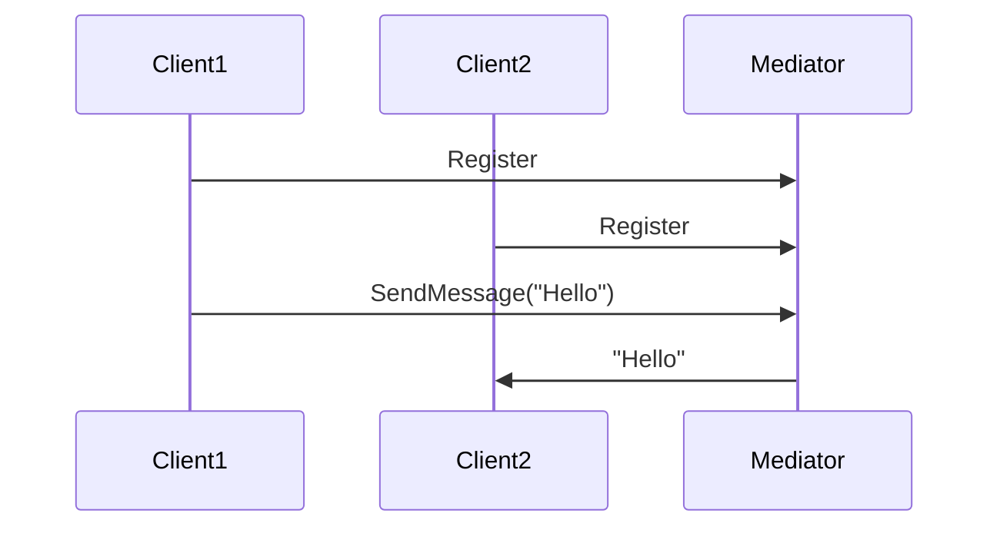

## 6.5 Mediator Pattern

In the world of software design, managing interactions between objects can become complex as systems grow. The Mediator Pattern offers a solution by encapsulating how a set of objects interact, promoting loose coupling and simplifying communication. In this section, we will delve into the Mediator Pattern, explore its implementation in F#, and discuss its benefits and potential pitfalls.

### Introduction to the Mediator Pattern

The Mediator Pattern is a behavioral design pattern that defines an object, known as the mediator, to encapsulate communication between a set of objects. Instead of objects referring to each other directly, they communicate through the mediator. This approach reduces dependencies between communicating objects, leading to a more modular and maintainable system.

#### Purpose of the Mediator Pattern

- **Loose Coupling**: By centralizing communication, the Mediator Pattern reduces the dependencies between objects, making the system more flexible and easier to maintain.
- **Simplified Communication**: Objects do not need to know about each other; they only need to know about the mediator.
- **Enhanced Modularity**: Changes to communication logic are localized to the mediator, minimizing the impact on other parts of the system.

### Implementing the Mediator Pattern in F#

F# is a functional-first language that offers powerful constructs for implementing design patterns. One such construct is the `MailboxProcessor`, which can be used to implement the Mediator Pattern effectively.

#### Using F# Agents (`MailboxProcessor`)

The `MailboxProcessor` in F# is an agent-based model that allows for asynchronous message processing. It is ideal for implementing the Mediator Pattern as it can handle message passing and coordination between different components.

```fsharp
type Message =
    | Register of string * AsyncReplyChannel<string>
    | SendMessage of string * string

let mediatorAgent = MailboxProcessor.Start(fun inbox ->
    let rec loop clients =
        async {
            let! msg = inbox.Receive()
            match msg with
            | Register(clientId, replyChannel) ->
                let newClients = Map.add clientId replyChannel clients
                return! loop newClients
            | SendMessage(clientId, message) ->
                clients |> Map.iter (fun id replyChannel ->
                    if id <> clientId then
                        replyChannel.Reply(message))
                return! loop clients
        }
    loop Map.empty
)
```

In this example, the `mediatorAgent` handles two types of messages: `Register` and `SendMessage`. Clients can register with the mediator, and messages can be sent to all registered clients except the sender.

#### Defining Mediators for Registration and Communication

A mediator in F# can be defined to handle registration and communication logic. The mediator maintains a list of registered clients and coordinates message passing between them.

```fsharp
let registerClient clientId =
    async {
        let replyChannel = AsyncReplyChannel<string>()
        mediatorAgent.Post(Register(clientId, replyChannel))
        return replyChannel
    }

let sendMessage clientId message =
    async {
        mediatorAgent.Post(SendMessage(clientId, message))
    }
```

These functions allow clients to register with the mediator and send messages through it. The mediator ensures that messages are delivered to all clients except the sender.

### Use Cases for the Mediator Pattern

The Mediator Pattern is particularly useful in scenarios where multiple components need to communicate without being tightly coupled. Here are some common use cases:

#### Chat Applications

In a chat application, the mediator can manage communication between users. Each user registers with the mediator, and messages are sent through the mediator to ensure that all users receive them.

#### Event Systems

In an event-driven system, the mediator can manage the distribution of events to various components. This approach ensures that components remain decoupled and can be easily modified or replaced.

### Benefits of Using the Mediator Pattern in F#

- **Improved Modularity**: The mediator centralizes communication logic, making it easier to modify and extend.
- **Scalability**: The pattern supports the addition of new components without affecting existing ones.
- **Concurrency**: Using `MailboxProcessor`, the mediator can handle asynchronous communication efficiently.

### Potential Pitfalls

While the Mediator Pattern offers many benefits, there are potential pitfalls to be aware of:

- **Mediator Complexity**: As the system grows, the mediator can become a bottleneck if it handles too many responsibilities.
- **Single Point of Failure**: The mediator is a central component, and its failure can impact the entire system.

### Best Practices for Designing Mediators in F#

- **Keep the Mediator Simple**: Focus on communication logic and avoid adding unrelated responsibilities.
- **Use Asynchronous Processing**: Leverage F#'s `MailboxProcessor` for efficient message handling.
- **Decouple Components**: Ensure that components interact only through the mediator to maintain loose coupling.

### Visualizing the Mediator Pattern

To better understand the Mediator Pattern, let's visualize the communication flow using Mermaid.js:



This diagram illustrates how clients register with the mediator and send messages through it. The mediator coordinates the message delivery to ensure that all clients receive the communication.

### Try It Yourself

To deepen your understanding of the Mediator Pattern, try modifying the code examples:

- **Add More Clients**: Experiment with registering additional clients and sending messages between them.
- **Implement Message Filtering**: Modify the mediator to filter messages based on specific criteria.
- **Handle Client Deregistration**: Extend the mediator to support client deregistration.

### Conclusion

The Mediator Pattern is a powerful tool for managing object interactions in F#. By centralizing communication through a mediator, you can achieve loose coupling, improved modularity, and scalability. While there are potential pitfalls, following best practices can help you design efficient and effective mediators.

Remember, this is just the beginning. As you progress, you'll build more complex systems using the Mediator Pattern. Keep experimenting, stay curious, and enjoy the journey!

## Quiz Time!



### What is the primary purpose of the Mediator Pattern?

- [x] To encapsulate how a set of objects interact
- [ ] To increase the coupling between objects
- [ ] To replace all direct communication with indirect communication
- [ ] To simplify object creation

> **Explanation:** The Mediator Pattern encapsulates how a set of objects interact, promoting loose coupling by preventing objects from referring to each other explicitly.

### How does the Mediator Pattern improve modularity?

- [x] By centralizing communication logic
- [ ] By increasing dependencies between objects
- [ ] By making objects aware of each other
- [ ] By reducing the number of objects

> **Explanation:** The Mediator Pattern centralizes communication logic, making it easier to modify and extend without affecting other parts of the system.

### Which F# construct is ideal for implementing the Mediator Pattern?

- [x] MailboxProcessor
- [ ] List
- [ ] Array
- [ ] Tuple

> **Explanation:** The `MailboxProcessor` in F# is ideal for implementing the Mediator Pattern as it allows for asynchronous message processing.

### What is a potential pitfall of the Mediator Pattern?

- [x] Mediator complexity
- [ ] Increased coupling
- [ ] Reduced scalability
- [ ] Simplified communication

> **Explanation:** As the system grows, the mediator can become a bottleneck if it handles too many responsibilities, leading to increased complexity.

### In a chat application, how can the Mediator Pattern be used?

- [x] To manage communication between users
- [ ] To store user data
- [ ] To encrypt messages
- [ ] To authenticate users

> **Explanation:** In a chat application, the mediator can manage communication between users, ensuring that messages are delivered to all participants.

### What is a benefit of using the Mediator Pattern in F#?

- [x] Improved concurrency
- [ ] Increased complexity
- [ ] Reduced modularity
- [ ] Decreased scalability

> **Explanation:** Using `MailboxProcessor`, the mediator can handle asynchronous communication efficiently, improving concurrency.

### How can you prevent the mediator from becoming a bottleneck?

- [x] Keep the mediator simple
- [ ] Add more responsibilities to the mediator
- [ ] Increase the number of mediators
- [ ] Decrease the number of clients

> **Explanation:** Keeping the mediator focused on communication logic and avoiding unrelated responsibilities can prevent it from becoming a bottleneck.

### What is a common use case for the Mediator Pattern?

- [x] Event systems
- [ ] Data storage
- [ ] User authentication
- [ ] File management

> **Explanation:** The Mediator Pattern is useful in event-driven systems to manage the distribution of events to various components.

### How does the Mediator Pattern promote loose coupling?

- [x] By preventing objects from referring to each other explicitly
- [ ] By increasing the number of objects
- [ ] By making objects aware of each other
- [ ] By centralizing object creation

> **Explanation:** The Mediator Pattern promotes loose coupling by ensuring that objects communicate through a central mediator rather than referring to each other directly.

### The Mediator Pattern can be a single point of failure. True or False?

- [x] True
- [ ] False

> **Explanation:** The mediator is a central component, and its failure can impact the entire system, making it a single point of failure.


