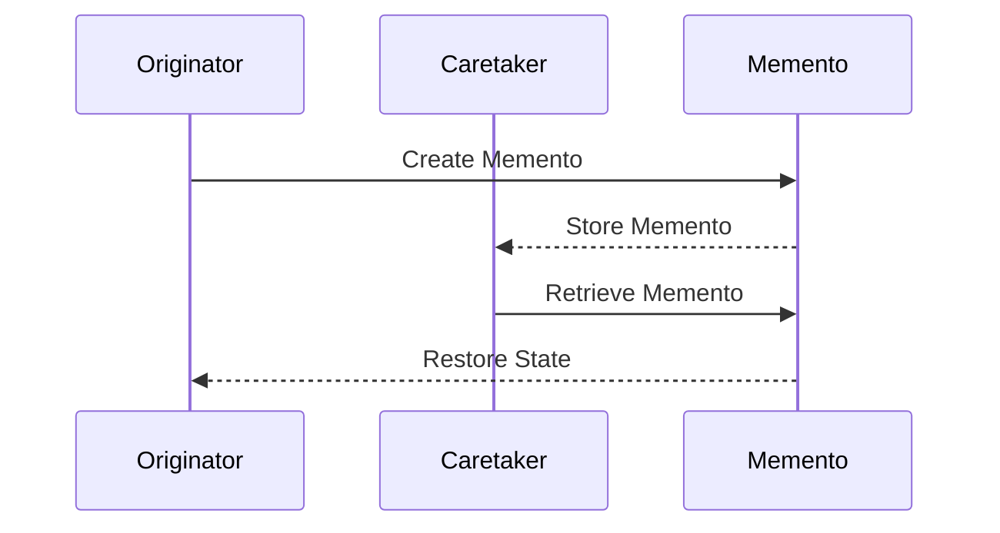

## 6.6 Memento Pattern

In the world of software design patterns, the Memento Pattern stands out as a powerful tool for capturing and restoring an object's state without violating encapsulation. This pattern is particularly useful in scenarios where you need to implement undo functionality, create state checkpoints, or manage state transitions. In this section, we will explore the Memento Pattern in the context of F#, a functional programming language that offers unique advantages for implementing this pattern.

### Understanding the Memento Pattern

The Memento Pattern is a behavioral design pattern that allows you to capture an object's internal state and store it externally, so that the object can be restored to this state later. This is done without exposing the internal details of the object, thus preserving encapsulation. The pattern involves three main components:

1. **Originator**: The object whose state needs to be saved and restored.
2. **Memento**: A representation of the saved state.
3. **Caretaker**: The entity responsible for storing and restoring the memento.

The Memento Pattern is particularly useful in applications that require undo functionality, such as text editors, drawing applications, or any system where state changes need to be reversible.

### The Role of F# in Simplifying Memento Implementation

F#'s functional nature and emphasis on immutability make it an ideal language for implementing the Memento Pattern. In F#, data structures are often immutable, meaning that once they are created, they cannot be changed. This immutability simplifies the process of capturing and restoring state, as it naturally aligns with the concept of creating snapshots of an object's state.

#### Capturing State via Immutable Snapshots

In F#, capturing an object's state can be as simple as creating a copy of its immutable data structure. Let's consider an example where we have a simple text editor that needs to support undo functionality. We can represent the state of the editor using a record type:

```fsharp
type EditorState = {
    Content: string
    CursorPosition: int
}

let initialState = { Content = ""; CursorPosition = 0 }
```

In this example, `EditorState` is an immutable record that holds the content of the editor and the cursor position. To capture the state, we simply create a new instance of `EditorState` with the current values.

#### Storing and Restoring State

To implement the Memento Pattern, we need to define a memento type that can hold the state of the editor. In F#, this can be done using another record type:

```fsharp
type EditorMemento = {
    State: EditorState
}

let createMemento (state: EditorState) = { State = state }

let restoreState (memento: EditorMemento) = memento.State
```

The `createMemento` function takes the current state and returns a memento, while the `restoreState` function takes a memento and returns the stored state. This simple approach leverages F#'s immutability to ensure that the state is captured and restored without side effects.

### Code Example: Implementing Undo Functionality

Let's put everything together and implement a simple text editor with undo functionality using the Memento Pattern:

```fsharp
type EditorState = {
    Content: string
    CursorPosition: int
}

type EditorMemento = {
    State: EditorState
}

type Editor() =
    let mutable currentState = { Content = ""; CursorPosition = 0 }
    let mutable history = []

    member this.TypeText(text: string) =
        currentState <- { currentState with Content = currentState.Content + text }
        history <- createMemento currentState :: history

    member this.MoveCursor(position: int) =
        currentState <- { currentState with CursorPosition = position }
        history <- createMemento currentState :: history

    member this.Undo() =
        match history with
        | [] -> ()
        | memento :: rest ->
            currentState <- restoreState memento
            history <- rest

    member this.GetContent() = currentState.Content
    member this.GetCursorPosition() = currentState.CursorPosition

let editor = Editor()
editor.TypeText("Hello, ")
editor.TypeText("world!")
printfn "Content: %s" (editor.GetContent()) // Output: Hello, world!
editor.Undo()
printfn "Content after undo: %s" (editor.GetContent()) // Output: Hello, 
```

In this example, the `Editor` class maintains the current state and a history of mementos. The `TypeText` and `MoveCursor` methods update the state and add a new memento to the history. The `Undo` method restores the previous state by popping a memento from the history.

### Scenarios for Using the Memento Pattern

The Memento Pattern is particularly useful in scenarios where state preservation and restoration are critical. Some common use cases include:

- **Undo Functionality**: As demonstrated in the example, the Memento Pattern is ideal for implementing undo functionality in applications such as text editors, drawing applications, and spreadsheets.
- **State Checkpoints**: In complex systems, you may need to create checkpoints to save the state at specific points in time, allowing you to roll back to a known good state if necessary.
- **State Transitions**: In applications with complex state transitions, the Memento Pattern can help manage and navigate between different states.

### Benefits of the Memento Pattern in F#

Using the Memento Pattern in F# offers several benefits:

- **Ease of Implementation**: F#'s functional nature and support for immutable data structures make it easy to capture and restore state without side effects.
- **Thread Safety**: Immutability ensures that captured states are inherently thread-safe, as they cannot be modified once created.
- **Encapsulation**: The pattern preserves encapsulation by keeping the internal state hidden from external entities.

### Considerations and Best Practices

While the Memento Pattern offers many advantages, there are some considerations to keep in mind:

- **Memory Usage**: Capturing large states can lead to increased memory usage. Consider using shallow copies or storing only the necessary parts of the state to minimize memory impact.
- **Shallow vs. Deep Copies**: Decide whether to use shallow or deep copies based on the complexity of the state and the need for independence between mementos.

#### Best Practices

- **Use Immutable Data Structures**: Leverage F#'s support for immutable data structures to simplify state capture and restoration.
- **Minimize State Size**: Capture only the necessary parts of the state to reduce memory usage and improve performance.
- **Consider State Granularity**: Determine the appropriate level of granularity for capturing state, balancing between detail and efficiency.

### Try It Yourself

To deepen your understanding of the Memento Pattern in F#, try modifying the code examples provided. Here are some suggestions:

- **Add Redo Functionality**: Extend the editor example to support redo functionality by maintaining a separate stack for undone states.
- **Implement State Checkpoints**: Modify the example to allow for creating and restoring checkpoints at specific points in time.
- **Experiment with Different Data Structures**: Try using different data structures, such as lists or trees, to capture and restore state.

### Visualizing the Memento Pattern

To better understand the flow of the Memento Pattern, let's visualize the process using a sequence diagram:



This diagram illustrates the interaction between the originator, caretaker, and memento in capturing and restoring state.

### Conclusion

The Memento Pattern is a valuable tool for managing state in software applications, and F#'s functional programming features make it particularly well-suited for implementing this pattern. By leveraging immutability and functional constructs, you can create robust, thread-safe solutions for capturing and restoring state. As you continue to explore F# and design patterns, remember to experiment, stay curious, and enjoy the journey!

## Quiz Time!



### What is the primary purpose of the Memento Pattern?

- [x] To capture and restore an object's state without violating encapsulation.
- [ ] To provide a simplified interface to a complex system.
- [ ] To define a family of interchangeable algorithms.
- [ ] To separate abstraction from implementation.

> **Explanation:** The Memento Pattern is designed to capture and restore an object's state without exposing its internal details, thus preserving encapsulation.

### Which F# feature simplifies the implementation of the Memento Pattern?

- [x] Immutability
- [ ] Object-oriented inheritance
- [ ] Dynamic typing
- [ ] Reflection

> **Explanation:** F#'s immutability simplifies the implementation of the Memento Pattern by allowing state to be captured and restored without side effects.

### In the Memento Pattern, what role does the Caretaker play?

- [x] Storing and restoring mementos
- [ ] Creating mementos
- [ ] Modifying the originator's state
- [ ] Defining the memento's structure

> **Explanation:** The Caretaker is responsible for storing and restoring mementos, ensuring that the originator's state can be reverted when needed.

### What is a common use case for the Memento Pattern?

- [x] Implementing undo functionality
- [ ] Managing concurrent access to resources
- [ ] Simplifying complex algorithms
- [ ] Enhancing code readability

> **Explanation:** The Memento Pattern is commonly used to implement undo functionality, allowing applications to revert to previous states.

### How does F#'s immutability contribute to thread safety in the Memento Pattern?

- [x] Captured states cannot be modified, ensuring thread safety.
- [ ] It allows dynamic state changes during execution.
- [ ] It enables runtime type checks for state transitions.
- [ ] It supports concurrent access to mutable states.

> **Explanation:** F#'s immutability ensures that captured states cannot be modified, making them inherently thread-safe.

### What is a potential drawback of the Memento Pattern?

- [x] Increased memory usage when capturing large states
- [ ] Difficulty in capturing object state
- [ ] Lack of encapsulation
- [ ] Complexity in implementation

> **Explanation:** Capturing large states can lead to increased memory usage, which is a potential drawback of the Memento Pattern.

### What is the benefit of using shallow copies in the Memento Pattern?

- [x] Reduced memory usage
- [ ] Increased encapsulation
- [ ] Enhanced state independence
- [ ] Simplified state transitions

> **Explanation:** Shallow copies can reduce memory usage by capturing only the necessary parts of the state.

### What is a best practice for implementing the Memento Pattern in F#?

- [x] Use immutable data structures
- [ ] Capture all possible states
- [ ] Use dynamic typing for flexibility
- [ ] Avoid using records for state representation

> **Explanation:** Using immutable data structures is a best practice for implementing the Memento Pattern in F#, as it simplifies state capture and restoration.

### Which component of the Memento Pattern is responsible for creating the memento?

- [x] Originator
- [ ] Caretaker
- [ ] Memento
- [ ] Observer

> **Explanation:** The Originator is responsible for creating the memento, capturing its current state for later restoration.

### True or False: The Memento Pattern violates encapsulation by exposing an object's internal state.

- [ ] True
- [x] False

> **Explanation:** The Memento Pattern preserves encapsulation by capturing and restoring state without exposing the object's internal details.


