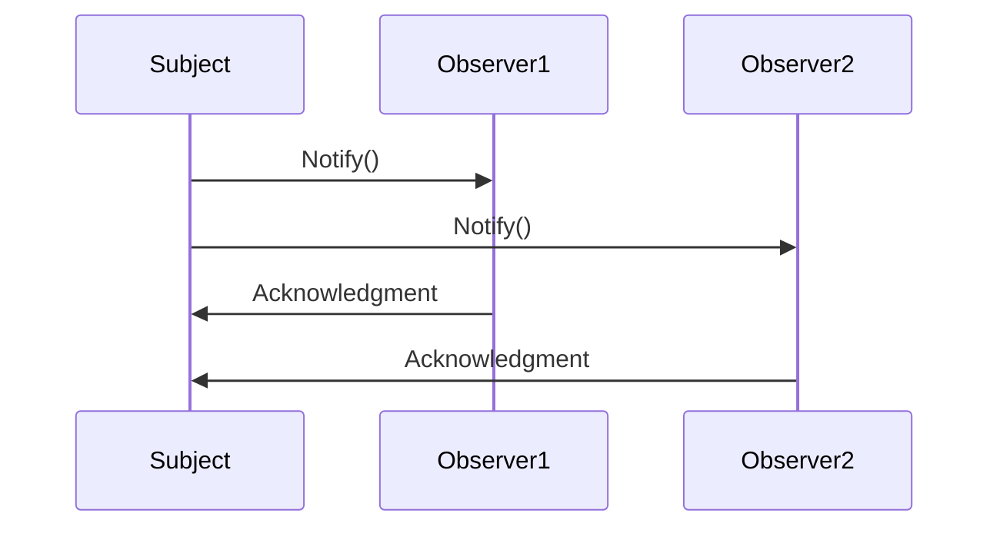

## 6.7 Observer Pattern

In the realm of software design, the Observer Pattern stands as a cornerstone for implementing event-driven programming. It defines a one-to-many dependency between objects, ensuring that when one object changes state, all its dependents are notified and updated automatically. This pattern is particularly useful in scenarios where the state of an object needs to be observed by multiple other objects, such as in GUI applications or reactive programming.

### Introduction to the Observer Pattern

The Observer Pattern is a behavioral design pattern that allows an object, known as the subject, to maintain a list of its dependents, called observers, and notify them of any state changes, usually by calling one of their methods. This pattern is crucial in event-driven systems where changes in one part of the system need to be propagated to other parts without tight coupling.

#### Key Concepts

- **Subject**: The object that holds the state and notifies observers of changes.
- **Observer**: The object that watches the subject and gets notified of changes.
- **Subscription**: The mechanism by which observers register their interest in the subject's state changes.
- **Notification**: The process of informing observers about changes in the subject's state.

### Implementing the Observer Pattern in F#

In F#, the Observer Pattern is elegantly implemented using the `IObservable` and `IObserver` interfaces. These interfaces provide a standardized way to create and manage observable sequences and their observers.

#### The `IObservable` Interface

The `IObservable<'T>` interface represents the provider of a sequence of values. It has a single method, `Subscribe`, which is used to register an observer.

```fsharp
type IObservable<'T> =
    abstract member Subscribe: IObserver<'T> -> IDisposable
```

#### The `IObserver` Interface

The `IObserver<'T>` interface represents the receiver of the sequence of values. It defines three methods: `OnNext`, `OnError`, and `OnCompleted`.

```fsharp
type IObserver<'T> =
    abstract member OnNext: 'T -> unit
    abstract member OnError: exn -> unit
    abstract member OnCompleted: unit -> unit
```

### Creating Observables and Observers

Let's explore how to create observables and observers in F#.

#### Creating an Observable

An observable is a source of data that can be observed. In F#, you can create an observable using the `Observable` module.

```fsharp
open System
open System.Reactive.Linq

let createObservable () =
    Observable.Create(fun (observer: IObserver<int>) ->
        for i in 1 .. 5 do
            observer.OnNext(i)
        observer.OnCompleted()
        Disposable.Empty
    )
```

In this example, we create an observable that emits integers from 1 to 5 and then completes.

#### Creating an Observer

An observer is an object that receives data from an observable. You can implement an observer by creating a type that implements the `IObserver<'T>` interface.

```fsharp
type IntObserver() =
    interface IObserver<int> with
        member _.OnNext(value) = printfn "Received value: %d" value
        member _.OnError(error) = printfn "Error: %s" error.Message
        member _.OnCompleted() = printfn "Sequence completed."
```

### Subscribing to Events and Handling Notifications

Once you have an observable and an observer, you can subscribe the observer to the observable to start receiving notifications.

```fsharp
let observable = createObservable()
let observer = IntObserver()

let subscription = observable.Subscribe(observer)
```

In this code, the observer subscribes to the observable, and it will receive notifications for each value emitted by the observable.

#### Using the `Observable` Module

F# provides the `Observable` module, which contains various functions for working with observables. For example, you can use `Observable.subscribe` to simplify the subscription process.

```fsharp
let subscription =
    observable
    |> Observable.subscribe (fun value -> printfn "Received: %d" value)
```

### Use Cases for the Observer Pattern

The Observer Pattern is widely used in various scenarios, including:

- **GUI Event Handling**: In graphical user interfaces, the Observer Pattern is used to handle events such as button clicks, where multiple components need to react to a single event.
- **Reactive Programming**: In reactive programming, the Observer Pattern is used to create data streams that can be observed and reacted to, enabling the creation of responsive and dynamic applications.
- **Data Binding**: In data-driven applications, the Observer Pattern is used to bind data models to UI components, ensuring that changes in the data model are automatically reflected in the UI.

### Benefits of Using the Observer Pattern in F#

The Observer Pattern offers several benefits in F#:

- **Asynchronous Event Handling**: F#'s support for asynchronous programming makes it easy to handle events asynchronously, improving application responsiveness.
- **Decoupling**: The Observer Pattern decouples the subject from its observers, allowing for more flexible and maintainable code.
- **Scalability**: The pattern supports multiple observers, making it easy to scale applications by adding new observers without modifying the subject.

### Potential Issues and Best Practices

While the Observer Pattern is powerful, it can introduce challenges, such as memory leaks due to unsubscriptions. Here are some best practices to manage subscriptions and ensure robustness:

- **Dispose of Subscriptions**: Always dispose of subscriptions when they are no longer needed to prevent memory leaks.
- **Use Weak References**: Consider using weak references for observers to avoid holding strong references that prevent garbage collection.
- **Handle Errors Gracefully**: Implement error handling in observers to ensure that exceptions do not disrupt the notification process.

### Try It Yourself

Experiment with the Observer Pattern by modifying the code examples. Try creating an observable that emits different types of data, such as strings or complex objects. Implement observers that perform different actions, such as logging data to a file or updating a UI component.

### Visualizing the Observer Pattern

To better understand the Observer Pattern, let's visualize the interaction between the subject and its observers.



**Diagram Description**: This sequence diagram illustrates the interaction between a subject and its observers. The subject notifies each observer, and each observer acknowledges the notification.

### Knowledge Check

- What are the key components of the Observer Pattern?
- How do `IObservable` and `IObserver` interfaces facilitate the implementation of the Observer Pattern in F#?
- What are some common use cases for the Observer Pattern?
- How can you prevent memory leaks when using the Observer Pattern?

### Conclusion

The Observer Pattern is a powerful tool for implementing event-driven programming in F#. By leveraging the `IObservable` and `IObserver` interfaces, you can create flexible and responsive applications that react to changes in state. Remember to follow best practices to manage subscriptions and ensure the robustness of your implementations.

## Quiz Time!



### What is the primary purpose of the Observer Pattern?

- [x] To define a one-to-many dependency between objects so that when one object changes state, all its dependents are notified and updated automatically.
- [ ] To encapsulate a request as an object, thereby allowing for parameterization of clients with queues, requests, and operations.
- [ ] To provide a way to access the elements of an aggregate object sequentially without exposing its underlying representation.
- [ ] To separate the construction of a complex object from its representation so that the same construction process can create different representations.

> **Explanation:** The Observer Pattern is designed to establish a one-to-many relationship between objects, ensuring that changes in one object are propagated to its dependents.

### Which F# interface represents the provider of a sequence of values?

- [x] IObservable<'T>
- [ ] IObserver<'T>
- [ ] IDisposable
- [ ] ISequence<'T>

> **Explanation:** The `IObservable<'T>` interface represents the provider of a sequence of values, allowing observers to subscribe and receive notifications.

### What method must be implemented by an observer in F#?

- [x] OnNext
- [ ] OnSubscribe
- [ ] OnNotify
- [ ] OnUpdate

> **Explanation:** An observer in F# must implement the `OnNext` method, which is called when the observable emits a new value.

### How can you prevent memory leaks when using the Observer Pattern?

- [x] Dispose of subscriptions when they are no longer needed.
- [ ] Use strong references for observers.
- [ ] Avoid using the Observer Pattern altogether.
- [ ] Implement a custom garbage collector.

> **Explanation:** Disposing of subscriptions when they are no longer needed helps prevent memory leaks by allowing resources to be released.

### What is a common use case for the Observer Pattern?

- [x] GUI event handling
- [ ] Sorting algorithms
- [ ] Database indexing
- [ ] File compression

> **Explanation:** The Observer Pattern is commonly used in GUI event handling to manage events such as button clicks and user interactions.

### Which method is NOT part of the IObserver<'T> interface?

- [x] OnSubscribe
- [ ] OnNext
- [ ] OnError
- [ ] OnCompleted

> **Explanation:** The `OnSubscribe` method is not part of the `IObserver<'T>` interface. The interface includes `OnNext`, `OnError`, and `OnCompleted`.

### What is the role of the `Subscribe` method in the `IObservable<'T>` interface?

- [x] To register an observer to receive notifications.
- [ ] To emit values to observers.
- [ ] To handle errors in the observable sequence.
- [ ] To complete the observable sequence.

> **Explanation:** The `Subscribe` method is used to register an observer to receive notifications from the observable.

### What is a benefit of using the Observer Pattern in F#?

- [x] Asynchronous event handling
- [ ] Increased code complexity
- [ ] Reduced application responsiveness
- [ ] Tight coupling between components

> **Explanation:** The Observer Pattern in F# supports asynchronous event handling, improving application responsiveness and decoupling components.

### In F#, how can you simplify the subscription process to an observable?

- [x] Use the `Observable.subscribe` function.
- [ ] Implement a custom subscription manager.
- [ ] Use the `Observable.notify` function.
- [ ] Avoid using observables altogether.

> **Explanation:** The `Observable.subscribe` function simplifies the subscription process by allowing you to specify actions to perform when values are emitted.

### True or False: The Observer Pattern can be used to implement data binding in applications.

- [x] True
- [ ] False

> **Explanation:** True. The Observer Pattern can be used to implement data binding, ensuring that changes in data models are automatically reflected in UI components.



Remember, this is just the beginning. As you progress, you'll build more complex and interactive applications using the Observer Pattern. Keep experimenting, stay curious, and enjoy the journey!
