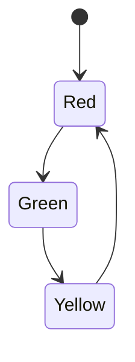

## 6.8 State Pattern

In the realm of software design, managing state-dependent behavior is a common challenge. The State Pattern provides a robust solution by allowing an object to change its behavior when its internal state changes, effectively making the object appear to alter its class. In F#, this pattern can be elegantly implemented using discriminated unions and pattern matching, offering clarity and type safety. This section will guide you through understanding and applying the State Pattern in F#, using functional programming techniques to manage state transitions and behavior changes effectively.

### Understanding the State Pattern

The State Pattern is a behavioral design pattern that allows an object to change its behavior when its internal state changes. This pattern is particularly useful in scenarios where an object's behavior is state-dependent, such as in workflow systems, finite state machines, or UI components that need to react to user interactions.

In traditional object-oriented languages, the State Pattern is often implemented using classes and interfaces to represent different states. However, F# offers a more concise and expressive way to implement this pattern using discriminated unions and pattern matching.

#### Key Concepts of the State Pattern

- **State Representation**: In F#, states can be represented using discriminated unions, which allow you to define a finite set of possible states for an object.
- **Behavioral Changes**: Pattern matching is used to alter the behavior of an object based on its current state.
- **State Transitions**: Functions are used to transition between states, encapsulating the logic for state changes.

### Representing States with Discriminated Unions

Discriminated unions in F# provide a powerful way to represent different states of an object. They allow you to define a type that can be one of several distinct cases, each potentially carrying different data.

#### Example: Defining States with Discriminated Unions

Let's consider a simple example of a traffic light system, where the light can be in one of three states: Red, Yellow, or Green.

```fsharp
type TrafficLight =
    | Red
    | Yellow
    | Green
```

In this example, `TrafficLight` is a discriminated union with three possible states. Each state is represented as a distinct case of the union.

### Altering Behavior with Pattern Matching

Once we have defined the states using a discriminated union, we can use pattern matching to alter the behavior of the system based on the current state.

#### Example: Implementing Behavior Changes with Pattern Matching

Continuing with the traffic light example, let's implement a function that determines the next state of the traffic light.

```fsharp
let nextTrafficLightState light =
    match light with
    | Red -> Green
    | Yellow -> Red
    | Green -> Yellow
```

In this function, we use pattern matching to determine the next state of the traffic light. The behavior of the system changes based on the current state, demonstrating the essence of the State Pattern.

### State Transitions and Behavior Changes

State transitions are a crucial aspect of the State Pattern. They define how an object moves from one state to another and how its behavior changes as a result.

#### Example: Implementing State Transitions

Let's expand our traffic light example to include a function that simulates the traffic light cycle, transitioning through the states in a loop.

```fsharp
let rec trafficLightCycle light =
    printfn "Current state: %A" light
    let nextState = nextTrafficLightState light
    System.Threading.Thread.Sleep(1000) // Simulate time delay
    trafficLightCycle nextState

// Start the traffic light cycle
trafficLightCycle Red
```

In this example, `trafficLightCycle` is a recursive function that prints the current state of the traffic light, determines the next state using `nextTrafficLightState`, and then calls itself with the new state after a delay.

### Scenarios for Using the State Pattern

The State Pattern is beneficial in various scenarios, particularly when dealing with systems that exhibit state-dependent behavior. Some common use cases include:

- **Workflow Systems**: Managing the progression of tasks through different stages.
- **Finite State Machines**: Implementing systems with a finite number of states and transitions.
- **UI Components**: Reacting to user interactions by changing the state of UI elements.

### Advantages of Using the State Pattern in F#

F# offers several advantages when implementing the State Pattern:

- **Clarity**: Discriminated unions and pattern matching provide a clear and concise way to represent and manage states.
- **Type Safety**: The F# type system ensures that only valid states and transitions are possible, reducing runtime errors.
- **Immutability**: F# encourages immutable data structures, making it easier to reason about state changes and avoid side effects.

### Considerations for Complex State Systems

While the State Pattern is powerful, it can lead to complexity in systems with a large number of states or intricate state transitions. Here are some considerations to keep in mind:

- **State Explosion**: As the number of states increases, the complexity of managing transitions can grow exponentially. Consider using hierarchical state machines or state aggregation to manage complexity.
- **Complex Transitions**: For systems with complex transition logic, consider encapsulating transition rules in separate functions or modules to improve maintainability.

### Best Practices for Designing Stateful Systems

When designing stateful systems using the State Pattern in F#, consider the following best practices:

- **Define Clear State Boundaries**: Clearly define the states and transitions to avoid ambiguity and ensure consistency.
- **Encapsulate Transition Logic**: Encapsulate state transition logic in functions or modules to improve readability and maintainability.
- **Leverage Immutability**: Use immutable data structures to simplify reasoning about state changes and avoid unintended side effects.
- **Test State Transitions**: Thoroughly test state transitions to ensure that all possible paths and edge cases are covered.

### Try It Yourself: Experimenting with the State Pattern

To deepen your understanding of the State Pattern, try modifying the traffic light example to include additional states or transitions. For instance, you could add a "Flashing" state that represents a malfunctioning traffic light, and implement logic to transition to and from this state.

### Visualizing State Transitions

To better understand the flow of state transitions, let's visualize the traffic light system using a state diagram.



This diagram illustrates the cyclic nature of the traffic light system, with transitions between the Red, Green, and Yellow states.

### References and Further Reading

For more information on the State Pattern and its applications, consider exploring the following resources:

- [Design Patterns: Elements of Reusable Object-Oriented Software](https://en.wikipedia.org/wiki/Design_Patterns) by Erich Gamma et al.
- [F# for Fun and Profit](https://fsharpforfunandprofit.com/) - A comprehensive resource for learning F# and functional programming concepts.

### Knowledge Check

Before we conclude, let's review some key concepts and pose a few questions to reinforce your understanding of the State Pattern.

- **What is the primary purpose of the State Pattern?**
- **How can discriminated unions be used to represent states in F#?**
- **What role does pattern matching play in the State Pattern?**

### Embrace the Journey

As you continue to explore the State Pattern and other design patterns in F#, remember that this is just the beginning. The skills you develop here will empower you to build more robust and maintainable systems. Keep experimenting, stay curious, and enjoy the journey!

## Quiz Time!



### What is the primary purpose of the State Pattern?

- [x] To allow an object to alter its behavior when its internal state changes
- [ ] To encapsulate object creation logic
- [ ] To provide a simplified interface to a complex system
- [ ] To manage dependencies in a functional way

> **Explanation:** The State Pattern allows an object to change its behavior when its internal state changes, effectively making the object appear to alter its class.

### How can discriminated unions be used in the State Pattern?

- [x] To represent different states of an object
- [ ] To encapsulate object creation logic
- [ ] To provide a simplified interface to a complex system
- [ ] To manage dependencies in a functional way

> **Explanation:** Discriminated unions in F# allow you to define a finite set of possible states for an object, making them ideal for representing states in the State Pattern.

### What role does pattern matching play in the State Pattern?

- [x] To alter behavior based on the current state
- [ ] To encapsulate object creation logic
- [ ] To provide a simplified interface to a complex system
- [ ] To manage dependencies in a functional way

> **Explanation:** Pattern matching is used to alter the behavior of an object based on its current state, which is a key aspect of the State Pattern.

### Which of the following is a common use case for the State Pattern?

- [x] Workflow systems
- [ ] Object creation
- [ ] Simplifying complex systems
- [ ] Dependency management

> **Explanation:** The State Pattern is beneficial in scenarios where an object's behavior is state-dependent, such as workflow systems.

### What is an advantage of using the State Pattern in F#?

- [x] Clarity and type safety
- [ ] Simplified object creation
- [ ] Reduced code complexity
- [ ] Enhanced dependency management

> **Explanation:** F# offers clarity and type safety when implementing the State Pattern, thanks to discriminated unions and pattern matching.

### What is a potential drawback of the State Pattern?

- [x] State explosion
- [ ] Increased code complexity
- [ ] Reduced code clarity
- [ ] Lack of type safety

> **Explanation:** As the number of states increases, the complexity of managing transitions can grow exponentially, leading to state explosion.

### How can complex state transitions be managed?

- [x] By encapsulating transition logic in separate functions or modules
- [ ] By simplifying object creation
- [ ] By reducing code complexity
- [ ] By enhancing dependency management

> **Explanation:** For systems with complex transition logic, encapsulating transition rules in separate functions or modules can improve maintainability.

### What is a best practice for designing stateful systems?

- [x] Define clear state boundaries
- [ ] Simplify object creation
- [ ] Reduce code complexity
- [ ] Enhance dependency management

> **Explanation:** Clearly defining the states and transitions helps avoid ambiguity and ensures consistency in stateful systems.

### What is one way to test state transitions?

- [x] Thoroughly test all possible paths and edge cases
- [ ] Simplify object creation
- [ ] Reduce code complexity
- [ ] Enhance dependency management

> **Explanation:** Thoroughly testing state transitions ensures that all possible paths and edge cases are covered, improving system reliability.

### True or False: The State Pattern is only applicable in object-oriented programming.

- [ ] True
- [x] False

> **Explanation:** The State Pattern can be effectively implemented in functional programming languages like F# using discriminated unions and pattern matching.


