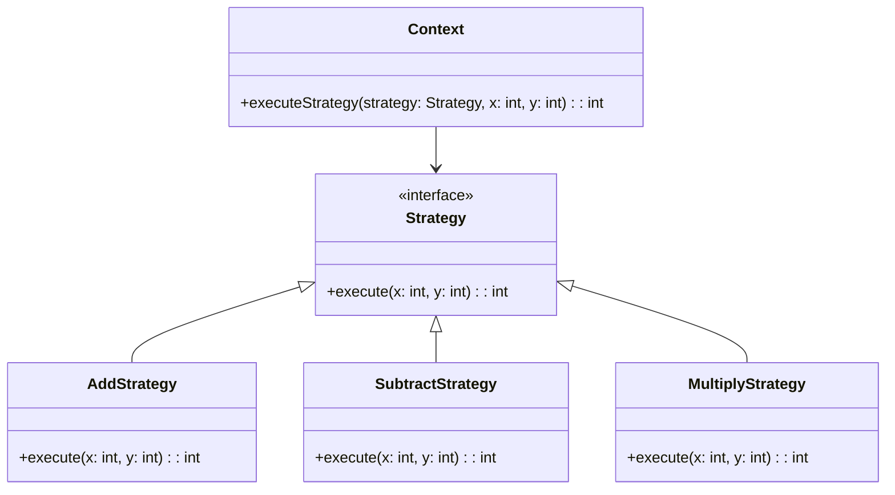

## 6.9 Strategy Pattern

### Introduction to the Strategy Pattern

The Strategy Pattern is a behavioral design pattern that enables you to define a family of algorithms, encapsulate each one, and make them interchangeable. This pattern allows the algorithm to vary independently from the clients that use it. In essence, the Strategy Pattern promotes the idea of selecting algorithms at runtime, providing flexibility and reusability in your code.

In the context of F#, a functional programming language, the Strategy Pattern can be naturally implemented using functions as first-class citizens. This allows us to pass different algorithm functions as parameters, making it an ideal fit for scenarios where behavior needs to be selected dynamically.

### Purpose and Benefits of the Strategy Pattern

The primary purpose of the Strategy Pattern is to enable the selection of algorithms at runtime. This is particularly useful in situations where multiple algorithms can be applied to a problem, and the choice of algorithm may depend on specific conditions or configurations.

**Benefits of the Strategy Pattern in F#:**

- **Flexibility:** Easily switch between different algorithms without altering the client code.
- **Reusability:** Encapsulated algorithms can be reused across different parts of the application.
- **Maintainability:** By separating the algorithm from the client, changes to the algorithm do not affect the client code.
- **Testability:** Individual algorithms can be tested in isolation, improving the overall testability of the system.

### Implementing the Strategy Pattern in F#

#### Functions as First-Class Citizens

In F#, functions are first-class citizens, meaning they can be passed as arguments, returned from other functions, and assigned to variables. This feature makes F# an excellent language for implementing the Strategy Pattern, as strategies can be represented as functions.

Let's start with a simple example to illustrate how functions can be used as strategies:

```fsharp
// Define a type alias for a strategy function
type Strategy = int -> int -> int

// Define different strategy functions
let addStrategy: Strategy = fun x y -> x + y
let subtractStrategy: Strategy = fun x y -> x - y
let multiplyStrategy: Strategy = fun x y -> x * y

// Function to execute a strategy
let executeStrategy strategy x y =
    strategy x y

// Using different strategies
let result1 = executeStrategy addStrategy 5 3  // Output: 8
let result2 = executeStrategy subtractStrategy 5 3  // Output: 2
let result3 = executeStrategy multiplyStrategy 5 3  // Output: 15
```

In this example, we define a type alias `Strategy` for functions that take two integers and return an integer. We then define three different strategies: addition, subtraction, and multiplication. The `executeStrategy` function takes a strategy and two integers, applying the strategy to the integers.

#### Higher-Order Functions for Strategy Selection

Higher-order functions are functions that take other functions as arguments or return them as results. They are a powerful tool in F# for implementing the Strategy Pattern, allowing us to select and execute strategies dynamically.

Consider the following example, which demonstrates how higher-order functions can be used to select strategies:

```fsharp
// Define a strategy selector function
let selectStrategy operation =
    match operation with
    | "add" -> addStrategy
    | "subtract" -> subtractStrategy
    | "multiply" -> multiplyStrategy
    | _ -> failwith "Unknown operation"

// Execute a strategy based on user input
let operation = "add"
let selectedStrategy = selectStrategy operation
let result = executeStrategy selectedStrategy 10 5  // Output: 15
```

In this example, the `selectStrategy` function takes a string representing an operation and returns the corresponding strategy function. This allows us to select and execute a strategy based on runtime conditions, such as user input.

### Use Cases for the Strategy Pattern

The Strategy Pattern is applicable in various scenarios where different algorithms can be applied to a problem. Here are some common use cases:

#### Sorting with Different Comparers

Sorting is a classic example where different strategies can be applied. Depending on the data and requirements, you might want to sort in ascending or descending order, or use a custom comparison function.

```fsharp
// Define a type alias for a comparison strategy
type ComparisonStrategy<'T> = 'T -> 'T -> int

// Define different comparison strategies
let ascendingComparer: ComparisonStrategy<int> = compare
let descendingComparer: ComparisonStrategy<int> = fun x y -> compare y x

// Function to sort a list using a strategy
let sortList strategy list =
    List.sortWith strategy list

// Using different comparison strategies
let numbers = [5; 3; 8; 1]
let sortedAscending = sortList ascendingComparer numbers  // Output: [1; 3; 5; 8]
let sortedDescending = sortList descendingComparer numbers  // Output: [8; 5; 3; 1]
```

In this example, we define a `ComparisonStrategy` type alias for comparison functions and provide two strategies: `ascendingComparer` and `descendingComparer`. The `sortList` function sorts a list using the specified strategy.

#### Logging Mechanisms

Another use case for the Strategy Pattern is logging, where different logging strategies can be applied based on the environment or configuration.

```fsharp
// Define a type alias for a logging strategy
type LoggingStrategy = string -> unit

// Define different logging strategies
let consoleLogger: LoggingStrategy = printfn "Console: %s"
let fileLogger: LoggingStrategy = fun message -> System.IO.File.AppendAllText("log.txt", message + "\n")

// Function to log a message using a strategy
let logMessage strategy message =
    strategy message

// Using different logging strategies
logMessage consoleLogger "This is a console log."
logMessage fileLogger "This is a file log."
```

In this example, we define a `LoggingStrategy` type alias for logging functions and provide two strategies: `consoleLogger` and `fileLogger`. The `logMessage` function logs a message using the specified strategy.

### Benefits of the Strategy Pattern in F#

The Strategy Pattern offers several benefits when implemented in F#:

- **Flexibility:** By using functions as strategies, you can easily switch between different behaviors without modifying the client code.
- **Reusability:** Strategies can be reused across different parts of the application, promoting code reuse.
- **Testability:** Each strategy can be tested independently, improving the overall testability of the system.
- **Simplicity:** F#'s concise syntax and functional features make it easy to implement and manage strategies.

### Potential Issues and Solutions

While the Strategy Pattern offers many benefits, there are potential issues to consider:

- **Managing Dependencies:** Strategies may have dependencies that need to be managed. Consider using dependency injection or partial application to handle dependencies effectively.
- **Configuration of Strategies:** Selecting the appropriate strategy at runtime can be challenging. Consider using configuration files or environment variables to determine the strategy to use.

### Best Practices for Implementing Strategies in F#

To effectively implement the Strategy Pattern in F#, consider the following best practices:

- **Use Type Aliases:** Define type aliases for strategy functions to improve code readability and maintainability.
- **Leverage Higher-Order Functions:** Use higher-order functions to select and execute strategies dynamically.
- **Encapsulate Strategies:** Encapsulate strategies in modules or classes to promote separation of concerns.
- **Test Strategies Independently:** Write unit tests for each strategy to ensure they work as expected.
- **Document Strategies:** Clearly document each strategy and its intended use to aid future developers.

### Visualizing the Strategy Pattern

To better understand the Strategy Pattern, let's visualize the relationship between the client, context, and strategies using a class diagram:



**Diagram Description:** This class diagram illustrates the Strategy Pattern. The `Context` class uses the `Strategy` interface to execute a strategy. Different strategies, such as `AddStrategy`, `SubtractStrategy`, and `MultiplyStrategy`, implement the `Strategy` interface.

### Try It Yourself

Now that we've explored the Strategy Pattern in F#, try implementing your own strategies. Here are some ideas to get you started:

- **Implement a Strategy for Filtering Data:** Create different filtering strategies for a list of numbers, such as filtering even numbers, odd numbers, or numbers greater than a certain value.
- **Create a Strategy for Calculating Discounts:** Implement different discount strategies for a shopping cart, such as percentage discounts, fixed amount discounts, or buy-one-get-one-free offers.

### Knowledge Check

Before we conclude, let's reinforce what we've learned:

- What is the primary purpose of the Strategy Pattern?
- How can functions as first-class citizens in F# be used to implement strategies?
- What are some common use cases for the Strategy Pattern?
- How can higher-order functions be used to select and execute strategies?
- What are the benefits of using the Strategy Pattern in F#?

### Conclusion

The Strategy Pattern is a powerful tool in the functional programmer's toolkit, offering flexibility, reusability, and maintainability. By leveraging F#'s functional features, such as first-class functions and higher-order functions, you can implement the Strategy Pattern effectively and efficiently. Remember, this is just the beginning. As you progress, you'll discover more ways to apply the Strategy Pattern to solve complex problems. Keep experimenting, stay curious, and enjoy the journey!

## Quiz Time!



### What is the primary purpose of the Strategy Pattern?

- [x] To define a family of algorithms and make them interchangeable
- [ ] To encapsulate data and behavior in a single entity
- [ ] To provide a simplified interface to a complex system
- [ ] To manage object creation and lifecycle

> **Explanation:** The Strategy Pattern is designed to define a family of algorithms, encapsulate each one, and make them interchangeable, allowing the algorithm to vary independently from clients that use it.

### How can functions as first-class citizens in F# be used to implement strategies?

- [x] By passing different algorithm functions as parameters
- [ ] By encapsulating data and behavior in a single entity
- [ ] By providing a simplified interface to a complex system
- [ ] By managing object creation and lifecycle

> **Explanation:** In F#, functions are first-class citizens, meaning they can be passed as arguments, returned from other functions, and assigned to variables, making them ideal for representing strategies.

### What are some common use cases for the Strategy Pattern?

- [x] Sorting with different comparers
- [x] Logging mechanisms
- [ ] Managing object creation
- [ ] Providing a simplified interface to a complex system

> **Explanation:** Common use cases for the Strategy Pattern include sorting with different comparers and implementing different logging mechanisms.

### How can higher-order functions be used to select and execute strategies?

- [x] By taking other functions as arguments or returning them as results
- [ ] By encapsulating data and behavior in a single entity
- [ ] By providing a simplified interface to a complex system
- [ ] By managing object creation and lifecycle

> **Explanation:** Higher-order functions can take other functions as arguments or return them as results, allowing for dynamic selection and execution of strategies.

### What are the benefits of using the Strategy Pattern in F#?

- [x] Flexibility
- [x] Reusability
- [x] Testability
- [ ] Complexity

> **Explanation:** The Strategy Pattern offers flexibility, reusability, and testability, making it a valuable tool in F# programming.

### What is a potential issue when implementing the Strategy Pattern?

- [x] Managing dependencies
- [ ] Encapsulating data and behavior
- [ ] Providing a simplified interface
- [ ] Managing object creation

> **Explanation:** Managing dependencies can be a potential issue when implementing the Strategy Pattern, as strategies may have dependencies that need to be managed.

### What is a best practice for implementing strategies in F#?

- [x] Use type aliases for strategy functions
- [x] Leverage higher-order functions
- [ ] Encapsulate data and behavior in a single entity
- [ ] Provide a simplified interface to a complex system

> **Explanation:** Using type aliases for strategy functions and leveraging higher-order functions are best practices for implementing strategies in F#.

### What is the role of the `Context` class in the Strategy Pattern?

- [x] To use the `Strategy` interface to execute a strategy
- [ ] To encapsulate data and behavior in a single entity
- [ ] To provide a simplified interface to a complex system
- [ ] To manage object creation and lifecycle

> **Explanation:** The `Context` class uses the `Strategy` interface to execute a strategy, allowing for dynamic selection and execution of strategies.

### What is a common use case for the Strategy Pattern in logging?

- [x] Implementing different logging strategies based on environment or configuration
- [ ] Managing object creation
- [ ] Providing a simplified interface to a complex system
- [ ] Encapsulating data and behavior in a single entity

> **Explanation:** A common use case for the Strategy Pattern in logging is implementing different logging strategies based on environment or configuration.

### True or False: The Strategy Pattern promotes the idea of selecting algorithms at compile time.

- [ ] True
- [x] False

> **Explanation:** The Strategy Pattern promotes the idea of selecting algorithms at runtime, not compile time, providing flexibility and reusability in your code.


