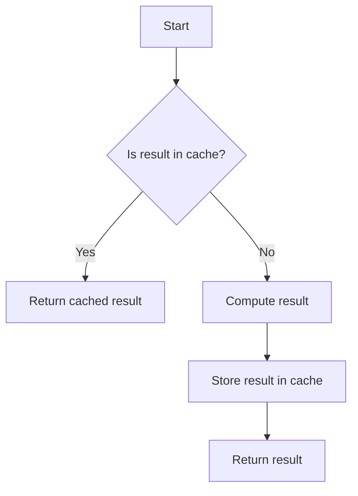

## 7.10 Memoization

In the realm of functional programming, memoization stands out as a powerful technique for optimizing performance by caching the results of expensive function calls. This section delves into the concept of memoization, its benefits, implementation strategies in F#, and best practices for effective usage.

### Understanding Memoization

**Memoization** is a technique used to speed up function execution by storing the results of expensive function calls and returning the cached result when the same inputs occur again. This is particularly useful in scenarios where functions are called repeatedly with the same arguments, such as recursive computations.

#### How Memoization Improves Performance

Memoization can significantly enhance performance by:

- **Reducing Redundant Calculations**: By caching results, memoization prevents the need to recompute results for the same inputs.
- **Optimizing Recursive Functions**: Recursive functions, especially those with overlapping subproblems like the Fibonacci sequence, benefit greatly from memoization.
- **Enhancing Responsiveness**: In interactive applications, memoization can improve responsiveness by reducing computation time.

### When to Use Memoization

Memoization is beneficial in scenarios where:

- **Functions are Pure**: Memoization works best with pure functions, where the output is solely determined by the input values and has no side effects.
- **Frequent Recalculation**: Functions that are called frequently with the same parameters are ideal candidates.
- **Expensive Computations**: Functions that involve costly computations, such as complex mathematical operations or data processing tasks.

### Implementing Memoization in F#

Let's explore how to implement memoization in F#, starting with a simple example using a dictionary to cache results.

#### Simple Memoization with Dictionaries

A straightforward way to implement memoization in F# is by using a dictionary to store computed results. Here's an example of memoizing a recursive Fibonacci function:

```fsharp
open System.Collections.Generic

let memoize (f: int -> int) =
    let cache = Dictionary<int, int>()
    fun x ->
        if cache.ContainsKey(x) then
            cache.[x]
        else
            let result = f x
            cache.[x] <- result
            result

let rec fibonacci n =
    match n with
    | 0 -> 0
    | 1 -> 1
    | _ -> fibonacci (n - 1) + fibonacci (n - 2)

let memoizedFibonacci = memoize fibonacci

// Example usage
printfn "Fibonacci of 10: %d" (memoizedFibonacci 10)
```

**Explanation**: 
- We define a `memoize` function that takes a function `f` and returns a new function that caches results in a dictionary.
- The `fibonacci` function is a classic example of a recursive function that benefits from memoization.
- The `memoizedFibonacci` function uses the `memoize` function to cache results, significantly improving performance for larger inputs.

#### Advanced Memoization Techniques

For more sophisticated caching, consider using immutable data structures or third-party libraries that offer enhanced features like cache eviction policies.

### Thread Safety Considerations

In concurrent environments, memoization must be thread-safe to prevent race conditions and ensure data integrity. Here are some strategies:

- **Immutable Data Structures**: Use immutable collections to avoid synchronization issues.
- **Locking Mechanisms**: Implement locks around cache access to ensure thread safety.
- **Concurrent Collections**: Utilize concurrent collections provided by .NET, such as `ConcurrentDictionary`.

#### Example: Thread-Safe Memoization

```fsharp
open System.Collections.Concurrent

let memoizeThreadSafe (f: int -> int) =
    let cache = ConcurrentDictionary<int, int>()
    fun x ->
        cache.GetOrAdd(x, f)

let memoizedFibonacciThreadSafe = memoizeThreadSafe fibonacci

// Example usage in a concurrent environment
printfn "Thread-safe Fibonacci of 10: %d" (memoizedFibonacciThreadSafe 10)
```

**Explanation**:
- We use `ConcurrentDictionary` to handle concurrent access safely.
- The `GetOrAdd` method ensures that the function `f` is only called once per unique input, even in a multithreaded context.

### Potential Drawbacks of Memoization

While memoization offers significant performance benefits, it also has potential drawbacks:

- **Increased Memory Usage**: Storing results in memory can lead to increased memory consumption, especially for functions with a large number of unique inputs.
- **Complexity in Cache Management**: Implementing cache eviction policies can add complexity to the codebase.
- **Not Suitable for All Functions**: Memoization is not effective for functions with side effects or those that rely on external state.

### Practical Example: Memoizing a Recursive Fibonacci Function

Let's revisit the Fibonacci function and explore a practical implementation of memoization:

```fsharp
let rec fibonacciMemoized n =
    let cache = Dictionary<int, int>()
    let rec fib n =
        if cache.ContainsKey(n) then
            cache.[n]
        else
            let result =
                match n with
                | 0 -> 0
                | 1 -> 1
                | _ -> fib (n - 1) + fib (n - 2)
            cache.[n] <- result
            result
    fib n

// Example usage
printfn "Memoized Fibonacci of 20: %d" (fibonacciMemoized 20)
```

**Explanation**:
- This version of the Fibonacci function uses a local dictionary `cache` to store computed values.
- The `fib` function checks the cache before computing results, ensuring that each value is calculated only once.

### Libraries and Frameworks Supporting Memoization in F#

Several libraries and frameworks in the F# ecosystem support memoization, offering features like automatic cache management and eviction policies:

- **FSharp.Control.AsyncSeq**: Provides memoization support for asynchronous sequences.
- **FsMemo**: A library specifically designed for memoization in F#, offering various caching strategies.

### Best Practices for Effective Memoization

To maximize the benefits of memoization, consider the following best practices:

- **Use Immutable Data Structures**: Favor immutable collections for thread safety and simplicity.
- **Implement Cache Eviction Policies**: Use strategies like Least Recently Used (LRU) to manage memory usage effectively.
- **Profile and Benchmark**: Measure the performance impact of memoization to ensure it provides the desired benefits.
- **Limit Cache Size**: Set a maximum size for caches to prevent excessive memory usage.

### Try It Yourself

Experiment with the provided code examples by modifying the input values or implementing additional caching strategies. Consider exploring different data structures or libraries to enhance your memoization implementation.

### Visualizing Memoization

To better understand the process of memoization, let's visualize the flow of a memoized function call using a flowchart:



**Diagram Explanation**:
- The flowchart illustrates the decision-making process in a memoized function call.
- If the result is already in the cache, it is returned immediately, bypassing computation.
- If not, the function computes the result, stores it in the cache, and then returns it.

### Knowledge Check

Before moving on, consider these questions to reinforce your understanding of memoization:

- What are the key benefits of memoization?
- In which scenarios is memoization most effective?
- How can you ensure thread safety when implementing memoization in a concurrent environment?

### Conclusion

Memoization is a valuable tool in the functional programmer's toolkit, offering significant performance improvements for expensive or frequently called computations. By understanding its principles, implementation strategies, and best practices, you can harness the power of memoization to build efficient and responsive applications in F#.

---

## Quiz Time!



### What is memoization?

- [x] A technique to cache function results for performance optimization.
- [ ] A method for encrypting data.
- [ ] A way to manage memory allocation.
- [ ] A process for compiling code.

> **Explanation:** Memoization is a technique used to cache the results of function calls to optimize performance, particularly for expensive or frequently called computations.


### Which type of functions benefit most from memoization?

- [x] Pure functions
- [ ] Functions with side effects
- [ ] Functions that modify global state
- [ ] Functions that rely on external resources

> **Explanation:** Memoization works best with pure functions, where the output is solely determined by the input values and has no side effects.


### What is a potential drawback of memoization?

- [x] Increased memory usage
- [ ] Decreased code readability
- [ ] Slower execution time
- [ ] Reduced code maintainability

> **Explanation:** Memoization can lead to increased memory usage due to storing results in memory.


### How can thread safety be ensured in memoization?

- [x] Using immutable data structures
- [ ] Ignoring concurrent access
- [ ] Using global variables
- [ ] Avoiding function calls

> **Explanation:** Using immutable data structures or concurrent collections can help ensure thread safety in memoization.


### What is a common data structure used for memoization?

- [x] Dictionary
- [ ] List
- [ ] Stack
- [ ] Queue

> **Explanation:** A dictionary is commonly used to store cached results in memoization.


### Which library supports memoization in F#?

- [x] FsMemo
- [ ] Newtonsoft.Json
- [ ] Entity Framework
- [ ] NLog

> **Explanation:** FsMemo is a library specifically designed for memoization in F#.


### What is a cache eviction policy?

- [x] A strategy to manage memory usage by removing old or unused cache items
- [ ] A method for encrypting cache data
- [ ] A process for compiling cache
- [ ] A way to increase cache size

> **Explanation:** A cache eviction policy is a strategy to manage memory usage by removing old or unused cache items.


### What is the purpose of the `GetOrAdd` method in `ConcurrentDictionary`?

- [x] To safely add a new key-value pair or return the existing value
- [ ] To remove a key-value pair
- [ ] To clear the dictionary
- [ ] To sort the dictionary

> **Explanation:** The `GetOrAdd` method in `ConcurrentDictionary` safely adds a new key-value pair or returns the existing value, ensuring thread safety.


### What is a benefit of using immutable data structures in memoization?

- [x] Thread safety
- [ ] Increased memory usage
- [ ] Slower execution
- [ ] Reduced code readability

> **Explanation:** Immutable data structures provide thread safety by preventing concurrent modifications.


### Memoization is most effective for functions that:

- [x] Have frequent recalculations with the same inputs
- [ ] Are rarely called
- [ ] Have side effects
- [ ] Modify global state

> **Explanation:** Memoization is most effective for functions that have frequent recalculations with the same inputs, as it prevents redundant computations.


