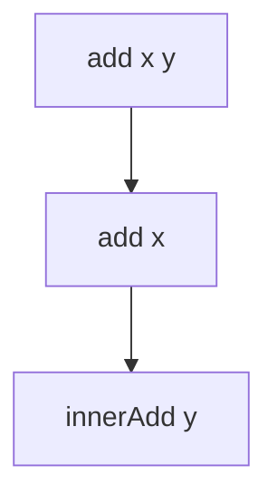
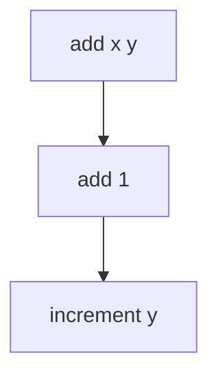

## 7.11 Partial Application and Currying

In the realm of functional programming, F# stands out with its robust support for functional paradigms, including partial application and currying. These concepts are pivotal in creating modular, reusable, and expressive code. In this section, we will delve into the intricacies of partial application and currying, exploring their definitions, differences, practical applications, and best practices.

### Understanding Currying in F#

**Currying** is a fundamental concept in functional programming that transforms a function with multiple arguments into a sequence of functions, each taking a single argument. In F#, all functions are curried by default, which means they inherently support this transformation.

#### What is Currying?

Currying is named after the mathematician Haskell Curry. It allows a function that takes multiple arguments to be broken down into a series of functions that take one argument each. This transformation enables more flexible function composition and reuse.

#### Currying in F#: A Simple Example

Let's consider a basic function in F#:

```fsharp
let add x y = x + y
```

In this example, `add` is a function that takes two arguments, `x` and `y`. However, due to F#'s default currying behavior, `add` can be seen as a function that takes an argument `x` and returns another function that takes an argument `y`.

Here's how currying works in practice:

```fsharp
let add x = 
    let innerAdd y = x + y
    innerAdd
```

This is equivalent to the original `add` function, but explicitly shows the currying process.

#### Visualizing Currying

To better understand currying, let's visualize it:



**Caption**: "Visualizing Currying in F#: Transforming a multi-argument function into a sequence of single-argument functions."

### Partial Application: Fixing Arguments

**Partial Application** is the process of fixing a few arguments of a function, producing another function of smaller arity (fewer arguments). This technique is invaluable for creating specialized functions from more general ones.

#### Partial Application in F#: A Simple Example

Consider the `add` function again:

```fsharp
let add x y = x + y
```

By fixing the first argument, we can create a new function:

```fsharp
let increment = add 1
```

Here, `increment` is a new function that adds 1 to its argument:

```fsharp
let result = increment 5  // result is 6
```

#### Practical Uses of Partial Application

Partial application is particularly useful in scenarios where you need to configure functions with specific parameters. It simplifies the use of higher-order functions by reducing the number of arguments required.

#### Visualizing Partial Application



**Caption**: "Visualizing Partial Application in F#: Fixing an argument to create a specialized function."

### Differences Between Currying and Partial Application

While currying and partial application are related, they serve different purposes:

- **Currying** transforms a function into a sequence of unary functions.
- **Partial Application** fixes some arguments of a function to create a new function with fewer arguments.

#### Code Example: Currying vs. Partial Application

```fsharp
// Currying
let multiply x y = x * y
let curriedMultiply = multiply 2
let result1 = curriedMultiply 3  // result1 is 6

// Partial Application
let partiallyAppliedMultiply = multiply 2
let result2 = partiallyAppliedMultiply 3  // result2 is 6
```

In this example, both `curriedMultiply` and `partiallyAppliedMultiply` achieve the same result, but the processes are conceptually different.

### Best Practices for Using Currying and Partial Application

1. **Enhance Code Clarity**: Use currying and partial application to simplify complex functions and improve readability.
2. **Promote Code Reuse**: Create reusable functions by partially applying arguments, reducing redundancy.
3. **Simplify Higher-Order Functions**: Leverage these techniques to work seamlessly with higher-order functions, reducing boilerplate code.
4. **Avoid Overuse**: While powerful, excessive use can lead to convoluted code. Use judiciously to maintain clarity.

### Common Pitfalls and How to Avoid Them

- **Confusion Between Currying and Partial Application**: Understand the conceptual differences to apply them correctly.
- **Excessive Nesting**: Avoid deeply nested functions, which can hinder readability.
- **Over-Partialization**: Be cautious of creating too many specialized functions, which can lead to a fragmented codebase.

### Try It Yourself

Experiment with the following code to deepen your understanding:

```fsharp
let subtract x y = x - y
let decrement = subtract 1
let result = decrement 10  // Try changing the value of 10 and observe the result
```

### Conclusion

Currying and partial application are powerful tools in F# that enhance code modularity, reuse, and expressiveness. By understanding and applying these concepts, you can write more elegant and maintainable code. Remember, this is just the beginning. As you progress, you'll discover even more ways to leverage these techniques in your functional programming journey.

## Quiz Time!



### What is currying in functional programming?

- [x] Transforming a function with multiple arguments into a sequence of unary functions.
- [ ] Fixing some arguments of a function to create a new function.
- [ ] Combining two functions into one.
- [ ] Converting a function into a lambda expression.

> **Explanation:** Currying is the process of transforming a function with multiple arguments into a sequence of functions, each taking a single argument.

### How does partial application differ from currying?

- [x] Partial application fixes some arguments, while currying transforms a function into unary functions.
- [ ] Partial application transforms functions into unary functions, while currying fixes arguments.
- [ ] Both are identical processes.
- [ ] Currying is used in object-oriented programming, while partial application is not.

> **Explanation:** Partial application fixes some arguments of a function, creating a new function with fewer arguments, whereas currying transforms a function into a sequence of unary functions.

### In F#, what does the following code do? `let increment = add 1`

- [x] Creates a new function that adds 1 to its argument.
- [ ] Creates a new function that subtracts 1 from its argument.
- [ ] Multiplies its argument by 1.
- [ ] Divides its argument by 1.

> **Explanation:** The code partially applies the `add` function by fixing the first argument to 1, creating a new function `increment` that adds 1 to its argument.

### What is a common use case for partial application?

- [x] Configuring functions with specific parameters.
- [ ] Transforming functions into unary functions.
- [ ] Creating lambda expressions.
- [ ] Converting functions to object-oriented methods.

> **Explanation:** Partial application is often used to configure functions with specific parameters, making them easier to use in different contexts.

### Which of the following is a best practice for using currying and partial application?

- [x] Enhance code clarity and promote reuse.
- [ ] Use them excessively to create many specialized functions.
- [ ] Avoid using them in higher-order functions.
- [ ] Always convert functions to object-oriented methods.

> **Explanation:** Currying and partial application should be used to enhance code clarity and promote reuse, but not excessively to avoid fragmentation.

### What is the result of the following code? `let curriedMultiply = multiply 2 in curriedMultiply 3`

- [x] 6
- [ ] 5
- [ ] 9
- [ ] 8

> **Explanation:** The code applies currying to the `multiply` function, fixing the first argument to 2, and then applies the second argument 3, resulting in 6.

### How can you avoid excessive nesting when using currying?

- [x] Use clear and concise function definitions.
- [ ] Avoid using currying altogether.
- [ ] Always use object-oriented methods.
- [ ] Convert functions to lambda expressions.

> **Explanation:** To avoid excessive nesting, use clear and concise function definitions, maintaining readability.

### What is a potential pitfall of over-partialization?

- [x] Fragmented codebase.
- [ ] Enhanced code modularity.
- [ ] Improved code reuse.
- [ ] Increased readability.

> **Explanation:** Over-partialization can lead to a fragmented codebase, making it harder to maintain and understand.

### Which of the following is a benefit of using currying?

- [x] Simplifies function composition.
- [ ] Increases code complexity.
- [ ] Reduces code reuse.
- [ ] Converts functions to object-oriented methods.

> **Explanation:** Currying simplifies function composition by breaking down functions into unary functions, enhancing flexibility.

### True or False: In F#, all functions are curried by default.

- [x] True
- [ ] False

> **Explanation:** In F#, all functions are curried by default, allowing them to be used as a sequence of unary functions.


