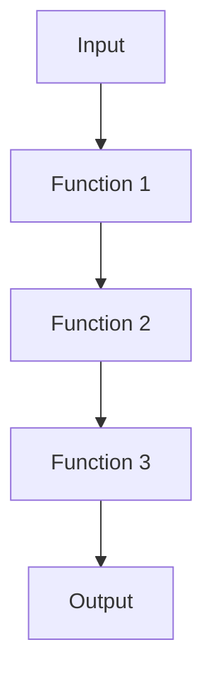

## 7.12 Function Composition and Pipelines

In the realm of functional programming, function composition and pipelines are fundamental concepts that enable developers to build complex functionality from simple, pure functions. This section delves into the significance of these concepts in F#, illustrating how they contribute to creating readable, maintainable, and scalable code. We will explore the function composition operators (`>>` and `<<`), the pipeline operator (`|>`), and best practices for leveraging these tools effectively.

### The Importance of Function Composition

Function composition is a cornerstone of functional programming. It allows developers to combine simple functions to form more complex ones, promoting code reuse and modularity. By composing functions, we can break down complex problems into manageable parts, each represented by a function, and then combine these parts to solve the overall problem.

Function composition enhances code readability and maintainability by enabling a declarative style of programming. Instead of focusing on how to perform a task, we define what needs to be done by composing existing functions. This approach aligns with the functional programming paradigm, which emphasizes immutability, pure functions, and declarative code.

### Introducing Function Composition Operators in F#

F# provides two operators for function composition: `>>` and `<<`. These operators allow us to compose functions in a concise and expressive manner.

- **Forward Composition Operator (`>>`)**: This operator composes two functions by applying the first function and then the second. It is read from left to right, making it intuitive for many developers.

- **Backward Composition Operator (`<<`)**: This operator composes two functions by applying the second function and then the first. It is read from right to left, which can be useful in certain contexts where this order aligns with the logical flow of data.

#### Example of Function Composition

Let's consider a simple example to illustrate function composition in F#:

```fsharp
let add x y = x + y
let multiply x y = x * y

// Composing functions using the forward composition operator
let addThenMultiply = add 2 >> multiply 3

// Applying the composed function
let result = addThenMultiply 5
printfn "Result: %d" result // Output: Result: 21
```

In this example, we define two functions: `add` and `multiply`. We then compose these functions using the `>>` operator to create a new function, `addThenMultiply`, which first adds 2 to its input and then multiplies the result by 3.

### The Pipeline Operator (`|>`)

The pipeline operator (`|>`) is another powerful tool in F# that enhances code readability by allowing us to chain function calls in a linear, top-to-bottom fashion. This operator passes the result of an expression as the argument to a function, effectively creating a pipeline of operations.

#### Example of Using the Pipeline Operator

Consider the following example, which demonstrates the use of the pipeline operator:

```fsharp
let square x = x * x
let increment x = x + 1

let result =
    5
    |> square
    |> increment

printfn "Result: %d" result // Output: Result: 26
```

In this example, we define two functions: `square` and `increment`. We then use the pipeline operator to apply these functions sequentially to the value `5`. The pipeline operator improves readability by presenting the sequence of operations in a clear, linear fashion.

### Composing Functions to Create New Functions

Function composition allows us to create new functions by combining existing ones. This technique is particularly useful when we want to build complex functionality from simpler components.

#### Example of Creating New Functions Through Composition

Let's explore an example where we compose functions to create a new function:

```fsharp
let toUpper (s: string) = s.ToUpper()
let addExclamation (s: string) = s + "!"

// Composing functions to create a new function
let shout = toUpper >> addExclamation

// Applying the composed function
let message = shout "hello"
printfn "%s" message // Output: HELLO!
```

In this example, we define two functions: `toUpper` and `addExclamation`. We then compose these functions using the `>>` operator to create a new function, `shout`, which converts a string to uppercase and adds an exclamation mark.

### Using Pipelines with Collections and Sequences

The pipeline operator is particularly powerful when working with collections and sequences. It allows us to apply a series of transformations to data in a clear and concise manner.

#### Example of Using Pipelines with Collections

Consider the following example, which demonstrates the use of pipelines with a list of numbers:

```fsharp
let numbers = [1; 2; 3; 4; 5]

let result =
    numbers
    |> List.map (fun x -> x * x)
    |> List.filter (fun x -> x > 10)
    |> List.sum

printfn "Sum of squares greater than 10: %d" result // Output: Sum of squares greater than 10: 29
```

In this example, we start with a list of numbers. We use the pipeline operator to apply a series of transformations: squaring each number, filtering out numbers less than or equal to 10, and summing the remaining numbers.

### Benefits of Composing Functions and Using Pipelines

Composing functions and using pipelines offer several benefits:

- **Code Clarity**: Function composition and pipelines promote a declarative style of programming, making code easier to read and understand.

- **Modularity**: By breaking down complex functionality into smaller functions, we create reusable components that can be combined in different ways.

- **Maintainability**: Composed functions and pipelines are easier to maintain because they encapsulate functionality in small, focused units.

- **Testability**: Small, pure functions are easier to test in isolation, improving the reliability of the codebase.

### Best Practices for Function Composition and Pipelines

To maximize the benefits of function composition and pipelines, consider the following best practices:

- **Keep Functions Pure and Small**: Pure functions with no side effects are easier to compose and test. Aim to keep functions small and focused on a single task.

- **Use Descriptive Names**: Give functions descriptive names that convey their purpose, making composed functions and pipelines easier to understand.

- **Leverage Type Inference**: F#'s strong type inference can simplify function signatures, making code more concise and readable.

- **Avoid Deep Nesting**: Deeply nested compositions can be difficult to read. Use the pipeline operator to flatten the structure and improve readability.

### Potential Issues and Debugging Composed Functions

While function composition and pipelines offer many advantages, they can also introduce challenges, particularly when debugging. Composed functions can obscure the flow of data, making it harder to identify the source of errors.

#### Tips for Debugging Composed Functions

- **Use Intermediate Variables**: Break down complex compositions into smaller steps with intermediate variables. This approach can help isolate and identify issues.

- **Leverage Logging**: Insert logging statements at key points in the pipeline to trace the flow of data and identify where errors occur.

- **Test Functions in Isolation**: Test individual functions before composing them. This practice ensures that each function behaves as expected, reducing the likelihood of errors in the composition.

### Visualizing Function Composition and Pipelines

To better understand function composition and pipelines, let's visualize the process using a flowchart:



**Figure 1**: This flowchart illustrates the flow of data through a series of composed functions, highlighting the linear progression from input to output.

### Try It Yourself

Experiment with the examples provided by modifying the functions and compositions. Try creating new functions by composing existing ones, and explore the impact of different transformations on collections using pipelines.

### References and Further Reading

- [F# Language Reference: Functions](https://docs.microsoft.com/en-us/dotnet/fsharp/language-reference/functions/)
- [F# for Fun and Profit: Function Composition](https://fsharpforfunandprofit.com/posts/function-composition/)
- [Functional Programming in F#](https://fsharp.org/learn/)

### Knowledge Check

To reinforce your understanding of function composition and pipelines, consider the following questions and exercises:

- How does function composition enhance code modularity and reuse?
- What are the differences between the `>>` and `<<` operators in F#?
- How can the pipeline operator (`|>`) improve code readability?
- Experiment with creating a pipeline that transforms a list of strings by trimming whitespace, converting to uppercase, and filtering out empty strings.

### Embrace the Journey

Remember, mastering function composition and pipelines is a journey. As you practice and experiment with these concepts, you'll gain a deeper understanding of their power and versatility. Keep exploring, stay curious, and enjoy the process of creating elegant, functional code.

## Quiz Time!



### What is the primary benefit of function composition in functional programming?

- [x] It promotes code reuse and modularity.
- [ ] It increases the execution speed of functions.
- [ ] It simplifies the syntax of functions.
- [ ] It allows for dynamic typing.

> **Explanation:** Function composition allows developers to combine simple functions to form more complex ones, promoting code reuse and modularity.

### Which operator in F# is used for forward function composition?

- [ ] <<
- [x] >>
- [ ] |>
- [ ] <|

> **Explanation:** The `>>` operator is used for forward function composition in F#.

### How does the pipeline operator (`|>`) enhance code readability?

- [x] By allowing function calls to be chained in a linear, top-to-bottom fashion.
- [ ] By reducing the number of lines of code needed.
- [ ] By enabling dynamic typing.
- [ ] By automatically optimizing function execution.

> **Explanation:** The pipeline operator allows function calls to be chained in a linear, top-to-bottom fashion, improving code readability.

### What is a best practice when composing functions?

- [x] Keep functions pure and small.
- [ ] Use global variables for state management.
- [ ] Avoid using descriptive names for functions.
- [ ] Deeply nest function compositions.

> **Explanation:** Keeping functions pure and small is a best practice, as it makes them easier to compose and test.

### What potential issue can arise when debugging composed functions?

- [x] The flow of data can be obscured, making it harder to identify errors.
- [ ] Functions cannot be tested in isolation.
- [ ] Composed functions always have side effects.
- [ ] The code becomes dynamically typed.

> **Explanation:** Composed functions can obscure the flow of data, making it harder to identify the source of errors.

### Which of the following is NOT a benefit of using pipelines?

- [ ] Code clarity
- [ ] Modularity
- [ ] Maintainability
- [x] Increased execution speed

> **Explanation:** While pipelines improve code clarity, modularity, and maintainability, they do not inherently increase execution speed.

### What is the purpose of the backward composition operator (`<<`) in F#?

- [x] To compose functions by applying the second function and then the first.
- [ ] To reverse the order of function arguments.
- [ ] To enable dynamic typing.
- [ ] To optimize function execution.

> **Explanation:** The backward composition operator (`<<`) composes functions by applying the second function and then the first.

### How can intermediate variables help when debugging composed functions?

- [x] They can help isolate and identify issues by breaking down complex compositions into smaller steps.
- [ ] They automatically log errors in the composition.
- [ ] They reduce the number of lines of code needed.
- [ ] They enable dynamic typing.

> **Explanation:** Intermediate variables can help isolate and identify issues by breaking down complex compositions into smaller steps.

### What is a key characteristic of pure functions?

- [x] They have no side effects.
- [ ] They rely on global variables.
- [ ] They modify external state.
- [ ] They always return the same result for different inputs.

> **Explanation:** Pure functions have no side effects and always return the same result for the same inputs.

### True or False: Function composition and pipelines are unique to F#.

- [ ] True
- [x] False

> **Explanation:** Function composition and pipelines are not unique to F#; they are fundamental concepts in functional programming and are used in many functional languages.




