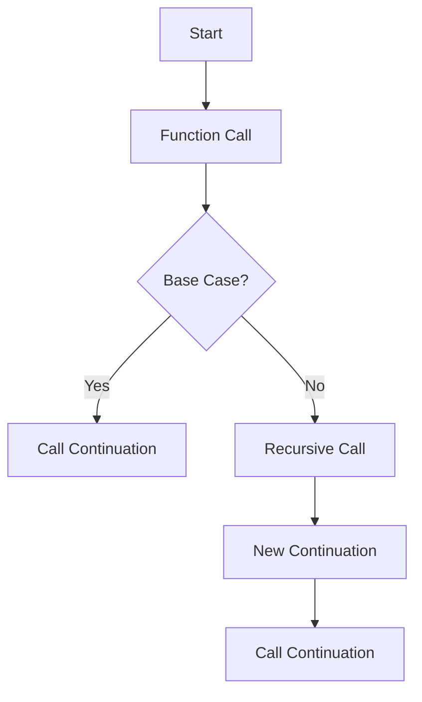

## 7.13 Continuation Passing Style (CPS)

### Introduction to Continuation Passing Style (CPS)

In the realm of functional programming, Continuation Passing Style (CPS) stands out as a powerful technique for managing control flow. CPS is a style of programming where the control flow of a program is made explicit by passing continuation functions. These continuation functions represent "the rest of the computation" and are invoked with the result of the current computation. This approach allows for advanced flow control mechanisms, such as non-blocking I/O, asynchronous programming, and complex control structures like coroutines and backtracking.

### Understanding CPS Transformation

CPS transforms function calls by making the continuation, or the next step of the computation, explicit. In traditional programming, a function returns a value to its caller. In CPS, instead of returning a value, a function receives an additional argument: a continuation function. This continuation function is called with the result, effectively passing control to the next step.

Let's explore this concept with a simple example. Consider a standard function that adds two numbers:

```fsharp
let add x y = x + y
```

In CPS, this function would be transformed to:

```fsharp
let addCPS x y cont = cont (x + y)
```

Here, `cont` is the continuation function that takes the result of `x + y` and performs the next computation.

### Converting Standard Functions to CPS in F#

To deepen our understanding, let's convert a more complex function to CPS. Consider a function that computes the factorial of a number:

```fsharp
let rec factorial n =
    if n = 0 then 1
    else n * factorial (n - 1)
```

In CPS, this function becomes:

```fsharp
let rec factorialCPS n cont =
    if n = 0 then cont 1
    else factorialCPS (n - 1) (fun res -> cont (n * res))
```

Here, `factorialCPS` takes an additional parameter `cont`, which is the continuation function. When `n` is 0, it calls `cont` with 1. Otherwise, it recursively calls `factorialCPS` with `n - 1` and a new continuation that multiplies the result by `n`.

### Use Cases for CPS

CPS is particularly useful in scenarios requiring advanced flow control, such as:

1. **Backtracking**: CPS can be used to implement backtracking algorithms, where the continuation represents the state of the computation at each decision point.

2. **Coroutines**: By explicitly managing control flow, CPS can be used to implement coroutines, allowing functions to pause and resume execution.

3. **Asynchronous Programming**: CPS is a natural fit for asynchronous programming, where continuations can represent callbacks to be invoked upon completion of an asynchronous operation.

4. **Non-blocking I/O**: CPS enables non-blocking I/O by allowing the program to continue executing other tasks while waiting for I/O operations to complete.

### Benefits of CPS

CPS offers several benefits, including:

- **Non-blocking I/O**: By using continuations, programs can perform other tasks while waiting for I/O operations, improving responsiveness and efficiency.
- **Advanced Flow Control**: CPS allows for complex control structures, such as coroutines and backtracking, enabling more flexible program design.
- **Asynchronous Operations**: CPS naturally supports asynchronous programming, making it easier to write non-blocking code.

### Complexity and Management of CPS

While CPS provides powerful capabilities, it can also introduce complexity. The explicit management of continuations can lead to code that is harder to read and maintain. Here are some strategies to manage this complexity:

- **Modular Design**: Break down complex CPS functions into smaller, modular components. This makes the code easier to understand and maintain.
- **Documentation**: Clearly document the purpose and behavior of each continuation function. This helps future developers (or yourself) understand the flow of the program.
- **Testing**: Thoroughly test CPS code to ensure that continuations are invoked correctly and that the program behaves as expected.

### When to Use CPS and Alternatives

CPS is a powerful tool, but it is not always the best choice. Consider using CPS when:

- You need advanced flow control mechanisms, such as coroutines or backtracking.
- You are implementing non-blocking I/O or asynchronous operations.

However, for simpler tasks, alternatives like async workflows or higher-order functions may be more appropriate. These alternatives can provide similar benefits with less complexity.

### Performance Implications of CPS

CPS can have performance implications, both positive and negative. On the positive side, CPS can improve responsiveness and efficiency by enabling non-blocking operations. However, the additional overhead of managing continuations can also impact performance. It's important to profile and test CPS code to ensure it meets performance requirements.

### Try It Yourself

Let's experiment with CPS by modifying the `factorialCPS` function. Try changing the continuation to print the result instead of returning it:

```fsharp
let rec factorialCPS n cont =
    if n = 0 then cont 1
    else factorialCPS (n - 1) (fun res -> cont (n * res))

// Try it yourself: Print the result
factorialCPS 5 (fun result -> printfn "Factorial result: %d" result)
```

### Visualizing CPS Flow

To better understand CPS, let's visualize the flow of a simple CPS function using a diagram:



**Figure 1**: Visualizing the flow of a CPS function. The function checks for a base case, makes a recursive call if necessary, and calls the continuation with the result.

### Conclusion

Continuation Passing Style (CPS) is a powerful programming paradigm that enables advanced flow control, non-blocking I/O, and asynchronous operations. By transforming functions to pass continuations, CPS provides greater flexibility and control over program execution. However, it also introduces complexity, which must be managed through careful design and documentation. By understanding when and how to use CPS, developers can leverage its benefits to build more responsive and efficient applications.

Remember, this is just the beginning. As you progress, you'll build more complex and interactive applications using CPS. Keep experimenting, stay curious, and enjoy the journey!

## Quiz Time!



### What is Continuation Passing Style (CPS)?

- [x] A programming style where control flow is passed explicitly through continuation functions.
- [ ] A style of programming that focuses on object-oriented design.
- [ ] A method for optimizing recursive functions.
- [ ] A technique for managing memory allocation.

> **Explanation:** CPS is a style of programming where control flow is passed explicitly through continuation functions, enabling advanced flow control mechanisms.

### How does CPS transform function calls?

- [x] By passing the next steps explicitly through continuation functions.
- [ ] By optimizing the function for tail recursion.
- [ ] By using higher-order functions to manage state.
- [ ] By converting functions into object methods.

> **Explanation:** CPS transforms function calls by passing the next steps explicitly through continuation functions, making the control flow explicit.

### What is a common use case for CPS?

- [x] Implementing asynchronous operations.
- [ ] Designing user interfaces.
- [ ] Managing memory allocation.
- [ ] Optimizing database queries.

> **Explanation:** CPS is commonly used for implementing asynchronous operations, as it allows for non-blocking I/O and advanced flow control.

### What is a potential downside of using CPS?

- [x] Increased code complexity.
- [ ] Reduced code readability.
- [ ] Slower execution speed.
- [ ] Limited support for recursion.

> **Explanation:** CPS can increase code complexity due to the explicit management of continuations, which can make the code harder to read and maintain.

### When should you consider using CPS?

- [x] When you need advanced flow control mechanisms.
- [ ] When you are designing a simple CRUD application.
- [ ] When you are optimizing a database query.
- [ ] When you are implementing a basic sorting algorithm.

> **Explanation:** CPS is useful when you need advanced flow control mechanisms, such as coroutines or backtracking, or when implementing non-blocking I/O or asynchronous operations.

### What is a benefit of using CPS?

- [x] Non-blocking I/O.
- [ ] Improved memory management.
- [ ] Simplified code structure.
- [ ] Enhanced error handling.

> **Explanation:** CPS enables non-blocking I/O by allowing the program to continue executing other tasks while waiting for I/O operations to complete.

### How can you manage the complexity introduced by CPS?

- [x] By breaking down complex CPS functions into smaller, modular components.
- [ ] By using global variables to manage state.
- [ ] By avoiding the use of recursion.
- [ ] By converting CPS functions into object methods.

> **Explanation:** To manage the complexity of CPS, break down complex functions into smaller, modular components, and clearly document the purpose and behavior of each continuation function.

### What is a performance implication of CPS?

- [x] It can improve responsiveness and efficiency by enabling non-blocking operations.
- [ ] It always increases execution speed.
- [ ] It reduces memory usage by optimizing recursion.
- [ ] It simplifies garbage collection.

> **Explanation:** CPS can improve responsiveness and efficiency by enabling non-blocking operations, but it can also introduce overhead due to the management of continuations.

### Can CPS be used for implementing coroutines?

- [x] Yes
- [ ] No

> **Explanation:** CPS can be used to implement coroutines by explicitly managing control flow, allowing functions to pause and resume execution.

### Is CPS suitable for all programming tasks?

- [x] False
- [ ] True

> **Explanation:** CPS is not suitable for all tasks. It is best used for scenarios requiring advanced flow control, non-blocking I/O, or asynchronous operations. For simpler tasks, alternatives like async workflows may be more appropriate.


