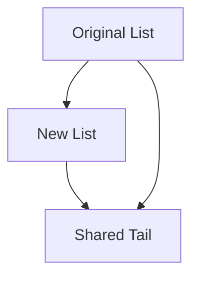

## 7.15.1 Persistent Data Structures

In the realm of functional programming, persistent data structures are a cornerstone for achieving immutability and thread safety. These structures allow us to preserve previous versions of data when modifications occur, which is crucial for building reliable and concurrent applications. In this section, we will delve into the concept of persistent data structures, their implementation in F#, and their significance in modern software development.

### Understanding Persistent Data Structures

Persistent data structures are those that maintain their previous states even after modifications. This is achieved through a technique known as **structural sharing**, which allows new versions of data structures to share parts of their structure with old versions, minimizing the need for duplication and optimizing memory usage.

#### Importance in Functional Programming

In functional programming, immutability is a key principle. By ensuring that data structures cannot be altered once created, we eliminate side effects, making our code more predictable and easier to reason about. Persistent data structures naturally align with this principle, providing a way to work with data immutably while still allowing for efficient updates.

### Achieving Persistence Through Structural Sharing

Structural sharing is the mechanism that enables persistence in data structures. Instead of copying the entire data structure when an update is made, only the parts that change are duplicated. The unchanged parts are shared between the old and new versions.

#### Example: Persistent Lists

Consider a simple list in F#. When we add an element to the front of a list, the new list shares the tail of the original list:

```fsharp
let originalList = [1; 2; 3]
let newList = 0 :: originalList

// originalList remains [1; 2; 3]
// newList is [0; 1; 2; 3]
```

In this example, `newList` shares the `[1; 2; 3]` portion with `originalList`, demonstrating structural sharing.

### Common Persistent Data Structures in F#

F# provides several built-in persistent data structures, such as lists, maps, and sets. Let's explore these structures and their usage.

#### Lists

Lists in F# are immutable and persistent by default. They are implemented as singly linked lists, making them ideal for scenarios where frequent additions to the front of the list are required.

```fsharp
let rec sumList lst =
    match lst with
    | [] -> 0
    | head :: tail -> head + sumList tail

let myList = [1; 2; 3; 4]
let total = sumList myList  // total is 10
```

#### Maps

Maps in F# are another example of persistent data structures. They are implemented as balanced binary trees, allowing for efficient lookups, insertions, and deletions.

```fsharp
let myMap = Map.empty.Add(1, "one").Add(2, "two")
let updatedMap = myMap.Add(3, "three")

// myMap remains unchanged
// updatedMap contains the new key-value pair
```

### Benefits of Immutability for Concurrency and Code Reliability

Immutability brings several advantages, particularly in the context of concurrency and code reliability:

- **Thread Safety**: Since immutable data structures cannot be changed, they are inherently thread-safe. Multiple threads can access them without the risk of data races or inconsistencies.
- **Predictability**: With immutable data, functions become more predictable, as they always produce the same output for the same input, regardless of external state.
- **Ease of Reasoning**: Immutability simplifies reasoning about code, as developers do not need to track changes to data over time.

### Operations Without Modifying the Original Structure

Persistent data structures allow us to perform operations like updates and deletions without altering the original structure. This is achieved through structural sharing, as demonstrated in the following examples.

#### Updating a Map

When updating a map, a new map is created that shares most of its structure with the original:

```fsharp
let originalMap = Map.ofList [(1, "one"); (2, "two")]
let updatedMap = originalMap.Add(3, "three")

// originalMap is still [(1, "one"); (2, "two")]
// updatedMap is [(1, "one"); (2, "two"); (3, "three")]
```

#### Deleting from a Map

Similarly, deleting an entry from a map results in a new map with the entry removed:

```fsharp
let mapWithDeletion = updatedMap.Remove(2)

// updatedMap remains unchanged
// mapWithDeletion is [(1, "one"); (3, "three")]
```

### Performance Considerations and Structural Sharing

While persistent data structures offer numerous benefits, they also come with performance considerations. The efficiency of these structures relies heavily on structural sharing, which minimizes the overhead of copying data.

#### Optimizing Performance

- **Tail Recursion**: Use tail recursion to optimize recursive functions that operate on persistent data structures, preventing stack overflow and improving performance.
- **Batch Operations**: Perform batch updates or transformations to reduce the overhead of creating multiple intermediate structures.

### Code Samples Demonstrating Usage

Let's explore some code samples that demonstrate the usage of persistent data structures in F#.

#### Example: Building a Persistent Stack

A stack is a classic data structure that can be implemented persistently using lists:

```fsharp
type PersistentStack<'T> = 
    | Empty
    | StackNode of 'T * PersistentStack<'T>

let push item stack = StackNode(item, stack)

let pop stack =
    match stack with
    | Empty -> failwith "Stack is empty"
    | StackNode(_, rest) -> rest

let peek stack =
    match stack with
    | Empty -> failwith "Stack is empty"
    | StackNode(item, _) -> item

let myStack = Empty |> push 1 |> push 2 |> push 3
let top = peek myStack  // top is 3
let newStack = pop myStack
```

#### Example: Persistent Queue

Implementing a queue with persistence can be achieved using two lists:

```fsharp
type PersistentQueue<'T> = 'T list * 'T list

let emptyQueue = ([], [])

let enqueue item (front, back) = (front, item :: back)

let dequeue (front, back) =
    match front with
    | [] -> 
        match List.rev back with
        | [] -> failwith "Queue is empty"
        | hd :: tl -> (hd, (tl, []))
    | hd :: tl -> (hd, (tl, back))

let myQueue = emptyQueue |> enqueue 1 |> enqueue 2 |> enqueue 3
let (first, newQueue) = dequeue myQueue  // first is 1
```

### Choosing Appropriate Data Structures

Selecting the right data structure depends on the specific requirements of your application. Consider the following guidelines:

- **Lists**: Use lists for simple collections where frequent additions to the front are needed.
- **Maps**: Opt for maps when you need key-value storage with efficient lookups and updates.
- **Sets**: Choose sets for collections of unique elements with efficient membership tests.

### Try It Yourself

Experiment with the provided code samples by modifying them to suit different scenarios. For example, try implementing a persistent binary tree or a more complex data structure using the principles of structural sharing.

### Visualizing Structural Sharing

To better understand how structural sharing works, let's visualize the process using a diagram:



**Description**: This diagram illustrates how a new list shares the tail of the original list, demonstrating structural sharing.

### References and Further Reading

- [F# Documentation on Collections](https://docs.microsoft.com/en-us/dotnet/fsharp/language-reference/fsharp-collections)
- [Immutable Data Structures](https://en.wikipedia.org/wiki/Immutable_object)
- [Functional Programming in F#](https://fsharp.org/learn/)

### Knowledge Check

- What are persistent data structures, and why are they important in functional programming?
- How does structural sharing optimize memory usage in persistent data structures?
- Provide an example of a persistent data structure in F# and explain its benefits.
- Discuss how immutability enhances concurrency and code reliability.
- Describe how updates and deletions are handled in persistent data structures without modifying the original structure.

### Embrace the Journey

Remember, mastering persistent data structures is just one step in your journey to becoming an expert in functional programming with F#. As you continue to explore and experiment, you'll discover new ways to leverage these powerful tools to build efficient and reliable applications. Keep pushing the boundaries, stay curious, and enjoy the process!

## Quiz Time!



### What is the primary advantage of using persistent data structures in functional programming?

- [x] They allow for immutability and thread safety.
- [ ] They enable faster computation.
- [ ] They require less memory.
- [ ] They simplify syntax.

> **Explanation:** Persistent data structures allow for immutability and thread safety, which are crucial in functional programming.

### How is persistence achieved in data structures?

- [x] Through structural sharing.
- [ ] By copying the entire structure.
- [ ] By using mutable variables.
- [ ] Through dynamic typing.

> **Explanation:** Persistence is achieved through structural sharing, which allows new versions of data structures to share parts of their structure with old versions.

### Which of the following is a persistent data structure in F#?

- [x] List
- [ ] Array
- [ ] StringBuilder
- [ ] Dictionary

> **Explanation:** Lists in F# are persistent data structures, while arrays and StringBuilder are not.

### What is a key benefit of immutability in concurrent programming?

- [x] Thread safety
- [ ] Faster execution
- [ ] Reduced memory usage
- [ ] Simplified syntax

> **Explanation:** Immutability ensures thread safety, as immutable data structures cannot be altered, preventing data races.

### How does structural sharing optimize memory usage?

- [x] By sharing unchanged parts between versions.
- [ ] By compressing data.
- [ ] By using pointers.
- [ ] By duplicating data.

> **Explanation:** Structural sharing optimizes memory usage by sharing unchanged parts between versions of data structures.

### What operation can be performed on a persistent map without altering the original?

- [x] Add a new key-value pair
- [ ] Modify an existing value
- [ ] Remove a key-value pair
- [ ] Sort the map

> **Explanation:** Adding a new key-value pair to a persistent map creates a new map without altering the original.

### Which data structure is best for frequent additions to the front?

- [x] List
- [ ] Array
- [ ] Set
- [ ] Map

> **Explanation:** Lists are ideal for frequent additions to the front due to their linked nature.

### What is the result of deleting an entry from a persistent map?

- [x] A new map with the entry removed
- [ ] The original map is altered
- [ ] The map is compressed
- [ ] The map is sorted

> **Explanation:** Deleting an entry from a persistent map results in a new map with the entry removed, leaving the original unchanged.

### What is a common use case for sets in F#?

- [x] Collections of unique elements
- [ ] Key-value storage
- [ ] Fast indexing
- [ ] String manipulation

> **Explanation:** Sets are used for collections of unique elements with efficient membership tests.

### True or False: Persistent data structures in F# require copying the entire structure for each modification.

- [ ] True
- [x] False

> **Explanation:** False. Persistent data structures use structural sharing to avoid copying the entire structure for each modification.


