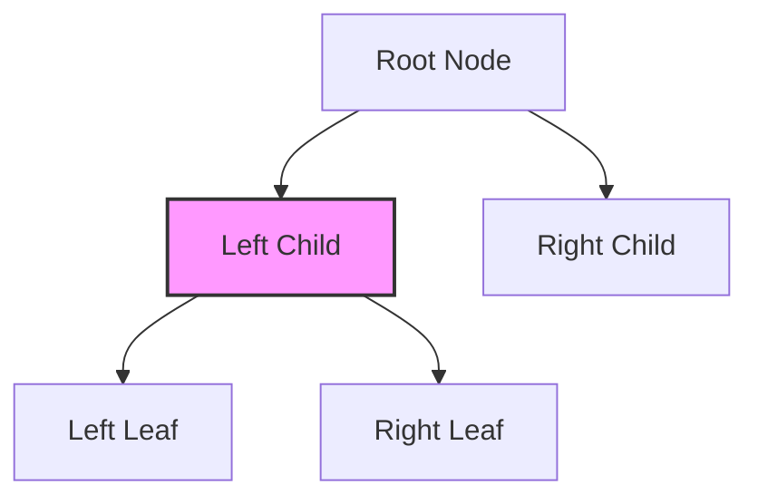

## 7.15.2 Zippers

In the realm of functional programming, immutability is a cornerstone principle that ensures data structures remain unchanged once created. While this immutability brings numerous benefits such as thread safety and predictability, it also poses challenges when it comes to efficiently navigating and updating data structures. Enter the concept of **zippers**—a powerful technique that enables efficient navigation and modification of immutable data structures by maintaining a focused position within them.

### Understanding Zippers

A **zipper** is a data structure that allows you to traverse and modify an immutable data structure efficiently. It achieves this by maintaining a "focus" on a particular part of the data structure, enabling localized updates without the need to recreate the entire structure. Think of a zipper as a cursor that can move through the data structure, allowing you to make changes at the point of focus.

#### The Anatomy of a Zipper

At its core, a zipper consists of two main components:

1. **Focus**: The current element or node that the zipper is pointing to.
2. **Context**: The surrounding structure that allows you to navigate back to the root or other parts of the data structure.

The context is typically represented as a list or stack of elements that have been traversed, allowing the zipper to "zip" back up to the root or move to adjacent elements.

### Implementing Zippers in F#

Let's delve into implementing a zipper for a simple list in F#. This example will illustrate the basic principles of zippers and how they can be used to navigate and modify a list efficiently.

#### Zipper for a List

```fsharp
type ListZipper<'T> = {
    Left: 'T list
    Focus: 'T
    Right: 'T list
}

let goLeft (zipper: ListZipper<'T>) =
    match zipper.Left with
    | [] -> None
    | h::t -> Some { Left = t; Focus = h; Right = zipper.Focus :: zipper.Right }

let goRight (zipper: ListZipper<'T>) =
    match zipper.Right with
    | [] -> None
    | h::t -> Some { Left = zipper.Focus :: zipper.Left; Focus = h; Right = t }

let updateFocus (newFocus: 'T) (zipper: ListZipper<'T>) =
    { zipper with Focus = newFocus }

// Example usage
let initialZipper = { Left = []; Focus = 1; Right = [2; 3; 4] }
let movedRight = goRight initialZipper
let updatedFocus = movedRight |> Option.map (updateFocus 5)
```

In this example, the `ListZipper` type keeps track of the elements to the left and right of the focus, allowing efficient navigation and updates. The `goLeft` and `goRight` functions enable moving the focus left or right, while `updateFocus` changes the current focus.

### Navigating and Modifying Data Structures

Zippers shine in scenarios where you need to navigate and modify complex data structures. Let's explore how zippers can be applied to a tree structure, which is a common use case.

#### Zipper for a Tree

Consider a simple binary tree:

```fsharp
type Tree<'T> =
    | Leaf
    | Node of 'T * Tree<'T> * Tree<'T>

type TreeZipper<'T> = {
    Focus: Tree<'T>
    Context: (Tree<'T> * Tree<'T> * 'T) list
}

let goLeft (zipper: TreeZipper<'T>) =
    match zipper.Focus with
    | Leaf -> None
    | Node (_, left, _) -> Some { Focus = left; Context = (zipper.Focus, Leaf, 'T) :: zipper.Context }

let goRight (zipper: TreeZipper<'T>) =
    match zipper.Focus with
    | Leaf -> None
    | Node (_, _, right) -> Some { Focus = right; Context = (zipper.Focus, 'T, Leaf) :: zipper.Context }

let updateFocus (newFocus: 'T) (zipper: TreeZipper<'T>) =
    match zipper.Focus with
    | Leaf -> zipper
    | Node (_, left, right) -> { zipper with Focus = Node(newFocus, left, right) }

// Example usage
let initialTree = Node(1, Node(2, Leaf, Leaf), Node(3, Leaf, Leaf))
let initialZipper = { Focus = initialTree; Context = [] }
let movedLeft = goLeft initialZipper
let updatedFocus = movedLeft |> Option.map (updateFocus 5)
```

In this example, the `TreeZipper` type maintains a focus on a specific node in the tree, along with a context that allows navigation back to the root or other nodes. The `goLeft` and `goRight` functions enable moving the focus to the left or right child, while `updateFocus` changes the value of the current node.

### Practical Applications of Zippers

Zippers have a wide range of applications, particularly in scenarios where efficient navigation and modification of data structures are crucial. Here are a few practical examples:

#### Editing XML Documents

Zippers can be used to navigate and edit XML documents efficiently. By maintaining a focus on a specific element, you can easily update attributes, add or remove child elements, and traverse the document structure.

#### Constructing Interactive UIs

In interactive user interfaces, zippers can be used to manage the state of UI components. By keeping a focus on the currently active component, you can efficiently update its state without affecting the rest of the UI.

#### Undo Functionality

Zippers are particularly useful for implementing undo functionality. By maintaining a history of changes in the context, you can easily revert to previous states without recreating the entire data structure.

### Benefits of Zippers

The primary benefit of zippers is their ability to perform localized updates in immutable data structures. This localized focus allows for efficient modifications without the overhead of recreating the entire structure. Additionally, zippers provide a natural way to implement undo functionality by maintaining a history of changes in the context.

### Complexity and Best Practices

Implementing zippers can be complex, especially for intricate data structures. Here are some best practices to manage this complexity:

- **Start Simple**: Begin with simple data structures like lists or binary trees to understand the basic principles of zippers.
- **Use Type Safety**: Leverage F#'s strong type system to ensure correctness and prevent errors.
- **Test Thoroughly**: Implement comprehensive tests to verify the correctness of navigation and updates.
- **Document Context**: Clearly document the context structure to aid in understanding and maintenance.

### Try It Yourself

To deepen your understanding of zippers, try modifying the code examples provided. Experiment with different data structures, such as more complex trees or graphs, and implement additional navigation functions. Consider how zippers can be applied to your own projects and explore their potential for efficient data manipulation.

### Visualizing Zippers

To better understand how zippers work, let's visualize the navigation process in a tree structure using Mermaid.js:



In this diagram, the focus is on the left child node, allowing for efficient updates and navigation within the tree.

### Conclusion

Zippers are a powerful tool for navigating and modifying immutable data structures in F#. By maintaining a focus on a specific part of the structure, zippers enable efficient updates and provide a natural way to implement undo functionality. While implementing zippers can be complex, the benefits they offer in terms of performance and flexibility make them a valuable addition to your functional programming toolkit.

## Quiz Time!



### What is a zipper in functional programming?

- [x] A data structure that allows efficient navigation and modification of immutable data structures.
- [ ] A method for compressing data in functional programming.
- [ ] A technique for sorting lists in F#.
- [ ] A type of loop used in functional programming.

> **Explanation:** A zipper is a data structure that maintains a focus on a part of an immutable data structure, allowing efficient navigation and modification.

### What are the two main components of a zipper?

- [x] Focus and Context
- [ ] Head and Tail
- [ ] Node and Edge
- [ ] Key and Value

> **Explanation:** A zipper consists of a focus, which is the current element, and a context, which is the surrounding structure allowing navigation.

### How does a zipper enable efficient updates in immutable data structures?

- [x] By maintaining a focus on a specific part of the structure, allowing localized updates.
- [ ] By compressing the data structure to reduce size.
- [ ] By converting the structure to a mutable form temporarily.
- [ ] By using parallel processing to speed up updates.

> **Explanation:** Zippers allow localized updates by focusing on a specific part of the structure, avoiding the need to recreate the entire structure.

### Which of the following is a practical application of zippers?

- [x] Editing XML documents
- [ ] Sorting large datasets
- [ ] Encrypting data
- [ ] Compiling code

> **Explanation:** Zippers can be used to navigate and edit XML documents efficiently by maintaining a focus on specific elements.

### What is a common benefit of using zippers?

- [x] Efficient localized updates
- [ ] Increased data compression
- [ ] Simplified data encryption
- [ ] Faster sorting algorithms

> **Explanation:** Zippers provide efficient localized updates without the need to recreate the entire data structure.

### What is a common challenge when implementing zippers?

- [x] Complexity of managing context
- [ ] Lack of support in F#
- [ ] Incompatibility with other data structures
- [ ] Difficulty in understanding recursion

> **Explanation:** Implementing zippers can be complex due to the need to manage context for navigation and updates.

### How can zippers be used in interactive UIs?

- [x] By managing the state of UI components efficiently
- [ ] By compressing UI elements for faster rendering
- [ ] By encrypting user input
- [ ] By sorting UI elements dynamically

> **Explanation:** Zippers can manage the state of UI components by maintaining a focus on the active component, allowing efficient updates.

### What is a best practice for implementing zippers?

- [x] Start with simple data structures to understand the principles
- [ ] Always use mutable data structures
- [ ] Avoid using type safety
- [ ] Implement zippers only for lists

> **Explanation:** Starting with simple data structures helps in understanding the basic principles of zippers before tackling more complex structures.

### Can zippers be used for undo functionality?

- [x] Yes
- [ ] No

> **Explanation:** Zippers can be used for undo functionality by maintaining a history of changes in the context.

### Are zippers specific to F#?

- [ ] True
- [x] False

> **Explanation:** Zippers are a general concept in functional programming and can be implemented in various languages, not just F#.


