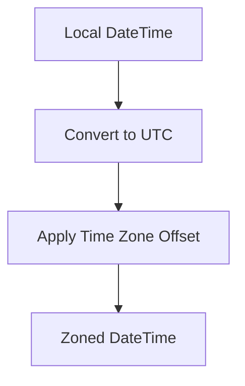
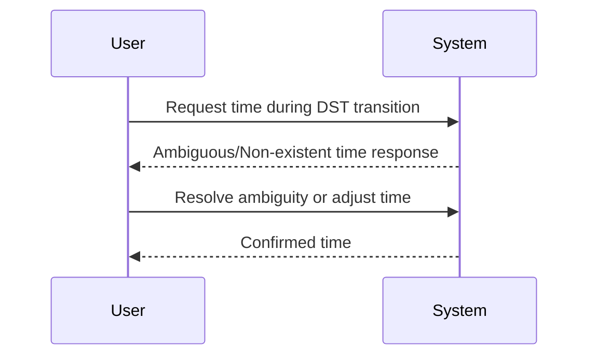

## 7.16 Time Handling and Temporal Patterns

In the realm of software development, managing time-related data is a task fraught with complexities and potential pitfalls. From dealing with time zones and daylight saving time to accurately modeling temporal aspects in applications, understanding how to handle time effectively is crucial. In this section, we'll delve into the intricacies of time handling in F#, exploring best practices, common challenges, and advanced techniques to ensure your applications manage time data accurately and efficiently.

### Understanding the Challenges of Time Management in Software

Time is a deceptively complex concept in software development. Here are some common challenges you may encounter:

1. **Time Zones**: Handling different time zones can be tricky, especially when users are spread across the globe.
2. **Daylight Saving Time (DST)**: DST transitions can lead to ambiguous or non-existent times, complicating scheduling and logging.
3. **Leap Seconds**: Occasionally, a leap second is added to synchronize atomic clocks with Earth's rotation, which can affect time calculations.
4. **Historical Changes**: Time zone rules can change, requiring updates to software that relies on accurate time calculations.
5. **Precision and Accuracy**: Ensuring that time calculations are precise and accurate, especially in applications requiring high precision.

### F# Date and Time Types

F# provides several types for working with dates and times, each with its own use cases and characteristics:

- **`DateTime`**: Represents an instant in time, typically expressed as a date and time of day. It can be in local time or UTC.
- **`DateTimeOffset`**: Represents a point in time relative to UTC, with an offset indicating the difference from UTC.
- **`TimeSpan`**: Represents a time interval.
- **`DateOnly` and `TimeOnly`**: Introduced in .NET 6, these types represent a date or time without a time zone.

#### Using `DateTime` and `DateTimeOffset`

`DateTime` and `DateTimeOffset` are the most commonly used types for handling date and time in F#. Let's explore how to use them effectively.

```fsharp
open System

// Creating a DateTime instance
let now = DateTime.Now // Local time
let utcNow = DateTime.UtcNow // UTC time

// Creating a DateTimeOffset instance
let offsetNow = DateTimeOffset.Now
let utcOffsetNow = DateTimeOffset.UtcNow

// Displaying DateTime and DateTimeOffset
printfn "Local DateTime: %A" now
printfn "UTC DateTime: %A" utcNow
printfn "Local DateTimeOffset: %A" offsetNow
printfn "UTC DateTimeOffset: %A" utcOffsetNow
```

**Key Points:**

- **Use `DateTime.UtcNow`** for UTC times to avoid issues with time zones.
- **Prefer `DateTimeOffset`** when you need to store or transmit time with an offset, as it provides more context about the time's origin.

### Best Practices for Time Handling

#### Always Work in UTC Internally

When dealing with time in applications, it's a best practice to work with UTC internally. This approach simplifies time calculations and avoids issues related to time zones and daylight saving time.

```fsharp
// Converting local time to UTC
let localTime = DateTime.Now
let utcTime = localTime.ToUniversalTime()

printfn "Local Time: %A, UTC Time: %A" localTime utcTime
```

#### Converting Between Time Zones

To handle time zone conversions effectively, consider using libraries like [NodaTime](https://nodatime.org/), which provide robust support for time zones and daylight saving time.

```fsharp
open NodaTime

// Convert a local time to a different time zone
let localDateTime = LocalDateTime(2024, 11, 17, 12, 0, 0)
let timeZone = DateTimeZoneProviders.Tzdb.["America/New_York"]
let zonedDateTime = localDateTime.InZoneLeniently(timeZone)

printfn "Zoned DateTime: %A" zonedDateTime
```

**NodaTime Advantages:**

- **Comprehensive Time Zone Support**: NodaTime provides a comprehensive database of time zones, including historical changes.
- **Clearer API**: The API is designed to reduce ambiguity and make time zone conversions more intuitive.

#### Storing and Displaying Dates and Times

When storing dates and times, consider the following best practices:

- **Store in UTC**: Store dates and times in UTC to avoid issues with time zones.
- **Use ISO 8601 Format**: When serializing dates and times, use the ISO 8601 format for consistency and interoperability.

```fsharp
let utcNow = DateTime.UtcNow
let iso8601String = utcNow.ToString("o") // ISO 8601 format

printfn "ISO 8601 DateTime: %s" iso8601String
```

### Handling Daylight Saving Time Transitions

Daylight saving time transitions can lead to ambiguous or non-existent times. Here's how to handle these scenarios:

- **Ambiguous Times**: When clocks are set back, an hour is repeated, leading to ambiguous times. Use time zone information to resolve ambiguity.
- **Non-Existent Times**: When clocks are set forward, an hour is skipped, leading to non-existent times. Handle these cases by adjusting the time or notifying the user.

```fsharp
let ambiguousTime = LocalDateTime(2024, 11, 3, 1, 30, 0)
let timeZone = DateTimeZoneProviders.Tzdb.["America/New_York"]
let zonedDateTime = ambiguousTime.InZoneStrictly(timeZone)

printfn "Resolved Zoned DateTime: %A" zonedDateTime
```

### Testing Time-Dependent Code

Testing code that depends on time can be challenging. Here are some strategies to consider:

- **Mocking Time**: Use dependency injection to inject a time provider, allowing you to control the current time during tests.
- **Time Travel**: Simulate time travel by manipulating the system clock or using libraries that support time manipulation.

```fsharp
type ITimeProvider =
    abstract member Now : DateTime

type DefaultTimeProvider() =
    interface ITimeProvider with
        member _.Now = DateTime.UtcNow

let performActionAtSpecificTime (timeProvider: ITimeProvider) =
    let currentTime = timeProvider.Now
    // Perform action based on currentTime

// In tests, use a mock time provider
type MockTimeProvider(initialTime: DateTime) =
    let mutable currentTime = initialTime
    interface ITimeProvider with
        member _.Now = currentTime
    member this.AdvanceTimeBy(minutes: int) =
        currentTime <- currentTime.AddMinutes(float minutes)
```

### Modeling Temporal Data

Temporal data often involves event streams with timestamps. Here's how to model such data effectively:

- **Use Immutable Data Structures**: Ensure that temporal data is immutable to prevent accidental modifications.
- **Include Timestamps**: Always include timestamps with events to provide context.

```fsharp
type Event = { Timestamp: DateTime; Data: string }

let events = [
    { Timestamp = DateTime.UtcNow; Data = "Event 1" }
    { Timestamp = DateTime.UtcNow.AddMinutes(1.0); Data = "Event 2" }
]

events |> List.iter (fun e -> printfn "Event: %s at %A" e.Data e.Timestamp)
```

### Visualizing Time Handling Concepts

To better understand the complexities of time handling, let's visualize some of these concepts using Mermaid.js diagrams.

#### Time Zone Conversion Flow



**Description**: This diagram illustrates the flow of converting a local date and time to a zoned date and time, highlighting the conversion to UTC and application of a time zone offset.

#### Daylight Saving Time Transition



**Description**: This sequence diagram shows the interaction between a user and a system during a daylight saving time transition, demonstrating how ambiguous or non-existent times are handled.

### Try It Yourself

To solidify your understanding of time handling in F#, try modifying the code examples provided:

- **Experiment with Different Time Zones**: Use NodaTime to convert times between various time zones and observe the results.
- **Simulate Daylight Saving Transitions**: Create scenarios with ambiguous and non-existent times, and implement logic to handle them.
- **Mock Time in Tests**: Implement a mock time provider and use it to test time-dependent code.

### Knowledge Check

Before we wrap up, let's summarize the key takeaways:

- **Always work in UTC internally** to avoid time zone issues.
- **Use `DateTimeOffset`** for storing or transmitting time with an offset.
- **Leverage libraries like NodaTime** for robust time zone handling.
- **Store dates and times in UTC** and use ISO 8601 format for serialization.
- **Handle daylight saving transitions** by resolving ambiguous times and adjusting non-existent times.
- **Test time-dependent code** using mocking and time travel techniques.
- **Model temporal data** with immutable structures and timestamps.

### Embrace the Journey

Remember, mastering time handling is a journey. As you continue to work with time-related data, you'll encounter new challenges and opportunities to refine your skills. Keep experimenting, stay curious, and enjoy the journey!

## Quiz Time!



### What is the recommended practice for handling time zones in software?

- [x] Always work in UTC internally
- [ ] Always work in local time internally
- [ ] Use local time for storage and UTC for display
- [ ] Use UTC for storage and local time for calculations

> **Explanation:** Working in UTC internally avoids issues related to time zones and daylight saving time, simplifying calculations and data storage.

### Which F# type should you use when you need to store or transmit time with an offset?

- [x] DateTimeOffset
- [ ] DateTime
- [ ] TimeSpan
- [ ] LocalDateTime

> **Explanation:** `DateTimeOffset` includes an offset from UTC, providing more context about the time's origin, making it ideal for storage and transmission.

### What library is recommended for robust time zone handling in F#?

- [x] NodaTime
- [ ] TimeZoneInfo
- [ ] System.DateTime
- [ ] FSharp.Core

> **Explanation:** NodaTime provides comprehensive support for time zones, including historical changes, and offers a clearer API for time zone conversions.

### What format is recommended for serializing dates and times?

- [x] ISO 8601
- [ ] RFC 2822
- [ ] Unix Timestamp
- [ ] Custom format

> **Explanation:** ISO 8601 is a widely used standard for representing dates and times, ensuring consistency and interoperability across systems.

### How should you handle ambiguous times during daylight saving transitions?

- [x] Use time zone information to resolve ambiguity
- [ ] Ignore the ambiguity
- [ ] Convert to local time
- [ ] Use a fixed offset

> **Explanation:** Using time zone information allows you to resolve ambiguous times accurately, considering daylight saving transitions.

### What is a common strategy for testing time-dependent code?

- [x] Mocking Time
- [ ] Using real system time
- [ ] Ignoring time dependencies
- [ ] Hardcoding time values

> **Explanation:** Mocking time allows you to control the current time during tests, making it easier to test time-dependent logic.

### Why is it important to include timestamps with events in temporal data modeling?

- [x] To provide context for the events
- [ ] To reduce data size
- [ ] To simplify event processing
- [ ] To avoid using time zones

> **Explanation:** Including timestamps provides context for events, allowing you to understand when they occurred and how they relate to other events.

### How can you simulate time travel in tests?

- [x] Manipulating the system clock or using libraries
- [ ] Using real-time data
- [ ] Ignoring time dependencies
- [ ] Hardcoding time values

> **Explanation:** Simulating time travel by manipulating the system clock or using libraries allows you to test how your code behaves at different times.

### What is the advantage of using immutable data structures for temporal data?

- [x] Prevents accidental modifications
- [ ] Reduces memory usage
- [ ] Simplifies data processing
- [ ] Avoids using time zones

> **Explanation:** Immutable data structures prevent accidental modifications, ensuring the integrity of temporal data over time.

### True or False: Leap seconds are added to synchronize atomic clocks with Earth's rotation.

- [x] True
- [ ] False

> **Explanation:** Leap seconds are occasionally added to account for variations in Earth's rotation, ensuring atomic clocks remain synchronized with astronomical time.


