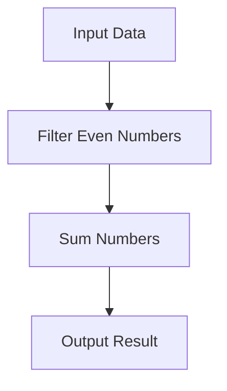

## 7.18 Declarative Programming Patterns

In the realm of software development, the way we express our logic can significantly impact the clarity, maintainability, and efficiency of our code. Declarative programming is a paradigm that emphasizes the expression of logic without explicitly detailing the control flow. In this section, we will delve into the world of declarative programming patterns in F#, exploring how this approach can lead to clearer, more concise, and easier-to-reason-about code.

### Understanding Declarative vs. Imperative Programming

Before we dive into F#'s support for declarative programming, let's first define what declarative programming is and how it contrasts with imperative programming.

**Declarative Programming** focuses on the "what" rather than the "how." It allows developers to specify what the program should accomplish without explicitly stating how to achieve it. This paradigm is characterized by high-level constructs that abstract away the control flow, making the code more readable and maintainable.

**Imperative Programming**, on the other hand, is all about the "how." It involves writing code that explicitly describes the steps the computer must take to achieve a desired outcome. This often leads to code that is more verbose and harder to maintain, as it requires managing state and control flow explicitly.

### F# and Declarative Programming

F# is a functional-first language that naturally supports declarative programming styles. Its rich set of features, including immutability, pattern matching, and higher-order functions, make it an ideal choice for writing declarative code.

#### Key Declarative Constructs in F#

1. **List Comprehensions**: F# provides powerful list comprehensions that allow you to succinctly express operations over collections.

2. **Pipelines**: The pipeline operator (`|>`) is a hallmark of F#'s declarative style, enabling the chaining of function calls in a clear and readable manner.

3. **Pattern Matching**: F#'s pattern matching is a versatile tool for deconstructing and analyzing data structures, allowing for expressive and concise code.

### Advantages of Declarative Code

Declarative code offers several advantages over imperative code:

- **Readability**: Declarative code is often more concise and easier to read, as it abstracts away the control flow and focuses on the logic.

- **Maintainability**: With less boilerplate and fewer explicit state manipulations, declarative code is generally easier to maintain and refactor.

- **Expressiveness**: Declarative constructs allow developers to express complex logic in a more natural and intuitive way.

### Refactoring Imperative Code to Declarative Style

To illustrate the power of declarative programming, let's refactor some imperative code into a more declarative style.

#### Imperative Example: Summing Even Numbers

```fsharp
let sumEvenNumbersImperative (numbers: int list) =
    let mutable sum = 0
    for number in numbers do
        if number % 2 = 0 then
            sum <- sum + number
    sum
```

#### Declarative Refactor

```fsharp
let sumEvenNumbersDeclarative (numbers: int list) =
    numbers
    |> List.filter (fun n -> n % 2 = 0)
    |> List.sum
```

In the declarative version, we use `List.filter` to select even numbers and `List.sum` to compute the total. This approach is not only more concise but also more expressive, clearly conveying the intent of the code.

### Querying Data with LINQ

F# integrates seamlessly with LINQ (Language Integrated Query), a powerful tool for querying data in a declarative manner.

#### Example: Querying a List of Records

```fsharp
type Person = { Name: string; Age: int }

let people = [
    { Name = "Alice"; Age = 30 }
    { Name = "Bob"; Age = 25 }
    { Name = "Charlie"; Age = 35 }
]

let adults =
    query {
        for person in people do
        where (person.Age >= 30)
        select person.Name
    }
```

In this example, we use a LINQ query to select the names of people who are 30 or older. The query syntax is declarative, focusing on what we want to achieve rather than how to iterate over the collection.

### Function Composition

Function composition is another powerful declarative pattern in F#. It allows us to build complex functions by combining simpler ones.

#### Example: Composing Functions

```fsharp
let add x y = x + y
let multiply x y = x * y

let addThenMultiply = add 2 >> multiply 3

let result = addThenMultiply 5 // (5 + 2) * 3 = 21
```

In this example, `addThenMultiply` is a composed function that first adds 2 to its input and then multiplies the result by 3. The `>>` operator is used to compose the functions, creating a new function that applies them in sequence.

### Potential Limitations of Declarative Code

While declarative programming offers many benefits, there are situations where imperative code may be necessary:

- **Performance**: In some cases, imperative code can be more efficient, especially when fine-grained control over state and execution is required.

- **Complex Logic**: For certain complex algorithms, imperative code may be more straightforward to implement and understand.

### Best Practices for Writing Declarative Code

To make the most of declarative programming in F#, consider the following best practices:

- **Avoid Unnecessary Mutations**: Embrace immutability to reduce side effects and improve code clarity.

- **Leverage Higher-Order Functions**: Use functions like `map`, `filter`, and `fold` to operate on collections declaratively.

- **Use Pattern Matching**: Take advantage of F#'s pattern matching to simplify control flow and data manipulation.

- **Compose Functions**: Build complex logic by composing simpler functions, enhancing modularity and readability.

### Try It Yourself

Let's encourage you to experiment with the concepts we've covered. Try modifying the examples to see how different approaches affect the code:

- **Modify the LINQ Query**: Change the age filter to see how it impacts the results.

- **Experiment with Function Composition**: Create a new composed function that performs different operations.

### Visualizing Declarative Programming Patterns

To aid understanding, let's visualize the flow of data in a declarative pipeline using a Mermaid.js diagram.



This diagram represents the flow of data through a declarative pipeline, highlighting the transformation steps from input to output.

### Conclusion

Declarative programming patterns in F# empower developers to write code that is not only more readable and maintainable but also more expressive and concise. By leveraging F#'s natural support for declarative styles, we can create software that is easier to reason about and adapt to changing requirements. Remember, this is just the beginning. As you continue to explore F#, you'll discover even more ways to harness the power of declarative programming. Keep experimenting, stay curious, and enjoy the journey!

## Quiz Time!



### What is the main focus of declarative programming?

- [x] Expressing logic without explicit control flow
- [ ] Detailing step-by-step instructions
- [ ] Managing state explicitly
- [ ] Writing verbose code

> **Explanation:** Declarative programming emphasizes expressing logic without detailing the control flow, focusing on the "what" rather than the "how."

### Which F# feature is commonly used for chaining function calls in a declarative style?

- [x] Pipeline operator (`|>`)
- [ ] Mutable variables
- [ ] Loops
- [ ] Conditional statements

> **Explanation:** The pipeline operator (`|>`) is used in F# to chain function calls, promoting a declarative style.

### How does F#'s pattern matching contribute to declarative programming?

- [x] Simplifies control flow and data manipulation
- [ ] Increases code verbosity
- [ ] Requires explicit state management
- [ ] Complicates logic expression

> **Explanation:** Pattern matching in F# simplifies control flow and data manipulation, making the code more declarative.

### What is a key advantage of declarative code?

- [x] Improved readability and maintainability
- [ ] Increased complexity
- [ ] More explicit state management
- [ ] Requires more lines of code

> **Explanation:** Declarative code is often more readable and maintainable due to its focus on expressing logic clearly.

### When might imperative code be necessary over declarative code?

- [x] When performance optimization is critical
- [ ] When readability is a priority
- [ ] When reducing code lines is essential
- [ ] When avoiding state management

> **Explanation:** Imperative code may be necessary when performance optimization requires fine-grained control over state and execution.

### What is the purpose of function composition in F#?

- [x] Building complex functions from simpler ones
- [ ] Increasing code verbosity
- [ ] Managing state explicitly
- [ ] Writing step-by-step instructions

> **Explanation:** Function composition in F# allows developers to build complex functions by combining simpler ones, enhancing modularity.

### Which of the following is a declarative construct in F#?

- [x] List comprehensions
- [ ] Mutable variables
- [ ] For loops
- [ ] If-else statements

> **Explanation:** List comprehensions in F# are a declarative construct that allows for concise expression of operations over collections.

### How can you refactor imperative code into a declarative style?

- [x] Use higher-order functions like `map`, `filter`, and `fold`
- [ ] Introduce more loops
- [ ] Increase mutable state usage
- [ ] Add more conditional statements

> **Explanation:** Refactoring imperative code into a declarative style involves using higher-order functions like `map`, `filter`, and `fold`.

### What is a potential limitation of declarative programming?

- [x] May not be suitable for performance-critical code
- [ ] Requires more explicit state management
- [ ] Increases code verbosity
- [ ] Complicates logic expression

> **Explanation:** Declarative programming may not be suitable for performance-critical code where fine-grained control is necessary.

### True or False: Declarative programming in F# often leads to more maintainable code.

- [x] True
- [ ] False

> **Explanation:** Declarative programming in F# often leads to more maintainable code due to its focus on expressing logic clearly and concisely.


