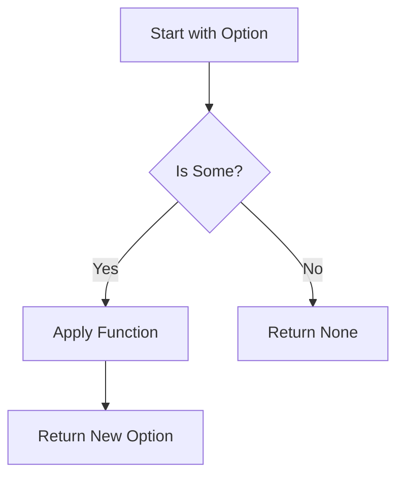

## 7.2.1 The `Option` Monad

In the realm of functional programming, the `Option` type is a powerful construct that provides a robust way to handle optional values without resorting to null references. In F#, the `Option` type is a monad that enables clean and safe handling of values that may or may not be present. This section will delve into the `Option` monad, exploring its structure, usage, and advantages over traditional null handling mechanisms.

### Understanding the `Option` Type

The `Option` type in F# is a discriminated union that can take one of two forms: `Some` or `None`. This type is used to represent a value that might be present (`Some`) or absent (`None`).

```fsharp
type Option<'T> =
    | Some of 'T
    | None
```

- **`Some`**: This case holds a value of type `'T`.
- **`None`**: This case represents the absence of a value.

The `Option` type is particularly useful in scenarios where a function might not return a meaningful result, such as searching for an element in a collection or parsing user input.

### The `Option` Monad

Monads are a fundamental concept in functional programming that allow for the composition of computations. The `Option` type forms a monad by providing a way to chain operations that may produce no result. This is achieved through the `bind` function, which is often represented by the `>>=` operator in functional programming languages.

#### The `bind` Function

The `bind` function takes an `Option` value and a function that returns an `Option`, chaining them together. If the initial `Option` is `None`, the function is not applied, and `None` is returned. If it is `Some`, the function is applied to the contained value.

```fsharp
let bind f option =
    match option with
    | Some value -> f value
    | None -> None
```

#### Chaining Computations with `Option.bind`

The ability to chain computations is one of the key features of the `Option` monad. Let's consider an example where we have a series of operations that may fail:

```fsharp
let tryParseInt (s: string) =
    match System.Int32.TryParse(s) with
    | (true, result) -> Some result
    | _ -> None

let divideByTwo x =
    if x % 2 = 0 then Some (x / 2)
    else None

let processInput input =
    input
    |> tryParseInt
    |> Option.bind divideByTwo
```

In this example, `processInput` takes a string, attempts to parse it as an integer, and then divides it by two if it is even. If any step fails, the computation short-circuits and returns `None`.

### Computation Expressions with `option { }`

F# provides computation expressions to make working with monads more readable. The `option { }` computation expression allows us to write code that looks imperative but is actually functional.

```fsharp
let processInputWithComputationExpression input =
    option {
        let! number = tryParseInt input
        let! half = divideByTwo number
        return half
    }
```

In this example, `let!` is used to bind the result of each operation, and `return` is used to produce the final result. If any operation returns `None`, the entire expression results in `None`.

### Common Functions: `map`, `bind`, and `defaultValue`

The `Option` type comes with several useful functions that make it easier to work with optional values.

#### `map`

The `map` function applies a given function to the value inside `Some`, returning a new `Option`. If the `Option` is `None`, it returns `None`.

```fsharp
let addOne option =
    Option.map ((+) 1) option
```

#### `bind`

As previously discussed, `bind` is used to chain operations that return `Option` types.

#### `defaultValue`

The `defaultValue` function provides a fallback value if the `Option` is `None`.

```fsharp
let getValueOrDefault option defaultValue =
    Option.defaultValue defaultValue option
```

### Best Practices for Handling `None` Cases

Handling `None` cases gracefully is crucial to avoid runtime errors and ensure code reliability. Here are some best practices:

- **Use `Option.defaultValue`** to provide a default value when an `Option` is `None`.
- **Pattern match** on `Option` values to handle both `Some` and `None` cases explicitly.
- **Avoid exceptions** by using `Option` to represent the absence of a value instead of throwing exceptions.

### Practical Use Cases

#### Parsing User Input

When parsing user input, it's common to encounter invalid data. The `Option` type can be used to handle such cases gracefully.

```fsharp
let parseAndProcessInput input =
    match processInput input with
    | Some result -> printfn "Processed result: %d" result
    | None -> printfn "Invalid input or processing failed."
```

#### Querying Data

When querying a database or an API, the requested data might not exist. Using `Option` allows us to handle such scenarios without exceptions.

```fsharp
let findUserById id =
    // Simulate a database lookup
    if id = 1 then Some "Alice"
    else None

let displayUserName id =
    match findUserById id with
    | Some name -> printfn "User found: %s" name
    | None -> printfn "User not found."
```

### Advantages of Using `Option` Over Nullable Types or Exceptions

The `Option` type provides several advantages over nullable types or exceptions:

- **Type Safety**: The `Option` type makes it explicit when a value might be absent, reducing the risk of null reference errors.
- **Composability**: The monadic nature of `Option` allows for easy composition of operations that may fail.
- **Clarity**: Code that uses `Option` is often clearer and more readable, as it explicitly handles the presence or absence of a value.

### Visualizing the `Option` Monad

To better understand how the `Option` monad works, let's visualize the flow of operations using a flowchart.



**Figure 1**: This diagram illustrates the flow of operations in the `Option` monad. If the initial value is `Some`, the function is applied, and a new `Option` is returned. If it is `None`, the computation short-circuits, and `None` is returned.

### Try It Yourself

To fully grasp the power of the `Option` monad, try modifying the code examples provided. Here are some suggestions:

- **Modify `divideByTwo`** to handle odd numbers by returning `Some (x / 2)` for any integer.
- **Create a new function** that chains multiple operations using `Option.bind`.
- **Experiment with `option { }`** by adding additional steps to the computation expression.

### Conclusion

The `Option` monad in F# is a powerful tool for handling optional values cleanly and safely. By using `Option`, we can avoid null references, simplify code, and improve its readability and reliability. As you continue to explore functional programming in F#, embrace the `Option` monad to enhance your code's robustness and maintainability.

## Quiz Time!



### What is the `Option` type in F# used for?

- [x] Representing values that may or may not be present
- [ ] Handling exceptions
- [ ] Performing asynchronous operations
- [ ] Managing state transitions

> **Explanation:** The `Option` type is used to represent values that may or may not be present, providing a safe alternative to null references.

### Which of the following is a case of the `Option` type?

- [x] Some
- [ ] Maybe
- [ ] Either
- [ ] Result

> **Explanation:** The `Option` type in F# has two cases: `Some`, which holds a value, and `None`, which represents the absence of a value.

### How does the `bind` function work with the `Option` type?

- [x] It chains operations that return `Option` types
- [ ] It maps a function over a list
- [ ] It combines two lists into one
- [ ] It filters elements from a list

> **Explanation:** The `bind` function chains operations that return `Option` types, allowing for the composition of computations that may fail.

### What does the `option { }` computation expression do?

- [x] Provides a more readable way to work with `Option` monads
- [ ] Executes asynchronous operations
- [ ] Handles exceptions
- [ ] Manages state transitions

> **Explanation:** The `option { }` computation expression provides a more readable way to work with `Option` monads, allowing for imperative-style code that is actually functional.

### Which function provides a fallback value for `None`?

- [x] defaultValue
- [ ] map
- [ ] bind
- [ ] filter

> **Explanation:** The `defaultValue` function provides a fallback value if an `Option` is `None`.

### What is a key advantage of using `Option` over nullable types?

- [x] Type safety
- [ ] Faster execution
- [ ] Smaller memory footprint
- [ ] Easier debugging

> **Explanation:** A key advantage of using `Option` over nullable types is type safety, as it makes the absence of a value explicit.

### Which of the following is NOT a common function for `Option`?

- [x] reduce
- [ ] map
- [ ] bind
- [ ] defaultValue

> **Explanation:** `reduce` is not a common function for `Option`. Common functions include `map`, `bind`, and `defaultValue`.

### How can you handle `None` cases gracefully?

- [x] Use `Option.defaultValue` to provide a default value
- [ ] Throw exceptions
- [ ] Ignore them
- [ ] Log an error message

> **Explanation:** Handling `None` cases gracefully can be achieved by using `Option.defaultValue` to provide a default value.

### What does the `Some` case of `Option` represent?

- [x] The presence of a value
- [ ] The absence of a value
- [ ] An error state
- [ ] A null reference

> **Explanation:** The `Some` case of `Option` represents the presence of a value.

### True or False: The `Option` monad can be used to avoid null references.

- [x] True
- [ ] False

> **Explanation:** True. The `Option` monad can be used to avoid null references by representing the absence of a value with `None`.


