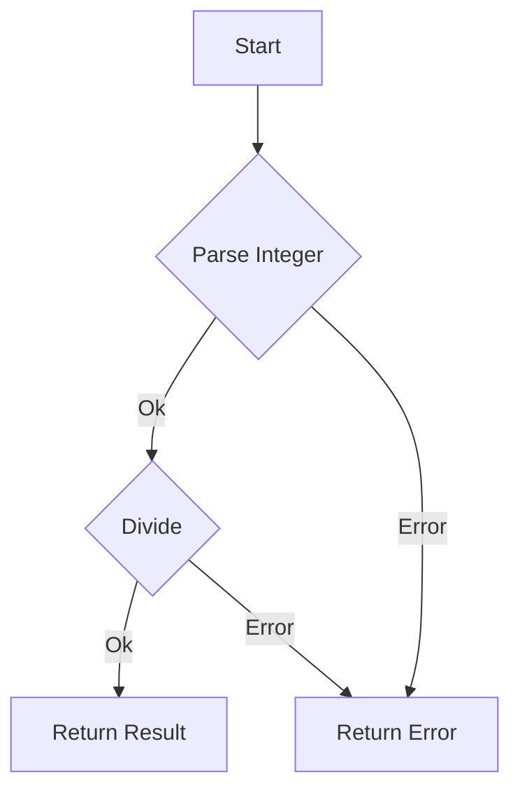

## 7.2.2 The `Result` Monad

In the realm of functional programming, handling errors effectively is crucial for building robust applications. The `Result` monad in F# provides a structured way to manage computations that can fail, encapsulating successful results or error information. This section will delve into the `Result` type, its monadic properties, and how it facilitates error handling in F#.

### Introducing the `Result` Type

The `Result` type in F# is a discriminated union that represents either a successful outcome (`Ok`) or an error (`Error`). This type is particularly useful for functions that can fail, as it allows you to return detailed error information rather than relying on exceptions.

```fsharp
type Result<'T, 'Error> =
    | Ok of 'T
    | Error of 'Error
```

- **`Ok`**: Represents a successful computation, containing a value of type `'T`.
- **`Error`**: Represents a failed computation, containing an error of type `'Error`.

This design encourages explicit error handling by forcing developers to consider both success and failure cases.

### The Power of Monads: Chaining Operations

Monads are a fundamental concept in functional programming that allow for the chaining of operations. The `Result` monad enables you to sequence computations that may fail, propagating errors without the need for cumbersome error-checking code.

#### Using `Result.bind` for Sequencing

`Result.bind` is a function that allows you to chain operations on `Result` values. It takes a function that returns a `Result` and applies it to an existing `Result`, propagating any errors along the way.

```fsharp
let bind (f: 'T -> Result<'U, 'Error>) (result: Result<'T, 'Error>) : Result<'U, 'Error> =
    match result with
    | Ok value -> f value
    | Error err -> Error err
```

**Example: Chaining Computations**

Let's consider a scenario where we have two functions: one that parses an integer from a string, and another that divides a number by a given divisor. Both operations can fail, and we'll use `Result.bind` to chain them together.

```fsharp
let parseInt (s: string) : Result<int, string> =
    match System.Int32.TryParse(s) with
    | (true, value) -> Ok value
    | (false, _) -> Error "Invalid integer"

let divide (dividend: int) (divisor: int) : Result<int, string> =
    if divisor = 0 then Error "Division by zero"
    else Ok (dividend / divisor)

let parseAndDivide (s: string) (divisor: int) : Result<int, string> =
    parseInt s |> Result.bind (fun value -> divide value divisor)

// Usage
let result = parseAndDivide "42" 2
```

In this example, `parseAndDivide` attempts to parse a string into an integer and then divide it by a given divisor. If any step fails, the error is propagated.

### Computation Expressions with `result { }`

F# provides computation expressions as a syntactic sugar to simplify working with monads. The `result { }` computation expression allows for clearer and more concise error handling with `Result`.

```fsharp
let parseAndDivideWithExpression (s: string) (divisor: int) : Result<int, string> =
    result {
        let! value = parseInt s
        return! divide value divisor
    }
```

In this example, `let!` is used to extract the value from a `Result`, and `return!` is used to return a `Result` from within the computation expression. This approach makes the code more readable and expressive.

### Benefits of Explicit Error Management

Using the `Result` monad for error handling offers several advantages over traditional exception-based approaches:

1. **Explicitness**: Errors are part of the function's type signature, making it clear which functions can fail.
2. **Type Safety**: The compiler ensures that all possible outcomes are handled, reducing runtime errors.
3. **Composability**: Functions returning `Result` can be easily composed, allowing for complex error-handling logic to be built from simple components.

### Practical Examples

#### File I/O Operations

File operations are prone to errors, such as file not found or access denied. Using `Result`, we can handle these errors gracefully.

```fsharp
let readFile (path: string) : Result<string, string> =
    try
        Ok (System.IO.File.ReadAllText(path))
    with
    | :? System.IO.FileNotFoundException -> Error "File not found"
    | :? System.UnauthorizedAccessException -> Error "Access denied"
```

#### Parsing Complex Data

When parsing data, errors can occur due to invalid formats. The `Result` monad allows us to handle these errors without exceptions.

```fsharp
type Person = { Name: string; Age: int }

let parsePerson (data: string) : Result<Person, string> =
    let parts = data.Split(',')
    if parts.Length <> 2 then Error "Invalid format"
    else
        let name = parts.[0].Trim()
        match System.Int32.TryParse(parts.[1].Trim()) with
        | (true, age) -> Ok { Name = name; Age = age }
        | (false, _) -> Error "Invalid age"
```

### Defining Meaningful Error Types

To make error handling more informative, define custom error types that provide detailed information about failures.

```fsharp
type FileError =
    | NotFound of string
    | AccessDenied of string
    | UnknownError of string

let readFileWithCustomError (path: string) : Result<string, FileError> =
    try
        Ok (System.IO.File.ReadAllText(path))
    with
    | :? System.IO.FileNotFoundException -> Error (NotFound path)
    | :? System.UnauthorizedAccessException -> Error (AccessDenied path)
    | ex -> Error (UnknownError ex.Message)
```

### Improving Code Reliability and Readability

By using the `Result` monad, we can improve the reliability and readability of our code:

- **Reliability**: Explicit error handling reduces the likelihood of unhandled exceptions.
- **Readability**: Computation expressions and `Result.bind` make error-handling logic clear and concise.

### Try It Yourself

To deepen your understanding, try modifying the examples provided:

1. **Extend the `parsePerson` function** to handle additional fields, such as email and phone number, and return appropriate error messages for invalid data.
2. **Implement a function** that reads a list of file paths and returns a list of `Result<string, FileError>` values, allowing you to see which files were read successfully and which failed.

### Visualizing the `Result` Monad

To better understand how the `Result` monad propagates errors, consider the following flowchart:



**Description**: This flowchart illustrates the process of parsing an integer and dividing it, with errors being propagated at each step.

### References and Further Reading

- [F# Documentation on Discriminated Unions](https://docs.microsoft.com/en-us/dotnet/fsharp/language-reference/discriminated-unions)
- [Understanding Monads in Functional Programming](https://www.fpcomplete.com/blog/2017/06/monads)
- [Computation Expressions in F#](https://docs.microsoft.com/en-us/dotnet/fsharp/language-reference/computation-expressions)

### Knowledge Check

- **Question**: What are the two cases of the `Result` type in F#?
- **Exercise**: Implement a `Result`-based function that performs a series of arithmetic operations, each of which can fail, and returns the final result or an error.

### Embrace the Journey

Remember, mastering the `Result` monad is just one step in your functional programming journey. As you continue to explore F#, you'll discover more powerful patterns and techniques that will enhance your ability to build reliable and maintainable applications. Keep experimenting, stay curious, and enjoy the journey!

## Quiz Time!



### What are the two cases of the `Result` type in F#?

- [x] `Ok` and `Error`
- [ ] `Success` and `Failure`
- [ ] `True` and `False`
- [ ] `Valid` and `Invalid`

> **Explanation:** The `Result` type in F# consists of two cases: `Ok` for successful results and `Error` for failures.


### What does `Result.bind` do?

- [x] Chains operations on `Result` values, propagating errors
- [ ] Converts a `Result` to an `Option`
- [ ] Throws an exception if the `Result` is `Error`
- [ ] Logs the error message

> **Explanation:** `Result.bind` allows chaining of operations on `Result` values, ensuring errors are propagated through the chain.


### How does the `result { }` computation expression help with error handling?

- [x] It provides a clearer and more concise syntax for chaining `Result` operations
- [ ] It automatically logs errors to a file
- [ ] It converts exceptions to `Result` values
- [ ] It makes all `Result` values `Ok`

> **Explanation:** The `result { }` computation expression simplifies error handling by providing a clear syntax for chaining operations on `Result` values.


### Why is explicit error management preferred over exceptions in functional programming?

- [x] It makes error handling explicit and part of the function's type signature
- [ ] It allows errors to be ignored
- [ ] It reduces the need for logging
- [ ] It makes the code run faster

> **Explanation:** Explicit error management makes errors part of the function's type signature, ensuring they are handled appropriately.


### What is a benefit of using custom error types with `Result`?

- [x] Provides detailed information about failures
- [ ] Makes the code shorter
- [ ] Automatically fixes errors
- [ ] Converts errors to warnings

> **Explanation:** Custom error types provide detailed information about failures, enhancing the clarity and usefulness of error messages.


### How can you improve the readability of error-handling code in F#?

- [x] Use computation expressions like `result { }`
- [ ] Use global variables
- [ ] Avoid handling errors
- [ ] Use exceptions instead of `Result`

> **Explanation:** Computation expressions like `result { }` improve readability by providing a clear and concise syntax for error handling.


### What is the purpose of the `Ok` case in the `Result` type?

- [x] To represent a successful computation
- [ ] To indicate an error occurred
- [ ] To log a message
- [ ] To throw an exception

> **Explanation:** The `Ok` case in the `Result` type represents a successful computation, containing the result value.


### What should you do if a function can fail in F#?

- [x] Return a `Result` type to encapsulate success or failure
- [ ] Throw an exception
- [ ] Return `null`
- [ ] Log the error and continue

> **Explanation:** If a function can fail, returning a `Result` type encapsulates both success and failure, allowing for explicit error handling.


### How does the `Error` case in `Result` improve code reliability?

- [x] By making errors explicit and ensuring they are handled
- [ ] By hiding errors from the user
- [ ] By automatically retrying failed operations
- [ ] By logging errors to a file

> **Explanation:** The `Error` case makes errors explicit, ensuring they are handled and improving code reliability.


### True or False: The `Result` monad can only be used for error handling in F#.

- [ ] True
- [x] False

> **Explanation:** False. While the `Result` monad is commonly used for error handling, it can also be used for other purposes where computations can have two possible outcomes.


