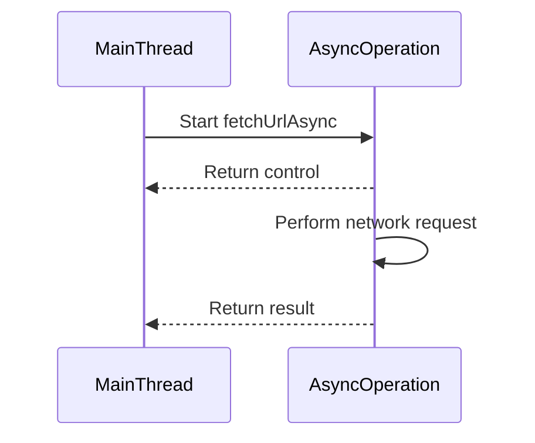

## 7.2.3 The `Async` Monad

In the realm of modern software development, asynchronous programming is a pivotal concept that enhances application performance and responsiveness. The `Async` monad in F# is a powerful tool that facilitates the composition of asynchronous operations, enabling developers to write non-blocking code that efficiently utilizes system resources. This section delves into the intricacies of the `Async` monad, exploring its structure, usage, and best practices.

### Understanding the `Async<'T>` Type

The `Async<'T>` type in F# represents an asynchronous computation that yields a result of type `'T`. It is a core component of F#'s asynchronous programming model, enabling developers to define computations that can be executed concurrently without blocking the main thread. By encapsulating asynchronous workflows, the `Async` monad provides a structured approach to handling operations that may take time to complete, such as I/O-bound tasks, network requests, or database queries.

#### Key Characteristics of `Async<'T>`

- **Non-blocking Execution**: `Async<'T>` allows computations to run without blocking the calling thread, making it ideal for I/O-bound operations.
- **Composability**: The `Async` monad supports the composition of multiple asynchronous operations, enabling complex workflows to be built from simpler components.
- **Error Handling**: Asynchronous workflows can include error handling mechanisms to manage exceptions gracefully.
- **Cancellation Support**: The `Async` monad provides built-in support for cancellation, allowing operations to be terminated if necessary.

### Composing Asynchronous Operations with the `Async` Monad

The `Async` monad enables the composition of asynchronous operations through a combination of computation expressions and monadic operations. This allows developers to build complex workflows by chaining together multiple asynchronous tasks.

#### Using `async { }` Computation Expressions

In F#, the `async { }` computation expression is used to define asynchronous workflows. Within this block, developers can use the `let!` syntax to bind the results of asynchronous operations, allowing for sequential execution of tasks.

```fsharp
open System.Net

let fetchUrlAsync (url: string) : Async<string> =
    async {
        let request = WebRequest.Create(url)
        use! response = request.AsyncGetResponse()
        use stream = response.GetResponseStream()
        use reader = new System.IO.StreamReader(stream)
        return! reader.ReadToEndAsync()
    }
```

In this example, `fetchUrlAsync` is an asynchronous function that fetches the content of a URL. The `let!` syntax is used to asynchronously bind the response and read the content without blocking the thread.

#### Chaining Asynchronous Operations with `Async.Bind` and `let!`

The `Async.Bind` function is a fundamental operation in the `Async` monad, enabling the chaining of asynchronous tasks. It allows developers to sequence operations, passing the result of one computation to the next.

```fsharp
let processUrlsAsync (urls: string list) : Async<unit> =
    urls
    |> List.map fetchUrlAsync
    |> Async.Parallel
    |> Async.Bind (fun results ->
        results
        |> Array.iter (printfn "Fetched content: %s")
        Async.Return ())
```

In this example, `Async.Parallel` is used to execute multiple URL fetch operations concurrently, and `Async.Bind` sequences the processing of the results.

#### Executing Asynchronous Workflows

Once an asynchronous workflow is defined, it can be executed using `Async.RunSynchronously` or `Async.Start`.

- **`Async.RunSynchronously`**: Executes the asynchronous computation and blocks the calling thread until the result is available. This is useful for testing or when synchronous behavior is required.

```fsharp
let content = fetchUrlAsync "http://example.com" |> Async.RunSynchronously
printfn "Content: %s" content
```

- **`Async.Start`**: Initiates the asynchronous computation without blocking the calling thread. This is ideal for fire-and-forget operations.

```fsharp
fetchUrlAsync "http://example.com" |> Async.Start
```

### Integration with .NET Tasks

F#'s `Async` monad can interoperate with .NET's `Task` and `ValueTask` types, providing flexibility in integrating with existing .NET libraries and frameworks.

#### Converting Between `Async` and `Task`

- **From `Async` to `Task`**: Use `Async.StartAsTask` to convert an `Async<'T>` computation to a `Task<'T>`.

```fsharp
let task = fetchUrlAsync "http://example.com" |> Async.StartAsTask
```

- **From `Task` to `Async`**: Use `Async.AwaitTask` to convert a `Task<'T>` to an `Async<'T>`.

```fsharp
open System.Threading.Tasks

let task = Task.Run(fun () -> "Hello, World!")
let asyncComputation = task |> Async.AwaitTask
```

### Best Practices for Error Handling and Cancellation

Handling errors and managing cancellation are crucial aspects of writing robust asynchronous code.

#### Error Handling in Asynchronous Workflows

Use `try...with` expressions within `async { }` blocks to catch and handle exceptions.

```fsharp
let safeFetchUrlAsync (url: string) : Async<string> =
    async {
        try
            return! fetchUrlAsync url
        with
        | ex -> return sprintf "Error: %s" ex.Message
    }
```

#### Cancellation Support

F# provides `Async.CancellationToken` to support cancellation in asynchronous workflows. Developers can pass a cancellation token to operations that support it.

```fsharp
let fetchWithCancellation (url: string) (token: System.Threading.CancellationToken) : Async<string> =
    async {
        let! result = fetchUrlAsync url |> Async.StartChild
        return! result
    }

let cts = new System.Threading.CancellationTokenSource()
let asyncOp = fetchWithCancellation "http://example.com" cts.Token
Async.Start(asyncOp, cancellationToken = cts.Token)
```

### Real-World Examples

#### Web Requests

Asynchronous programming is particularly useful for web requests, where network latency can cause significant delays.

```fsharp
let fetchMultipleUrlsAsync (urls: string list) : Async<unit> =
    urls
    |> List.map fetchUrlAsync
    |> Async.Parallel
    |> Async.Bind (fun contents ->
        contents
        |> Array.iter (printfn "Content: %s")
        Async.Return ())
```

#### Database Operations

Asynchronous operations can also be applied to database queries, improving application responsiveness.

```fsharp
let queryDatabaseAsync (query: string) : Async<seq<string>> =
    async {
        // Simulate a database query
        do! Async.Sleep 1000
        return seq { "Result1"; "Result2"; "Result3" }
    }

let processDatabaseResultsAsync () : Async<unit> =
    async {
        let! results = queryDatabaseAsync "SELECT * FROM table"
        results |> Seq.iter (printfn "Database result: %s")
    }
```

### Try It Yourself

To deepen your understanding of the `Async` monad, try modifying the examples provided:

- Change the URL in `fetchUrlAsync` to a different website and observe the output.
- Implement error handling in `fetchMultipleUrlsAsync` to manage failed requests.
- Experiment with cancellation by canceling an ongoing database query.

### Visualizing Asynchronous Workflows

To better understand how asynchronous operations are composed and executed, let's visualize the flow of an asynchronous workflow using a Mermaid.js sequence diagram.



**Diagram Description**: This sequence diagram illustrates the non-blocking nature of an asynchronous operation. The `MainThread` initiates the `AsyncOperation` and immediately regains control, allowing other tasks to proceed. Once the `AsyncOperation` completes, it returns the result to the `MainThread`.

### Conclusion

The `Async` monad in F# is a powerful construct for composing asynchronous operations, enabling developers to write efficient, non-blocking code. By leveraging computation expressions, monadic operations, and integration with .NET tasks, developers can build robust applications that handle complex workflows with ease. Remember to incorporate best practices for error handling and cancellation to ensure your asynchronous code is resilient and maintainable.

## Quiz Time!



### What is the primary purpose of the `Async<'T>` type in F#?

- [x] To represent asynchronous computations that yield a result of type `'T`.
- [ ] To execute synchronous computations in parallel.
- [ ] To handle exceptions in functional programming.
- [ ] To manage memory allocation in F#.

> **Explanation:** The `Async<'T>` type is used to represent asynchronous computations that yield a result of type `'T`, allowing for non-blocking execution.

### How can you define an asynchronous workflow in F#?

- [x] Using the `async { }` computation expression.
- [ ] By creating a new thread for each operation.
- [ ] Using the `task { }` computation expression.
- [ ] By implementing a custom monad.

> **Explanation:** Asynchronous workflows in F# are defined using the `async { }` computation expression, which allows for the composition of asynchronous operations.

### Which function is used to execute an asynchronous computation and block the calling thread until the result is available?

- [x] `Async.RunSynchronously`
- [ ] `Async.Start`
- [ ] `Async.Parallel`
- [ ] `Async.AwaitTask`

> **Explanation:** `Async.RunSynchronously` is used to execute an asynchronous computation and block the calling thread until the result is available.

### What is the role of `Async.Bind` in the `Async` monad?

- [x] To chain asynchronous operations by passing the result of one computation to the next.
- [ ] To handle errors in asynchronous workflows.
- [ ] To convert `Async<'T>` to `Task<'T>`.
- [ ] To start an asynchronous computation without blocking.

> **Explanation:** `Async.Bind` is used to chain asynchronous operations, allowing the result of one computation to be passed to the next.

### How can you convert an `Async<'T>` computation to a `Task<'T>`?

- [x] Using `Async.StartAsTask`.
- [ ] Using `Async.AwaitTask`.
- [ ] Using `Task.Run`.
- [ ] Using `Async.Parallel`.

> **Explanation:** `Async.StartAsTask` is used to convert an `Async<'T>` computation to a `Task<'T>`.

### Which syntax is used within an `async { }` block to bind the result of an asynchronous operation?

- [x] `let!`
- [ ] `let`
- [ ] `do!`
- [ ] `use!`

> **Explanation:** The `let!` syntax is used within an `async { }` block to bind the result of an asynchronous operation.

### What is the purpose of `Async.CancellationToken` in F#?

- [x] To support cancellation in asynchronous workflows.
- [ ] To handle errors in asynchronous operations.
- [ ] To convert `Task<'T>` to `Async<'T>`.
- [ ] To execute computations synchronously.

> **Explanation:** `Async.CancellationToken` is used to support cancellation in asynchronous workflows, allowing operations to be terminated if necessary.

### Which of the following is a best practice for error handling in asynchronous workflows?

- [x] Using `try...with` expressions within `async { }` blocks.
- [ ] Ignoring exceptions and allowing the program to crash.
- [ ] Using `Async.Parallel` to handle errors.
- [ ] Relying on the .NET garbage collector for error management.

> **Explanation:** Using `try...with` expressions within `async { }` blocks is a best practice for error handling in asynchronous workflows.

### How can you initiate an asynchronous computation without blocking the calling thread?

- [x] Using `Async.Start`.
- [ ] Using `Async.RunSynchronously`.
- [ ] Using `Async.AwaitTask`.
- [ ] Using `Async.Parallel`.

> **Explanation:** `Async.Start` is used to initiate an asynchronous computation without blocking the calling thread.

### True or False: The `Async` monad in F# can only be used for network-related operations.

- [ ] True
- [x] False

> **Explanation:** False. The `Async` monad in F# can be used for a wide range of asynchronous operations, not just network-related tasks.


