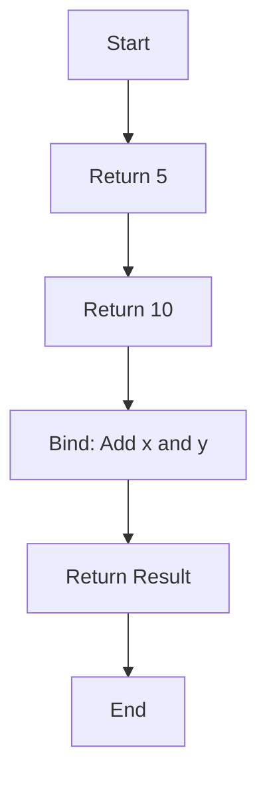

## 7.2.4 Custom Monads with Computation Expressions

In the world of functional programming, monads are powerful abstractions that allow us to handle computations in a structured way. F# provides a unique feature called computation expressions, which enables developers to define custom monads tailored to specific domain needs. In this section, we will explore how to create custom monads using computation expressions, providing you with the tools to craft domain-specific computation flows.

### Understanding Computation Expressions

Computation expressions in F# are a syntactic construct that allows you to define custom control flows. They are particularly useful for implementing monads, as they provide a way to encapsulate and sequence computations. Computation expressions are defined using a builder type, which specifies how computations are combined.

#### Key Components of Computation Expressions

To create a computation expression, you need to define a builder type with specific methods. The most essential methods are:

- **`Bind`**: This method is used to sequence computations. It takes a monadic value and a function, applies the function to the value, and returns a new monadic value.
- **`Return`**: This method wraps a value into the monad.
- **`ReturnFrom`**: This method is used to return a monadic value directly.
- **`Zero`**: This method provides a default value for the monad, often used in loops.
- **`Combine`**: This method is used to combine two computations.
- **`Delay`**: This method delays the execution of a computation until it is needed.

Let's delve into these components with an example.

### Creating a Custom Monad: The Logging Monad

To illustrate the creation of a custom monad, we will build a simple logging monad. This monad will allow us to perform computations while keeping a log of operations.

#### Step-by-Step Example

1. **Define the Monad Type**

   First, we define a type to represent our monad. This type will encapsulate a value and a log.

   ```fsharp
   type Log<'a> = Log of 'a * string list
   ```

2. **Create the Monad Operations**

   Next, we define the operations for our monad: `Return`, `Bind`, and `ReturnFrom`.

   ```fsharp
   module LogMonad =
       let return x = Log (x, [])

       let bind (Log (x, log)) f =
           let (Log (y, newLog)) = f x
           Log (y, log @ newLog)

       let returnFrom log = log
   ```

3. **Implement the Computation Expression Builder**

   Now, we create a builder type that implements the required methods.

   ```fsharp
   type LogBuilder() =
       member this.Bind(x, f) = LogMonad.bind x f
       member this.Return(x) = LogMonad.return x
       member this.ReturnFrom(x) = LogMonad.returnFrom x
   ```

4. **Use the Computation Expression**

   With the builder defined, we can now use our logging monad in a computation expression.

   ```fsharp
   let log = LogBuilder()

   let computation =
       log {
           let! x = LogMonad.return 5
           let! y = LogMonad.return 10
           return x + y
       }
   ```

   In this example, `computation` will result in a `Log` containing the sum of `x` and `y`, along with an empty log.

#### Visualizing the Monad Workflow

To better understand the flow of computations within our custom monad, let's visualize the process using a flowchart.



This flowchart illustrates how values are passed through the monad, with each step potentially modifying the log.

### Practical Applications of Custom Monads

Custom monads can greatly simplify complex workflows by encapsulating common patterns and side effects. For example, a logging monad can be used to track operations in a financial application, while a state monad can manage state transitions in a game.

#### Example: State Monad

Let's create a simple state monad to demonstrate another practical application.

1. **Define the State Monad Type**

   ```fsharp
   type State<'s, 'a> = State of ('s -> 'a * 's)
   ```

2. **Create the Monad Operations**

   ```fsharp
   module StateMonad =
       let return x = State (fun s -> (x, s))

       let bind (State f) g =
           State (fun s ->
               let (x, s') = f s
               let (State h) = g x
               h s'
           )
   ```

3. **Implement the Computation Expression Builder**

   ```fsharp
   type StateBuilder() =
       member this.Bind(x, f) = StateMonad.bind x f
       member this.Return(x) = StateMonad.return x
   ```

4. **Use the State Monad**

   ```fsharp
   let state = StateBuilder()

   let increment =
       state {
           let! x = StateMonad.return 1
           let! y = StateMonad.return 2
           return x + y
       }
   ```

   In this example, `increment` will result in a state transition that increments the state by the sum of `x` and `y`.

### Benefits and Pitfalls of Custom Monads

Custom monads can enhance code readability and maintainability by abstracting complex patterns. However, they can also introduce complexity if overused or poorly designed. Here are some best practices to consider:

- **Use Custom Monads Sparingly**: Only create custom monads when they provide significant benefits over existing solutions.
- **Leverage Existing Libraries**: Before creating a custom monad, check if an existing library meets your needs.
- **Keep Monads Simple**: Avoid adding unnecessary complexity to your monad implementations.

### Best Practices for Creating Custom Monads

When designing custom monads, consider the following guidelines:

- **Identify Common Patterns**: Look for repeated patterns in your code that can be encapsulated in a monad.
- **Ensure Composability**: Design your monads to work seamlessly with other monads and computation expressions.
- **Document Your Monads**: Provide clear documentation and examples to help others understand and use your monads effectively.

### Try It Yourself

To deepen your understanding of custom monads, try modifying the examples provided:

- **Extend the Logging Monad**: Add functionality to filter or format log messages.
- **Enhance the State Monad**: Implement additional operations, such as state inspection or modification.

### Conclusion

Custom monads with computation expressions offer a powerful way to encapsulate complex computation flows in F#. By understanding the key components and best practices, you can create monads that simplify your code and enhance its readability. Remember, the journey of mastering monads is ongoing. Keep experimenting, stay curious, and enjoy the process of crafting elegant solutions in F#.

## Quiz Time!



### What is the primary purpose of computation expressions in F#?

- [x] To define custom control flows and encapsulate computations.
- [ ] To replace all imperative programming constructs.
- [ ] To simplify syntax for basic arithmetic operations.
- [ ] To enforce strict typing in all computations.

> **Explanation:** Computation expressions allow for the definition of custom control flows, particularly useful for implementing monads.

### Which method in a computation expression builder is used to sequence computations?

- [x] Bind
- [ ] Return
- [ ] Zero
- [ ] Combine

> **Explanation:** The `Bind` method is used to sequence computations by applying a function to a monadic value and returning a new monadic value.

### What does the `Return` method do in a computation expression?

- [x] Wraps a value into the monad.
- [ ] Sequences computations.
- [ ] Provides a default value for the monad.
- [ ] Combines two computations.

> **Explanation:** The `Return` method is responsible for wrapping a value into the monad.

### In the logging monad example, what does the `Log` type encapsulate?

- [x] A value and a log of operations.
- [ ] Only a log of operations.
- [ ] Only a value.
- [ ] A sequence of computations.

> **Explanation:** The `Log` type encapsulates both a value and a log of operations performed.

### What is a potential pitfall of using custom monads?

- [x] Increased complexity if overused.
- [ ] Simplifying code readability.
- [ ] Enhancing maintainability.
- [ ] Improving performance.

> **Explanation:** While custom monads can simplify code, they can also increase complexity if overused or poorly designed.

### Which method in a computation expression builder is used to return a monadic value directly?

- [x] ReturnFrom
- [ ] Bind
- [ ] Return
- [ ] Zero

> **Explanation:** `ReturnFrom` is used to return a monadic value directly within a computation expression.

### What is a best practice when creating custom monads?

- [x] Ensure composability with other monads.
- [ ] Avoid using existing libraries.
- [ ] Add as much complexity as possible.
- [ ] Use them for every function.

> **Explanation:** Ensuring composability with other monads is a best practice to maintain flexibility and integration.

### How can custom monads enhance code?

- [x] By abstracting complex patterns and improving readability.
- [ ] By making code more verbose.
- [ ] By enforcing strict typing.
- [ ] By replacing all existing libraries.

> **Explanation:** Custom monads can abstract complex patterns, making code more readable and maintainable.

### What is the role of the `Zero` method in computation expressions?

- [x] Provides a default value for the monad.
- [ ] Sequences computations.
- [ ] Wraps a value into the monad.
- [ ] Combines two computations.

> **Explanation:** The `Zero` method provides a default value for the monad, often used in loops.

### True or False: Custom monads should be used for every computation in F#.

- [ ] True
- [x] False

> **Explanation:** Custom monads should be used judiciously, only when they provide significant benefits over existing solutions.


