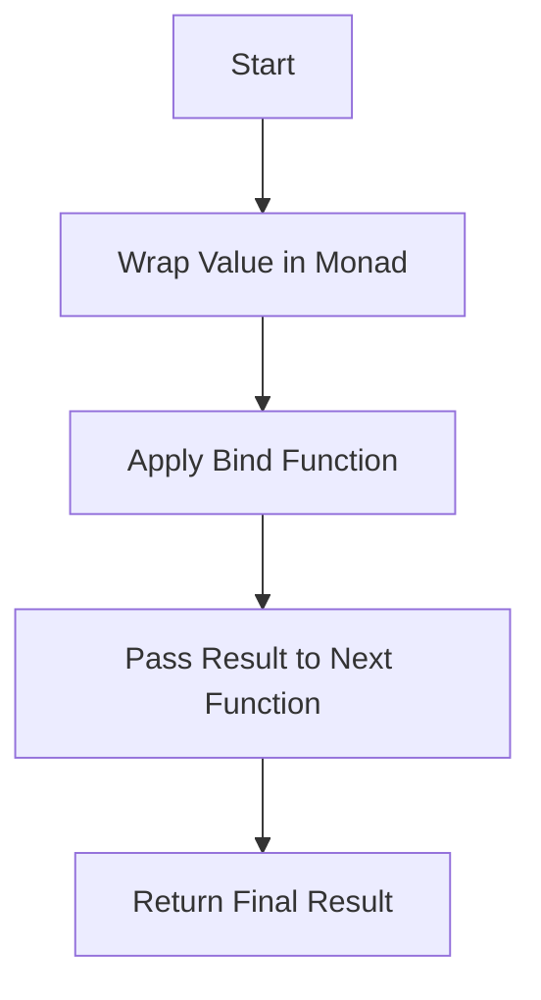

## 7.2 Monads in F#

Monads are a fundamental concept in functional programming, providing a powerful abstraction for handling computations, side effects, and control flow. In F#, monads are implemented using computation expressions, which allow developers to build complex workflows in a clear and concise manner. This guide will delve into the intricacies of monads, exploring their theoretical foundations, practical applications, and specific implementations in F#.

### Understanding Monads

Monads can be thought of as design patterns that encapsulate computation logic. They provide a way to chain operations together, handling intermediate values and side effects in a consistent manner. At their core, monads consist of three primary components:

1. **Type Constructor**: A monad is a type constructor that defines how to wrap a value into a monadic context.
2. **Bind Function**: This function, often represented as `bind` or `>>=`, chains operations together, passing the result of one computation as the input to the next.
3. **Return Function**: This function, often called `return` or `unit`, injects a value into the monadic context.

### Monad Laws

Monads must adhere to three laws that ensure their behavior is consistent and predictable:

1. **Left Identity**: Applying `return` to a value and then binding a function should be the same as applying the function directly.
   - `return a >>= f` is equivalent to `f a`.

2. **Right Identity**: Binding `return` to a monadic value should not change the value.
   - `m >>= return` is equivalent to `m`.

3. **Associativity**: The order of binding operations should not affect the outcome.
   - `(m >>= f) >>= g` is equivalent to `m >>= (\x -> f x >>= g)`.

### Monads in F#

In F#, monads are implemented using computation expressions, which provide a syntactic sugar for working with monadic types. Let's explore some common monads and their implementations in F#.

#### The `Option` Monad

The `Option` monad is used to represent computations that may fail or return no result. It encapsulates a value that may or may not be present, providing a way to handle optional values without resorting to null references.

```fsharp
type OptionBuilder() =
    member _.Bind(m, f) =
        match m with
        | Some x -> f x
        | None -> None

    member _.Return(x) = Some x

let option = OptionBuilder()

let divide x y =
    if y = 0 then None
    else Some (x / y)

let result =
    option {
        let! a = divide 10 2
        let! b = divide a 0
        return b
    }

// result is None
```

In this example, the `OptionBuilder` defines the `Bind` and `Return` methods, allowing us to use the `option` computation expression to chain operations that may return `None`.

#### The `Result` Monad

The `Result` monad is similar to the `Option` monad but provides additional information about the failure. It encapsulates a value that is either a success (`Ok`) or a failure (`Error`).

```fsharp
type ResultBuilder() =
    member _.Bind(m, f) =
        match m with
        | Ok x -> f x
        | Error e -> Error e

    member _.Return(x) = Ok x

let result = ResultBuilder()

let divide x y =
    if y = 0 then Error "Division by zero"
    else Ok (x / y)

let computation =
    result {
        let! a = divide 10 2
        let! b = divide a 0
        return b
    }

// computation is Error "Division by zero"
```

The `ResultBuilder` allows us to handle computations that may fail with an error message, making error handling more expressive.

#### The `Async` Monad

The `Async` monad is used for asynchronous computations, allowing us to perform non-blocking operations in a functional style.

```fsharp
let asyncComputation =
    async {
        let! data = async { return "Hello, world!" }
        return data.Length
    }

let result = Async.RunSynchronously asyncComputation
// result is 13
```

In this example, the `async` computation expression allows us to perform asynchronous operations, using `let!` to await the result of an asynchronous computation.

### Combining Monads

Monads can be combined to create more complex workflows. However, combining different monads can be challenging due to their differing structures. One common approach is to use monad transformers, which allow us to stack monads and work with their combined effects.

#### Monad Transformers

While F# does not have built-in support for monad transformers, we can manually implement them to combine monads. Let's explore a simple example of combining the `Option` and `Async` monads.

```fsharp
let asyncOption =
    async {
        let! result = async { return Some 42 }
        match result with
        | Some value -> return Some (value * 2)
        | None -> return None
    }

let finalResult = Async.RunSynchronously asyncOption
// finalResult is Some 84
```

In this example, we manually handle the `Option` monad within an `Async` computation, allowing us to work with both monads simultaneously.

### Visualizing Monad Operations

To better understand how monads work, let's visualize the flow of operations within a monadic computation.



This diagram illustrates the typical flow of a monadic computation, starting with wrapping a value in a monad, applying the bind function to chain operations, and returning the final result.

### Practical Applications of Monads

Monads are not just theoretical constructs; they have practical applications in real-world software development. Let's explore some common use cases for monads in F#.

#### Error Handling

Monads like `Option` and `Result` provide a structured way to handle errors and optional values, reducing the need for error-prone null checks and exception handling.

#### Asynchronous Programming

The `Async` monad allows developers to write non-blocking code in a declarative style, making it easier to manage asynchronous operations and improve application performance.

#### State Management

Monads can be used to manage state in a functional way, encapsulating state transitions and side effects within a monadic context.

### Try It Yourself

Experiment with the code examples provided in this guide. Try modifying the computations to see how different monads handle various scenarios. For example, change the divisor in the `divide` function to see how the `Option` and `Result` monads handle division by zero.

### Further Reading

For more information on monads and their applications, consider exploring the following resources:

- [Learn You a Haskell for Great Good!](http://learnyouahaskell.com/monads) - A beginner-friendly introduction to monads in Haskell.
- [F# for Fun and Profit](https://fsharpforfunandprofit.com/posts/monads/) - A comprehensive guide to monads in F#.

### Knowledge Check

Before moving on, take a moment to review the key concepts covered in this guide. Ensure you understand the role of monads in functional programming, how they are implemented in F#, and their practical applications.

## Quiz Time!



### What is the primary purpose of a monad in functional programming?

- [x] To encapsulate computations and control flow
- [ ] To provide object-oriented inheritance
- [ ] To define data structures
- [ ] To perform mathematical calculations

> **Explanation:** Monads encapsulate computations and control flow, allowing developers to chain operations and handle side effects in a consistent manner.

### Which function is used to chain operations in a monad?

- [ ] return
- [x] bind
- [ ] map
- [ ] filter

> **Explanation:** The `bind` function is used to chain operations in a monad, passing the result of one computation as the input to the next.

### What does the `Option` monad represent?

- [ ] A successful computation
- [x] A computation that may fail or return no result
- [ ] An asynchronous operation
- [ ] A mathematical function

> **Explanation:** The `Option` monad represents a computation that may fail or return no result, encapsulating a value that may or may not be present.

### How does the `Result` monad differ from the `Option` monad?

- [x] It provides additional information about the failure
- [ ] It handles asynchronous operations
- [ ] It supports object-oriented inheritance
- [ ] It is used for mathematical calculations

> **Explanation:** The `Result` monad provides additional information about the failure, encapsulating a value that is either a success (`Ok`) or a failure (`Error`).

### What is the purpose of the `Async` monad?

- [ ] To handle optional values
- [x] To perform non-blocking operations
- [ ] To manage state transitions
- [ ] To define data structures

> **Explanation:** The `Async` monad is used for asynchronous computations, allowing developers to perform non-blocking operations in a functional style.

### Which of the following is a monad law?

- [x] Left Identity
- [ ] Right Inheritance
- [ ] Associative Property
- [ ] Commutative Law

> **Explanation:** Left Identity is one of the monad laws, ensuring that applying `return` to a value and then binding a function is the same as applying the function directly.

### What is a common challenge when combining different monads?

- [ ] Lack of type safety
- [x] Differing structures of monads
- [ ] Limited computational power
- [ ] Inability to handle side effects

> **Explanation:** Combining different monads can be challenging due to their differing structures, which may require the use of monad transformers.

### What is a practical application of monads in F#?

- [x] Error handling
- [ ] Object-oriented programming
- [ ] Mathematical calculations
- [ ] Data serialization

> **Explanation:** Monads like `Option` and `Result` provide a structured way to handle errors and optional values, reducing the need for error-prone null checks and exception handling.

### What is the role of the `return` function in a monad?

- [x] To inject a value into the monadic context
- [ ] To chain operations together
- [ ] To handle side effects
- [ ] To perform mathematical calculations

> **Explanation:** The `return` function injects a value into the monadic context, allowing it to be used in subsequent computations.

### True or False: Monads are only applicable in functional programming languages.

- [ ] True
- [x] False

> **Explanation:** While monads are a fundamental concept in functional programming, they can be applied in other programming paradigms as well, providing a powerful abstraction for handling computations and side effects.



Remember, this is just the beginning. As you progress, you'll build more complex and interactive applications using monads in F#. Keep experimenting, stay curious, and enjoy the journey!
