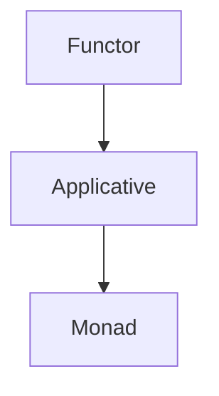

## 7.3 Functors and Applicatives

In the realm of functional programming, functors and applicatives are powerful abstractions that allow us to apply functions within computational contexts. These concepts enable more general and powerful function composition, which is a cornerstone of writing clean, efficient, and maintainable code. In this section, we will delve into the intricacies of functors and applicatives in F#, exploring their definitions, operations, and practical applications.

### Understanding Functors

**Definition**: A functor is a type that can be mapped over. In F#, functors are types that implement the `map` operation, allowing us to apply a function to values wrapped in a context.

#### The `map` Operation

The `map` operation is central to the concept of functors. It allows us to transform the contents of a functor without altering its structure. In F#, several types like `Option`, `List`, and `Async` can be treated as functors.

**Example with `Option`:**

```fsharp
let optionValue = Some 5
let incrementedOption = Option.map ((+) 1) optionValue
// incrementedOption is Some 6
```

**Example with `List`:**

```fsharp
let numbers = [1; 2; 3]
let incrementedNumbers = List.map ((+) 1) numbers
// incrementedNumbers is [2; 3; 4]
```

**Example with `Async`:**

```fsharp
let asyncValue = async { return 5 }
let incrementedAsync = Async.map ((+) 1) asyncValue
// incrementedAsync will eventually compute to 6
```

#### Applying Functions to Values in Context

Functors allow us to apply a function to values that are wrapped in a context, such as an `Option` or a `List`. This abstraction is powerful because it lets us work with values in a uniform way, regardless of their context.

### Introducing Applicatives

**Definition**: Applicatives extend functors by introducing the `apply` operation. This operation allows us to apply a function that is itself wrapped in a context to a value wrapped in a context.

#### The `apply` Operation

The `apply` operation is what distinguishes applicatives from functors. It allows for function application within a context, which is crucial for combining multiple independent computations.

**Example with `Option`:**

```fsharp
let someFunction = Some ((+) 1)
let someValue = Some 5
let result = Option.apply someFunction someValue
// result is Some 6
```

**Example with `List`:**

```fsharp
let functions = [(+) 1; (*) 2]
let values = [1; 2; 3]
let results = List.apply functions values
// results is [2; 3; 4; 2; 4; 6]
```

### Comparing Functors, Applicatives, and Monads

While functors and applicatives are powerful, they are often compared to monads, another fundamental concept in functional programming. Here's how they differ:

- **Functors**: Allow mapping a function over a wrapped value.
- **Applicatives**: Extend functors by allowing functions wrapped in a context to be applied to values wrapped in a context.
- **Monads**: Extend applicatives by allowing chaining of operations that produce wrapped values.

**Visualizing Relationships:**



### Practical Applications of Applicatives

Applicatives are particularly useful in scenarios where we need to compose independent computations. Here are some practical applications:

#### Form Validation

When validating forms, each field can be validated independently, and applicatives allow us to combine these validations seamlessly.

**Example:**

```fsharp
type ValidationResult<'a> = 
    | Success of 'a
    | Failure of string list

let validateName name =
    if String.IsNullOrWhiteSpace(name) then Failure ["Name cannot be empty"]
    else Success name

let validateAge age =
    if age < 0 then Failure ["Age cannot be negative"]
    else Success age

let combineValidations name age =
    let createPerson n a = (n, a)
    ValidationResult.apply (ValidationResult.map createPerson (validateName name)) (validateAge age)
```

#### Parallel Computations

Applicatives can be used to run computations in parallel, combining their results once all computations are complete.

**Example:**

```fsharp
let asyncAdd x y = async { return x + y }
let asyncMultiply x y = async { return x * y }

let combinedAsync = 
    Async.apply (Async.map asyncAdd (async { return 5 })) (async { return 10 })
// combinedAsync will eventually compute to 15
```

### Idiomatic Usage of Functors and Applicatives

When using functors and applicatives in F#, it's important to write idiomatic code that leverages these abstractions effectively. Here are some tips:

- **Use `map` for simple transformations**: When you need to apply a function to a wrapped value, use `map`.
- **Use `apply` for combining computations**: When you have multiple computations that need to be combined, use `apply`.
- **Favor composability**: Design your functions to be easily composable, taking advantage of F#'s functional features.

### When to Use Functors and Applicatives

Choosing between functors and applicatives depends on the problem you're solving:

- **Use functors** when you need to transform a single wrapped value.
- **Use applicatives** when you need to combine multiple independent computations.

### Try It Yourself

To deepen your understanding, try modifying the code examples provided:

- **Experiment with different types**: Try using `map` and `apply` with other types, such as `Result` or custom types.
- **Create your own applicative**: Implement an applicative for a custom type and use it in a practical example.

### Conclusion

Functors and applicatives are essential tools in the functional programmer's toolkit. By understanding and applying these abstractions, we can write more general, powerful, and maintainable code. Remember, this is just the beginning. As you progress, you'll find more opportunities to leverage these concepts in your F# projects. Keep experimenting, stay curious, and enjoy the journey!

## Quiz Time!



### What is a functor in F#?

- [x] A type that can be mapped over using the `map` operation.
- [ ] A type that can be applied using the `apply` operation.
- [ ] A type that allows chaining operations with `bind`.
- [ ] A type that represents asynchronous computations.

> **Explanation:** A functor is a type that can be mapped over using the `map` operation, allowing us to apply a function to values wrapped in a context.

### What operation distinguishes applicatives from functors?

- [ ] `map`
- [x] `apply`
- [ ] `bind`
- [ ] `return`

> **Explanation:** The `apply` operation distinguishes applicatives from functors, allowing functions wrapped in a context to be applied to values wrapped in a context.

### In F#, which of the following types can be treated as functors?

- [x] `Option`
- [x] `List`
- [x] `Async`
- [ ] `Tuple`

> **Explanation:** `Option`, `List`, and `Async` can be treated as functors in F#, as they support the `map` operation.

### How do applicatives enable the composition of independent computations?

- [x] By allowing functions wrapped in a context to be applied to values wrapped in a context.
- [ ] By allowing chaining of operations that produce wrapped values.
- [ ] By allowing mapping of a function over a wrapped value.
- [ ] By allowing asynchronous computations to run in parallel.

> **Explanation:** Applicatives enable the composition of independent computations by allowing functions wrapped in a context to be applied to values wrapped in a context.

### Which of the following is a practical application of applicatives?

- [x] Form validation
- [x] Parallel computations
- [ ] State management
- [ ] Event handling

> **Explanation:** Applicatives are useful for form validation and parallel computations, as they allow combining independent computations.

### What is the primary use of the `map` operation in functors?

- [x] To transform the contents of a functor without altering its structure.
- [ ] To apply a function that is itself wrapped in a context.
- [ ] To chain operations that produce wrapped values.
- [ ] To handle asynchronous computations.

> **Explanation:** The `map` operation is used to transform the contents of a functor without altering its structure.

### How do functors differ from monads?

- [x] Functors allow mapping a function over a wrapped value, while monads allow chaining operations that produce wrapped values.
- [ ] Functors allow chaining operations that produce wrapped values, while monads allow mapping a function over a wrapped value.
- [ ] Functors allow applying functions wrapped in a context, while monads allow mapping a function over a wrapped value.
- [ ] Functors allow handling asynchronous computations, while monads allow mapping a function over a wrapped value.

> **Explanation:** Functors allow mapping a function over a wrapped value, while monads allow chaining operations that produce wrapped values.

### Which operation is used to combine multiple independent computations in applicatives?

- [ ] `map`
- [x] `apply`
- [ ] `bind`
- [ ] `return`

> **Explanation:** The `apply` operation is used to combine multiple independent computations in applicatives.

### What is the result of applying `Option.apply (Some ((+) 1)) (Some 5)` in F#?

- [x] `Some 6`
- [ ] `Some 5`
- [ ] `None`
- [ ] `Some 1`

> **Explanation:** The result of applying `Option.apply (Some ((+) 1)) (Some 5)` is `Some 6`, as the function `((+) 1)` is applied to the value `5`.

### True or False: Applicatives can be used to run computations in parallel.

- [x] True
- [ ] False

> **Explanation:** True. Applicatives can be used to run computations in parallel, combining their results once all computations are complete.


