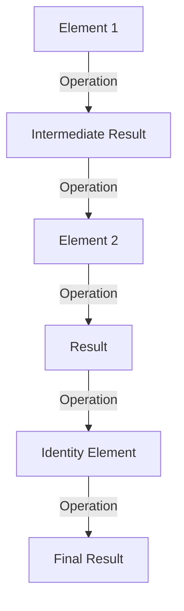

## 7.4 Monoid Pattern

In the world of functional programming, the Monoid Pattern stands out as a powerful abstraction that simplifies the process of combining elements. By leveraging associative operations and identity elements, monoids enable developers to write clean, efficient, and parallelizable code. In this section, we'll explore the mathematical concept of monoids, delve into their laws, and demonstrate their practical applications in F#.

### Understanding Monoids

A **monoid** is a mathematical structure that consists of a set equipped with an associative binary operation and an identity element. This concept is not only foundational in abstract algebra but also incredibly useful in programming, particularly in functional languages like F#.

#### The Three Monoid Laws

1. **Closure**: For a set to be a monoid, the result of the binary operation on any two elements of the set must also be an element of the set. In F#, this means that if you have a function `f` and elements `a` and `b`, then `f(a, b)` should also be an element of the same type.

2. **Associativity**: The binary operation must be associative. This means that the grouping of operations does not affect the result. Mathematically, for any elements `a`, `b`, and `c`, the equation `(a * b) * c = a * (b * c)` must hold true.

3. **Identity Element**: There must be an identity element in the set such that when combined with any element of the set using the binary operation, it returns the original element. For example, in addition, the identity element is `0` because `a + 0 = a`.

### Examples of Monoids in F#

Let's explore some common examples of monoids in F# to solidify our understanding.

#### Numbers with Addition

Consider the set of integers with addition as the binary operation. The identity element here is `0`.

```fsharp
let add x y = x + y
let zero = 0

// Demonstrating monoid laws
let example1 = add (add 1 2) 3 // (1 + 2) + 3
let example2 = add 1 (add 2 3) // 1 + (2 + 3)

printfn "Associativity: %b" (example1 = example2) // True
printfn "Identity: %b" (add 5 zero = 5) // True
```

#### Strings with Concatenation

Strings form a monoid with concatenation as the operation and the empty string `""` as the identity element.

```fsharp
let concat x y = x + y
let emptyString = ""

// Demonstrating monoid laws
let example3 = concat (concat "Hello, " "World") "!"
let example4 = concat "Hello, " (concat "World" "!")

printfn "Associativity: %b" (example3 = example4) // True
printfn "Identity: %b" (concat "F#" emptyString = "F#") // True
```

### Using Monoids in Folding and Reducing Collections

Monoids are particularly useful in operations like folding and reducing collections, where you combine elements of a collection into a single result.

#### Folding with Monoids

In F#, the `List.fold` function can be used to reduce a list using a monoid.

```fsharp
let sumList = List.fold add zero [1; 2; 3; 4; 5]
printfn "Sum of list: %d" sumList // 15

let concatList = List.fold concat emptyString ["Functional"; " "; "Programming"]
printfn "Concatenated string: %s" concatList // "Functional Programming"
```

### Implementing Custom Monoids

While numbers and strings are straightforward examples, monoids can be implemented for more complex data types.

#### Custom Monoid for Complex Data Types

Let's create a custom monoid for a record type representing a configuration.

```fsharp
type Config = { MaxConnections: int; Timeout: int }

let combineConfig c1 c2 = 
    { MaxConnections = c1.MaxConnections + c2.MaxConnections
      Timeout = max c1.Timeout c2.Timeout }

let emptyConfig = { MaxConnections = 0; Timeout = 0 }

// Demonstrating monoid laws
let config1 = { MaxConnections = 10; Timeout = 30 }
let config2 = { MaxConnections = 5; Timeout = 20 }

let combinedConfig = combineConfig config1 config2
printfn "Combined Config: %A" combinedConfig // { MaxConnections = 15; Timeout = 30 }
```

### Monoids in Parallel and Distributed Computations

One of the most compelling uses of monoids is in parallel and distributed computing. The associative property allows us to split computations into smaller parts, process them in parallel, and then combine the results.

#### Parallel Aggregation

Consider aggregating logs from multiple sources. Each log entry can be treated as a string, and the log aggregation can be performed using string concatenation, a monoidal operation.

```fsharp
open System.Threading.Tasks

let logs = ["Log1: Start"; "Log2: Process"; "Log3: End"]

let aggregateLogs logs = 
    logs
    |> List.map (fun log -> Task.Run(fun () -> log))
    |> Task.WhenAll
    |> Task.Result
    |> Array.fold concat emptyString

printfn "Aggregated Logs: %s" (aggregateLogs logs)
```

### Benefits of Monoidal Thinking

Monoidal thinking encourages developers to recognize opportunities for composability and parallelism in their code. By identifying monoidal structures, we can write code that is not only cleaner and more efficient but also easier to reason about and maintain.

#### Best Practices for Recognizing and Applying Monoids

- **Identify Associative Operations**: Look for operations in your code that are associative and have an identity element. These are candidates for monoidal abstraction.
- **Leverage Folding and Reducing**: Use monoids to simplify folding and reducing operations in collections.
- **Parallelize with Confidence**: Utilize the associative property of monoids to safely parallelize computations.
- **Compose Complex Data Types**: Implement custom monoids for complex data types to facilitate composition and aggregation.

### Try It Yourself

To solidify your understanding, try modifying the code examples above. For instance, create a custom monoid for a different data type, such as a list of errors or warnings, and implement a function to aggregate them.

### Visualizing Monoid Operations

Let's visualize the monoid operation using a simple flowchart to understand how elements are combined.



**Diagram Description**: This flowchart represents the process of combining elements using a monoidal operation. The identity element ensures that the final result remains unchanged when combined.

### Knowledge Check

Before we conclude, let's reinforce what we've learned with a few questions:

1. What are the three laws that define a monoid?
2. How can monoids be used to simplify folding operations?
3. Why is the associative property important in parallel computations?

### Embrace the Journey

Remember, understanding monoids is just the beginning. As you continue to explore functional programming, you'll discover even more powerful abstractions that will enhance your ability to write clean, efficient, and scalable code. Keep experimenting, stay curious, and enjoy the journey!

## Quiz Time!



### What is a monoid?

- [x] A set with an associative binary operation and an identity element
- [ ] A set with a commutative binary operation
- [ ] A set with a distributive binary operation
- [ ] A set with a unary operation

> **Explanation:** A monoid is defined by having an associative binary operation and an identity element.

### Which of the following is an example of a monoid in F#?

- [x] Integers with addition
- [ ] Integers with subtraction
- [ ] Integers with division
- [ ] Integers with multiplication

> **Explanation:** Integers with addition form a monoid, where the identity element is 0.

### What is the identity element for string concatenation in F#?

- [x] ""
- [ ] " "
- [ ] null
- [ ] None

> **Explanation:** The identity element for string concatenation is the empty string "".

### Which property allows monoids to be used in parallel computations?

- [x] Associativity
- [ ] Commutativity
- [ ] Distributivity
- [ ] Idempotence

> **Explanation:** Associativity allows for operations to be grouped in any order, enabling parallel computations.

### What is the result of folding a list of numbers using a monoid with addition?

- [x] The sum of all numbers
- [ ] The product of all numbers
- [ ] The difference of all numbers
- [ ] The quotient of all numbers

> **Explanation:** Folding a list of numbers with addition results in their sum.

### How can custom monoids be beneficial in programming?

- [x] They allow for composability and aggregation of complex data types
- [ ] They make code less readable
- [ ] They increase the complexity of simple operations
- [ ] They reduce the need for functions

> **Explanation:** Custom monoids facilitate composability and aggregation, making code more modular and maintainable.

### What is the role of the identity element in a monoid?

- [x] It leaves other elements unchanged when combined
- [ ] It changes the type of the elements
- [ ] It reverses the elements
- [ ] It duplicates the elements

> **Explanation:** The identity element leaves other elements unchanged when combined with them.

### Why is recognizing monoidal structures important?

- [x] It helps in writing clean and efficient code
- [ ] It complicates the codebase
- [ ] It is only useful in mathematical computations
- [ ] It is not important in real-world applications

> **Explanation:** Recognizing monoidal structures helps in writing clean, efficient, and maintainable code.

### What does the closure property of a monoid ensure?

- [x] The result of the operation is always within the set
- [ ] The operation is commutative
- [ ] The operation is distributive
- [ ] The operation is idempotent

> **Explanation:** Closure ensures that the result of the operation is always an element of the set.

### True or False: Monoids can only be applied to simple data types like numbers and strings.

- [ ] True
- [x] False

> **Explanation:** Monoids can be applied to complex data types as well, allowing for composability and aggregation.


