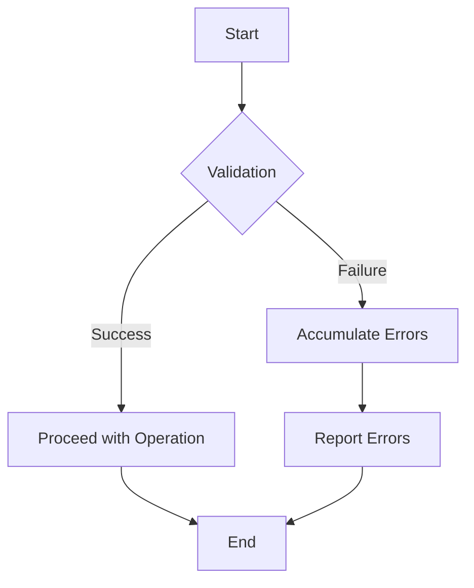

## 7.7 Advanced Error Handling Patterns

In the realm of software development, error handling is a critical aspect that can significantly influence the robustness and user experience of an application. In F#, a functional-first language, error handling patterns are often approached differently than in imperative languages. This section delves into advanced error handling patterns, focusing on the Validation applicative pattern to manage and aggregate multiple errors effectively.

### Understanding the Limitations of Simple Error Handling with `Result` Types

The `Result` type in F# is a powerful tool for handling errors in a functional way. It represents a computation that can either succeed with a value (`Ok`) or fail with an error (`Error`). Here's a simple example:

```fsharp
type Result<'T, 'E> = 
    | Ok of 'T
    | Error of 'E

let divide x y =
    if y = 0 then Error "Division by zero"
    else Ok (x / y)
```

While `Result` is effective for handling single errors in a fail-fast manner, it has limitations when dealing with multiple errors simultaneously. For instance, in scenarios like form validation, where you want to collect all errors before reporting them to the user, `Result` falls short because it stops at the first encountered error.

### Introducing the Validation Applicative Pattern

The Validation applicative pattern is designed to address the limitations of `Result` by allowing the accumulation of multiple errors. Unlike `Result`, which is monadic and thus inherently sequential, the Validation pattern is applicative, enabling parallel error accumulation.

#### Differences Between `Result` and `Validation`

- **Result (Fail-Fast):** Stops processing at the first error encountered. Suitable for operations where subsequent computations depend on the success of previous ones.
- **Validation (Error Accumulation):** Continues processing to accumulate all errors. Ideal for scenarios like form validation, where you want to provide comprehensive feedback.

### Implementing the Validation Pattern in F#

To implement the Validation pattern, we can use libraries like Chessie, which provides a robust framework for handling validations. Chessie extends the basic `Result` type to support error accumulation.

#### Example with Chessie

First, let's define a simple validation function using Chessie:

```fsharp
open Chessie.ErrorHandling

type ValidationError = string

let validateNonEmpty fieldName value =
    if String.IsNullOrWhiteSpace(value) then
        fail (sprintf "%s cannot be empty" fieldName)
    else
        ok value

let validateEmail email =
    if email.Contains("@") then
        ok email
    else
        fail "Invalid email format"

let validateUser name email =
    trial {
        let! validatedName = validateNonEmpty "Name" name
        let! validatedEmail = validateEmail email
        return (validatedName, validatedEmail)
    }
```

In this example, `validateNonEmpty` and `validateEmail` are validation functions that return a `Result` type. The `trial` computation expression provided by Chessie allows us to accumulate errors from both validations.

### Applying Functions Over Validated Data Using Applicative Style

The power of the Validation pattern lies in its ability to apply functions over validated data in an applicative style. This means you can combine multiple validations and apply a function to the results if all validations succeed.

#### Example of Applicative Style

```fsharp
let createUser name email =
    let nameValidation = validateNonEmpty "Name" name
    let emailValidation = validateEmail email

    let userCreation = 
        (fun n e -> (n, e)) <!> nameValidation <*> emailValidation

    match userCreation with
    | Ok user -> printfn "User created: %A" user
    | Bad errors -> printfn "Errors: %A" errors
```

In this example, the `<*!>` and `<*>` operators are used to apply the `createUser` function over the validated name and email. If both validations succeed, the function is applied, and a user is created. If any validation fails, errors are accumulated and reported.

### Practical Use Cases for Validation Pattern

The Validation pattern is particularly useful in scenarios where multiple errors need to be reported, such as:

- **Form Validation:** Ensure all fields are validated and report all errors at once.
- **Configuration Validation:** Validate multiple configuration settings and accumulate errors.
- **Data Processing Pipelines:** Validate data at various stages and accumulate errors for comprehensive reporting.

### Integrating Validation Pattern with Existing Error Handling Strategies

Integrating the Validation pattern with existing error handling strategies involves understanding when to use fail-fast (`Result`) versus error accumulation (`Validation`). A common approach is to use `Result` for operations where subsequent computations depend on previous successes and `Validation` for scenarios requiring comprehensive error reporting.

### Importance of Clear and Comprehensive Error Messages

Providing clear and comprehensive error messages is crucial for user experience and debugging. When using the Validation pattern, ensure that error messages are:

- **Descriptive:** Clearly describe what went wrong.
- **Actionable:** Provide guidance on how to fix the issue.
- **Contextual:** Include relevant context to help users understand the error.

### Best Practices for Implementing and Managing Validations

- **Modularize Validation Logic:** Break down validation logic into small, reusable functions.
- **Use Libraries:** Leverage libraries like Chessie for robust validation handling.
- **Test Validations Thoroughly:** Ensure validations are tested with various inputs to catch edge cases.
- **Document Validation Rules:** Clearly document validation rules for maintainability and transparency.

### Try It Yourself

To deepen your understanding, try modifying the code examples above:

- Add additional validation rules, such as checking for a minimum length for the name.
- Experiment with different error messages and see how they affect user feedback.
- Implement a validation scenario for a complex form with multiple fields.

### Visualizing Error Handling Patterns

To better understand the flow of error handling in F#, let's visualize the process using a flowchart.



**Figure 1:** Flowchart illustrating the error handling process using the Validation pattern.

### Knowledge Check

- What are the key differences between `Result` and `Validation` patterns?
- How does the Validation pattern enhance error handling in scenarios like form validation?
- Why is it important to provide clear and comprehensive error messages?

### Embrace the Journey

Remember, mastering error handling patterns is a journey. As you progress, you'll build more robust and user-friendly applications. Keep experimenting, stay curious, and enjoy the journey!

## Quiz Time!



### What is a key limitation of using `Result` types for error handling in F#?

- [x] It stops processing at the first error encountered.
- [ ] It cannot represent successful computations.
- [ ] It is not compatible with functional programming.
- [ ] It requires external libraries to function.

> **Explanation:** The `Result` type is a fail-fast mechanism, which stops processing at the first error, making it unsuitable for scenarios where multiple errors need to be accumulated.

### How does the Validation applicative pattern differ from the `Result` pattern?

- [x] It accumulates multiple errors instead of stopping at the first.
- [ ] It only handles successful computations.
- [ ] It is not used in functional programming.
- [ ] It requires imperative programming constructs.

> **Explanation:** The Validation pattern allows for the accumulation of multiple errors, unlike the `Result` pattern, which stops at the first error encountered.

### Which library is commonly used in F# for implementing the Validation pattern?

- [x] Chessie
- [ ] Newtonsoft.Json
- [ ] Entity Framework
- [ ] Dapper

> **Explanation:** Chessie is a library in F# that provides support for the Validation pattern, allowing for error accumulation.

### What is the purpose of using the `<*!>` and `<*>` operators in the Validation pattern?

- [x] To apply functions over validated data in an applicative style.
- [ ] To perform imperative operations.
- [ ] To handle asynchronous computations.
- [ ] To manage stateful operations.

> **Explanation:** The `<*!>` and `<*>` operators are used to apply functions over validated data in an applicative style, enabling parallel error accumulation.

### In what scenario is the Validation pattern particularly useful?

- [x] Form validation where multiple errors need to be reported.
- [ ] Single-step computations.
- [ ] Operations that require immediate termination on error.
- [ ] Simple arithmetic calculations.

> **Explanation:** The Validation pattern is useful in scenarios like form validation, where multiple errors need to be reported simultaneously.

### Why is it important to provide clear and comprehensive error messages?

- [x] To enhance user experience and facilitate debugging.
- [ ] To increase code complexity.
- [ ] To make errors harder to understand.
- [ ] To discourage user feedback.

> **Explanation:** Clear and comprehensive error messages improve user experience and make it easier to debug issues.

### What is a best practice for implementing validations in code?

- [x] Modularize validation logic into small, reusable functions.
- [ ] Write all validation logic in a single function.
- [ ] Avoid using libraries for validation.
- [ ] Ignore edge cases in validation.

> **Explanation:** Modularizing validation logic into small, reusable functions enhances maintainability and reusability.

### What is the role of the `trial` computation expression in Chessie?

- [x] To accumulate errors from multiple validations.
- [ ] To handle asynchronous computations.
- [ ] To manage stateful operations.
- [ ] To perform imperative operations.

> **Explanation:** The `trial` computation expression in Chessie is used to accumulate errors from multiple validations.

### What is a practical use case for the Validation pattern?

- [x] Configuration validation where multiple settings need to be checked.
- [ ] Single-step computations.
- [ ] Operations that require immediate termination on error.
- [ ] Simple arithmetic calculations.

> **Explanation:** The Validation pattern is practical for scenarios like configuration validation, where multiple settings need to be checked and errors accumulated.

### True or False: The Validation pattern is only applicable in functional programming.

- [x] False
- [ ] True

> **Explanation:** While the Validation pattern is commonly used in functional programming, its principles can be applied in other paradigms as well.


