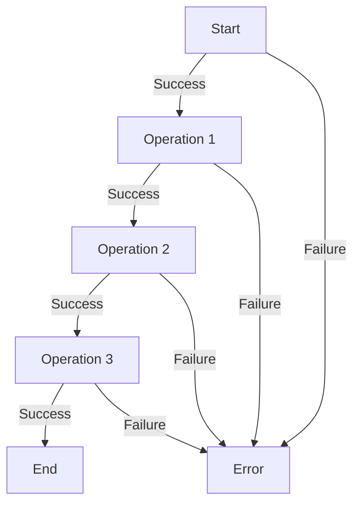

## 7.8 Railway-Oriented Programming

In the world of functional programming, managing errors gracefully is a crucial skill. Railway-Oriented Programming (ROP) is a metaphorical approach that helps us handle errors in a structured and predictable way. By envisioning our computations as railway tracks, we can effectively manage both success and failure paths, leading to cleaner and more reliable code.

### Introduction to Railway-Oriented Programming

Railway-Oriented Programming is inspired by the idea of a railway track, where the train can either continue on the main track (success) or be diverted to a side track (failure) when an error occurs. This metaphor helps us visualize how our program can handle operations that might fail, allowing us to focus on the flow of data and error handling.

#### The Railway Metaphor

Imagine a train journey where the train can either continue smoothly on its track or be diverted to a side track if an obstacle is encountered. In programming terms, this translates to a function that can either return a successful result or an error. By modeling our computations as a series of such tracks, we can chain operations together, ensuring that errors are handled consistently.

### Modeling Computations with Success and Failure Paths

In ROP, computations are modeled with two distinct paths: the success path and the failure path. This dual-path approach allows us to handle errors gracefully, without cluttering our code with conditional checks and error-handling boilerplate.

#### Using `Result` Types

The `Result` type in F# is a powerful tool for implementing ROP. It represents a computation that can either succeed with a value (`Ok`) or fail with an error (`Error`). By using `Result` types, we can explicitly model the success and failure paths of our computations.

```fsharp
type Result<'T, 'E> =
    | Ok of 'T
    | Error of 'E
```

This simple type definition allows us to represent any computation that might fail, with `Ok` carrying the successful result and `Error` carrying the error information.

#### Chaining Functions with `bind`

The `bind` operation is a key component of ROP, allowing us to chain functions together in a way that respects both the success and failure paths. When a function succeeds, `bind` passes the result to the next function in the chain. If a function fails, `bind` short-circuits the chain, propagating the error.

```fsharp
let bind f result =
    match result with
    | Ok value -> f value
    | Error e -> Error e
```

This function takes a function `f` and a `result`, applying `f` only if `result` is `Ok`. If `result` is `Error`, it simply returns the error, ensuring that errors are propagated correctly.

### Visualizing Railway-Oriented Programming

To better understand ROP, let's visualize the concept using a flowchart. This diagram illustrates how data flows through a series of operations, with both success and failure paths clearly defined.



In this diagram, each operation can either succeed, passing the result to the next operation, or fail, diverting to the error path. This visualization helps us understand how ROP manages the flow of data and errors.

### Code Examples: Composing Functions with ROP

Let's dive into some code examples to see how ROP can be applied in practice. We'll start with a simple scenario where we need to validate and process user input.

#### Example: Validating User Input

Suppose we have a function that validates user input and another function that processes it. Using ROP, we can chain these functions together, ensuring that errors are handled consistently.

```fsharp
let validateInput input =
    if input <> "" then Ok input
    else Error "Input cannot be empty"

let processInput input =
    if input.Length > 5 then Ok (input.ToUpper())
    else Error "Input is too short"

let handleInput input =
    input
    |> validateInput
    |> bind processInput
```

In this example, `validateInput` checks if the input is non-empty, and `processInput` checks if the input is long enough. By using `bind`, we chain these functions together, ensuring that errors are propagated correctly.

#### Example: Parsing and Calculating

Consider a scenario where we need to parse a string into a number and then perform a calculation. Using ROP, we can handle parsing errors gracefully.

```fsharp
let parseNumber str =
    match System.Int32.TryParse(str) with
    | (true, num) -> Ok num
    | _ -> Error "Invalid number"

let calculateSquare num =
    if num >= 0 then Ok (num * num)
    else Error "Number must be non-negative"

let processNumber str =
    str
    |> parseNumber
    |> bind calculateSquare
```

Here, `parseNumber` attempts to parse a string into an integer, and `calculateSquare` computes the square of the number. By chaining these functions with `bind`, we ensure that any parsing errors are handled appropriately.

### Error Propagation and Handling

One of the key benefits of ROP is its ability to propagate errors automatically. By using `Result` types and `bind`, we can ensure that errors are handled consistently throughout our code.

#### Automatic Error Propagation

When an error occurs in a function, `bind` ensures that the error is propagated to the end of the chain. This eliminates the need for explicit error handling at each step, reducing boilerplate and improving code clarity.

#### Custom Error Handling

While ROP provides automatic error propagation, there are times when we need to handle errors explicitly. By using pattern matching, we can define custom error-handling logic at any point in the chain.

```fsharp
let handleErrors result =
    match result with
    | Ok value -> printfn "Success: %A" value
    | Error e -> printfn "Error: %s" e

let processAndHandle str =
    str
    |> processNumber
    |> handleErrors
```

In this example, `handleErrors` prints a success message if the result is `Ok` and an error message if the result is `Error`. This allows us to define custom error-handling logic as needed.

### Benefits of Railway-Oriented Programming

Railway-Oriented Programming offers several benefits that make it an attractive choice for error handling in functional programming.

#### Reduced Boilerplate

By using `Result` types and `bind`, ROP eliminates the need for explicit error checks and handling at each step. This reduces boilerplate code, making our programs more concise and easier to read.

#### Improved Error Management

ROP provides a structured approach to error management, ensuring that errors are handled consistently throughout our code. This improves reliability and makes it easier to reason about our programs.

#### Enhanced Code Clarity

By modeling computations with success and failure paths, ROP enhances code clarity. This makes it easier to understand the flow of data and identify potential error points.

### Limitations and Scenarios Where ROP May Not Be Ideal

While ROP offers many benefits, it's important to recognize its limitations and scenarios where it may not be the best choice.

#### Limitations of ROP

- **Complex Error Handling**: In scenarios where error handling is complex or requires side effects, ROP may not be the best fit.
- **Performance Overhead**: The use of `Result` types and `bind` can introduce performance overhead, especially in performance-critical applications.

#### Scenarios Where ROP May Not Be Ideal

- **Side-Effect-Heavy Operations**: In cases where operations involve significant side effects, traditional error-handling approaches may be more appropriate.
- **Performance-Critical Code**: In performance-critical code, the overhead of `Result` types and `bind` may outweigh the benefits of ROP.

### Best Practices for Implementing ROP

To make the most of Railway-Oriented Programming, it's important to follow best practices that ensure consistent and effective error handling.

#### Consistent Error Handling Strategies

- **Define Clear Error Types**: Use well-defined error types to represent different error conditions. This makes it easier to handle errors consistently.
- **Use `bind` for Chaining**: Use `bind` to chain functions together, ensuring that errors are propagated automatically.
- **Leverage Pattern Matching**: Use pattern matching to handle errors explicitly when needed, allowing for custom error-handling logic.

#### Encouraging Experimentation

To fully grasp the power of ROP, we encourage you to experiment with the code examples provided. Try modifying the functions, introducing new error conditions, and observing how ROP handles them. This hands-on approach will deepen your understanding of ROP and its benefits.

### Conclusion

Railway-Oriented Programming is a powerful method for handling errors in functional programming. By modeling computations with success and failure paths, ROP provides a structured approach to error management that enhances code clarity and reliability. While it may not be ideal for all scenarios, its benefits make it a valuable tool in the functional programmer's toolkit.

Remember, this is just the beginning. As you continue your journey with F# and functional programming, you'll discover new ways to apply ROP and other design patterns to build robust, scalable, and maintainable applications. Keep experimenting, stay curious, and enjoy the journey!

## Quiz Time!



### What is the primary metaphor behind Railway-Oriented Programming?

- [x] A train journey with success and failure tracks
- [ ] A branching tree structure
- [ ] A waterfall model
- [ ] A circular loop

> **Explanation:** Railway-Oriented Programming uses the metaphor of a train journey, where computations can follow a success track or be diverted to a failure track.

### What type in F# is commonly used to model success and failure paths in ROP?

- [x] Result
- [ ] Option
- [ ] List
- [ ] Tuple

> **Explanation:** The `Result` type is used to model computations that can either succeed with a value (`Ok`) or fail with an error (`Error`).

### What operation is used to chain functions together in ROP?

- [x] bind
- [ ] map
- [ ] filter
- [ ] reduce

> **Explanation:** The `bind` operation is used to chain functions together, allowing for error propagation in Railway-Oriented Programming.

### In ROP, what happens when a function in the chain fails?

- [x] The error is propagated to the end of the chain
- [ ] The program terminates immediately
- [ ] The error is ignored
- [ ] The function retries automatically

> **Explanation:** When a function in the chain fails, `bind` ensures that the error is propagated to the end of the chain.

### Which of the following is a benefit of using ROP?

- [x] Reduced boilerplate code
- [ ] Increased complexity
- [ ] Higher memory usage
- [ ] Slower execution

> **Explanation:** ROP reduces boilerplate code by eliminating the need for explicit error checks at each step.

### What is a limitation of ROP?

- [x] Performance overhead
- [ ] Lack of error handling
- [ ] Inability to chain functions
- [ ] Difficulty in understanding

> **Explanation:** The use of `Result` types and `bind` can introduce performance overhead, especially in performance-critical applications.

### In which scenario might ROP not be ideal?

- [x] Side-effect-heavy operations
- [ ] Purely functional computations
- [ ] Simple arithmetic operations
- [ ] Data transformation

> **Explanation:** In scenarios involving significant side effects, traditional error-handling approaches may be more appropriate than ROP.

### What is a best practice for implementing ROP?

- [x] Use `bind` for chaining functions
- [ ] Avoid using `Result` types
- [ ] Use global variables for error handling
- [ ] Ignore errors in the chain

> **Explanation:** Using `bind` for chaining functions ensures that errors are propagated automatically in ROP.

### How can custom error handling be implemented in ROP?

- [x] Using pattern matching
- [ ] By ignoring errors
- [ ] With global error handlers
- [ ] Through exception throwing

> **Explanation:** Pattern matching allows for custom error-handling logic in ROP, enabling explicit handling of errors when needed.

### True or False: ROP is only applicable to functional programming languages.

- [x] False
- [ ] True

> **Explanation:** While ROP is commonly associated with functional programming, its principles can be applied in other programming paradigms as well.


