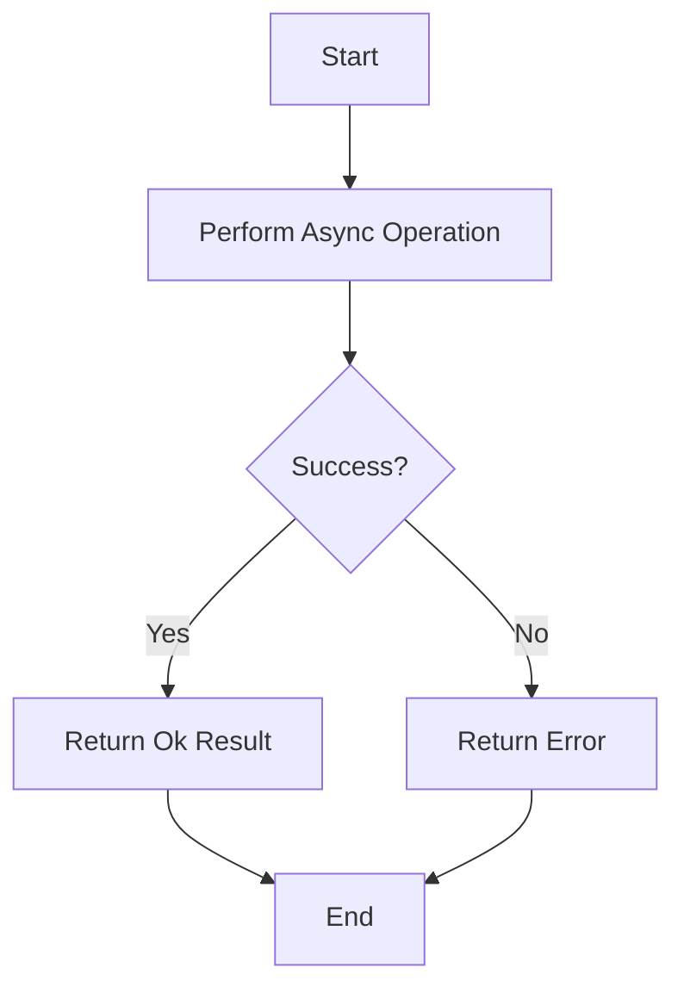

## 7.9 Functional Error Handling with AsyncResult

In the realm of software development, handling both asynchronous computations and potential errors is a common challenge. Asynchronous operations are crucial for building responsive applications, while robust error handling ensures reliability and user satisfaction. In F#, the `AsyncResult` type emerges as a powerful construct that combines these two aspects, simplifying the management of operations that are both asynchronous and may fail.

### Understanding the Need for AsyncResult

Before diving into the specifics of `AsyncResult`, let's explore why such a construct is necessary. Asynchronous programming allows us to perform non-blocking operations, which is essential for applications that require high responsiveness, such as web servers or GUI applications. However, asynchronous operations can fail due to various reasons, such as network issues or invalid data. Handling these failures gracefully is crucial for maintaining application stability.

Traditional error handling in asynchronous workflows can become cumbersome, often leading to nested callbacks or complex error propagation logic. The `AsyncResult` type in F# addresses these challenges by providing a unified approach to handle both asynchronous computations and errors.

### Introducing the AsyncResult Type

The `AsyncResult` type is a combination of the `Async` and `Result` types. It encapsulates an asynchronous operation that can either succeed with a result or fail with an error. This combination allows developers to handle both asynchronous execution and error propagation in a seamless manner.

Here's a basic definition of the `AsyncResult` type:

```fsharp
type AsyncResult<'T, 'E> = Async<Result<'T, 'E>>
```

In this definition:
- `'T` represents the type of the successful result.
- `'E` represents the type of the error.

### Defining and Using AsyncResult in F#

Let's start with a simple example to illustrate how to define and use `AsyncResult` in F#. We'll create a function that performs an asynchronous operation and returns an `AsyncResult`.

```fsharp
open System

// Simulate an asynchronous operation that may fail
let fetchDataAsync (url: string) : AsyncResult<string, string> =
    async {
        try
            // Simulate a delay
            do! Async.Sleep 1000
            if String.IsNullOrWhiteSpace(url) then
                return Error "Invalid URL"
            else
                // Simulate fetching data
                return Ok $"Data from {url}"
        with
        | ex -> return Error ex.Message
    }

// Usage example
let result = fetchDataAsync "http://example.com"
```

In this example, `fetchDataAsync` is a function that simulates fetching data from a URL. It returns an `AsyncResult` that either contains the fetched data or an error message.

### Composing Asynchronous Operations with Error Handling

One of the key benefits of using `AsyncResult` is the ability to compose asynchronous operations while handling errors gracefully. Let's demonstrate this with a more complex example.

Suppose we have two asynchronous operations: one that fetches user data and another that fetches user preferences. We want to compose these operations and handle any errors that may occur.

```fsharp
type User = { Id: int; Name: string }
type Preferences = { Theme: string }

let fetchUserAsync (userId: int) : AsyncResult<User, string> =
    async {
        try
            do! Async.Sleep 500
            if userId <= 0 then
                return Error "Invalid user ID"
            else
                return Ok { Id = userId; Name = "John Doe" }
        with
        | ex -> return Error ex.Message
    }

let fetchPreferencesAsync (userId: int) : AsyncResult<Preferences, string> =
    async {
        try
            do! Async.Sleep 500
            if userId <= 0 then
                return Error "Invalid user ID"
            else
                return Ok { Theme = "Dark" }
        with
        | ex -> return Error ex.Message
    }

let fetchUserDataAndPreferencesAsync (userId: int) : AsyncResult<(User * Preferences), string> =
    async {
        let! userResult = fetchUserAsync userId
        match userResult with
        | Error e -> return Error e
        | Ok user ->
            let! preferencesResult = fetchPreferencesAsync userId
            match preferencesResult with
            | Error e -> return Error e
            | Ok preferences -> return Ok (user, preferences)
    }

// Usage example
let userDataAndPreferences = fetchUserDataAndPreferencesAsync 1
```

In this example, `fetchUserDataAndPreferencesAsync` composes the results of `fetchUserAsync` and `fetchPreferencesAsync`. It handles errors at each step, returning an `AsyncResult` that contains either a tuple of user data and preferences or an error message.

### Computation Expressions for AsyncResult

F#'s computation expressions provide a powerful way to streamline asynchronous workflows. By defining a computation expression for `AsyncResult`, we can simplify the code and make it more readable.

Here's how we can define a computation expression for `AsyncResult`:

```fsharp
type AsyncResultBuilder() =
    member _.Bind(m: AsyncResult<'T, 'E>, f: 'T -> AsyncResult<'U, 'E>) : AsyncResult<'U, 'E> =
        async {
            let! result = m
            match result with
            | Error e -> return Error e
            | Ok value -> return! f value
        }

    member _.Return(x: 'T) : AsyncResult<'T, 'E> =
        async { return Ok x }

let asyncResult = AsyncResultBuilder()

// Using the computation expression
let fetchUserDataAndPreferencesAsyncCE (userId: int) : AsyncResult<(User * Preferences), string> =
    asyncResult {
        let! user = fetchUserAsync userId
        let! preferences = fetchPreferencesAsync userId
        return (user, preferences)
    }
```

With the computation expression, the code becomes more concise and easier to follow. The `asyncResult` computation expression handles the binding of `AsyncResult` values, allowing us to focus on the logic of the operations.

### Benefits of Using AsyncResult

Using `AsyncResult` in F# offers several benefits:

- **Cleaner Code**: By combining asynchronous execution and error handling, `AsyncResult` reduces the need for nested callbacks and complex error propagation logic.
- **Unified Error Handling**: `AsyncResult` provides a consistent approach to handle errors in asynchronous workflows, making it easier to manage error propagation and recovery.
- **Improved Readability**: Computation expressions for `AsyncResult` enhance code readability by abstracting away the boilerplate code associated with asynchronous operations.

### Integrating AsyncResult with Existing Asynchronous Code

Integrating `AsyncResult` with existing asynchronous code is straightforward. You can convert existing `Async` operations to `AsyncResult` by wrapping the result in a `Result` type. Similarly, you can convert `AsyncResult` back to `Async` by extracting the result.

Here's an example of integrating `AsyncResult` with existing asynchronous code:

```fsharp
let existingAsyncOperation (value: int) : Async<int> =
    async {
        do! Async.Sleep 500
        return value * 2
    }

let convertToAsyncResult (asyncOp: Async<'T>) : AsyncResult<'T, string> =
    async {
        try
            let! result = asyncOp
            return Ok result
        with
        | ex -> return Error ex.Message
    }

let asyncResultOperation = convertToAsyncResult (existingAsyncOperation 5)

// Converting back to Async
let convertToAsync (asyncResult: AsyncResult<'T, 'E>) : Async<'T> =
    async {
        let! result = asyncResult
        match result with
        | Ok value -> return value
        | Error e -> failwith e
    }

let asyncOperation = convertToAsync asyncResultOperation
```

In this example, `convertToAsyncResult` wraps an existing `Async` operation in an `AsyncResult`, while `convertToAsync` extracts the result from an `AsyncResult` to return an `Async`.

### Best Practices for Error Propagation, Cancellation, and Resource Management

When working with `AsyncResult`, it's important to follow best practices to ensure robust error handling and resource management:

- **Error Propagation**: Use the `Result` type to propagate errors through the `AsyncResult` workflow. This ensures that errors are handled consistently and can be recovered from at any point in the workflow.
- **Cancellation**: Leverage F#'s built-in support for cancellation tokens to handle cancellation in asynchronous operations. This allows you to cancel long-running operations gracefully.
- **Resource Management**: Ensure that resources such as file handles or network connections are properly managed and released, even in the presence of errors. Use `use` bindings or `finally` blocks to guarantee resource cleanup.

### Try It Yourself

To deepen your understanding of `AsyncResult`, try modifying the examples provided:

- **Experiment with Different Error Types**: Modify the error type in the `AsyncResult` to use a custom error type instead of a string. This can help you model more complex error scenarios.
- **Add Logging**: Introduce logging to the `AsyncResult` workflow to track the progress and errors of asynchronous operations.
- **Implement Retry Logic**: Enhance the `AsyncResult` workflow with retry logic for transient errors, such as network timeouts.

### Visualizing AsyncResult Workflow

To better understand the flow of data and error handling in an `AsyncResult` workflow, let's visualize the process using a flowchart.



In this flowchart, we see the process of performing an asynchronous operation, checking for success, and returning either an `Ok` result or an error.

### Conclusion

The `AsyncResult` type in F# provides a powerful and elegant solution for handling asynchronous operations that may fail. By combining `Async` and `Result`, it simplifies error handling and improves code readability. With the use of computation expressions, `AsyncResult` becomes even more expressive, allowing developers to focus on the logic of their applications rather than the intricacies of error propagation.

Remember, this is just the beginning. As you progress, you'll build more complex and interactive applications. Keep experimenting, stay curious, and enjoy the journey!

## Quiz Time!



### What is the primary purpose of the `AsyncResult` type in F#?

- [x] To combine asynchronous operations with error handling
- [ ] To perform synchronous operations
- [ ] To handle only successful operations
- [ ] To replace the `Async` type in F#

> **Explanation:** The `AsyncResult` type is designed to combine asynchronous operations with error handling, providing a unified approach to manage both aspects.

### How is the `AsyncResult` type defined in F#?

- [x] `type AsyncResult<'T, 'E> = Async<Result<'T, 'E>>`
- [ ] `type AsyncResult<'T> = Result<Async<'T>>`
- [ ] `type AsyncResult<'T, 'E> = Result<'T, Async<'E>>`
- [ ] `type AsyncResult<'T> = Async<'T>`

> **Explanation:** The `AsyncResult` type is defined as `Async<Result<'T, 'E>>`, combining `Async` and `Result` to handle asynchronous operations that may fail.

### Which F# feature can be used to streamline `AsyncResult` workflows?

- [x] Computation expressions
- [ ] Pattern matching
- [ ] Type providers
- [ ] Object expressions

> **Explanation:** Computation expressions in F# provide a powerful way to streamline `AsyncResult` workflows, making the code more readable and expressive.

### What is a key benefit of using `AsyncResult`?

- [x] Cleaner code with unified error handling
- [ ] Increased code complexity
- [ ] Reduced performance
- [ ] Elimination of all errors

> **Explanation:** A key benefit of using `AsyncResult` is cleaner code with unified error handling, reducing the need for nested callbacks and complex error propagation logic.

### How can you integrate `AsyncResult` with existing `Async` code?

- [x] By wrapping `Async` operations in `Result` types
- [ ] By converting `Async` to synchronous operations
- [ ] By using only `Result` types
- [ ] By ignoring errors

> **Explanation:** You can integrate `AsyncResult` with existing `Async` code by wrapping `Async` operations in `Result` types, allowing for seamless error handling.

### What should you use to handle cancellation in `AsyncResult` workflows?

- [x] Cancellation tokens
- [ ] Error messages
- [ ] Type providers
- [ ] Object expressions

> **Explanation:** Cancellation tokens should be used to handle cancellation in `AsyncResult` workflows, allowing for graceful cancellation of long-running operations.

### Which of the following is a best practice for resource management in `AsyncResult` workflows?

- [x] Use `use` bindings or `finally` blocks for cleanup
- [ ] Ignore resource cleanup
- [ ] Use only synchronous operations
- [ ] Avoid using resources

> **Explanation:** A best practice for resource management in `AsyncResult` workflows is to use `use` bindings or `finally` blocks to ensure proper cleanup, even in the presence of errors.

### What is the role of the `Bind` method in the `AsyncResultBuilder` computation expression?

- [x] To handle the binding of `AsyncResult` values
- [ ] To perform synchronous operations
- [ ] To replace the `Async` type
- [ ] To ignore errors

> **Explanation:** The `Bind` method in the `AsyncResultBuilder` computation expression handles the binding of `AsyncResult` values, allowing for seamless composition of asynchronous operations.

### True or False: `AsyncResult` can only be used with string error types.

- [ ] True
- [x] False

> **Explanation:** False. `AsyncResult` can be used with any error type, allowing for more complex error modeling beyond just strings.

### Which diagramming tool is used to visualize the `AsyncResult` workflow in this guide?

- [x] Mermaid.js
- [ ] UML
- [ ] Visio
- [ ] Lucidchart

> **Explanation:** Mermaid.js is used to create diagrams in this guide, providing a visual representation of the `AsyncResult` workflow.


