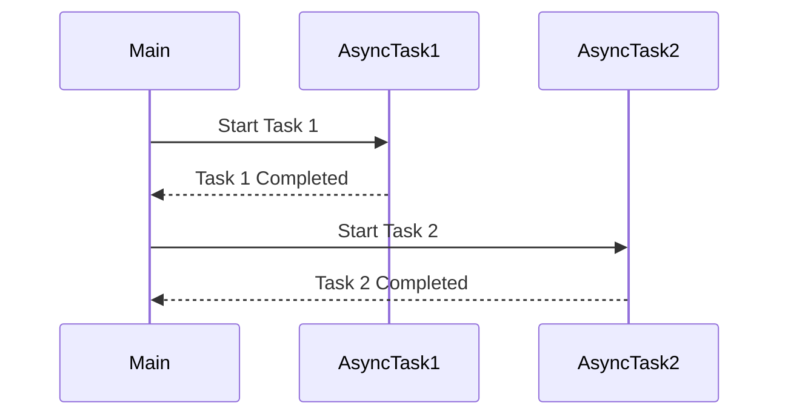

## 8.1 Asynchronous Workflows

In today's fast-paced digital world, applications are expected to be responsive, efficient, and capable of handling multiple tasks simultaneously. Asynchronous programming has become a cornerstone in achieving these goals, allowing developers to manage I/O-bound and CPU-bound tasks without blocking the main thread. In this section, we delve into the world of asynchronous workflows in F#, exploring how the `async` computation expression empowers developers to create robust, non-blocking applications.

### Understanding Asynchronous Programming

Asynchronous programming is a paradigm that allows a program to initiate a potentially long-running operation and continue executing other tasks while waiting for the operation to complete. This approach is crucial in modern applications, where responsiveness and efficiency are paramount. By leveraging asynchronous programming, applications can handle multiple operations concurrently, such as network requests, file I/O, or complex computations, without freezing the user interface or wasting CPU resources.

### The Power of F#'s `async` Computation Expression

F# provides a powerful feature called the `async` computation expression, which simplifies the creation and management of asynchronous workflows. The `async` keyword in F# allows developers to define blocks of code that can be executed asynchronously, making it easier to write non-blocking code that is both readable and maintainable.

#### Defining Asynchronous Workflows with `async { }` Blocks

The `async { }` block is the cornerstone of asynchronous programming in F#. It allows you to define a sequence of operations that can be executed asynchronously. Here's a simple example to illustrate how to define and use an `async` block:

```fsharp
open System

let asyncWorkflow = async {
    printfn "Starting asynchronous operation..."
    do! Async.Sleep 2000 // Simulate a delay
    printfn "Asynchronous operation completed."
}

// Running the asynchronous workflow
Async.RunSynchronously asyncWorkflow
```

In this example, we define an asynchronous workflow using the `async { }` block. The `do!` keyword is used to indicate that the operation should be executed asynchronously. The `Async.Sleep` function simulates a delay, allowing us to observe the non-blocking nature of the workflow.

#### Running Asynchronous Workflows

Once an asynchronous workflow is defined, it can be executed using various methods, such as `Async.RunSynchronously` and `Async.Start`. These methods determine how the asynchronous operation is initiated and managed.

- **`Async.RunSynchronously`**: This method runs the asynchronous workflow synchronously, blocking the calling thread until the operation completes. It is useful for scenarios where you need to wait for the result of an asynchronous operation before proceeding.

```fsharp
Async.RunSynchronously asyncWorkflow
```

- **`Async.Start`**: This method starts the asynchronous workflow without blocking the calling thread. It is ideal for fire-and-forget scenarios where you don't need to wait for the operation to complete.

```fsharp
Async.Start asyncWorkflow
```

### Composing Asynchronous Workflows

F# provides several powerful constructs for composing asynchronous workflows, allowing developers to create complex, non-blocking operations with ease.

#### Using `Async.Bind`

The `Async.Bind` function is used to chain asynchronous operations together, ensuring that each operation is executed in sequence. This is particularly useful when you need to perform a series of dependent asynchronous tasks.

```fsharp
let asyncWorkflow1 = async {
    printfn "Task 1 started."
    do! Async.Sleep 1000
    printfn "Task 1 completed."
}

let asyncWorkflow2 = async {
    printfn "Task 2 started."
    do! Async.Sleep 1000
    printfn "Task 2 completed."
}

let combinedWorkflow = async {
    do! asyncWorkflow1
    do! asyncWorkflow2
}

Async.RunSynchronously combinedWorkflow
```

In this example, `asyncWorkflow1` and `asyncWorkflow2` are executed sequentially using `Async.Bind`, ensuring that Task 2 starts only after Task 1 completes.

#### Using `Async.Parallel`

The `Async.Parallel` function allows you to execute multiple asynchronous workflows concurrently, improving performance by taking advantage of parallel processing.

```fsharp
let parallelWorkflow = 
    [ asyncWorkflow1; asyncWorkflow2 ]
    |> Async.Parallel

Async.RunSynchronously parallelWorkflow
```

Here, `asyncWorkflow1` and `asyncWorkflow2` are executed in parallel, allowing both tasks to run simultaneously.

#### Using `Async.Sequential`

The `Async.Sequential` function is similar to `Async.Bind`, but it takes a sequence of asynchronous workflows and executes them one after the other.

```fsharp
let sequentialWorkflow = 
    [ asyncWorkflow1; asyncWorkflow2 ]
    |> Async.Sequential

Async.RunSynchronously sequentialWorkflow
```

### Error Handling in Asynchronous Workflows

Error handling is a crucial aspect of any programming paradigm, and asynchronous workflows are no exception. F# provides robust mechanisms for managing errors within `async` blocks, ensuring that your applications remain resilient and reliable.

#### Using Try/Catch within `async` Blocks

You can use the familiar `try/catch` construct within an `async` block to handle exceptions that may occur during the execution of an asynchronous operation.

```fsharp
let errorProneWorkflow = async {
    try
        printfn "Starting risky operation..."
        // Simulate an error
        let result = 10 / 0
        printfn "Operation completed successfully: %d" result
    with
    | :? System.DivideByZeroException as ex ->
        printfn "Caught exception: %s" ex.Message
}

Async.RunSynchronously errorProneWorkflow
```

In this example, we simulate a division by zero error and handle it using a `try/catch` block within the `async` workflow.

### Practical Examples of Asynchronous Workflows

Let's explore some practical examples of how asynchronous workflows can be used to perform common tasks such as web requests and file I/O operations.

#### Performing Asynchronous Web Requests

Asynchronous workflows are particularly useful for performing web requests, allowing your application to remain responsive while waiting for network operations to complete.

```fsharp
open System.Net.Http

let fetchUrlAsync (url: string) = async {
    use httpClient = new HttpClient()
    let! response = httpClient.GetStringAsync(url) |> Async.AwaitTask
    printfn "Fetched %s: %s" url response
}

let urls = [ "http://example.com"; "http://example.org" ]

let fetchAllUrls = 
    urls
    |> List.map fetchUrlAsync
    |> Async.Parallel

Async.RunSynchronously fetchAllUrls
```

In this example, we define an asynchronous workflow `fetchUrlAsync` to fetch the contents of a URL using `HttpClient`. We then use `Async.Parallel` to fetch multiple URLs concurrently.

#### Asynchronous File I/O Operations

Asynchronous workflows can also be used to perform file I/O operations, enabling your application to handle large files without blocking the main thread.

```fsharp
open System.IO

let readFileAsync (filePath: string) = async {
    use reader = new StreamReader(filePath)
    let! content = reader.ReadToEndAsync() |> Async.AwaitTask
    printfn "Read file %s: %s" filePath content
}

let filePath = "example.txt"
Async.RunSynchronously (readFileAsync filePath)
```

In this example, we define an asynchronous workflow `readFileAsync` to read the contents of a file using `StreamReader`. The `Async.AwaitTask` function is used to convert the task-based asynchronous operation to an F# `async` workflow.

### Best Practices for Asynchronous Workflows

Writing clean and maintainable asynchronous code is essential for building robust applications. Here are some best practices to keep in mind:

- **Use `async` for I/O-bound operations**: Asynchronous workflows are most beneficial for operations that involve waiting, such as network requests or file I/O. For CPU-bound tasks, consider using parallel processing techniques.
- **Avoid blocking calls**: Ensure that your asynchronous workflows do not contain blocking calls, as this defeats the purpose of asynchronous programming.
- **Handle exceptions gracefully**: Use `try/catch` blocks within `async` workflows to handle exceptions and prevent your application from crashing.
- **Compose workflows effectively**: Leverage `Async.Bind`, `Async.Parallel`, and `Async.Sequential` to compose complex workflows and improve code readability.
- **Test asynchronous code thoroughly**: Asynchronous workflows can introduce subtle bugs, so it's important to test your code thoroughly to ensure it behaves as expected.

### Common Pitfalls and How to Avoid Them

While asynchronous workflows offer many benefits, there are some common pitfalls to be aware of:

- **Deadlocks**: Avoid scenarios where asynchronous workflows wait on each other, leading to deadlocks. Use `Async.Start` for fire-and-forget operations to prevent blocking.
- **Unintended blocking**: Ensure that your asynchronous workflows do not inadvertently block the main thread. Use `Async.RunSynchronously` sparingly and only when necessary.
- **Resource management**: Be mindful of resource management, such as disposing of `HttpClient` or `StreamReader` objects, to prevent resource leaks.

### Benefits of Asynchronous Workflows

Asynchronous workflows offer several benefits for application performance and responsiveness:

- **Improved responsiveness**: By allowing operations to run concurrently, asynchronous workflows prevent the application from freezing, resulting in a smoother user experience.
- **Efficient resource utilization**: Asynchronous workflows make better use of system resources, allowing applications to handle more tasks simultaneously.
- **Scalability**: Asynchronous programming enables applications to scale more effectively, handling increased workloads without a significant impact on performance.

### Try It Yourself

To truly grasp the power of asynchronous workflows, try modifying the code examples provided in this section. Experiment with different scenarios, such as fetching additional URLs or reading larger files, to see how asynchronous workflows can enhance your applications.

### Visualizing Asynchronous Workflows

To help visualize the flow of asynchronous operations, let's use a Mermaid.js diagram to represent the sequence of tasks in an asynchronous workflow.



This diagram illustrates the sequence of operations in an asynchronous workflow, where Task 1 and Task 2 are executed in sequence, allowing the main thread to remain responsive.

### Conclusion

Asynchronous workflows in F# provide a powerful mechanism for managing concurrent operations, enabling developers to build responsive and efficient applications. By leveraging the `async` computation expression, you can create non-blocking workflows that handle I/O-bound and CPU-bound tasks with ease. Remember to follow best practices, avoid common pitfalls, and experiment with the examples provided to master asynchronous programming in F#.

## Quiz Time!



### What is the primary benefit of using asynchronous workflows in F#?

- [x] Improved application responsiveness
- [ ] Simplified code syntax
- [ ] Reduced memory usage
- [ ] Enhanced security

> **Explanation:** Asynchronous workflows improve application responsiveness by allowing operations to run concurrently without blocking the main thread.


### Which F# construct is used to define asynchronous workflows?

- [ ] `async { }`
- [x] `async { }`
- [ ] `async ()`
- [ ] `async []`

> **Explanation:** The `async { }` block is used to define asynchronous workflows in F#.


### How can you run an asynchronous workflow synchronously in F#?

- [x] `Async.RunSynchronously`
- [ ] `Async.Start`
- [ ] `Async.Execute`
- [ ] `Async.Begin`

> **Explanation:** `Async.RunSynchronously` is used to run an asynchronous workflow synchronously, blocking the calling thread until completion.


### Which function allows you to execute multiple asynchronous workflows concurrently?

- [ ] `Async.Bind`
- [x] `Async.Parallel`
- [ ] `Async.Sequential`
- [ ] `Async.Combine`

> **Explanation:** `Async.Parallel` allows multiple asynchronous workflows to be executed concurrently.


### What is the purpose of `Async.Bind` in F#?

- [x] To chain asynchronous operations sequentially
- [ ] To execute operations in parallel
- [ ] To handle exceptions in async workflows
- [ ] To start an async operation

> **Explanation:** `Async.Bind` is used to chain asynchronous operations sequentially, ensuring each operation completes before the next begins.


### How can you handle exceptions within an `async` block?

- [x] Using `try/catch` within the `async` block
- [ ] Using `Async.Catch`
- [ ] Using `Async.Try`
- [ ] Using `catch` outside the `async` block

> **Explanation:** Exceptions within an `async` block can be handled using `try/catch` constructs.


### What is a common pitfall when using asynchronous workflows?

- [x] Deadlocks
- [ ] Memory leaks
- [ ] Syntax errors
- [ ] Type mismatches

> **Explanation:** Deadlocks can occur if asynchronous workflows wait on each other, leading to a halt in execution.


### Which method is ideal for fire-and-forget asynchronous operations?

- [ ] `Async.RunSynchronously`
- [x] `Async.Start`
- [ ] `Async.Execute`
- [ ] `Async.Begin`

> **Explanation:** `Async.Start` is ideal for fire-and-forget operations as it starts the workflow without blocking the calling thread.


### What should you avoid in asynchronous workflows to prevent blocking?

- [x] Blocking calls
- [ ] Asynchronous operations
- [ ] Exception handling
- [ ] Resource management

> **Explanation:** Blocking calls should be avoided in asynchronous workflows to maintain non-blocking execution.


### True or False: Asynchronous workflows are most beneficial for CPU-bound tasks.

- [ ] True
- [x] False

> **Explanation:** Asynchronous workflows are most beneficial for I/O-bound tasks, not CPU-bound tasks, which are better suited for parallel processing techniques.


