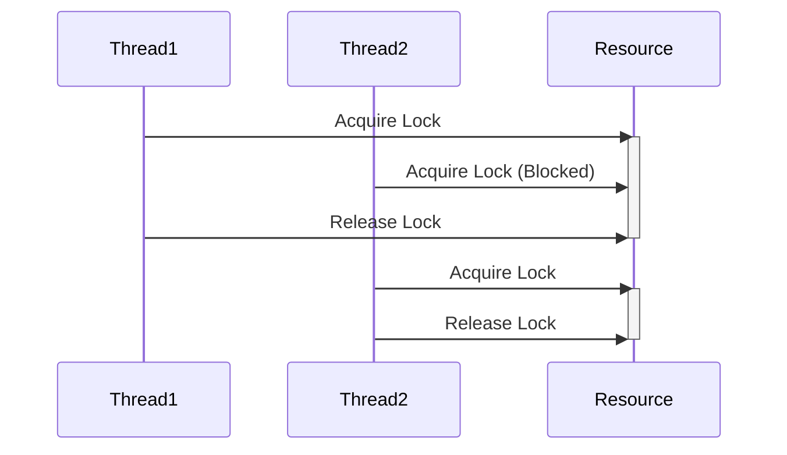

## 8.10 Synchronization Primitives

In the world of concurrent programming, managing access to shared resources is crucial to ensure data integrity and application stability. Synchronization primitives are tools that help us control access to these resources, preventing race conditions and ensuring thread safety. In this section, we will explore various synchronization primitives available in .NET, demonstrate their usage in F#, and discuss best practices for writing thread-safe code.

### Understanding Race Conditions

Race conditions occur when two or more threads access shared data and try to change it at the same time. If the threads' operations interleave in a way that leads to unexpected results, it can cause data corruption or inconsistent application behavior. Synchronization is necessary to ensure that only one thread can access the critical section of code at a time, thereby preventing race conditions.

### Introducing Synchronization Primitives

.NET provides several synchronization primitives to manage access to shared resources:

- **`lock` (or `Monitor`)**: Simplifies the process of acquiring and releasing locks on objects.
- **`Mutex`**: Provides mutual exclusion, allowing only one thread to access a resource.
- **`Semaphore`**: Limits the number of threads that can access a resource concurrently.
- **`AutoResetEvent` and `ManualResetEvent`**: Signal threads to proceed with execution.

Let's dive into each of these primitives, starting with the `lock` statement.

### Using `lock` in F#

The `lock` statement in F# is a convenient way to ensure that a critical section of code is executed by only one thread at a time. It is a wrapper around the `Monitor` class in .NET.

```fsharp
let mutable sharedResource = 0

let incrementResource() =
    lock sharedResource (fun () ->
        // Critical section
        sharedResource <- sharedResource + 1
    )
```

In this example, the `lock` statement ensures that only one thread can modify `sharedResource` at a time.

#### Key Points about `lock`

- **Simplicity**: The `lock` statement is easy to use and understand.
- **Scope**: The lock is automatically released when the block of code exits.
- **Drawbacks**: Overuse of locks can lead to contention, reducing concurrency.

### Exploring Other Synchronization Primitives

#### `Mutex`

A `Mutex` is similar to a `lock`, but it can be used across different processes. It is more heavyweight than a `lock` and should be used when inter-process synchronization is required.

```fsharp
let mutex = new System.Threading.Mutex()

let accessResource() =
    mutex.WaitOne()
    try
        // Critical section
    finally
        mutex.ReleaseMutex()
```

#### `Semaphore` and `SemaphoreSlim`

A `Semaphore` restricts the number of threads that can access a resource concurrently. `SemaphoreSlim` is a lightweight alternative designed for use within a single process and supports asynchronous operations.

```fsharp
let semaphore = new System.Threading.SemaphoreSlim(3)

let accessLimitedResource() =
    async {
        do! semaphore.WaitAsync()
        try
            // Critical section
        finally
            semaphore.Release()
    }
```

#### `AutoResetEvent` and `ManualResetEvent`

These primitives are used for signaling between threads. An `AutoResetEvent` automatically resets after releasing a single waiting thread, while a `ManualResetEvent` remains signaled until manually reset.

```fsharp
let autoResetEvent = new System.Threading.AutoResetEvent(false)

let waitForSignal() =
    autoResetEvent.WaitOne()

let signal() =
    autoResetEvent.Set()
```

### Choosing the Right Synchronization Primitive

- **Use `lock`** for simple, intra-process synchronization.
- **Use `Mutex`** when synchronization is needed across processes.
- **Use `Semaphore` or `SemaphoreSlim`** to limit concurrent access to a resource.
- **Use `AutoResetEvent` or `ManualResetEvent`** for thread signaling.

### Potential Drawbacks of Using Locks

While locks are essential for preventing race conditions, they come with potential drawbacks:

- **Deadlocks**: Occur when two or more threads are waiting indefinitely for locks held by each other.
- **Contention**: High contention can lead to performance bottlenecks.
- **Reduced Concurrency**: Excessive locking can limit the application's ability to perform concurrent operations.

### Techniques to Minimize Locking

1. **Use Immutable Data Structures**: Immutable objects are inherently thread-safe, reducing the need for locks.
2. **Design Lock-Free Algorithms**: Use atomic operations and concurrent collections to avoid locks.
3. **Acquire Locks in a Consistent Order**: Prevent deadlocks by ensuring that locks are always acquired in the same order.

### Using Concurrent Collections

.NET provides concurrent collections that handle synchronization internally, such as `ConcurrentDictionary`, `ConcurrentQueue`, and `ConcurrentBag`. These collections are designed for concurrent access and can be used as an alternative to manual synchronization.

```fsharp
let concurrentDictionary = System.Collections.Concurrent.ConcurrentDictionary<_, _>()

let addToDictionary key value =
    concurrentDictionary.TryAdd(key, value) |> ignore
```

### Best Practices for Writing Thread-Safe Code

- **Minimize Shared State**: Reduce the amount of shared data to minimize the need for synchronization.
- **Prefer Immutability**: Use immutable data structures whenever possible.
- **Use Concurrent Collections**: Leverage concurrent collections for thread-safe data access.
- **Avoid Blocking Calls**: Use asynchronous programming to prevent blocking threads.
- **Test for Concurrency Issues**: Use tools and techniques to identify and fix concurrency issues.

### Try It Yourself

Experiment with the code examples provided. Try modifying the number of threads accessing a shared resource and observe how different synchronization primitives affect the program's behavior. Consider implementing a lock-free algorithm using atomic operations or concurrent collections.

### Visualizing Synchronization Primitives

To better understand how synchronization primitives work, let's visualize the flow of acquiring and releasing locks using a sequence diagram.



**Diagram Description**: This sequence diagram illustrates how two threads interact with a shared resource using a lock. Thread1 acquires the lock first, blocking Thread2 until the lock is released.

### Knowledge Check

Before moving on, consider these questions:

- What are the differences between `lock` and `Mutex`?
- How does `SemaphoreSlim` differ from `Semaphore`?
- What are the potential drawbacks of using locks, and how can they be mitigated?

### Embrace the Journey

Remember, mastering synchronization primitives is a journey. As you progress, you'll develop more efficient and robust concurrent applications. Keep experimenting, stay curious, and enjoy the journey!

## Quiz Time!



### What is a race condition?

- [x] A situation where two or more threads access shared data and try to change it at the same time.
- [ ] A condition where a program runs slower than expected.
- [ ] A scenario where a thread waits indefinitely for a resource.
- [ ] A situation where a program crashes due to an unhandled exception.

> **Explanation:** A race condition occurs when multiple threads access shared data simultaneously, leading to unpredictable results.

### Which synchronization primitive should you use for simple, intra-process synchronization?

- [x] lock
- [ ] Mutex
- [ ] Semaphore
- [ ] AutoResetEvent

> **Explanation:** The `lock` statement is ideal for simple, intra-process synchronization because it is easy to use and automatically releases the lock when the block is exited.

### What is the primary difference between `Semaphore` and `SemaphoreSlim`?

- [x] `SemaphoreSlim` is a lightweight alternative designed for use within a single process and supports asynchronous operations.
- [ ] `Semaphore` is used only for signaling between threads.
- [ ] `SemaphoreSlim` can be used across different processes.
- [ ] `Semaphore` automatically resets after releasing a thread.

> **Explanation:** `SemaphoreSlim` is designed for use within a single process and supports asynchronous operations, making it more lightweight compared to `Semaphore`.

### What is a potential drawback of using locks?

- [x] Deadlocks
- [ ] Increased concurrency
- [ ] Improved performance
- [ ] Reduced memory usage

> **Explanation:** A potential drawback of using locks is deadlocks, which occur when two or more threads are waiting indefinitely for locks held by each other.

### How can you prevent deadlocks?

- [x] Acquire locks in a consistent order.
- [ ] Use more locks.
- [ ] Avoid using immutable data structures.
- [ ] Increase the number of threads.

> **Explanation:** Acquiring locks in a consistent order can help prevent deadlocks by ensuring that threads do not wait indefinitely for locks held by each other.

### Which concurrent collection can be used as an alternative to manual synchronization?

- [x] ConcurrentDictionary
- [ ] List
- [ ] Array
- [ ] Dictionary

> **Explanation:** `ConcurrentDictionary` is a concurrent collection that handles synchronization internally, making it a good alternative to manual synchronization.

### What is a best practice for writing thread-safe code?

- [x] Minimize shared state.
- [ ] Use blocking calls.
- [ ] Avoid using concurrent collections.
- [ ] Maximize shared state.

> **Explanation:** Minimizing shared state is a best practice for writing thread-safe code because it reduces the need for synchronization.

### What is the purpose of `AutoResetEvent`?

- [x] Signal threads to proceed with execution.
- [ ] Limit the number of threads accessing a resource.
- [ ] Provide mutual exclusion across processes.
- [ ] Automatically reset after releasing a thread.

> **Explanation:** `AutoResetEvent` is used for signaling between threads, allowing them to proceed with execution.

### Which of the following is NOT a synchronization primitive?

- [x] List
- [ ] Mutex
- [ ] Semaphore
- [ ] ManualResetEvent

> **Explanation:** `List` is not a synchronization primitive. It is a collection type, whereas `Mutex`, `Semaphore`, and `ManualResetEvent` are synchronization primitives.

### True or False: Immutable data structures are inherently thread-safe.

- [x] True
- [ ] False

> **Explanation:** Immutable data structures are inherently thread-safe because their state cannot be modified after creation, eliminating the need for synchronization.




