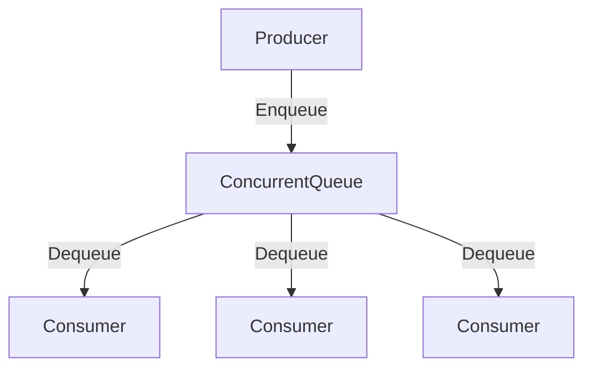

## 8.11 Concurrent Data Structures

In the realm of concurrent programming, ensuring thread safety while maintaining performance is a challenging task. F# provides a unique advantage with its emphasis on immutability, which inherently offers thread safety. However, there are scenarios where immutable data structures may not suffice due to performance constraints. In this section, we will explore the use of concurrent data structures in F#, including .NET's concurrent collections, and discuss best practices for minimizing synchronization overhead and maximizing throughput.

### Understanding Immutability in F#

Immutability is a core principle in functional programming, and F# encourages immutable data by default. When data is immutable, it cannot be changed after creation, which eliminates the risk of data races and makes concurrent programming easier.

#### Benefits of Immutability

- **Thread Safety**: Immutable data structures are inherently thread-safe because they cannot be modified once created. This eliminates the need for locks or other synchronization mechanisms.
- **Predictability**: Since immutable data does not change, functions that operate on it are more predictable and easier to reason about.
- **Ease of Use**: Immutability simplifies code by reducing side effects, making it easier to understand and maintain.

#### Limitations of Immutability

While immutability offers many advantages, it may not always be the best choice for performance-sensitive applications. Creating new copies of data structures for every modification can be inefficient, especially for large datasets or high-frequency updates.

### Introducing .NET's Concurrent Collections

For scenarios where immutable data structures are not sufficient, .NET provides a set of concurrent collections designed for safe access by multiple threads. These collections include `ConcurrentDictionary<'K,'V>`, `ConcurrentQueue<'T>`, and `ConcurrentBag<'T>`, among others.

#### ConcurrentDictionary<'K,'V>

`ConcurrentDictionary<'K,'V>` is a thread-safe dictionary implementation that allows multiple threads to add, update, and remove items concurrently without the need for explicit locks.

```fsharp
open System.Collections.Concurrent

let concurrentDict = ConcurrentDictionary<int, string>()

// Adding items
concurrentDict.TryAdd(1, "One") |> ignore
concurrentDict.TryAdd(2, "Two") |> ignore

// Updating items
concurrentDict.[1] <- "Uno"

// Retrieving items
let value = concurrentDict.TryGetValue(1)
printfn "Value for key 1: %A" value
```

#### ConcurrentQueue<'T>

`ConcurrentQueue<'T>` is a thread-safe FIFO (first-in, first-out) collection that allows multiple threads to enqueue and dequeue items concurrently.

```fsharp
open System.Collections.Concurrent

let concurrentQueue = ConcurrentQueue<int>()

// Enqueuing items
concurrentQueue.Enqueue(1)
concurrentQueue.Enqueue(2)

// Dequeuing items
let success, result = concurrentQueue.TryDequeue()
if success then
    printfn "Dequeued: %d" result
```

#### ConcurrentBag<'T>

`ConcurrentBag<'T>` is a thread-safe unordered collection that allows multiple threads to add and remove items concurrently. It is optimized for scenarios where the order of items is not important.

```fsharp
open System.Collections.Concurrent

let concurrentBag = ConcurrentBag<int>()

// Adding items
concurrentBag.Add(1)
concurrentBag.Add(2)

// Removing items
let success, result = concurrentBag.TryTake()
if success then
    printfn "Removed: %d" result
```

### Performance Considerations

When using mutable concurrent data structures, it's important to consider the performance implications. While these collections provide thread safety, they may introduce some overhead due to internal synchronization mechanisms.

#### Choosing Between Immutable and Concurrent Collections

- **Use Immutable Data Structures**: When thread safety is the primary concern and performance is not a critical factor, prefer immutable data structures.
- **Use Concurrent Collections**: When performance is critical and frequent updates are required, consider using concurrent collections.

### Best Practices for Concurrent Data Structures

- **Minimize Synchronization Overhead**: Use lock-free and wait-free algorithms where possible to reduce contention and improve performance.
- **Maximize Throughput**: Choose the appropriate data structure based on the specific use case and access patterns.
- **Test for Correctness**: Thoroughly test concurrent data structures to ensure they behave correctly under concurrent access.

### Advanced Topics: Lock-Free and Wait-Free Algorithms

Lock-free and wait-free algorithms are advanced techniques used to implement concurrent data structures without the need for locks. These algorithms can improve performance by reducing contention and avoiding deadlocks.

#### Lock-Free Algorithms

Lock-free algorithms ensure that at least one thread makes progress in a finite number of steps, even if other threads are delayed.

#### Wait-Free Algorithms

Wait-free algorithms guarantee that every thread makes progress in a finite number of steps, regardless of the behavior of other threads.

### Testing Concurrent Data Structures

Testing concurrent data structures is crucial to ensure correctness and performance. Consider the following strategies:

- **Unit Testing**: Write unit tests to verify the behavior of individual operations.
- **Stress Testing**: Simulate high-concurrency scenarios to identify potential issues.
- **Race Condition Testing**: Use tools to detect race conditions and other concurrency-related bugs.

### Practical Examples

#### Building a Thread-Safe Cache

A thread-safe cache is a common use case for concurrent data structures. Here's an example using `ConcurrentDictionary<'K,'V>`:

```fsharp
open System.Collections.Concurrent

type Cache<'K, 'V>() =
    let cache = ConcurrentDictionary<'K, 'V>()

    member this.Add(key: 'K, value: 'V) =
        cache.TryAdd(key, value) |> ignore

    member this.Get(key: 'K) =
        match cache.TryGetValue(key) with
        | true, value -> Some value
        | _ -> None

    member this.Remove(key: 'K) =
        cache.TryRemove(key) |> ignore

// Usage
let cache = Cache<int, string>()
cache.Add(1, "One")
let value = cache.Get(1)
printfn "Cached value: %A" value
```

#### Implementing a Producer-Consumer Queue

A producer-consumer queue is another common pattern that can benefit from concurrent data structures. Here's an example using `ConcurrentQueue<'T>`:

```fsharp
open System
open System.Collections.Concurrent
open System.Threading

let producerConsumerQueue = ConcurrentQueue<int>()

let producer() =
    for i in 1 .. 10 do
        producerConsumerQueue.Enqueue(i)
        printfn "Produced: %d" i
        Thread.Sleep(100)

let consumer() =
    while true do
        let success, result = producerConsumerQueue.TryDequeue()
        if success then
            printfn "Consumed: %d" result
        Thread.Sleep(150)

// Start producer and consumer threads
let producerThread = Thread(ThreadStart(producer))
let consumerThread = Thread(ThreadStart(consumer))

producerThread.Start()
consumerThread.Start()

producerThread.Join()
consumerThread.Join()
```

### Try It Yourself

Experiment with the provided examples by modifying the code to suit your needs. Try adding more producers or consumers, or implement additional features such as timeouts or priority queues.

### Visualizing Concurrent Data Structures

To better understand the flow of data in concurrent structures, let's visualize a producer-consumer queue using a flowchart.



This diagram illustrates how multiple producers can enqueue items into a `ConcurrentQueue`, while multiple consumers dequeue items concurrently.

### References and Further Reading

- [Microsoft Docs: Concurrent Collections](https://docs.microsoft.com/en-us/dotnet/standard/collections/thread-safe/)
- [Concurrency in .NET](https://www.oreilly.com/library/view/concurrency-in-net/9781492054504/)
- [F# for Fun and Profit: Concurrency](https://fsharpforfunandprofit.com/posts/concurrency-intro/)

### Knowledge Check

- What are the benefits and limitations of using immutable data structures in concurrent programming?
- How do .NET's concurrent collections ensure thread safety?
- What are the differences between lock-free and wait-free algorithms?
- How can you test concurrent data structures for correctness and performance?

### Embrace the Journey

Remember, mastering concurrent data structures is a journey. As you progress, you'll build more efficient and robust applications. Keep experimenting, stay curious, and enjoy the journey!

## Quiz Time!



### What is a primary benefit of using immutable data structures in F#?

- [x] Thread safety
- [ ] Increased performance
- [ ] Reduced memory usage
- [ ] Simplified syntax

> **Explanation:** Immutable data structures are inherently thread-safe because they cannot be modified after creation, eliminating data races.

### Which .NET concurrent collection is best suited for FIFO operations?

- [ ] ConcurrentDictionary<'K,'V>
- [x] ConcurrentQueue<'T>
- [ ] ConcurrentBag<'T>
- [ ] ConcurrentStack<'T>

> **Explanation:** `ConcurrentQueue<'T>` is designed for FIFO (first-in, first-out) operations, allowing multiple threads to enqueue and dequeue items concurrently.

### What is a key advantage of lock-free algorithms?

- [x] Reduced contention
- [ ] Guaranteed progress for all threads
- [ ] Simplified code
- [ ] Increased memory usage

> **Explanation:** Lock-free algorithms reduce contention by allowing at least one thread to make progress without requiring locks.

### Which concurrent collection would you use for unordered data storage?

- [ ] ConcurrentQueue<'T>
- [ ] ConcurrentDictionary<'K,'V>
- [x] ConcurrentBag<'T>
- [ ] ConcurrentStack<'T>

> **Explanation:** `ConcurrentBag<'T>` is an unordered collection optimized for scenarios where the order of items is not important.

### What is a common use case for `ConcurrentDictionary<'K,'V>`?

- [x] Thread-safe caching
- [ ] FIFO queueing
- [ ] LIFO stack operations
- [ ] Unordered data storage

> **Explanation:** `ConcurrentDictionary<'K,'V>` is commonly used for thread-safe caching, allowing concurrent access and updates.

### How can you minimize synchronization overhead in concurrent programming?

- [x] Use lock-free algorithms
- [ ] Use more locks
- [ ] Increase thread count
- [ ] Use larger data structures

> **Explanation:** Lock-free algorithms minimize synchronization overhead by reducing the need for locks, thus improving performance.

### What is a characteristic of wait-free algorithms?

- [x] Guaranteed progress for all threads
- [ ] Reduced memory usage
- [ ] Simplified code
- [ ] Increased contention

> **Explanation:** Wait-free algorithms guarantee that every thread makes progress in a finite number of steps, regardless of other threads.

### Which testing strategy is important for concurrent data structures?

- [x] Stress testing
- [ ] Unit testing only
- [ ] Manual testing
- [ ] Visual testing

> **Explanation:** Stress testing is crucial for concurrent data structures to simulate high-concurrency scenarios and identify potential issues.

### What is a potential drawback of using immutable data structures?

- [x] Performance overhead
- [ ] Thread safety issues
- [ ] Increased complexity
- [ ] Reduced predictability

> **Explanation:** Immutable data structures can introduce performance overhead due to the need to create new copies for every modification.

### True or False: `ConcurrentDictionary<'K,'V>` requires explicit locks for thread-safe operations.

- [ ] True
- [x] False

> **Explanation:** `ConcurrentDictionary<'K,'V>` is designed to be thread-safe without requiring explicit locks, as it handles synchronization internally.


