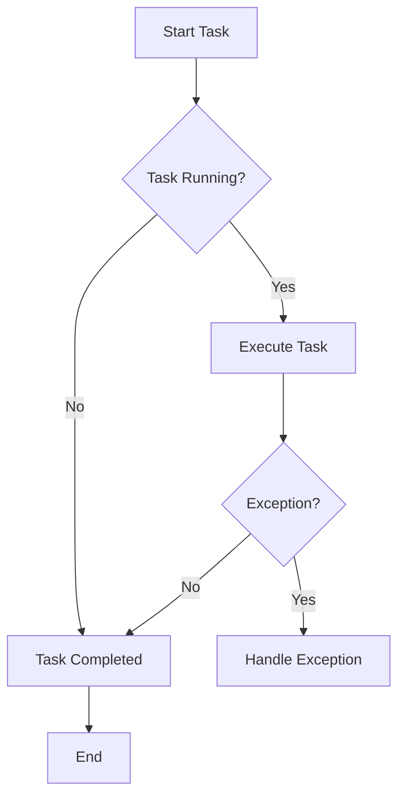

## 8.3 Parallelism with Task Parallel Library (TPL)

In the modern era of computing, leveraging the full potential of multi-core processors is crucial for building efficient and responsive applications. The Task Parallel Library (TPL) in .NET provides a robust framework for executing tasks in parallel, making it an invaluable tool for F# developers. In this section, we'll delve into the intricacies of TPL, exploring how it can be harnessed to achieve parallelism in F# applications.

### Understanding Concurrency vs. Parallelism

Before diving into TPL, it's essential to distinguish between concurrency and parallelism, as they are often confused but serve different purposes:

- **Concurrency** is about dealing with many things at once. It involves structuring a program to handle multiple tasks, which may or may not be executed simultaneously. Concurrency is more about the structure of the program and less about execution.

- **Parallelism** is about doing many things at once. It involves executing multiple operations simultaneously, typically to improve performance by utilizing multiple CPU cores.

**When to Use Each:**
- Use **concurrency** when you need to manage multiple tasks that may involve waiting (e.g., I/O operations).
- Use **parallelism** when you need to perform CPU-bound operations that can be divided into independent tasks.

### Introduction to the Task Parallel Library (TPL)

The Task Parallel Library (TPL) is a set of public types and APIs in the `System.Threading.Tasks` namespace, designed to simplify the process of adding parallelism and concurrency to applications. The core components of TPL are:

- **Task**: Represents an asynchronous operation. It can be used to execute code in parallel.
- **Task<'T>**: A generic version of Task that returns a result upon completion.

#### Creating and Running Tasks in F#

To create and run tasks in F#, you can use `Task.Run` or `Task.Factory.StartNew`. Here's how you can do it:

```fsharp
open System.Threading.Tasks

// Using Task.Run to start a task
let task1 = Task.Run(fun () ->
    printfn "Task 1 is running"
    // Simulate work
    System.Threading.Thread.Sleep(1000)
    printfn "Task 1 completed"
)

// Using Task.Factory.StartNew to start a task
let task2 = Task.Factory.StartNew(fun () ->
    printfn "Task 2 is running"
    // Simulate work
    System.Threading.Thread.Sleep(1000)
    printfn "Task 2 completed"
)

// Wait for tasks to complete
Task.WaitAll([| task1; task2 |])
```

**Key Points:**
- `Task.Run` is a simpler and more modern approach to starting tasks.
- `Task.Factory.StartNew` provides more control over task creation options.

### Data Parallelism with Parallel.For and Parallel.ForEach

Data parallelism involves performing the same operation on elements of a collection in parallel. TPL provides `Parallel.For` and `Parallel.ForEach` for this purpose.

#### Using Parallel.For

`Parallel.For` is used for parallelizing loops with a known range:

```fsharp
open System.Threading.Tasks

// Parallel.For example
Parallel.For(0, 10, fun i ->
    printfn "Processing item %d on thread %d" i System.Threading.Thread.CurrentThread.ManagedThreadId
)
```

#### Using Parallel.ForEach

`Parallel.ForEach` is used for parallelizing operations on collections:

```fsharp
open System.Threading.Tasks

let items = [1..10]

// Parallel.ForEach example
Parallel.ForEach(items, fun item ->
    printfn "Processing item %d on thread %d" item System.Threading.Thread.CurrentThread.ManagedThreadId
)
```

**Try It Yourself:**
- Modify the range or collection size to observe how the workload is distributed across threads.
- Add a delay inside the loop to simulate longer processing times and see how it affects parallel execution.

### Parallel LINQ (PLINQ)

PLINQ extends LINQ to support parallel execution of queries. It can be used to perform parallel operations on collections, making it easy to parallelize data processing.

```fsharp
open System.Linq

let numbers = [| 1; 2; 3; 4; 5; 6; 7; 8; 9; 10 |]

// Using PLINQ to perform parallel operations
let squares = numbers.AsParallel().Select(fun n -> n * n).ToArray()

printfn "Squares: %A" squares
```

**Key Points:**
- Use `AsParallel()` to convert a collection to a parallel query.
- PLINQ automatically partitions the data and executes the query in parallel.

### Handling Exceptions and Cancellations

When dealing with parallel tasks, handling exceptions and cancellations is crucial to ensure robustness.

#### Handling Exceptions

Exceptions in tasks can be handled using `try-catch` blocks or by checking the `Task.Exception` property.

```fsharp
open System

let task = Task.Run(fun () ->
    try
        // Simulate an exception
        raise (InvalidOperationException("An error occurred"))
    with
    | ex -> printfn "Caught exception: %s" ex.Message
)

task.Wait()
```

#### Using CancellationToken

A `CancellationToken` allows you to cancel tasks gracefully.

```fsharp
open System.Threading

let cts = new CancellationTokenSource()

let task = Task.Run(fun () ->
    while not cts.Token.IsCancellationRequested do
        printfn "Task is running"
        System.Threading.Thread.Sleep(500)
)

System.Threading.Thread.Sleep(2000)
cts.Cancel() // Request cancellation
task.Wait()
```

**Key Points:**
- Use `CancellationTokenSource` to create a token that can be passed to tasks.
- Check `IsCancellationRequested` within the task to handle cancellation.

### Awaiting and Composing Tasks

Tasks can be awaited and composed to continue processing once they complete.

#### Awaiting Tasks

In F#, you can use `Async.AwaitTask` to await tasks.

```fsharp
open System.Threading.Tasks
open Microsoft.FSharp.Control

let asyncTask = async {
    let! result = Task.Run(fun () -> 42) |> Async.AwaitTask
    printfn "Result: %d" result
}

Async.RunSynchronously asyncTask
```

#### Composing Tasks

Tasks can be composed using `Task.WhenAll` or `Task.WhenAny`.

```fsharp
let task1 = Task.Run(fun () -> 1)
let task2 = Task.Run(fun () -> 2)

let combinedTask = Task.WhenAll([| task1; task2 |])

combinedTask.ContinueWith(fun t ->
    printfn "All tasks completed"
)
```

### Potential Pitfalls and Synchronization Issues

Parallel programming introduces challenges such as race conditions and synchronization issues. Here are some tips to avoid them:

- **Race Conditions**: Occur when multiple tasks access shared data concurrently. Use locks or other synchronization primitives to protect shared data.
- **Deadlocks**: Can occur if tasks wait indefinitely for resources. Avoid nested locks and ensure resources are acquired in a consistent order.
- **Thread Safety**: Ensure that shared data is accessed in a thread-safe manner.

### Combining TPL with F# Asynchronous Workflows

F# asynchronous workflows (`async`) can be combined with TPL to leverage both paradigms.

```fsharp
open System.Threading.Tasks
open Microsoft.FSharp.Control

let asyncWorkflow = async {
    let! result = Task.Run(fun () -> 42) |> Async.AwaitTask
    printfn "Result from task: %d" result
}

Async.Start asyncWorkflow
```

**Best Practices:**
- Use TPL for CPU-bound operations and `async` for I/O-bound operations.
- Combine them when you need to integrate asynchronous workflows with parallel tasks.

### Best Practices for Maximizing Performance

To maximize performance and write thread-safe parallel code, consider the following best practices:

- **Minimize Lock Contention**: Use fine-grained locking and avoid unnecessary locks.
- **Partition Workload**: Divide tasks into independent units to maximize parallelism.
- **Avoid Blocking Calls**: Use asynchronous operations to prevent blocking threads.
- **Profile and Optimize**: Use profiling tools to identify bottlenecks and optimize performance.
- **Use Immutable Data Structures**: Reduce the risk of race conditions by using immutable data structures.

### Visualizing Task Execution Flow

To better understand how tasks are executed and managed, let's visualize the task execution flow using a flowchart:



**Diagram Description:**
- The flowchart illustrates the lifecycle of a task from start to completion.
- It shows how tasks are executed, how exceptions are handled, and when tasks are considered complete.

### Conclusion

Parallelism with the Task Parallel Library (TPL) in F# offers powerful capabilities for executing tasks concurrently, making efficient use of multi-core processors. By understanding the differences between concurrency and parallelism, leveraging TPL components, and following best practices, you can build robust and performant applications. Remember, parallel programming introduces complexities such as race conditions and synchronization issues, so always ensure your code is thread-safe and well-tested.

## Quiz Time!



### What is the primary difference between concurrency and parallelism?

- [x] Concurrency is about dealing with many things at once, while parallelism is about doing many things at once.
- [ ] Concurrency is about doing many things at once, while parallelism is about dealing with many things at once.
- [ ] Concurrency and parallelism are the same.
- [ ] Concurrency is only used for I/O-bound operations.

> **Explanation:** Concurrency involves managing multiple tasks, which may not run simultaneously, whereas parallelism involves executing multiple tasks simultaneously.

### Which TPL component represents an asynchronous operation?

- [x] Task
- [ ] Thread
- [ ] Process
- [ ] Semaphore

> **Explanation:** The `Task` component in TPL represents an asynchronous operation.

### How can you start a task in F# using TPL?

- [x] Task.Run or Task.Factory.StartNew
- [ ] Task.Start or Task.Begin
- [ ] Task.Execute or Task.BeginNew
- [ ] Task.Initiate or Task.Launch

> **Explanation:** Tasks in TPL can be started using `Task.Run` or `Task.Factory.StartNew`.

### What is the purpose of Parallel.ForEach?

- [x] To perform parallel operations on collections
- [ ] To execute tasks sequentially
- [ ] To handle exceptions in parallel tasks
- [ ] To cancel running tasks

> **Explanation:** `Parallel.ForEach` is used to perform parallel operations on collections.

### How can you handle exceptions in a task?

- [x] Using try-catch blocks or checking Task.Exception
- [ ] Using Task.Catch or Task.Handle
- [ ] Using Task.Error or Task.Fault
- [ ] Using Task.Try or Task.Catch

> **Explanation:** Exceptions in tasks can be handled using try-catch blocks or by checking the `Task.Exception` property.

### What is a CancellationToken used for?

- [x] To cancel tasks gracefully
- [ ] To start tasks
- [ ] To handle exceptions
- [ ] To execute tasks in parallel

> **Explanation:** A `CancellationToken` is used to cancel tasks gracefully.

### How can you await a task in F#?

- [x] Using Async.AwaitTask
- [ ] Using Task.Await
- [ ] Using Task.Wait
- [ ] Using Task.Complete

> **Explanation:** In F#, you can use `Async.AwaitTask` to await tasks.

### What is a potential pitfall of parallel programming?

- [x] Race conditions
- [ ] Sequential execution
- [ ] Improved performance
- [ ] Reduced complexity

> **Explanation:** Race conditions are a potential pitfall of parallel programming, occurring when multiple tasks access shared data concurrently.

### How can you combine TPL with F# asynchronous workflows?

- [x] By using Async.AwaitTask
- [ ] By using Task.Combine
- [ ] By using Task.Merge
- [ ] By using Task.Sync

> **Explanation:** You can combine TPL with F# asynchronous workflows by using `Async.AwaitTask`.

### Is it true that parallelism is only useful for CPU-bound operations?

- [x] True
- [ ] False

> **Explanation:** Parallelism is particularly useful for CPU-bound operations, as it allows multiple tasks to be executed simultaneously, utilizing multiple CPU cores.



Remember, this is just the beginning. As you progress, you'll build more complex and efficient parallel applications. Keep experimenting, stay curious, and enjoy the journey!
