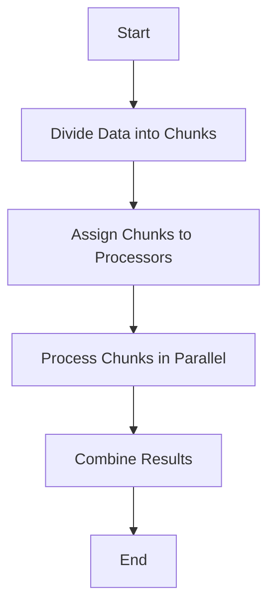

## 8.4 Data Parallelism

In the realm of high-performance computing, data parallelism stands out as a powerful paradigm for processing large datasets efficiently. By distributing data across multiple processors, data parallelism allows for simultaneous computation, significantly reducing execution time. This section delves into the intricacies of data parallelism in F#, exploring its implementation through `Array.Parallel` and `PSeq` (Parallel Sequences), and offering insights into best practices for achieving optimal performance.

### Understanding Data Parallelism

**Data Parallelism** involves distributing subsets of data across multiple processing units to perform the same operation on each subset concurrently. This approach contrasts with **Task Parallelism**, where different tasks are executed in parallel, potentially on different data. In data parallelism, the focus is on parallelizing operations over collections, making it particularly suitable for data-intensive applications.

### F# Support for Data Parallelism

F# provides robust support for data parallelism through the `Array.Parallel` module and the `PSeq` module from the F# PowerPack. These modules offer parallelized versions of common collection operations, enabling developers to harness the power of multi-core processors with minimal code changes.

#### Array.Parallel

The `Array.Parallel` module in F# facilitates parallel operations on arrays. Functions such as `Array.Parallel.map` and `Array.Parallel.iter` allow for parallel processing of array elements, providing a straightforward way to improve performance.

```fsharp
let numbers = [| 1 .. 1000000 |]

// Parallel map operation to square each number
let squaredNumbers = Array.Parallel.map (fun x -> x * x) numbers

// Output the first 10 squared numbers
printfn "%A" (squaredNumbers |> Array.take 10)
```

In this example, `Array.Parallel.map` is used to square each element of the array in parallel, demonstrating a simple yet effective use of data parallelism.

#### PSeq (Parallel Sequences)

The `PSeq` module extends the concept of parallelism to sequences, offering a more flexible approach compared to arrays. It is part of the F# PowerPack and provides functions like `PSeq.map` and `PSeq.filter` for parallel processing of sequences.

```fsharp
open FSharp.Collections.ParallelSeq

let numbersSeq = seq { 1 .. 1000000 }

// Parallel map operation to cube each number
let cubedNumbers = numbersSeq |> PSeq.map (fun x -> x * x * x)

// Output the first 10 cubed numbers
printfn "%A" (cubedNumbers |> Seq.take 10)
```

Here, `PSeq.map` is used to cube each element of the sequence in parallel, showcasing the power of parallel sequences in handling large datasets.

### Thread Safety in Parallel Operations

When working with parallel operations, ensuring thread safety is crucial, especially when dealing with mutable data. F# encourages immutability, which naturally aligns with safe parallel processing. However, if mutable data structures are necessary, synchronization mechanisms such as locks or concurrent collections should be employed to prevent race conditions.

```fsharp
open System.Collections.Concurrent

let concurrentDict = ConcurrentDictionary<int, int>()

let addToDict key value =
    concurrentDict.AddOrUpdate(key, value, (fun _ oldValue -> oldValue + value))

// Parallel operation with thread-safe updates
[| 1 .. 1000 |]
|> Array.Parallel.iter (fun x -> addToDict x (x * 2))

printfn "Dictionary count: %d" concurrentDict.Count
```

In this example, `ConcurrentDictionary` is used to safely update a shared dictionary in parallel, illustrating how to handle mutable state in a thread-safe manner.

### Performance Improvements with Data Parallelism

Data parallelism can lead to significant performance improvements, particularly in scenarios involving large datasets or computationally intensive operations. By leveraging multiple cores, operations that would otherwise be time-consuming can be executed more rapidly.

#### Case Study: Image Processing

Consider an image processing application where each pixel needs to be processed independently. Data parallelism can be employed to process multiple pixels simultaneously, drastically reducing processing time.

```fsharp
type Pixel = { R: byte; G: byte; B: byte }

let processPixel (pixel: Pixel) =
    // Simulate a complex operation on the pixel
    { R = byte (pixel.R / 2); G = byte (pixel.G / 2); B = byte (pixel.B / 2) }

let image = Array.init 1000000 (fun _ -> { R = 255uy; G = 255uy; B = 255uy })

let processedImage = Array.Parallel.map processPixel image

printfn "Processed %d pixels" processedImage.Length
```

In this image processing example, `Array.Parallel.map` is used to process each pixel in parallel, demonstrating how data parallelism can enhance performance in real-world applications.

### Overhead and Workload Considerations

While data parallelism offers performance benefits, it also introduces overhead due to task scheduling and context switching. It's essential to assess whether the overhead outweighs the benefits for a given workload. For small datasets or operations with minimal computational complexity, the overhead may negate any performance gains.

#### Profiling and Benchmarking Parallel Code

Profiling and benchmarking are vital for understanding the performance characteristics of parallel code. Tools such as the .NET Performance Profiler can help identify bottlenecks and measure the impact of parallelization.

```fsharp
open System.Diagnostics

let stopwatch = Stopwatch.StartNew()

// Parallel operation
let result = Array.Parallel.map (fun x -> x * x) [| 1 .. 1000000 |]

stopwatch.Stop()
printfn "Parallel operation took %d ms" stopwatch.ElapsedMilliseconds
```

This code snippet demonstrates how to use a stopwatch to measure the execution time of a parallel operation, providing insights into performance improvements.

### Effective Data Partitioning

Effective data partitioning is crucial for achieving load balancing across processors. By dividing data into chunks that can be processed independently, we can ensure that all processors are utilized efficiently.

#### Strategies for Data Partitioning

1. **Static Partitioning**: Divide the data into fixed-size chunks. This approach is simple but may lead to load imbalance if the workload is not evenly distributed.

2. **Dynamic Partitioning**: Adjust the size of data chunks dynamically based on workload. This strategy can improve load balancing but may introduce additional overhead.

3. **Domain-Specific Partitioning**: Tailor partitioning strategies to the specific characteristics of the data and operations. For example, in image processing, partitioning by rows or columns may be more effective.

### Best Practices for Data Parallelism

To write efficient data-parallel code, consider the following best practices:

- **Minimize Synchronization**: Avoid unnecessary synchronization, which can negate the benefits of parallelism.
- **Avoid Shared Mutable State**: Use immutable data structures or thread-safe collections to prevent race conditions.
- **Profile and Benchmark**: Regularly profile and benchmark code to identify performance bottlenecks and validate improvements.
- **Consider Overhead**: Assess the overhead associated with parallelization and ensure that it is justified by the performance gains.
- **Optimize Data Partitioning**: Implement effective data partitioning strategies to achieve load balancing and maximize processor utilization.

### Try It Yourself

To deepen your understanding of data parallelism, try modifying the code examples provided:

- Experiment with different data sizes and observe how performance scales with parallelism.
- Implement a parallel version of a different collection operation, such as `filter` or `reduce`.
- Explore the impact of thread safety by introducing mutable state and employing synchronization mechanisms.

### Visualizing Data Parallelism

To better understand how data parallelism works, let's visualize the process of parallelizing an array operation using a flowchart.



This flowchart illustrates the key steps involved in data parallelism: dividing data, assigning it to processors, processing it in parallel, and combining the results.

### Conclusion

Data parallelism in F# offers a powerful mechanism for improving the performance of data-intensive applications. By leveraging `Array.Parallel` and `PSeq`, developers can easily parallelize operations over collections, harnessing the full potential of multi-core processors. However, it's crucial to consider the overhead associated with parallelization and to employ best practices for writing efficient, thread-safe code. With careful implementation and regular profiling, data parallelism can lead to significant performance gains, enabling the development of high-performance applications.

## Quiz Time!



### What is the primary focus of data parallelism?

- [x] Distributing subsets of data across multiple processing units
- [ ] Executing different tasks in parallel
- [ ] Synchronizing threads for shared data access
- [ ] Reducing memory usage in applications

> **Explanation:** Data parallelism focuses on distributing data across processors to perform the same operation concurrently, enhancing performance in data-intensive tasks.

### Which F# module provides parallel operations for arrays?

- [x] Array.Parallel
- [ ] PSeq
- [ ] Seq
- [ ] List.Parallel

> **Explanation:** The `Array.Parallel` module in F# offers functions for parallel operations on arrays, such as `Array.Parallel.map`.

### How does the `PSeq` module extend parallelism in F#?

- [x] By providing parallel operations for sequences
- [ ] By optimizing memory usage
- [ ] By enhancing array operations
- [ ] By simplifying thread synchronization

> **Explanation:** The `PSeq` module extends parallelism to sequences, allowing parallel processing of sequence elements.

### What is a key consideration when using mutable data in parallel operations?

- [x] Ensuring thread safety
- [ ] Reducing memory usage
- [ ] Increasing data size
- [ ] Simplifying code structure

> **Explanation:** When using mutable data in parallel operations, it's crucial to ensure thread safety to prevent race conditions and data corruption.

### What is a potential drawback of data parallelism?

- [x] Overhead from task scheduling and context switching
- [ ] Increased memory usage
- [ ] Reduced code readability
- [ ] Limited scalability

> **Explanation:** Data parallelism introduces overhead due to task scheduling and context switching, which can negate performance gains for small datasets.

### Which strategy is NOT effective for data partitioning?

- [ ] Static Partitioning
- [ ] Dynamic Partitioning
- [ ] Domain-Specific Partitioning
- [x] Random Partitioning

> **Explanation:** Random partitioning is not effective as it can lead to load imbalance and inefficient processor utilization.

### What tool can be used to profile parallel code in .NET?

- [x] .NET Performance Profiler
- [ ] Visual Studio Code
- [ ] F# Interactive
- [ ] Task Manager

> **Explanation:** The .NET Performance Profiler is a tool that helps identify bottlenecks and measure the performance of parallel code.

### Which practice should be avoided in data-parallel code?

- [x] Sharing mutable state without synchronization
- [ ] Using immutable data structures
- [ ] Profiling and benchmarking code
- [ ] Optimizing data partitioning

> **Explanation:** Sharing mutable state without synchronization can lead to race conditions and should be avoided in data-parallel code.

### What is the benefit of using `Array.Parallel.map`?

- [x] It allows parallel processing of array elements
- [ ] It reduces memory usage
- [ ] It simplifies code structure
- [ ] It enhances code readability

> **Explanation:** `Array.Parallel.map` enables parallel processing of array elements, improving performance for large datasets.

### True or False: Data parallelism is always beneficial for small datasets.

- [ ] True
- [x] False

> **Explanation:** Data parallelism introduces overhead, which may negate performance benefits for small datasets, making it less beneficial in such cases.


