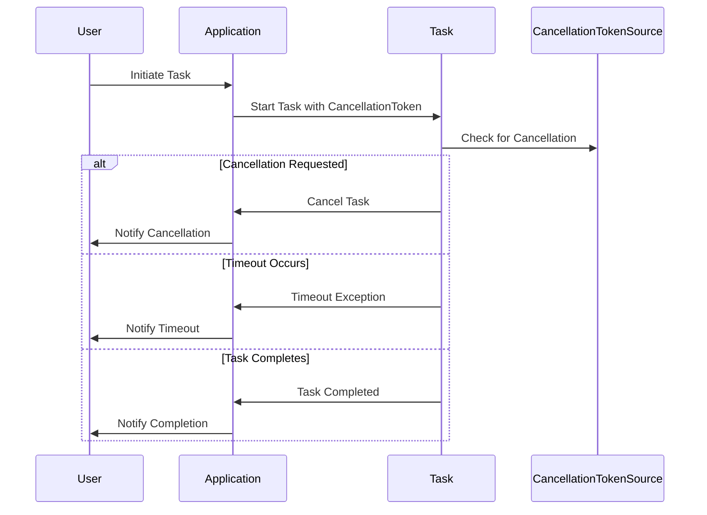

## 8.8 Cancellation and Timeout Handling

In the realm of modern software development, especially when dealing with asynchronous operations, the ability to cancel long-running or unresponsive tasks is crucial. This capability not only enhances the responsiveness of applications but also ensures efficient resource management. In this section, we will delve into the intricacies of implementing cancellation and timeout handling in F#, focusing on the use of `CancellationTokenSource`, `CancellationToken`, and best practices for managing asynchronous workflows.

### The Importance of Cancellation in Responsive Applications

In today's fast-paced digital environment, users expect applications to be responsive and agile. Long-running operations, such as network requests or complex computations, can lead to unresponsive applications if not managed properly. Implementing cancellation allows applications to:

- **Respond to User Actions**: Users can cancel operations they initiated, such as file downloads or data processing tasks.
- **Adapt to System Conditions**: Applications can terminate operations based on system constraints, like low memory or CPU availability.
- **Improve Resource Utilization**: By stopping unnecessary tasks, applications can free up resources for more critical operations.

### Introducing `CancellationTokenSource` and `CancellationToken`

F# provides robust support for cancellation through the `CancellationTokenSource` and `CancellationToken` types. These types are integral to propagating cancellation requests across asynchronous workflows.

- **`CancellationTokenSource`**: This is the main type used to signal cancellation. It generates a `CancellationToken` that can be passed to tasks and async workflows.
- **`CancellationToken`**: This token is used by tasks and async workflows to check for cancellation requests.

#### Example: Creating and Using a Cancellation Token

```fsharp
open System.Threading

// Create a CancellationTokenSource
let cts = new CancellationTokenSource()

// Obtain the CancellationToken from the source
let token = cts.Token

// Simulate a task that checks for cancellation
let longRunningTask (token: CancellationToken) =
    async {
        for i in 1 .. 10 do
            // Check if cancellation has been requested
            if token.IsCancellationRequested then
                printfn "Task was cancelled."
                return
            else
                printfn "Processing step %d" i
                do! Async.Sleep 1000 // Simulate work
    }

// Start the task
let task = longRunningTask token |> Async.Start

// Cancel the task after 3 seconds
Async.Sleep 3000 |> Async.RunSynchronously
cts.Cancel()
```

### Handling Cancellation in Async Workflows

To effectively handle cancellation, it's essential to pass the `CancellationToken` to async workflows and check for cancellation within `async { }` blocks.

#### Passing the CancellationToken

When defining an async workflow, ensure that the `CancellationToken` is an argument, and use it to check for cancellation requests.

```fsharp
let cancellableWorkflow (token: CancellationToken) =
    async {
        // Perform work and periodically check for cancellation
        for i in 1 .. 10 do
            if token.IsCancellationRequested then
                printfn "Cancellation requested. Exiting workflow."
                return
            else
                printfn "Working on item %d" i
                do! Async.Sleep 500
    }
```

#### Throwing `OperationCanceledException`

When a cancellation is detected, it's a common practice to throw an `OperationCanceledException`. This exception is recognized by the .NET framework and can be used to gracefully terminate operations.

```fsharp
let cancellableOperation (token: CancellationToken) =
    async {
        try
            for i in 1 .. 10 do
                if token.IsCancellationRequested then
                    printfn "Cancellation detected."
                    // Throwing the exception to terminate the operation
                    raise (OperationCanceledException("Operation was cancelled.", token))
                else
                    printfn "Processing item %d" i
                    do! Async.Sleep 500
        with
        | :? OperationCanceledException as ex ->
            printfn "Caught cancellation exception: %s" ex.Message
    }
```

### Implementing Timeouts in Async Workflows

Timeouts are another critical aspect of managing asynchronous operations. They ensure that tasks do not run indefinitely, which can lead to resource exhaustion.

#### Using `Async.WithTimeout`

F# provides the `Async.WithTimeout` function to specify a maximum duration for an async operation. If the operation exceeds this duration, it is automatically cancelled.

```fsharp
let operationWithTimeout =
    async {
        printfn "Starting operation with timeout."
        do! Async.Sleep 5000 // Simulate a long-running task
        printfn "Operation completed."
    }

// Apply a timeout of 3 seconds
let operationWithTimeoutApplied = operationWithTimeout |> Async.WithTimeout 3000

// Run the operation
try
    Async.RunSynchronously operationWithTimeoutApplied
with
| :? TimeoutException ->
    printfn "Operation timed out."
```

#### Combining Async Workflows with Timeout Logic

You can also manually implement timeout logic by combining async workflows with cancellation tokens.

```fsharp
let operationWithManualTimeout (token: CancellationToken) =
    async {
        let! completed = Async.Choice [
            async {
                do! Async.Sleep 5000 // Simulate work
                return Some "Operation completed."
            }
            async {
                do! Async.Sleep 3000 // Timeout duration
                return None
            }
        ]
        match completed with
        | Some result -> printfn "%s" result
        | None -> printfn "Operation timed out."
    }
```

### Best Practices for Resource Cleanup and Consistent State

When cancellation occurs, it's vital to ensure that resources are cleaned up properly and the application remains in a consistent state.

#### Using `use!` and `finally` Expressions

F# provides `use!` and `finally` expressions within async workflows to manage resource disposal and ensure that cleanup code is executed, even if a cancellation occurs.

```fsharp
let safeResourceHandling (token: CancellationToken) =
    async {
        use! resource = async {
            printfn "Acquiring resource."
            // Simulate resource acquisition
            return new System.IO.MemoryStream()
        }
        try
            for i in 1 .. 10 do
                if token.IsCancellationRequested then
                    printfn "Cancellation detected. Cleaning up."
                    return
                else
                    printfn "Using resource for item %d" i
                    do! Async.Sleep 500
        finally
            printfn "Releasing resource."
            resource.Dispose()
    }
```

### Thread Synchronization and Cancellation

Cancellation in asynchronous workflows often involves multiple threads. It's essential to handle thread synchronization properly to avoid race conditions and ensure that cancellation requests are processed correctly.

- **Use Locks**: When shared resources are involved, use locks to prevent concurrent access issues.
- **Atomic Operations**: Ensure that operations checking for cancellation and updating shared state are atomic.

### Designing Cancellation-Aware APIs

When designing APIs, it's crucial to make them cancellation-aware. This involves:

- **Accepting CancellationTokens**: Ensure that your API methods accept `CancellationToken` parameters.
- **Documenting Behavior**: Clearly document how cancellation is handled and what the expected behavior is when cancellation occurs.
- **Graceful Termination**: Design your APIs to terminate gracefully, releasing resources and maintaining a consistent state.

### Testing and Validating Cancellation Behavior

Testing cancellation behavior is an essential part of ensuring that your application handles cancellations correctly. Here are some strategies:

- **Simulate Cancellations**: Use unit tests to simulate cancellation scenarios and verify that resources are released and state remains consistent.
- **Stress Testing**: Perform stress tests to ensure that your application can handle frequent cancellation requests without degrading performance.
- **Mocking**: Use mocking frameworks to simulate cancellation tokens and test how your code responds to cancellation requests.

### Try It Yourself

To solidify your understanding, try modifying the examples provided:

- **Experiment with Different Timeout Durations**: Change the timeout durations in the examples and observe how the behavior changes.
- **Simulate Resource-Intensive Tasks**: Modify the examples to simulate more resource-intensive tasks and see how cancellation affects them.
- **Implement Custom Cancellation Logic**: Create a custom cancellation logic that combines multiple conditions, such as user input and system constraints.

### Visualizing Cancellation and Timeout Handling

To better understand the flow of cancellation and timeout handling in F#, let's visualize the process using a sequence diagram.



### Summary

In this section, we've explored the critical aspects of cancellation and timeout handling in F#. By understanding how to implement cooperative cancellation using `CancellationTokenSource` and `CancellationToken`, and how to manage timeouts effectively, you can build responsive and robust applications. Remember, designing cancellation-aware APIs and testing your cancellation logic are key to ensuring your applications can handle cancellations gracefully.

## Quiz Time!



### What is the primary purpose of cancellation in asynchronous operations?

- [x] To enhance application responsiveness
- [ ] To increase the complexity of code
- [ ] To reduce the number of threads used
- [ ] To improve network latency

> **Explanation:** Cancellation in asynchronous operations is primarily used to enhance application responsiveness by allowing tasks to be stopped when they are no longer needed.

### Which type is used to signal cancellation in F#?

- [ ] CancellationRequest
- [x] CancellationTokenSource
- [ ] CancellationSignal
- [ ] CancellationManager

> **Explanation:** `CancellationTokenSource` is the type used to signal cancellation requests in F#.

### How do you check for cancellation within an async workflow?

- [ ] By using a try-catch block
- [x] By checking the IsCancellationRequested property
- [ ] By using a while loop
- [ ] By calling a cancel method

> **Explanation:** Within an async workflow, you check for cancellation by examining the `IsCancellationRequested` property of the `CancellationToken`.

### What exception should be thrown to indicate an operation was cancelled?

- [ ] TimeoutException
- [ ] InvalidOperationException
- [x] OperationCanceledException
- [ ] TaskCanceledException

> **Explanation:** `OperationCanceledException` is the standard exception thrown to indicate that an operation was cancelled.

### How can you implement a timeout for an async operation in F#?

- [x] Using Async.WithTimeout
- [ ] Using a for loop
- [ ] By increasing the thread count
- [ ] By using a delay function

> **Explanation:** You can implement a timeout for an async operation in F# using `Async.WithTimeout`.

### What is a best practice when handling cancellation in async workflows?

- [x] Clean up resources and maintain a consistent state
- [ ] Ignore the cancellation request
- [ ] Increase the timeout duration
- [ ] Use more threads

> **Explanation:** A best practice when handling cancellation is to clean up resources and maintain a consistent state.

### Which expression in F# helps manage resource disposal in async workflows?

- [ ] try-catch
- [x] use!
- [ ] let!
- [ ] match

> **Explanation:** The `use!` expression in F# helps manage resource disposal in async workflows.

### What should be included in API design to support cancellation?

- [ ] A large number of parameters
- [x] Acceptance of CancellationTokens
- [ ] Complex logic
- [ ] Multiple return types

> **Explanation:** To support cancellation, APIs should accept `CancellationTokens`.

### Why is it important to test cancellation behavior?

- [x] To ensure resources are released and state remains consistent
- [ ] To increase the number of test cases
- [ ] To reduce code complexity
- [ ] To improve code readability

> **Explanation:** Testing cancellation behavior is important to ensure that resources are released and the application state remains consistent.

### True or False: Cancellation handling in F# requires manual thread management.

- [ ] True
- [x] False

> **Explanation:** Cancellation handling in F# does not require manual thread management; it is managed through the use of `CancellationTokenSource` and `CancellationToken`.



Remember, mastering cancellation and timeout handling is just one step in building robust and responsive applications. Keep experimenting, stay curious, and enjoy the journey of learning F# design patterns!
