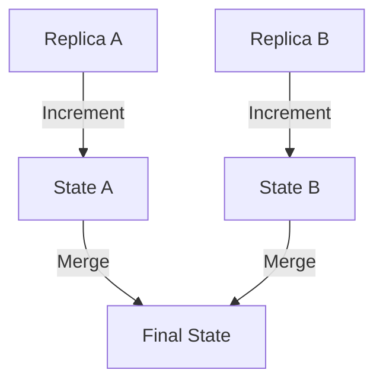
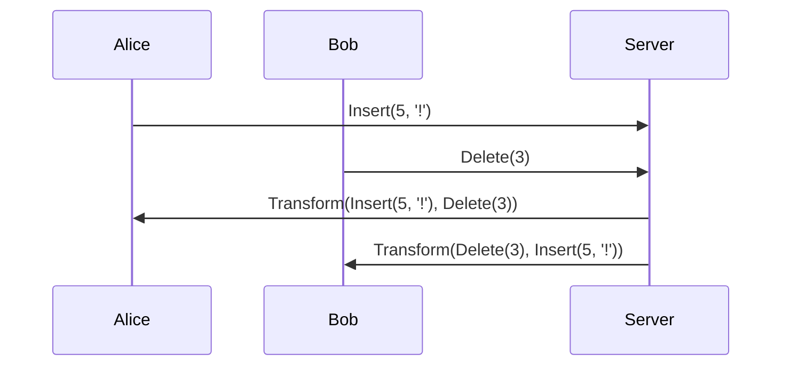

## 8.9 Operational Transformation and CRDTs

In the ever-evolving landscape of distributed systems, maintaining data consistency across multiple nodes is a formidable challenge. As systems grow in complexity and scale, ensuring that all nodes in a network agree on the state of shared data becomes increasingly difficult. This section delves into two powerful techniques—Operational Transformation (OT) and Conflict-Free Replicated Data Types (CRDTs)—that address these challenges by enabling consistency and conflict resolution without centralized coordination.

### Introduction to Consistency Challenges in Distributed Systems

Distributed systems are characterized by multiple independent nodes that communicate over a network. This architecture offers benefits such as fault tolerance, scalability, and geographic distribution. However, it also introduces significant challenges, particularly when it comes to maintaining consistency in the face of concurrent updates and network partitions.

#### Key Challenges:

- **Concurrency**: Multiple nodes may attempt to update the same piece of data simultaneously, leading to conflicts.
- **Latency**: Network delays can cause nodes to have outdated views of the system state.
- **Partitioning**: Network failures can isolate nodes, leading to divergent states.
- **Scalability**: As the number of nodes increases, so does the complexity of managing consistency.

### Operational Transformation (OT)

Operational Transformation is a technique designed to enable collaborative editing in distributed systems. It allows multiple users to edit a shared document simultaneously, ensuring that all changes are consistently applied across all replicas.

#### How OT Works

OT works by transforming operations to account for the effects of concurrent updates. When a user makes a change, the operation is transformed based on other operations that have been applied concurrently. This transformation ensures that all replicas converge to the same state.

**Example**: Consider a shared text document where two users, Alice and Bob, are editing concurrently. If Alice inserts a character at position 5 and Bob deletes a character at position 3, OT will transform these operations to ensure both changes are applied consistently.

#### Applying OT in Real-Time Collaborative Applications

OT is widely used in real-time collaborative applications, such as Google Docs, where multiple users can edit documents simultaneously. By transforming operations in real-time, these applications provide a seamless collaborative experience.

**Code Example**: Implementing a simple OT system in F#.

```fsharp
type Operation =
    | Insert of int * char
    | Delete of int

let transform op1 op2 =
    match op1, op2 with
    | Insert(pos1, _), Insert(pos2, _) when pos1 <= pos2 -> op1
    | Insert(pos1, _), Insert(pos2, _) -> Insert(pos1 + 1, snd op1)
    | Delete(pos1), Insert(pos2, _) when pos1 < pos2 -> op1
    | Delete(pos1), Insert(pos2, _) -> Delete(pos1 + 1)
    | Insert(pos1, _), Delete(pos2) when pos1 <= pos2 -> op1
    | Insert(pos1, _), Delete(pos2) -> Insert(pos1 - 1, snd op1)
    | Delete(pos1), Delete(pos2) when pos1 < pos2 -> op1
    | Delete(pos1), Delete(pos2) -> Delete(pos1 - 1)

let applyOperation doc op =
    match op with
    | Insert(pos, char) -> doc.Insert(pos, char)
    | Delete(pos) -> doc.Remove(pos, 1)

let doc = new System.Text.StringBuilder("Hello")
let op1 = Insert(5, '!')
let op2 = Delete(3)

let transformedOp1 = transform op1 op2
let transformedOp2 = transform op2 op1

applyOperation doc transformedOp1
applyOperation doc transformedOp2
```

### Conflict-Free Replicated Data Types (CRDTs)

CRDTs are data structures that enable consistency in distributed systems by ensuring that all replicas can be merged without conflicts. They are designed to be commutative, associative, and idempotent, allowing updates to be applied in any order and still converge to the same state.

#### Properties of CRDTs

- **Commutativity**: The order of operations does not affect the final state.
- **Associativity**: Grouping of operations does not affect the final state.
- **Idempotency**: Applying the same operation multiple times has the same effect as applying it once.

#### Implementing Basic CRDTs in F#

Let's explore some basic CRDTs and how they can be implemented in F#.

##### Grow-Only Counter (G-Counter)

A G-Counter is a simple CRDT that only allows increment operations. Each replica maintains its own counter, and the global count is the sum of all replica counts.

```fsharp
type GCounter = Map<string, int>

let increment (replicaId: string) (counter: GCounter) =
    let current = Map.tryFind replicaId counter |> Option.defaultValue 0
    Map.add replicaId (current + 1) counter

let merge (counter1: GCounter) (counter2: GCounter) =
    Map.fold (fun acc key value ->
        let maxVal = max value (Map.tryFind key acc |> Option.defaultValue 0)
        Map.add key maxVal acc) counter1 counter2

let counterA = Map.empty |> increment "A"
let counterB = Map.empty |> increment "B" |> increment "B"

let mergedCounter = merge counterA counterB
let total = Map.fold (fun acc _ value -> acc + value) 0 mergedCounter
```

##### Positive-Negative Counter (PN-Counter)

A PN-Counter extends the G-Counter by allowing both increment and decrement operations. It maintains two G-Counters: one for increments and one for decrements.

```fsharp
type PNCounter = { Pos: GCounter; Neg: GCounter }

let incrementPN (replicaId: string) (counter: PNCounter) =
    { counter with Pos = increment replicaId counter.Pos }

let decrementPN (replicaId: string) (counter: PNCounter) =
    { counter with Neg = increment replicaId counter.Neg }

let mergePN (counter1: PNCounter) (counter2: PNCounter) =
    { Pos = merge counter1.Pos counter2.Pos; Neg = merge counter1.Neg counter2.Neg }

let valuePN (counter: PNCounter) =
    let posTotal = Map.fold (fun acc _ value -> acc + value) 0 counter.Pos
    let negTotal = Map.fold (fun acc _ value -> acc + value) 0 counter.Neg
    posTotal - negTotal

let counterPN1 = { Pos = Map.empty; Neg = Map.empty } |> incrementPN "A"
let counterPN2 = { Pos = Map.empty; Neg = Map.empty } |> incrementPN "B" |> decrementPN "B"

let mergedPNCounter = mergePN counterPN1 counterPN2
let totalPN = valuePN mergedPNCounter
```

##### Observed-Remove Set (OR-Set)

An OR-Set is a CRDT that allows elements to be added and removed. It tracks the context of each addition to ensure that only the intended elements are removed.

```fsharp
type ORSet<'T> = Map<'T, Set<string>>

let add (replicaId: string) (element: 'T) (set: ORSet<'T>) =
    let current = Map.tryFind element set |> Option.defaultValue Set.empty
    Map.add element (Set.add replicaId current) set

let remove (replicaId: string) (element: 'T) (set: ORSet<'T>) =
    let current = Map.tryFind element set |> Option.defaultValue Set.empty
    let updated = Set.remove replicaId current
    if Set.isEmpty updated then Map.remove element set else Map.add element updated set

let mergeOR (set1: ORSet<'T>) (set2: ORSet<'T>) =
    Map.fold (fun acc key value ->
        let merged = Set.union value (Map.tryFind key acc |> Option.defaultValue Set.empty)
        Map.add key merged acc) set1 set2

let elements (set: ORSet<'T>) =
    Map.fold (fun acc key value -> if not (Set.isEmpty value) then Set.add key acc else acc) Set.empty set

let setA = Map.empty |> add "A" "apple"
let setB = Map.empty |> add "B" "banana" |> remove "B" "apple"

let mergedSet = mergeOR setA setB
let finalElements = elements mergedSet
```

### Merging State from Different Replicas

One of the key advantages of CRDTs is their ability to merge state from different replicas without conflicts. This is achieved through the properties of commutativity, associativity, and idempotency, which ensure that the order and grouping of operations do not affect the final state.

#### Practical Applications of CRDTs

CRDTs are particularly useful in distributed databases, synchronization services, and offline-capable applications. They provide a way to achieve eventual consistency without the need for complex conflict resolution logic.

**Use Cases**:

- **Distributed Databases**: CRDTs can be used to maintain consistency across distributed nodes, allowing for high availability and partition tolerance.
- **Synchronization Services**: Applications that require data synchronization across devices can benefit from CRDTs to ensure consistent state.
- **Offline-Capable Apps**: CRDTs enable applications to function offline and synchronize changes once connectivity is restored.

### Consistency Models: Eventual Consistency vs. Strong Consistency

When designing distributed systems, it's important to choose the appropriate consistency model based on application requirements. CRDTs naturally align with eventual consistency, where replicas may temporarily diverge but eventually converge to the same state.

#### Trade-Offs:

- **Eventual Consistency**: Offers high availability and partition tolerance but may result in temporary inconsistencies.
- **Strong Consistency**: Ensures immediate consistency across replicas but can impact availability and performance.

### Challenges in Implementing OT and CRDTs

Implementing OT and CRDTs comes with its own set of challenges, including handling network failures, partitioning, and ensuring efficient transformation and merging of operations.

#### Key Challenges:

- **Network Failures**: Ensuring that operations are reliably transmitted and applied across all replicas.
- **Partitioning**: Handling scenarios where network partitions lead to divergent states.
- **Efficiency**: Optimizing the transformation and merging processes to minimize latency and resource usage.

### Best Practices for Choosing the Appropriate Strategy

When deciding between OT and CRDTs, consider the following best practices:

- **Application Requirements**: Evaluate the need for real-time collaboration versus eventual consistency.
- **Network Conditions**: Consider the reliability and latency of the network.
- **Scalability**: Assess the scalability requirements of the system.
- **Complexity**: Balance the complexity of implementation with the desired consistency guarantees.

### Try It Yourself

To deepen your understanding of OT and CRDTs, try modifying the provided code examples. Experiment with different scenarios, such as adding more replicas or introducing network partitions, to observe how the system behaves.

### Visualizing CRDTs and OT

To aid in understanding, let's visualize the concepts of CRDTs and OT using Mermaid.js diagrams.

#### CRDTs: Merging States



**Caption**: This diagram illustrates how states from different replicas are merged in a CRDT system.

#### OT: Transforming Operations



**Caption**: This sequence diagram shows how operations are transformed in an OT system to ensure consistency.

### Conclusion

Operational Transformation and CRDTs are powerful techniques for building distributed systems that require consistency and conflict resolution. By understanding the principles and trade-offs of these approaches, you can design systems that meet the specific needs of your application. Remember, this is just the beginning. As you progress, you'll be able to build more complex and reliable distributed systems. Keep experimenting, stay curious, and enjoy the journey!

## Quiz Time!



### What is the primary goal of Operational Transformation (OT)?

- [x] To enable collaborative editing by transforming operations
- [ ] To synchronize data across distributed systems
- [ ] To provide strong consistency in distributed databases
- [ ] To handle network failures in distributed systems

> **Explanation:** OT is designed to enable collaborative editing by transforming operations to account for concurrent updates.

### Which property is NOT associated with CRDTs?

- [ ] Commutativity
- [ ] Associativity
- [ ] Idempotency
- [x] Determinism

> **Explanation:** CRDTs are commutative, associative, and idempotent, allowing operations to be applied in any order. Determinism is not a specific property of CRDTs.

### What is a key advantage of CRDTs in distributed systems?

- [x] They allow merging state from different replicas without conflicts
- [ ] They provide strong consistency guarantees
- [ ] They reduce network latency
- [ ] They eliminate the need for data replication

> **Explanation:** CRDTs are designed to merge state from different replicas without conflicts, making them ideal for distributed systems.

### In a Grow-Only Counter (G-Counter), what operation is allowed?

- [x] Increment
- [ ] Decrement
- [ ] Reset
- [ ] Multiply

> **Explanation:** A G-Counter only allows increment operations, making it a simple CRDT.

### What is the primary challenge of implementing OT in real-time collaborative applications?

- [x] Transforming operations to account for concurrent updates
- [ ] Ensuring strong consistency across replicas
- [ ] Reducing network latency
- [ ] Handling data replication

> **Explanation:** The primary challenge of OT is transforming operations to ensure consistency in the presence of concurrent updates.

### Which CRDT allows both increment and decrement operations?

- [ ] G-Counter
- [x] PN-Counter
- [ ] OR-Set
- [ ] LWW-Register

> **Explanation:** A PN-Counter allows both increment and decrement operations, extending the functionality of a G-Counter.

### What is a practical application of CRDTs?

- [x] Synchronization services
- [ ] Real-time analytics
- [ ] Load balancing
- [ ] Network routing

> **Explanation:** CRDTs are useful in synchronization services to ensure consistent state across devices.

### What consistency model do CRDTs naturally align with?

- [x] Eventual consistency
- [ ] Strong consistency
- [ ] Causal consistency
- [ ] Linearizability

> **Explanation:** CRDTs naturally align with eventual consistency, where replicas may temporarily diverge but eventually converge.

### What is a key trade-off of eventual consistency?

- [x] Temporary inconsistencies
- [ ] Reduced availability
- [ ] Increased latency
- [ ] Complex conflict resolution

> **Explanation:** Eventual consistency allows for high availability but may result in temporary inconsistencies.

### True or False: CRDTs require centralized coordination to resolve conflicts.

- [ ] True
- [x] False

> **Explanation:** CRDTs do not require centralized coordination to resolve conflicts; they are designed to merge state without conflicts.


