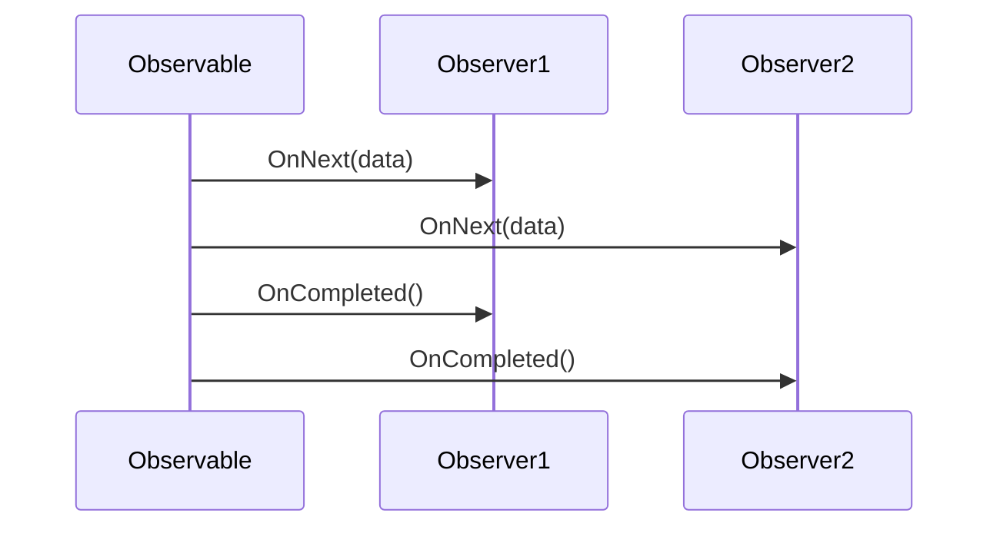

## 9.2 Observer Pattern with `IObservable` and `IObserver`

In the realm of reactive and event-driven programming, the Observer Pattern stands out as a pivotal design pattern for managing asynchronous data streams. This pattern enables decoupled communication between producers (observables) and consumers (observers), allowing for a flexible and scalable architecture. In F#, the `IObservable<'T>` and `IObserver<'T>` interfaces provide a robust framework for implementing the Observer Pattern, facilitating the creation of reactive applications.

### Understanding the Observer Pattern

The Observer Pattern is a behavioral design pattern that defines a one-to-many dependency between objects. When the state of one object (the subject or observable) changes, all its dependents (observers) are notified and updated automatically. This pattern is particularly useful in scenarios where multiple components need to react to changes in data or events, such as user interface updates, real-time data feeds, or system monitoring.

#### Key Components of the Observer Pattern

1. **Observable (Subject)**: The source of data or events. It maintains a list of observers and notifies them of any state changes.
2. **Observer**: An entity that registers interest in the observable's data or events and receives updates when changes occur.
3. **Subscription**: The mechanism through which observers register with an observable to receive updates.

### Implementing the Observer Pattern in F#

In F#, the `IObservable<'T>` and `IObserver<'T>` interfaces are central to implementing the Observer Pattern. Let's delve into how these interfaces work and how they can be used to create reactive applications.

#### `IObservable<'T>` Interface

The `IObservable<'T>` interface represents a provider of push-based notification. It defines a single method, `Subscribe`, which allows observers to register for notifications.

```fsharp
type IObservable<'T> =
    abstract member Subscribe : IObserver<'T> -> IDisposable
```

- **Subscribe**: This method takes an `IObserver<'T>` as a parameter and returns an `IDisposable`. The `IDisposable` is used to unsubscribe the observer when it no longer wishes to receive notifications.

#### `IObserver<'T>` Interface

The `IObserver<'T>` interface represents a consumer of push-based notifications. It defines three methods for handling notifications:

```fsharp
type IObserver<'T> =
    abstract member OnNext : 'T -> unit
    abstract member OnError : exn -> unit
    abstract member OnCompleted : unit -> unit
```

- **OnNext**: Invoked to provide the observer with new data.
- **OnError**: Invoked when an error occurs in the observable sequence.
- **OnCompleted**: Invoked when the observable sequence has finished sending notifications.

### Creating Observables in F#

To create an observable in F#, you typically define a class that implements the `IObservable<'T>` interface. Let's explore how to create an observable that emits a sequence of integers over time.

```fsharp
open System
open System.Threading

type NumberGenerator() =
    let event = new Event<int>()
    
    interface IObservable<int> with
        member this.Subscribe(observer: IObserver<int>) =
            let handler = EventHandler<int>(fun _ value -> observer.OnNext(value))
            event.Publish.AddHandler(handler)
            { new IDisposable with
                member _.Dispose() = event.Publish.RemoveHandler(handler) }

    member this.GenerateNumbers() =
        for i in 1 .. 10 do
            Thread.Sleep(1000) // Simulate work
            event.Trigger(i)
        event.TriggerCompleted()
```

In this example, `NumberGenerator` is an observable that emits integers from 1 to 10 with a delay of one second between each emission. The `Subscribe` method allows observers to register for these integer events.

### Subscribing Observers to Observables

Observers can subscribe to observables to receive notifications. Let's create an observer that prints the received integers to the console.

```fsharp
type ConsoleObserver() =
    interface IObserver<int> with
        member this.OnNext(value) = printfn "Received: %d" value
        member this.OnError(error) = printfn "Error: %s" (error.Message)
        member this.OnCompleted() = printfn "Sequence completed."

let generator = NumberGenerator()
let observer = ConsoleObserver()

let subscription = generator.Subscribe(observer)
generator.GenerateNumbers()
subscription.Dispose() // Unsubscribe when done
```

In this example, `ConsoleObserver` implements the `IObserver<int>` interface and prints each received integer. The observer subscribes to the `NumberGenerator`, receives notifications, and then unsubscribes.

### Handling onNext, onError, and onCompleted

Handling notifications in observers involves implementing the `OnNext`, `OnError`, and `OnCompleted` methods. These methods allow observers to respond to data, errors, and completion events.

- **OnNext**: Handle each piece of data emitted by the observable.
- **OnError**: Handle any errors that occur during the observable sequence.
- **OnCompleted**: Perform any cleanup or final actions when the sequence completes.

### Converting Event Sources into Observables

In F#, you can convert existing event sources into observables using the `Observable` module. This module provides functions to create observables from .NET events, making it easy to integrate with existing event-driven code.

```fsharp
open System
open System.IO

let fileSystemWatcher = new FileSystemWatcher(@"C:\path\to\directory")

let fileCreatedObservable =
    Observable.FromEventPattern<FileSystemEventArgs>(
        fileSystemWatcher, "Created"
    )

fileCreatedObservable.Subscribe(
    { new IObserver<EventPattern<FileSystemEventArgs>> with
        member this.OnNext(event) =
            printfn "File created: %s" event.EventArgs.FullPath
        member this.OnError(error) =
            printfn "Error: %s" (error.Message)
        member this.OnCompleted() =
            printfn "Monitoring completed." }
)

fileSystemWatcher.EnableRaisingEvents <- true
```

In this example, a `FileSystemWatcher` monitors a directory for file creation events. The `Observable.FromEventPattern` function converts these events into an observable sequence, allowing observers to subscribe and react to file creations.

### Built-in Functions and Extensions for Observables

F# provides a rich set of built-in functions and extensions for working with observables. These functions enable filtering, transforming, and aggregating data in observable sequences.

#### Filtering Observables

Use the `Observable.filter` function to filter data in an observable sequence based on a predicate.

```fsharp
let evenNumbers = fileCreatedObservable |> Observable.filter (fun event -> event.EventArgs.FullPath.EndsWith(".txt"))
```

In this example, only file creation events for `.txt` files are passed to the observer.

#### Transforming Observables

Use the `Observable.map` function to transform data in an observable sequence.

```fsharp
let fileNames = fileCreatedObservable |> Observable.map (fun event -> event.EventArgs.Name)
```

Here, the observable sequence is transformed to emit only the names of created files.

#### Aggregating Observables

Use the `Observable.scan` function to aggregate data over time.

```fsharp
let fileCount = fileCreatedObservable |> Observable.scan (fun count _ -> count + 1) 0
```

This example counts the number of file creation events.

### Advantages of Using Observables

Observables offer several advantages over traditional event handling mechanisms:

1. **Composability**: Observables can be easily composed using functions like `map`, `filter`, and `merge`, enabling complex data processing pipelines.
2. **Improved Error Handling**: Observables provide a unified mechanism for handling data, errors, and completion events, reducing the risk of unhandled exceptions.
3. **Decoupled Architecture**: Observables promote a decoupled architecture, allowing components to communicate without tight coupling.

### Practical Examples

Let's explore some practical examples of using observables in F#.

#### Monitoring File System Changes

The `FileSystemWatcher` example above demonstrates how to monitor file system changes using observables. This approach can be extended to monitor other system events, such as network activity or process creation.

#### Handling User Input Events

Observables can be used to handle user input events in graphical user interfaces (GUIs). For example, you can create an observable sequence from button click events and react to user interactions.

```fsharp
open System.Windows.Forms

let button = new Button(Text = "Click Me")
let form = new Form(Controls = [| button |])

let buttonClicks = Observable.FromEventPattern<EventArgs>(button, "Click")

buttonClicks.Subscribe(
    { new IObserver<EventPattern<EventArgs>> with
        member this.OnNext(_) = printfn "Button clicked!"
        member this.OnError(error) = printfn "Error: %s" (error.Message)
        member this.OnCompleted() = printfn "No more clicks." }
)

Application.Run(form)
```

In this example, an observable sequence is created from button click events, allowing the application to respond to user interactions.

#### Implementing Real-Time Data Feeds

Observables are ideal for implementing real-time data feeds, such as stock price updates or sensor data streams. By creating observables that emit data at regular intervals, you can build applications that react to real-time information.

### Managing Subscriptions

Managing subscriptions is crucial to prevent memory leaks in applications using observables. When an observer no longer needs to receive notifications, it should unsubscribe from the observable.

Use the `IDisposable` returned by the `Subscribe` method to unsubscribe.

```fsharp
let subscription = generator.Subscribe(observer)
// ...
subscription.Dispose() // Unsubscribe when done
```

### Best Practices for Error Handling, Concurrency, and Synchronization

When working with observables, consider the following best practices:

- **Error Handling**: Implement robust error handling in the `OnError` method to prevent unhandled exceptions from propagating to subscribers.
- **Concurrency**: Use concurrency control mechanisms, such as locks or synchronization contexts, to manage concurrent access to shared resources.
- **Synchronization**: Ensure that observers are notified on the appropriate thread, especially when updating user interfaces.

### Potential Pitfalls and How to Avoid Them

While observables offer many benefits, there are potential pitfalls to be aware of:

- **Unhandled Exceptions**: Ensure that exceptions in the observable sequence are handled to prevent crashes.
- **Memory Leaks**: Always dispose of subscriptions when they are no longer needed to avoid memory leaks.
- **Threading Issues**: Be mindful of threading issues when observers update shared resources or user interfaces.

### Try It Yourself

To deepen your understanding of observables, try modifying the code examples provided. Experiment with different event sources, transformations, and filters. Consider creating a real-time data feed or a GUI application that reacts to user input.

### Visualizing the Observer Pattern

To better understand the flow of data and events in the Observer Pattern, let's visualize the interaction between observables and observers.



This sequence diagram illustrates how an observable sends data and completion notifications to multiple observers.

### Conclusion

The Observer Pattern, implemented through the `IObservable<'T>` and `IObserver<'T>` interfaces in F#, provides a powerful framework for managing asynchronous data streams and event-driven programming. By leveraging observables, you can build reactive applications that are composable, scalable, and maintainable. Remember to follow best practices for error handling, concurrency, and subscription management to ensure robust and efficient applications.

## Quiz Time!



### What is the primary role of the Observer Pattern in reactive programming?

- [x] To manage asynchronous data streams and decouple communication between producers and consumers.
- [ ] To synchronize data between distributed systems.
- [ ] To provide a mechanism for error handling in functional programming.
- [ ] To optimize performance in high-load applications.

> **Explanation:** The Observer Pattern is designed to manage asynchronous data streams and facilitate decoupled communication between producers (observables) and consumers (observers).

### Which method in the `IObservable<'T>` interface allows observers to register for notifications?

- [x] Subscribe
- [ ] OnNext
- [ ] OnError
- [ ] OnCompleted

> **Explanation:** The `Subscribe` method in the `IObservable<'T>` interface allows observers to register for notifications.

### What is the purpose of the `OnNext` method in the `IObserver<'T>` interface?

- [x] To handle each piece of data emitted by the observable.
- [ ] To handle errors that occur in the observable sequence.
- [ ] To perform cleanup actions when the sequence completes.
- [ ] To unsubscribe from the observable.

> **Explanation:** The `OnNext` method is invoked to handle each piece of data emitted by the observable.

### How can you convert existing event sources into observables in F#?

- [x] By using the `Observable.FromEventPattern` function.
- [ ] By implementing the `IObservable<'T>` interface manually.
- [ ] By using the `Observable.scan` function.
- [ ] By creating a new `Event<int>` instance.

> **Explanation:** The `Observable.FromEventPattern` function is used to convert existing event sources into observables.

### What advantage do observables have over traditional event handling mechanisms?

- [x] Composability and improved error handling.
- [ ] Faster execution and lower memory usage.
- [ ] Easier integration with legacy systems.
- [ ] Simplified user interface design.

> **Explanation:** Observables offer composability and improved error handling, making them advantageous over traditional event handling mechanisms.

### What should you do to prevent memory leaks when using observables?

- [x] Dispose of subscriptions when they are no longer needed.
- [ ] Use the `Observable.scan` function for aggregation.
- [ ] Implement the `IObserver<'T>` interface manually.
- [ ] Use the `Observable.map` function for transformations.

> **Explanation:** Disposing of subscriptions when they are no longer needed helps prevent memory leaks.

### Which function is used to filter data in an observable sequence?

- [x] Observable.filter
- [ ] Observable.map
- [ ] Observable.scan
- [ ] Observable.merge

> **Explanation:** The `Observable.filter` function is used to filter data in an observable sequence based on a predicate.

### What is the purpose of the `OnError` method in the `IObserver<'T>` interface?

- [x] To handle errors that occur in the observable sequence.
- [ ] To handle each piece of data emitted by the observable.
- [ ] To perform cleanup actions when the sequence completes.
- [ ] To unsubscribe from the observable.

> **Explanation:** The `OnError` method is invoked to handle errors that occur in the observable sequence.

### How can you ensure that observers are notified on the appropriate thread?

- [x] Use concurrency control mechanisms and synchronization contexts.
- [ ] Implement the `IObservable<'T>` interface manually.
- [ ] Use the `Observable.scan` function for aggregation.
- [ ] Dispose of subscriptions when they are no longer needed.

> **Explanation:** Using concurrency control mechanisms and synchronization contexts ensures that observers are notified on the appropriate thread.

### True or False: Observables promote a tightly coupled architecture.

- [ ] True
- [x] False

> **Explanation:** Observables promote a decoupled architecture, allowing components to communicate without tight coupling.


