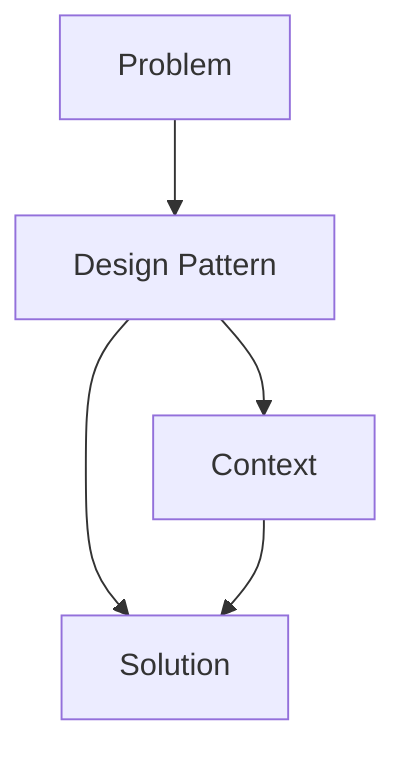

## 1.1 What Are Design Patterns?

In the realm of software engineering, design patterns serve as a cornerstone for building robust, scalable, and maintainable systems. They are not just abstract concepts but practical solutions that have been refined over time to address recurring design challenges. This section delves into the essence of design patterns, their purpose, benefits, and historical significance, providing a foundational understanding for their application in Go and beyond.

### Defining Design Patterns

Design patterns are essentially standard solutions to common software design problems. They are not finished designs that can be directly transformed into code but rather templates that guide developers in crafting solutions to specific issues. By abstracting the recurring themes in software design, patterns offer a blueprint for solving problems in various contexts, enhancing the efficiency and effectiveness of the development process.

#### Visual Representation of Design Patterns

To better understand the concept of design patterns, consider the following diagram that illustrates the relationship between a problem, a pattern, and a solution:

In this diagram, a design pattern acts as a bridge between a problem and its solution, taking into account the specific context in which the problem occurs.

### Purpose and Benefits

Design patterns offer several key benefits that make them invaluable in software development:

1. **Promote Code Reuse and Efficiency:** By providing tried-and-tested solutions, design patterns enable developers to reuse code structures and logic, reducing redundancy and enhancing productivity.

2. **Improve Communication:** Design patterns establish a common vocabulary among developers. This shared language simplifies the discussion of design concepts and solutions, facilitating better collaboration and understanding within development teams.

3. **Enhance Code Maintainability:** Patterns encourage the use of best practices, leading to cleaner, more organized code that is easier to maintain and extend over time.

4. **Facilitate Design Flexibility:** By abstracting complex design issues, patterns allow for more flexible and adaptable software architectures, capable of evolving with changing requirements.

### Types of Design Patterns

Design patterns are typically categorized into three main groups, each addressing different aspects of software design:

#### 1. Creational Patterns

Creational patterns focus on the process of object creation. They abstract the instantiation process, making it more flexible and dynamic. This category includes patterns like Singleton, Factory Method, and Builder, which help manage object creation in a way that enhances scalability and reduces complexity.

#### 2. Structural Patterns

Structural patterns deal with the composition of classes or objects. They facilitate the design of complex structures by identifying simple ways to realize relationships between entities. Patterns such as Adapter, Composite, and Decorator fall under this category, enabling developers to build flexible and efficient class structures.

#### 3. Behavioral Patterns

Behavioral patterns are concerned with communication between objects. They define how objects interact and communicate with each other, focusing on the flow of control and data. Examples include Observer, Strategy, and Command patterns, which help manage complex control flows and interactions.

### Historical Context

The concept of design patterns was popularized by the "Gang of Four" (GoF), a group of authors who published the seminal book "Design Patterns: Elements of Reusable Object-Oriented Software" in 1994. This book cataloged 23 foundational design patterns, providing a comprehensive framework for object-oriented design.

#### Impact on Modern Software Development

The introduction of design patterns has had a profound impact on software development practices. They have become an integral part of the developer's toolkit, influencing the design of countless systems and applications. By offering a structured approach to problem-solving, design patterns have helped standardize and streamline the development process, making it more efficient and effective.

### Conclusion

Understanding design patterns is crucial for any software developer aiming to build high-quality, maintainable systems. By leveraging these patterns, developers can address complex design challenges with confidence, knowing they are applying solutions that have been validated by years of practice and refinement. As we explore the implementation of these patterns in Go, we will see how they can be adapted to fit the unique features and philosophies of the language, further enhancing their utility and effectiveness.

## Quiz Time!



### What are design patterns?

- [x] Standard solutions to common software design problems
- [ ] Specific algorithms for solving computational problems
- [ ] Detailed code implementations for specific tasks
- [ ] User interface design templates

> **Explanation:** Design patterns are standard solutions to common software design problems, providing templates for solving issues in various contexts.

### What is one of the main benefits of using design patterns?

- [x] They promote code reuse and efficiency
- [ ] They eliminate the need for testing
- [ ] They guarantee bug-free software
- [ ] They simplify user interface design

> **Explanation:** Design patterns promote code reuse and efficiency by providing tried-and-tested solutions that can be adapted to different contexts.

### Which category of design patterns focuses on object creation?

- [x] Creational Patterns
- [ ] Structural Patterns
- [ ] Behavioral Patterns
- [ ] Functional Patterns

> **Explanation:** Creational patterns focus on the process of object creation, abstracting the instantiation process to enhance flexibility and scalability.

### Who popularized the concept of design patterns?

- [x] The "Gang of Four" (GoF)
- [ ] Alan Turing
- [ ] Tim Berners-Lee
- [ ] Donald Knuth

> **Explanation:** The "Gang of Four" (GoF) popularized design patterns with their book "Design Patterns: Elements of Reusable Object-Oriented Software."

### What is a key characteristic of structural design patterns?

- [x] They deal with the composition of classes or objects
- [ ] They focus on object creation
- [ ] They define communication between objects
- [ ] They optimize algorithm performance

> **Explanation:** Structural patterns deal with the composition of classes or objects, facilitating the design of complex structures.

### How do design patterns improve communication among developers?

- [x] By establishing a common vocabulary
- [ ] By providing detailed code examples
- [ ] By enforcing strict coding standards
- [ ] By eliminating the need for documentation

> **Explanation:** Design patterns improve communication by establishing a common vocabulary, simplifying the discussion of design concepts and solutions.

### What is the focus of behavioral design patterns?

- [x] Communication between objects
- [ ] Object creation
- [ ] Class composition
- [ ] User interface design

> **Explanation:** Behavioral patterns focus on communication between objects, defining how they interact and manage control flows.

### What impact have design patterns had on modern software development?

- [x] They have standardized and streamlined the development process
- [ ] They have replaced the need for programming languages
- [ ] They have eliminated software bugs
- [ ] They have reduced the need for software testing

> **Explanation:** Design patterns have standardized and streamlined the development process, making it more efficient and effective.

### What is an example of a creational pattern?

- [x] Singleton
- [ ] Adapter
- [ ] Observer
- [ ] Proxy

> **Explanation:** The Singleton pattern is an example of a creational pattern, focusing on object creation.

### True or False: Design patterns are finished designs that can be directly transformed into code.

- [x] False
- [ ] True

> **Explanation:** Design patterns are not finished designs but templates that guide developers in crafting solutions to specific issues.


