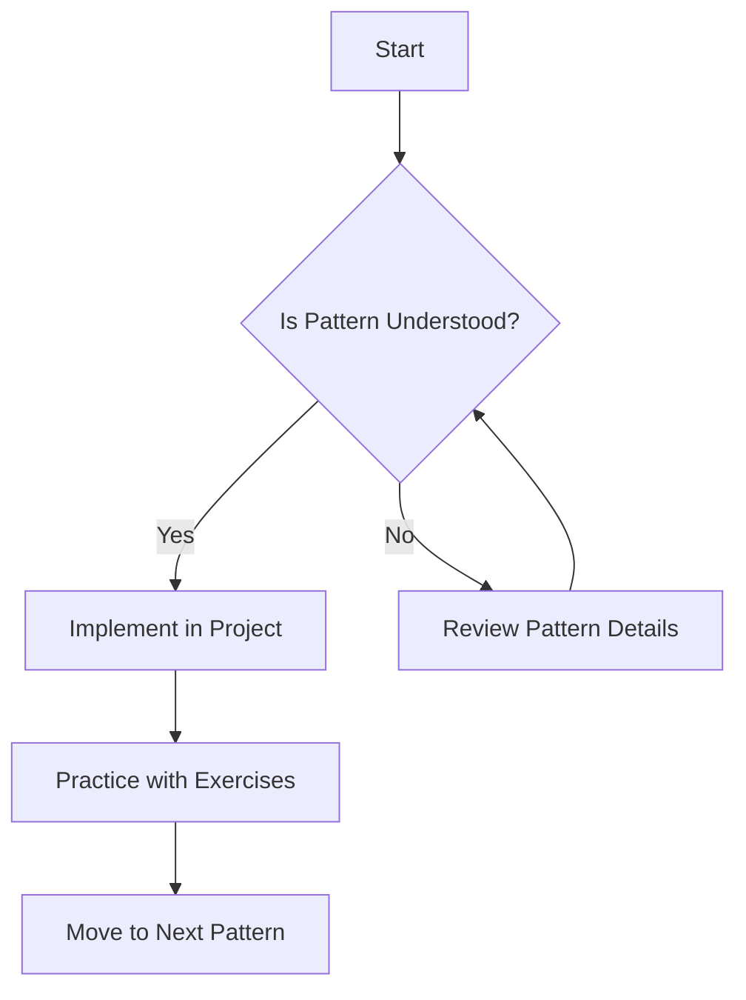

## 1.4 How to Use This Guide

Welcome to the comprehensive guide on mastering design patterns in Go! This guide is meticulously crafted to cater to both beginners and experienced developers looking to deepen their understanding of design patterns within the Go programming language. To maximize your learning experience, we have structured this guide to facilitate a progressive learning journey, encourage hands-on practice, and serve as a reliable reference during your development endeavors.

### Structured Learning Path

Embarking on a journey to master design patterns in Go requires a structured approach. This guide is organized to provide a logical progression from foundational concepts to advanced topics, ensuring a solid understanding of each pattern before moving on to more complex ideas.

#### Start with Foundational Concepts

Begin your exploration with the foundational concepts of design patterns. These sections lay the groundwork for understanding the purpose and application of design patterns in software development. By grasping these basics, you'll be better equipped to tackle more intricate patterns and concepts later on.

- **Creational Patterns:** Start with patterns like Singleton and Factory Method to understand object creation mechanisms.
- **Structural Patterns:** Move on to patterns such as Adapter and Composite to learn how to compose classes and objects.
- **Behavioral Patterns:** Explore patterns like Observer and Strategy to see how objects interact and communicate.

#### Focus on One Pattern at a Time

To truly master design patterns, it's crucial to focus on one pattern at a time. This approach allows you to delve deeply into each pattern's nuances, understand its use cases, and recognize its advantages and limitations. As you progress through the guide, take the time to implement each pattern in small, manageable projects to reinforce your learning.

### Hands-On Practice

Theory alone is not enough to master design patterns. Practical application is key to internalizing these concepts and understanding their real-world implications. This guide encourages hands-on practice through exercises and challenges designed to test your understanding and push your skills further.

#### Implement Patterns in Your Projects

One of the most effective ways to learn design patterns is by implementing them in your own projects. This not only helps solidify your understanding but also demonstrates how these patterns can solve real-world problems. As you work through the guide, identify opportunities to apply the patterns in your existing or new projects.

#### Exercises and Challenges

Throughout the guide, you'll find exercises and challenges that encourage you to apply what you've learned. These tasks are designed to reinforce your understanding and provide practical experience in implementing design patterns. Take the time to complete these exercises, as they are invaluable in cementing your knowledge.

### Reference Material

In addition to serving as a learning tool, this guide is also a valuable reference during development. As you encounter design challenges in your projects, refer back to the relevant sections to find solutions and insights.

#### Use as a Reference During Development

Keep this guide handy as a reference when working on your Go projects. Whether you're dealing with a specific design issue or simply need a refresher on a particular pattern, the guide's comprehensive coverage ensures you have the information you need at your fingertips.

#### Highlighted Sections for Common Issues

Certain sections of the guide address common issues and frequently asked questions related to design patterns in Go. These sections are highlighted for easy access, providing quick solutions and insights into typical challenges developers face.

### Visual Aids and Code Examples

To enhance your understanding, this guide incorporates visual aids and up-to-date code examples. Diagrams, tables, and charts are used to illustrate key concepts, while code snippets demonstrate practical implementations of design patterns using the latest Go syntax and libraries.

#### Diagrams and Charts

Visual aids such as diagrams and charts are included to clarify complex concepts and illustrate the relationships between different components of a pattern. These visuals are accompanied by explanations to guide you through the material.

#### Code Snippets

Code examples are provided throughout the guide to demonstrate how each pattern can be implemented in Go. These examples are designed to be clear and concise, with comments to explain complex sections of the code. By studying these examples, you'll gain practical insights into how design patterns can be applied effectively.

### Best Practices and Advanced Topics

The guide also emphasizes best practices and introduces advanced topics to further enhance your understanding of design patterns in Go. By adhering to these best practices, you'll write clean, maintainable, and scalable code.

#### Best Practices

Each section includes recommendations for implementing design patterns effectively. These best practices are based on industry standards and are designed to help you avoid common pitfalls and write high-quality code.

#### Advanced Topics

For those looking to deepen their understanding, the guide covers advanced topics such as Domain-Driven Design (DDD), Event Sourcing, and modern architectural patterns. These sections provide insights into how design patterns fit into larger software architecture frameworks.

### Conclusion

By following the structured learning path, engaging in hands-on practice, and utilizing this guide as a reference, you'll be well-equipped to master design patterns in Go. Whether you're a beginner or an experienced developer, this guide offers valuable insights and practical tools to enhance your software development skills.

---

## Quiz Time!



### What is the recommended approach to learning design patterns in this guide?

- [x] Focus on one pattern at a time and practice with examples.
- [ ] Learn all patterns simultaneously.
- [ ] Skip foundational concepts and start with advanced topics.
- [ ] Only read theoretical explanations without practicing.

> **Explanation:** The guide suggests focusing on one pattern at a time and practicing with examples to deepen understanding.

### How can hands-on practice benefit your learning of design patterns?

- [x] It helps solidify understanding through practical application.
- [ ] It is not necessary for learning design patterns.
- [ ] It only benefits beginners.
- [ ] It is only useful for advanced topics.

> **Explanation:** Hands-on practice is crucial for solidifying understanding and seeing real-world applications of design patterns.

### What role does this guide play as a reference material?

- [x] It provides solutions and insights for design challenges during development.
- [ ] It is only useful for initial learning and not for reference.
- [ ] It should be used only for advanced topics.
- [ ] It is not intended to be a reference.

> **Explanation:** The guide serves as a valuable reference for solving design challenges and refreshing knowledge on patterns.

### Why are visual aids included in the guide?

- [x] To clarify complex concepts and illustrate relationships.
- [ ] To make the guide look more appealing.
- [ ] To replace the need for code examples.
- [ ] To provide entertainment.

> **Explanation:** Visual aids help clarify complex concepts and illustrate relationships between components of a pattern.

### What is the purpose of the exercises and challenges in the guide?

- [x] To reinforce understanding and provide practical experience.
- [ ] To test memory retention.
- [ ] To fill space in the guide.
- [ ] To discourage readers from skipping sections.

> **Explanation:** Exercises and challenges are designed to reinforce understanding and provide practical experience.

### How should the guide be used during development?

- [x] As a reference for solving design issues and refreshing knowledge.
- [ ] Only for learning new patterns.
- [ ] It should not be used during development.
- [ ] Only for reviewing advanced topics.

> **Explanation:** The guide should be used as a reference for solving design issues and refreshing knowledge during development.

### What is the benefit of starting with foundational concepts?

- [x] It provides a solid understanding for tackling more complex patterns.
- [ ] It is not necessary for experienced developers.
- [ ] It slows down the learning process.
- [ ] It is only beneficial for beginners.

> **Explanation:** Starting with foundational concepts provides a solid understanding necessary for tackling more complex patterns.

### How do code examples enhance the learning experience?

- [x] They demonstrate practical implementations of design patterns.
- [ ] They are only for advanced learners.
- [ ] They are optional and not very useful.
- [ ] They replace the need for theoretical explanations.

> **Explanation:** Code examples demonstrate practical implementations, enhancing the learning experience by showing real-world applications.

### What advanced topics are covered in the guide?

- [x] Domain-Driven Design (DDD) and Event Sourcing.
- [ ] Only basic design patterns.
- [ ] Topics unrelated to design patterns.
- [ ] Only Go language syntax.

> **Explanation:** Advanced topics like Domain-Driven Design (DDD) and Event Sourcing are covered to deepen understanding.

### True or False: The guide is only useful for beginners.

- [ ] True
- [x] False

> **Explanation:** The guide is designed for both beginners and experienced developers, offering insights and tools for all skill levels.


