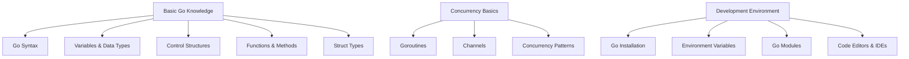

## 1.5 Prerequisites and Recommended Knowledge

Embarking on a journey to master design patterns in Go requires a solid foundation in several key areas. This section outlines the essential prerequisites and recommended knowledge that will enable you to effectively comprehend and implement the design patterns covered in this guide. By ensuring you have a firm grasp of these foundational concepts, you will be better equipped to tackle the complexities of design patterns and apply them effectively in your Go projects.

### Basic Go Knowledge

Before diving into design patterns, it's crucial to have a strong understanding of the Go programming language itself. Here are the fundamental aspects you should be familiar with:

#### Understanding of Go Syntax, Variables, Data Types, and Control Structures

- **Go Syntax:** Familiarity with the basic syntax of Go, including how to write and structure Go programs, is essential. This includes understanding how to declare packages, import libraries, and define functions and variables.

- **Variables and Data Types:** You should be comfortable with declaring and using variables in Go, as well as understanding the various data types available, such as integers, floats, strings, booleans, arrays, slices, maps, and structs.

- **Control Structures:** A solid grasp of control structures like loops (`for`), conditional statements (`if`, `else`, `switch`), and error handling (`defer`, `panic`, `recover`) is necessary for writing effective Go code.

#### Familiarity with Functions, Methods, and Struct Types in Go

- **Functions:** Understanding how to define and use functions, including passing arguments, returning values, and using variadic functions, is crucial. Functions are the building blocks of Go programs and are heavily utilized in design patterns.

- **Methods:** Go allows you to define methods on struct types, which is a key feature for implementing object-oriented design patterns. You should be comfortable with method receivers and how methods differ from regular functions.

- **Struct Types:** Structs are a fundamental data structure in Go, used to group related data together. Understanding how to define, instantiate, and manipulate structs is essential for implementing many design patterns.

### Concurrency Basics

Go's concurrency model is one of its standout features, and understanding it is vital for implementing certain design patterns effectively.

#### Basic Knowledge of Goroutines and Channels

- **Goroutines:** Goroutines are lightweight threads managed by the Go runtime. You should understand how to launch goroutines and manage their lifecycle. This includes knowing how to handle goroutine leaks and understanding the implications of concurrent execution.

- **Channels:** Channels are used for communication between goroutines. You should be familiar with creating channels, sending and receiving data through them, and using buffered and unbuffered channels. Channels are often used in design patterns to coordinate concurrent activities.

#### Understanding of Concurrency Patterns in Go

- **Concurrency Patterns:** Familiarity with common concurrency patterns such as worker pools, fan-out/fan-in, and pipeline patterns will be beneficial. These patterns leverage goroutines and channels to solve complex concurrency problems and are often used in conjunction with design patterns.

### Development Environment

Setting up a robust development environment is crucial for efficient Go programming and design pattern implementation.

#### Instructions on Setting Up Go on Your Machine

- **Go Installation:** Ensure that you have Go installed on your machine. You can download the latest version from the [official Go website](https://golang.org/dl/). Follow the installation instructions for your operating system to set up Go properly.

- **Environment Variables:** Configure your `GOPATH` and `GOROOT` environment variables as needed. These variables help Go locate your workspace and installation directory.

- **Go Modules:** Familiarize yourself with Go modules, which are used for dependency management in modern Go projects. Understand how to create and manage modules using the `go mod` command.

#### Recommendations for Code Editors or IDEs Suitable for Go Development

- **Visual Studio Code:** A popular choice for Go development, Visual Studio Code offers excellent support through extensions like `Go` by the Go team, which provides features like IntelliSense, debugging, and code navigation.

- **GoLand:** Developed by JetBrains, GoLand is a powerful IDE specifically designed for Go development. It offers advanced features such as refactoring, code analysis, and integrated testing tools.

- **Sublime Text:** With the `GoSublime` package, Sublime Text becomes a lightweight yet effective editor for Go development, providing syntax highlighting, code completion, and build tools.

- **Vim/Neovim:** For those who prefer terminal-based editors, Vim and Neovim can be configured for Go development using plugins like `vim-go`, which adds Go-specific functionality.

### Visual Aids

To further illustrate the prerequisites and recommended knowledge, let's use a conceptual diagram to visualize the relationships between these foundational concepts.

### Conclusion

By ensuring you have a solid understanding of these prerequisites and recommended knowledge areas, you will be well-prepared to delve into the world of design patterns in Go. These foundational skills will not only help you grasp the concepts more effectively but also enable you to apply them in real-world scenarios, ultimately enhancing your Go programming expertise.

## Quiz Time!



### Which of the following is NOT a basic Go syntax element?

- [ ] Package declaration
- [ ] Importing libraries
- [x] Class declaration
- [ ] Function definition

> **Explanation:** Go does not have classes; it uses structs and interfaces for similar purposes.

### What is a goroutine in Go?

- [x] A lightweight thread managed by the Go runtime
- [ ] A type of variable in Go
- [ ] A function that returns a channel
- [ ] A method for handling errors

> **Explanation:** Goroutines are lightweight threads managed by the Go runtime, allowing concurrent execution.

### Which Go feature is used for communication between goroutines?

- [ ] Mutexes
- [x] Channels
- [ ] Interfaces
- [ ] Packages

> **Explanation:** Channels are used for communication between goroutines in Go.

### What is the purpose of the `GOPATH` environment variable?

- [x] To specify the workspace location for Go projects
- [ ] To define the Go installation directory
- [ ] To set the maximum number of goroutines
- [ ] To configure the Go compiler options

> **Explanation:** `GOPATH` specifies the workspace location for Go projects.

### Which of the following is a recommended code editor for Go development?

- [x] Visual Studio Code
- [ ] Microsoft Word
- [x] GoLand
- [ ] Adobe Photoshop

> **Explanation:** Visual Studio Code and GoLand are popular choices for Go development due to their robust support and features.

### What is a common concurrency pattern in Go?

- [x] Worker Pool
- [ ] Singleton
- [ ] Factory Method
- [ ] Adapter

> **Explanation:** The Worker Pool is a common concurrency pattern in Go, used to manage a pool of goroutines for processing tasks.

### What is the role of Go modules?

- [x] Dependency management
- [ ] Error handling
- [x] Version control
- [ ] Memory management

> **Explanation:** Go modules are used for dependency management and version control in Go projects.

### Which Go feature allows defining methods on struct types?

- [ ] Interfaces
- [ ] Channels
- [x] Methods
- [ ] Packages

> **Explanation:** Methods in Go allow defining functions with receivers on struct types.

### What is the purpose of the `defer` statement in Go?

- [x] To ensure a function call is executed later, usually for cleanup
- [ ] To declare a variable
- [ ] To handle errors
- [ ] To start a goroutine

> **Explanation:** `defer` is used to schedule a function call to be executed later, often for resource cleanup.

### True or False: Go supports class-based inheritance.

- [ ] True
- [x] False

> **Explanation:** Go does not support class-based inheritance; it uses composition and interfaces instead.


