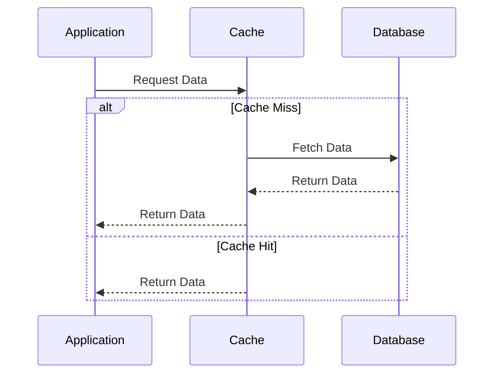
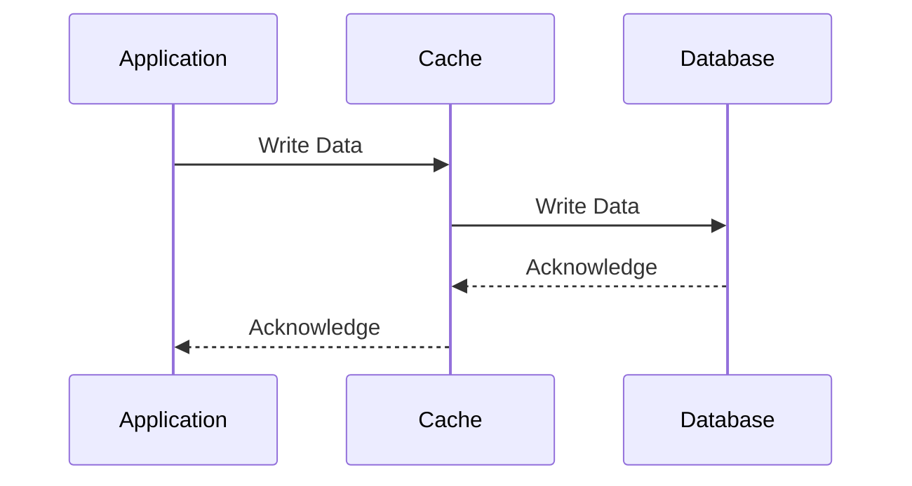

## 11.3.2 Read-Through and Write-Through Caching

Caching is a critical component in modern software systems, significantly enhancing performance by reducing the load on databases and speeding up data retrieval times. In this section, we delve into two popular caching strategies: Read-Through and Write-Through Caching. These strategies are essential for maintaining data consistency and optimizing performance in Go applications.

### Introduction

Caching strategies are designed to improve the efficiency of data retrieval and storage operations. Read-Through and Write-Through Caching are two approaches that integrate the cache with the database operations, ensuring data consistency and reducing latency.

### Read-Through Cache

A Read-Through Cache acts as an intermediary between the application and the database. When the application requests data, it first checks the cache. If the data is not present (a cache miss), the cache fetches it from the database, stores it, and then returns it to the application.

#### Workflow



#### Implementation Steps

1. **Cache Configuration**: Set up a caching layer that can intercept data requests and manage cache misses by fetching data from the database.
2. **Data Retrieval**: Implement logic to check the cache first and only query the database if the data is not present in the cache.
3. **Cache Population**: On a cache miss, fetch the data from the database, store it in the cache, and return it to the application.

#### Code Example

```go
package main

import (
	"fmt"
	"sync"
)

// Simulated cache and database
type Cache struct {
	data map[string]string
	mu   sync.RWMutex
}

func NewCache() *Cache {
	return &Cache{data: make(map[string]string)}
}

func (c *Cache) Get(key string) (string, bool) {
	c.mu.RLock()
	defer c.mu.RUnlock()
	val, found := c.data[key]
	return val, found
}

func (c *Cache) Set(key, value string) {
	c.mu.Lock()
	defer c.mu.Unlock()
	c.data[key] = value
}

func fetchFromDatabase(key string) string {
	// Simulate database fetch
	return "Data for " + key
}

func readThroughCache(cache *Cache, key string) string {
	if val, found := cache.Get(key); found {
		return val
	}
	// Simulate a database fetch
	val := fetchFromDatabase(key)
	cache.Set(key, val)
	return val
}

func main() {
	cache := NewCache()
	key := "user123"
	fmt.Println("Fetching:", readThroughCache(cache, key))
	fmt.Println("Fetching again:", readThroughCache(cache, key))
}
```

### Write-Through Cache

A Write-Through Cache ensures that any data written to the cache is also written to the database immediately. This strategy maintains data consistency between the cache and the database but may introduce latency due to synchronous writes.

#### Workflow



#### Implementation Steps

1. **Cache Configuration**: Configure the cache to handle write operations by updating both the cache and the database.
2. **Synchronous Writes**: Ensure that every write operation to the cache is immediately propagated to the database.
3. **Consistency Management**: Implement mechanisms to handle potential failures during the write process to maintain consistency.

#### Code Example

```go
package main

import (
	"fmt"
	"sync"
)

type Cache struct {
	data map[string]string
	mu   sync.RWMutex
}

func NewCache() *Cache {
	return &Cache{data: make(map[string]string)}
}

func (c *Cache) Get(key string) (string, bool) {
	c.mu.RLock()
	defer c.mu.RUnlock()
	val, found := c.data[key]
	return val, found
}

func (c *Cache) Set(key, value string) {
	c.mu.Lock()
	defer c.mu.Unlock()
	c.data[key] = value
	writeToDatabase(key, value)
}

func writeToDatabase(key, value string) {
	// Simulate database write
	fmt.Printf("Writing %s to database\n", value)
}

func writeThroughCache(cache *Cache, key, value string) {
	cache.Set(key, value)
}

func main() {
	cache := NewCache()
	key := "user123"
	value := "New Data"
	writeThroughCache(cache, key, value)
}
```

### Best Practices

- **Consistency**: Use Write-Through Caching when immediate consistency between the cache and the database is required.
- **Performance Considerations**: Be aware of potential performance impacts due to synchronous writes in Write-Through Caching.
- **Cache Eviction Policies**: Implement appropriate cache eviction policies to manage cache size and ensure frequently accessed data remains in the cache.
- **Monitoring and Logging**: Monitor cache performance and log cache hits and misses to optimize caching strategies.

### Advantages and Disadvantages

#### Advantages

- **Read-Through Cache**: Reduces database load and improves read performance by caching frequently accessed data.
- **Write-Through Cache**: Ensures data consistency between the cache and the database.

#### Disadvantages

- **Read-Through Cache**: May not reflect the most recent data if the cache is not updated frequently.
- **Write-Through Cache**: Can introduce latency due to synchronous writes, impacting write performance.

### Conclusion

Read-Through and Write-Through Caching strategies are powerful tools for optimizing data access and maintaining consistency in Go applications. By understanding their workflows and implementation details, developers can effectively leverage these strategies to enhance application performance and reliability.

## Quiz Time!



### What is the primary benefit of a Read-Through Cache?

- [x] Reduces database load by caching frequently accessed data.
- [ ] Ensures immediate consistency between cache and database.
- [ ] Simplifies write operations by caching data.
- [ ] Increases write performance by batching operations.

> **Explanation:** A Read-Through Cache reduces database load by caching frequently accessed data, improving read performance.

### In a Write-Through Cache, what happens when data is written to the cache?

- [x] The data is immediately written to the database.
- [ ] The data is only stored in the cache.
- [ ] The data is written to the database asynchronously.
- [ ] The data is discarded if not frequently accessed.

> **Explanation:** In a Write-Through Cache, data written to the cache is immediately written to the database to ensure consistency.

### What is a potential disadvantage of Write-Through Caching?

- [x] It can introduce latency due to synchronous writes.
- [ ] It may not reflect the most recent data.
- [ ] It increases database load.
- [ ] It requires complex configuration.

> **Explanation:** Write-Through Caching can introduce latency due to synchronous writes, impacting write performance.

### Which caching strategy is best when immediate consistency is required?

- [ ] Read-Through Cache
- [x] Write-Through Cache
- [ ] Lazy Loading Cache
- [ ] Cache-Aside Pattern

> **Explanation:** Write-Through Cache is best when immediate consistency between the cache and the database is required.

### What is the role of the cache in a Read-Through Cache strategy?

- [x] It acts as an intermediary between the application and the database.
- [ ] It only stores data temporarily without interacting with the database.
- [ ] It processes write operations asynchronously.
- [ ] It manages user authentication and authorization.

> **Explanation:** In a Read-Through Cache strategy, the cache acts as an intermediary between the application and the database.

### How does a Read-Through Cache handle a cache miss?

- [x] It fetches the data from the database and stores it in the cache.
- [ ] It returns an error to the application.
- [ ] It ignores the request and waits for a cache hit.
- [ ] It writes the request to a log for later processing.

> **Explanation:** On a cache miss, a Read-Through Cache fetches the data from the database and stores it in the cache.

### What is a key consideration when implementing Write-Through Caching?

- [x] Managing potential performance impacts due to synchronous writes.
- [ ] Ensuring the cache is updated infrequently.
- [ ] Avoiding cache eviction policies.
- [ ] Using asynchronous writes to improve performance.

> **Explanation:** A key consideration is managing potential performance impacts due to synchronous writes in Write-Through Caching.

### Which Go package can be used for implementing caching strategies?

- [x] groupcache
- [ ] fmt
- [ ] net/http
- [ ] os

> **Explanation:** The `groupcache` package can be used for implementing caching strategies in Go.

### What is a common use case for Read-Through Caching?

- [x] Improving read performance by caching frequently accessed data.
- [ ] Ensuring immediate consistency for write operations.
- [ ] Handling complex write transactions.
- [ ] Managing user sessions.

> **Explanation:** Read-Through Caching is commonly used to improve read performance by caching frequently accessed data.

### True or False: Write-Through Caching can introduce latency due to asynchronous writes.

- [ ] True
- [x] False

> **Explanation:** Write-Through Caching introduces latency due to synchronous writes, not asynchronous writes.


