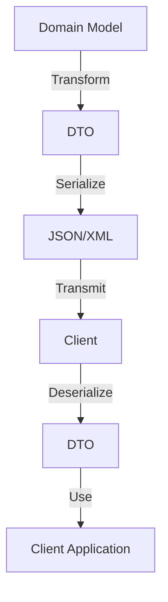

---

linkTitle: "12.3 Data Transfer Object (DTO)"
title: "Data Transfer Object (DTO) in Golang: Streamlining Data Management"
description: "Explore the Data Transfer Object (DTO) pattern in Golang, its implementation, benefits, and best practices for efficient data management."
categories:
- Software Design
- Golang
- Data Management
tags:
- DTO
- Golang
- Design Patterns
- Data Transfer
- Software Architecture
date: 2024-10-25
type: docs
nav_weight: 1230000
canonical: "https://softwarepatternslexicon.com/patterns-go/12/3"
license: "© 2024 Tokenizer Inc. CC BY-NC-SA 4.0"
---

## 12.3 Data Transfer Object (DTO)

In the realm of software architecture, the Data Transfer Object (DTO) pattern plays a crucial role in efficiently managing data transfer between different layers of an application. This pattern is particularly useful in scenarios where data needs to be transported across network boundaries or between different parts of a system, minimizing the number of method calls and optimizing performance. In this article, we delve into the DTO pattern within the context of Go (Golang), exploring its implementation, benefits, and best practices.

### Introduction to Data Transfer Object (DTO)

A Data Transfer Object (DTO) is a simple object that encapsulates data and is used to transfer it between different parts of a system. Unlike domain objects, DTOs do not contain any business logic. They are often used to aggregate data from multiple sources and present it in a format suitable for client consumption, especially in distributed systems or applications with a layered architecture.

### Purpose and Relevance

The primary purpose of a DTO is to reduce the number of remote calls by bundling multiple data elements into a single object. This is particularly relevant in applications where data needs to be transferred over a network, such as in RESTful APIs or microservices architectures. By using DTOs, developers can ensure that only the necessary data is transferred, reducing bandwidth usage and improving performance.

### Detailed Explanation

#### Components and Workflow

1. **Definition:** A DTO is defined as a plain struct in Go, containing fields that represent the data to be transferred. It does not include any methods or business logic.

2. **Transformation:** Data from domain objects or entities is transformed into DTOs before being sent across layers or over the network.

3. **Serialization:** DTOs are often serialized into formats such as JSON or XML for transmission.

4. **Deserialization:** On the receiving end, DTOs are deserialized back into Go structs for further processing.

5. **Usage:** DTOs are used in service interfaces, controllers, or API endpoints to encapsulate data for client consumption.

#### Example Workflow

```go
// Domain model
type User struct {
    ID        int
    FirstName string
    LastName  string
    Email     string
    Password  string // Sensitive data not needed in DTO
}

// DTO
type UserDTO struct {
    ID        int    `json:"id"`
    FirstName string `json:"first_name"`
    LastName  string `json:"last_name"`
    Email     string `json:"email"`
}

// Function to convert User to UserDTO
func ToUserDTO(user User) UserDTO {
    return UserDTO{
        ID:        user.ID,
        FirstName: user.FirstName,
        LastName:  user.LastName,
        Email:     user.Email,
    }
}
```

### Visual Aids

#### Conceptual Diagram



### Use Cases

- **RESTful APIs:** DTOs are commonly used to format data for API responses, ensuring that only necessary information is exposed to clients.
- **Microservices:** In a microservices architecture, DTOs facilitate communication between services by providing a standardized data format.
- **Data Aggregation:** DTOs can aggregate data from multiple sources, simplifying the data consumption process for clients.

### Advantages and Disadvantages

#### Advantages

- **Performance Optimization:** Reduces the number of remote calls by bundling data.
- **Security:** Prevents exposure of sensitive data by excluding it from DTOs.
- **Decoupling:** Separates the internal domain model from external data representation, allowing for flexibility in data presentation.

#### Disadvantages

- **Maintenance Overhead:** Requires additional code for transformation between domain objects and DTOs.
- **Complexity:** Can introduce complexity in systems with a large number of DTOs.

### Best Practices

- **Keep DTOs Simple:** Ensure DTOs are simple structs without business logic.
- **Use Tags for Serialization:** Utilize Go struct tags to facilitate serialization and deserialization.
- **Automate Transformation:** Consider using libraries or code generation tools to automate the transformation between domain objects and DTOs.

### Comparisons

- **DTO vs. Value Object:** Unlike DTOs, value objects contain business logic and are part of the domain model.
- **DTO vs. Entity:** Entities represent persistent data with identity, while DTOs are transient and used for data transfer.

### Conclusion

The Data Transfer Object (DTO) pattern is a powerful tool in Go for optimizing data transfer across application layers and network boundaries. By encapsulating data in simple structs, DTOs enhance performance, security, and maintainability. Understanding and implementing DTOs effectively can significantly improve the efficiency of data management in Go applications.

## Quiz Time!



### What is the primary purpose of a Data Transfer Object (DTO)?

- [x] To reduce the number of remote calls by bundling multiple data elements into a single object.
- [ ] To contain business logic for data processing.
- [ ] To replace domain models in the application.
- [ ] To store data persistently in a database.

> **Explanation:** The primary purpose of a DTO is to reduce the number of remote calls by bundling multiple data elements into a single object, optimizing data transfer.

### In Go, how is a DTO typically represented?

- [x] As a plain struct with fields representing data to be transferred.
- [ ] As an interface with methods for data manipulation.
- [ ] As a class with encapsulated business logic.
- [ ] As a package with multiple files.

> **Explanation:** In Go, a DTO is typically represented as a plain struct with fields representing the data to be transferred, without any business logic.

### Which of the following is a common use case for DTOs?

- [x] RESTful APIs
- [ ] Database schema design
- [ ] File system operations
- [ ] Memory management

> **Explanation:** DTOs are commonly used in RESTful APIs to format data for responses, ensuring only necessary information is exposed to clients.

### What is a disadvantage of using DTOs?

- [x] Maintenance overhead due to additional code for transformation.
- [ ] Increased exposure of sensitive data.
- [ ] Reduced performance due to larger data size.
- [ ] Lack of flexibility in data presentation.

> **Explanation:** A disadvantage of using DTOs is the maintenance overhead due to the additional code required for transforming domain objects to DTOs and vice versa.

### How can DTOs enhance security in an application?

- [x] By excluding sensitive data from being transferred.
- [ ] By encrypting all data fields.
- [ ] By implementing access control mechanisms.
- [ ] By using complex data structures.

> **Explanation:** DTOs enhance security by excluding sensitive data from being transferred, ensuring that only necessary information is exposed.

### What is a best practice when implementing DTOs in Go?

- [x] Keep DTOs simple and free of business logic.
- [ ] Include all possible fields from the domain model.
- [ ] Use DTOs to replace domain models entirely.
- [ ] Implement complex methods within DTOs.

> **Explanation:** A best practice when implementing DTOs is to keep them simple and free of business logic, focusing solely on data transfer.

### How do DTOs differ from entities in a system?

- [x] DTOs are transient and used for data transfer, while entities represent persistent data with identity.
- [ ] DTOs contain business logic, while entities are simple data holders.
- [ ] DTOs are used for database operations, while entities are used for API responses.
- [ ] DTOs are more complex than entities.

> **Explanation:** DTOs are transient and used for data transfer, whereas entities represent persistent data with identity and are part of the domain model.

### What is a common serialization format for DTOs in Go?

- [x] JSON
- [ ] YAML
- [ ] CSV
- [ ] Binary

> **Explanation:** JSON is a common serialization format for DTOs in Go, especially for data transfer in web applications.

### Which Go feature is often used to facilitate DTO serialization?

- [x] Struct tags
- [ ] Interfaces
- [ ] Goroutines
- [ ] Channels

> **Explanation:** Struct tags in Go are often used to facilitate DTO serialization, allowing for easy conversion to formats like JSON.

### True or False: DTOs should contain business logic to process data before transfer.

- [ ] True
- [x] False

> **Explanation:** False. DTOs should not contain business logic; they are meant for data transfer only.




